# MON 317B (octal) - UECOM (ExecuteCommand)

Executes a SINTRAN III command line as if it had been typed at the terminal (without the
leading `@`). The command text is passed as one string. Errors print a message and return -
they do **not** terminate the calling program.

**Status:** **byte-verified end to end.** Every layer of the dispatch - the level-14 entry,
the `GOTAB` slot, the `MFELL` level switch, the `MCTAB` slot and the `UECOM` worker body -
is carved and reproduced from bytes. All addresses/values are **octal**.

- **Full disassembly:** [`317B-ExecuteCommand.ASM`](317B-ExecuteCommand.ASM) - the actual code, all five regions.
- **Emulator model:** [`317B-ExecuteCommand.pseudo.c`](317B-ExecuteCommand.pseudo.c).
- **Bytes live once in** the canonical segment layer: [`../../segments-ref/`](../../segments-ref/).

---

## Dispatch path

```mermaid
flowchart LR
    A["User program<br/>MON 317B"] --> B["ENT14 level-14 entry<br/>026-S3IMPIT :072167B"]
    B --> C["GOTAB[317B] = MFELL<br/>MGOTA=071233B :071552B"]
    C --> D["MFELL level switch<br/>026-S3IMPIT :072114B"]
    D --> E["CALLP on the monitor level<br/>:032201B"]
    E --> F["MCTAB[317B] = UECOM<br/>MCTAB=005620B :006137B"]
    F --> G["UECOM worker<br/>003-S3CP :050701B"]
    G --> H["shared command body<br/>upcase + SINTRAN decoder"]
    class A blue
    class B,C,D,E,F teal
    class G,H green
    classDef blue fill:#E3F2FD,stroke:#0D47A1,color:#0D47A1
    classDef teal fill:#E0F7FA,stroke:#00838F,color:#00838F
    classDef green fill:#E8F5E9,stroke:#2E7D32,color:#2E7D32
```



There is **no dashed hop**. The link earlier documents called the "uncarved CALLPROC bridge"
is `MFELL` at `072114B`, and it is carved: it is a program-**level** switch (`IRW 20 DP`
writes `CALLP` into the monitor level's P register), not a subroutine call. See
[Honest caveats](#honest-caveats).

---

## Code location (dispatch path)

Byte offset = `(addr - loadbase)` in octal words x 2 (decimal). Every offset below was
reproduced with `dd` (see "Verify by hand").

| Role | Segment | Addr (octal) | Byte offset | Symbol | Verdict |
|------|---------|--------------|-------------|--------|---------|
| level-14 monitor entry | [026-S3IMPIT.asm](../../segments-ref/026-S3IMPIT/026-S3IMPIT.asm) | `072167B-072260B` | 33006 | `ENT14` | **VERIFIED** |
| GOTAB base | [026-S3IMPIT.asm](../../segments-ref/026-S3IMPIT/026-S3IMPIT.asm) | `071233B` | 32468 (slot) | `MGOTA` | **VERIFIED** |
| GOTAB[317B] slot | [026-S3IMPIT.asm](../../segments-ref/026-S3IMPIT/026-S3IMPIT.asm) | `071552B` = `072114B` | 32468 | -> `MFELL` | **VERIFIED** |
| MFELL level switch | [026-S3IMPIT.asm](../../segments-ref/026-S3IMPIT/026-S3IMPIT.asm) | `072114B-072123B` | 32920 | `MFELL` | **VERIFIED** |
| CALLP literal | [026-S3IMPIT.asm](../../segments-ref/026-S3IMPIT/026-S3IMPIT.asm) | `072161B` = `032201B` | 33014 | `CALLP` | **VERIFIED** |
| MCTAB[317B] slot | `044-S3IDPIT` (not yet in segments-ref) | `006137B` = `050701B` | 2238 | -> `UECOM` | **VERIFIED** |
| UECOM worker body | `003-S3CP` (not yet in segments-ref) | `050701B-050725B` | 17282 | `UECOM` | **VERIFIED** |
| shared command body | `003-S3CP` (not yet in segments-ref) | `050740B-050771B` | 17314 | (shared) | **VERIFIED** |

`044-S3IDPIT` and `003-S3CP` are carved but have not yet been promoted into `segments-ref/`;
their canonical bins are `tools/sintran-segment-carver/versions/L-VSX-500/segments/044-S3IDPIT.bin`
and `.../003-S3CP.bin`. Promoting them is the follow-up action (see Honest caveats).

**Verify by hand** (from the carver's `versions/L-VSX-500/segments/` directory):
```
dd if=026-S3IMPIT.bin bs=1 skip=32468 count=2 | od -An -tx1   ->  74 4c   (= 072114B = MFELL)
dd if=044-S3IDPIT.bin bs=1 skip=2238  count=2 | od -An -tx1   ->  51 c1   (= 050701B = UECOM)
dd if=003-S3CP.bin    bs=1 skip=17282 count=2 | od -An -tx1   ->  cc 61   (= 146141B, UECOM entry)
```

---

## Instruction walkthrough

Full listing: [`317B-ExecuteCommand.ASM`](317B-ExecuteCommand.ASM).

**The dispatch (`072253B-072260B`).** `T` holds the MON number (masked to 8 bits by the
constant `000377B` at `072266B`, so `GOTAB` is exactly 256 words). The fetch
`057020 LDX I ,X 20` resolves through the literal at `072276B` = `071233B` = `MGOTA`, giving
`X := MEM[MGOTA + N]` = `GOTAB[N]`; then `126000 JMP ,X` jumps straight to it. The fetch is
bracketed by `BSET ZRO SSPTM` / `BSET ONE SSPTM`, i.e. the table word is read through a
different page-table mapping than the code that runs next. **This is a direct jump - no call.**

**GOTAB is not the monitor-call table.** Only **32 of its 256 slots** are real resident
handlers (MON 1B read, 2B write, 21B-24B, 63B, 163B, **200B XMSG**, 310B, 346B-377B); those
arm the B-level through `IOB14 = 071660B`. The other **224 slots all hold `MFELL`**, including
MON 317B.

**MFELL (`072114B`) is the hand-off, not an error.** It copies the MON number into the monitor
level's `X` (`IRW 20 DX`), writes `CALLP = 032201B` into that level's `P` (`IRW 20 DP`), and
activates the level (`MST PID` / `MST PIE`). The monitor level then dispatches through
**`MCTAB = 005620B`** (alias `9MCTA`), the real Monitor-Call TABle: one word per MON number,
**216 of 256 slots populated**, every populated slot landing exactly on a named L07 symbol.
`MCTAB[317B]` at `006137B` = `050701B` = `UECOM`.

**UECOM (`050701B`) shares one body with two siblings.** `COMSB` (MON 070B) at `050673B`,
`UECOM` (MON 317B) at `050701B` and `UELOG` (MON 320B) at `050726B` are three entries into one
command-execution body. Each saves the return link (`RADD CLD SL DD`), calls a common prologue
(`JPL I ,B -37`), stores the caller's string pointer at `,B -177`, writes a **mode code** to
`,B -175` (COMSB=1, UECOM=2 or 4, UELOG=3) and jumps to the shared body at `050740B`.

That single fact explains the manual's headline difference: **MON 70B (COMND) and MON 317B
(UECOM) are the same code with a different mode code**, which is why one terminates the caller
on error and the other returns.

**Shared body (`050740B-050771B`).** Loads the command pointer (`LDX ,B -177`), walks the text
with `LBYT`/`SBYT` and upper-cases it in place (`'a'`=`141B` .. `'z'`, `AAA -40`), then calls
the standard SINTRAN command decoder via `JPL I 41` at `050746B`.

---

## Parameter / register contract

| Reg / field | Dir | Meaning | Verdict |
|-------------|-----|---------|---------|
| `A` | in | address of the command string | **VERIFIED** (bytes: `050705B STA ,B -177`, and the manual) |
| `T` | in | range-checked at `050710B-050715B`; selects mode 4 vs mode 2 | **VERIFIED** (bytes); *meaning* of the two variants **inferred** |
| `,B -177` | frame | caller's command-string pointer | **VERIFIED** (bytes) |
| `,B -175` | frame | mode code: COMSB=1, UECOM=2/4, UELOG=3 | **VERIFIED** (bytes) |
| `,B -200` | frame | caller's `T` | **VERIFIED** (bytes) |
| command text | in/out | **upper-cased in place** before decoding | **VERIFIED** (bytes) |
| error behaviour | out | prints a message and **returns**; does not terminate the caller | **VERIFIED** (official manual ND-860228-2 p.180-181); not byte-proven here |
| completion | out | synchronous - returns after the command has run | **VERIFIED** (manual); not byte-proven here |

Note the string is **modified in place** (upper-cased). An emulator that passes a read-only
buffer will diverge from real L07.

---

## Pseudo-code (for an emulator)

See **[`317B-ExecuteCommand.pseudo.c`](317B-ExecuteCommand.pseudo.c)** - a pseudo-C model of all four dispatch
layers plus the worker. The dispatch chain and the mode-code fork are byte-verified; the
command-decoder internals are inferred (that body is reached by `JPL I 41` at `050746B` and is
not carved in this folder).

---

## Honest caveats

**What is byte-proven:** the whole dispatch chain. `GOTAB[317B] = MFELL`; `MFELL` loads
`CALLP` and switches program level; `MCTAB[317B] = UECOM = 050701B`; the `UECOM` entry bytes
at `050701B` in `003-S3CP` match the disassembly; `COMSB`/`UECOM`/`UELOG` share one body and
are distinguished only by the mode code. The `MCTAB` identification is not a one-slot
coincidence: **216 of 256 slots** land exactly on named L07 symbols (`RDISK`, `WDISK`, `CIBUF`,
`OPFIL`, `MAGTP`, `DEBUG`, `CPUST`, `MOINF`, `UECOM`, ...), and `MON 200B -> 007516B` is XMSG
exactly where it must be.

**What is NOT proven:**
- The meaning of the **two UECOM mode variants** (4 vs 2, chosen by a range test on `T` at
  `050710B-050715B`). The fork is in the bytes; what it selects is **not**. Do not guess it.
- The **command decoder body** itself (`JPL I 41` at `050746B`) is not carved here.
- The behavioural guarantees (synchronous, non-terminating on error, prompts for missing
  parameters, output to terminal) come from the **official manual**, not from these bytes.

**Correction to earlier work.** An earlier analysis read `GOTAB` out of the
`SINTRAN-DATA_commoncode` carve at `071233B` and reported `GOTAB[317B] = 112242B` with the
handler "not on disk". That was wrong: commoncode's `071233B` is **not** the GOTAB (its slot 0
is `000000`, not `MFELL`; its slot 1 is `120303B`, not `M1=071633B`). The real GOTAB is in the
monitor-PIT segments (`017-S3SMPIT` / `026-S3IMPIT`), which is also where `ENT14` actually
lives. The `112xxx` "entry addresses" were unrelated bytes at that address in a different
overlay. See [`../../MON-CALL-INDEX.md`](../../MON-CALL-INDEX.md).

**Follow-up:** promote `003-S3CP` and `044-S3IDPIT` into `segments-ref/` so the two tables in
the Code-location table above resolve as links like the others.

Method: [../../../../../EXTRACTING-RESIDENT-CODE.md](../../../../../EXTRACTING-RESIDENT-CODE.md) - master map:
[../../MON-CALL-INDEX.md](../../MON-CALL-INDEX.md).
