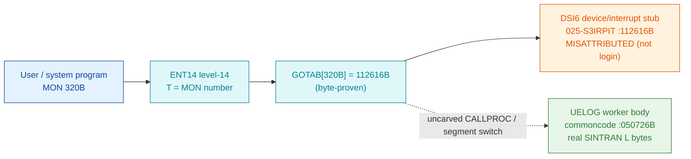

# MON 320B (octal) — UELogin (UELOG)

Logs a user into a **User Environment** (manual ND-860228.2 EN, section 2.14, name-only).
ND-100 call. This folder had to **reconcile four conflicting `UELOG` addresses** carried across
SINTRAN revisions and symbol tables — the honest result is below.

**Status:** `GOTAB[320B]=112616B` is byte-proven, but it resolves to **`DSI6`** — a
device/interrupt routine, **not** login code (**MISATTRIBUTED**). The routine actually named
`UELOG` is real SINTRAN L bytes at **`050726B`** in resident commoncode (version-matched **L07**
`SYMBOL-1-LIST`), inside the `UE-*` cluster. The `MON 320 → UELOG` link crosses the uncarved
CALLPROC bridge and is **UNVERIFIED**. All addresses/values are **octal**.

- **Full disassembly:** [`320B-UELogin.ASM`](320B-UELogin.ASM) — both regions (GOTAB target stub `DSI6` + the `UELOG` worker body).
- **Bytes live once in** the canonical segment layer: [`../../segments-ref/`](../../segments-ref/).

---

## Dispatch path

The dashed hop is the resident `CALLPROC`/segment switch — **not present in any carved segment**.
`GOTAB[320]` byte-resolves to `DSI6` (device code, orange = misattributed), while the real
`UELOG` worker (green) is located by its version-matched symbol name, not by a followed pointer.

---

## Code location (dispatch path)

Byte offset = `(addr − loadbase)` in octal words × 2 (decimal).

| Role | Segment (full disasm) | Addr range (octal) | Byte offset | Symbol | Verdict |
|------|------------------------|--------------------|-------------|--------|---------|
| GOTAB[320] dispatch word | [commoncode.asm](../../segments-ref/SINTRAN-DATA_commoncode/SINTRAN-DATA_commoncode.asm) · [.hex](../../segments-ref/SINTRAN-DATA_commoncode/SINTRAN-DATA_commoncode.hex) | `071553B` (1 word) | 59094 | `GOTAB+320` = `112616B` | **VERIFIED** |
| GOTAB[320] target stub | [025-S3IRPIT.asm](../../segments-ref/025-S3IRPIT/025-S3IRPIT.asm) · [.hex](../../segments-ref/025-S3IRPIT/025-S3IRPIT.hex) | `112616B–112644B` | 49948 | `DSI6` | real bytes; **MISATTRIBUTED** (device code, not login) |
| resident CALLPROC bridge | — (uncarved) | — | — | `CALLPROC` | **UNVERIFIED** |
| UELOG worker body | [commoncode.asm](../../segments-ref/SINTRAN-DATA_commoncode/SINTRAN-DATA_commoncode.asm) · [.hex](../../segments-ref/SINTRAN-DATA_commoncode/SINTRAN-DATA_commoncode.hex) | `050726B–051025B` | 41900 | `UELOG` | real bytes; `MON 320 → UELOG` link **UNVERIFIED** |

**Verify by hand:**
`grep '^71553 ' ../../segments-ref/SINTRAN-DATA_commoncode/SINTRAN-DATA_commoncode.hex` → the
`GOTAB[320]` word `112616`; then
`dd if=../../../segments/025-S3IRPIT.bin bs=1 skip=49948 count=6 2>/dev/null | od -An -tx1` →
`d0 43 5a 22 0c 0f` (= octal `150103 055042 006017`, the `DSI6` entry `TRR PCR` / `LDX I 42` / `STA ,X 17`);
and `dd if=../../../resident/SINTRAN-DATA_commoncode.bin bs=1 skip=41900 count=6 2>/dev/null | od -An -tx1` →
`f7 08 f7 08 41 ef` (= octal `173410 173410 040757`, the `UELOG` entry `AAX 10` / `AAX 10` / `MIN ,B -21`).
Re-derive `GOTAB[320]` from the repo root with `python3 scripts/prove-mon.py 320`.

---

## Instruction walkthrough

Full listing: [`320B-UELogin.ASM`](320B-UELogin.ASM). Two regions.

**Region A — `DSI6` @`112616B` (`025-S3IRPIT`), the GOTAB[320] target.** 23 words, bounded by the
next symbol `DSI7=112645B`. Its content is device/interrupt-service code: `112616 TRR PCR` (read
paging control), `112621 ION` / `112632 ION` / `112640 IOF` (interrupt on/off), `112641 MCL PIE`
(clear priority-interrupt enable), `112631/112635 JPL I` into nearby resident helpers. This is
plainly **not** User-Environment login logic — it is what the `320` index happens to resolve to.

**Region B — `UELOG` @`050726B` (resident commoncode), the worker body.** 64 words, bounded by
`MYGTL=051026B`, sitting between `UECOM=050701B` and `MYGTL` inside the User-Environment cluster
(`UECHE=050544B`, `UECOM=050701B`, **`UELOG=050726B`**). A first table-scan pass
(`050726–050747`) steps 8-word entries (`AAX 10`), reads a pair (`LDATX`), sets a status bit
(`BSET ONE 10 DA`), stores back (`STATX`), and loops via `JMP -40 → 050707` into the shared
`UECOM` tail. `050751–050776` is an embedded pointer/data block (data-before/among-code — the
disassembler renders it as instructions, but the bytes are the routine's data table, ending in
five zero words). A second code stretch (`050777–051025`) copies a caller word, loads a base
descriptor + limit, and loops applying an update to successive records until the magnitude test
`051006 SKP IF DA MLST ST` terminates it.

---

## Parameter / register contract

The manual lists MON 320B **name-only** (section 2.14), so no user-visible register block is
byte-proven. What is byte-proven is the code shape, not its argument meaning.

| Reg / field | Dir | Meaning | Verdict |
|-------------|-----|---------|---------|
| entry point | in | `UELOG=050726B` (resident commoncode) is the named worker | VERIFIED (bytes) |
| scan cursor (`X`) | internal | 8-word-stride entry cursor (`AAX 10`); `BSET ONE 10 DA` sets bit 1 (mask `02`; printed `10` = bn<<3) per entry | VERIFIED (bytes) |
| `D` (double) | in | caller word saved first in region B (`050777 STD -2`) | inferred |
| base / limit | internal | descriptor + limit driving the `050777–051025` apply loop | inferred |
| record fields | in/out | per-entry login fields (`w[0]` bit `010`, `rec[1]` active flag) | inferred |
| user-visible convention | in | A/X/T argument assignment | **UNVERIFIED** (in caller wrapper + uncarved CALLPROC) |

Full YAML contract: `Developer/MON/calls/320B_UELogin.yaml` (note: that YAML quotes the **M06**
address `056561` and calls the body absent — reconciled below).

---

## Pseudo-code (for an emulator)

See **[`320B-UELogin.pseudo.c`](320B-UELogin.pseudo.c)** — a pseudo-C model of the `UELOG` worker.
The two loops and register moves are byte-verified; the record/field semantics are inferred from
the symbol name and neighbourhood (the manual is name-only), so treat the field meanings as
`inferred`, not confirmed.

Instruction semantics follow the canonical reference:
[`../../instruction-semantics/ND100-INSTRUCTION-SEMANTICS.md`](../../instruction-semantics/ND100-INSTRUCTION-SEMANTICS.md).
Note on `BSET ONE 10 DA` (`050736/050742`): the printed bit number is `bn<<3`, so `10` (octal)
means bit number 1 - the instruction sets bit 1 (mask `02`), not `010`.

---

## Honest caveats — reconciling the four `UELOG` addresses

There are four addresses in play. Bytes are ground truth, and the carved binary is the
**L-VSX-500 (L07)** revision — so the L07 tables are the ones that apply to it.

1. **`112616B` = `DSI6`** — L07 `SYMBOL-2-LIST`. This is exactly what `GOTAB[320]` byte-resolves
   to (word `071553B` = `112616B`, and `prove-mon 320` agrees). But the 23 words there are
   device/interrupt code (`TRR PCR`, `ION`/`IOF`, `MCL PIE`), **not** login logic. So the `320`
   index is **MISATTRIBUTED** — it lands in the `DSI5/DSI6/DSI7` device-service run in
   `025-S3IRPIT`, the same family the neighbouring 304B/313B calls resolve into. It is *not* the
   UE-login body.

2. **`050726B` = `UELOG`** — L07 `SYMBOL-1-LIST`, resident commoncode. **This is the answer.**
   Real non-zero SINTRAN L bytes live here, the routine is named `UELOG`, and it sits in the
   contiguous `UE-*` cluster (`UECHE`, `UECOM`, `UELOG`). This is the actual User-Environment
   login worker, located by version-matched symbol name — the same standard of evidence used for
   the other ND-100 worker bodies in this deliverable.

3. **`126036B` = `UELOG`** — L07 `N500-SYMBOLS`. This is the **ND-500-side** `UELOG` (the address
   lives in the ND-500 `026-S3IMPIT`/`030-S3SM5` space), a separate copy for the ND-500 processor.
   MON 320B is an ND-100 call, so this is a companion module, not the ND-100 body carved here.

4. **`056561B` = `UELOG`** — **M06** `SYMBOL-1-LIST`. This is a **different SINTRAN revision** (M06,
   not the carved L binary). The `320B_UELogin.yaml` pulled this M06 address and concluded "the
   body is absent from the source tree" — that conclusion is a **wrong-table artefact**: in the
   version-matched L07 table the body is present at `050726B`. (For proof the tables differ: in
   L07, address `056561` is unrelated, and in L07 `SYMBOL-1-LIST` the routine at `050726` is
   `UELOG` whereas in M06 the address `050726` is a different symbol, `DVSTR`.)

**What is byte-proven:** `GOTAB[320]=112616B`; that `112616B` is `DSI6` device code, not login;
and that real `UELOG` bytes exist at `050726B` in commoncode (`AAX 10 / AAX 10 / MIN ,B -21` …).

**What is NOT proven:** the `MON 320 → UELOG` transfer. `GOTAB[320]` points at `DSI6`, not at
`UELOG`, so nothing statically links the MON entry to `050726B`; the true route runs through the
uncarved resident `CALLPROC`/segment switch. Confirming it needs a live trace (break at the MON
320 entry, single-step the segment switch, confirm P lands on `UELOG=050726B`). Until then the
worker body is identified by symbol name + real bytes, and the dispatch link stays **UNVERIFIED**.

This reconciles the four addresses into one story: the L07 `SYMBOL-1-LIST` `UELOG=050726B` is the
real ND-100 body; `126036B` is its ND-500 companion; `112616B` is a misattributed device-code
target of the `320` index; and `056561B` belongs to the unrelated M06 revision.

---

Method: [../../../../../EXTRACTING-RESIDENT-CODE.md](../../../../../EXTRACTING-RESIDENT-CODE.md) §9 · dispatch reality:
[../../TASK-05-mismatches.md](../../TASK-05-mismatches.md) §G · master map: [../../MON-CALL-INDEX.md](../../MON-CALL-INDEX.md).
