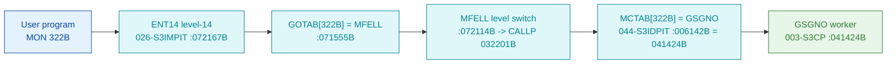

# MON 322B (octal) - GSGNO (GetSegmentNo)

Given a segment **name** (6 characters), return that segment's **number**. Segment names are created by
the RT LOADER or when a program is dumped reentrant (`@DUMP-PROGRAM-REENTRANT`). ND-100 monitor call.

**Status:** **byte-verified** (dispatch + worker body). The worker is real carved code in `003-S3CP`,
with siblings `GRTDA` / `1FU7`. All addresses/values are **octal**.

> **CORRECTED 2026-07-13.** The previous version of this folder located the worker via a fictional
> level-14 `GOTAB`/`DSI7` compiler stub and read `GSGNO` from `SINTRAN-DATA_commoncode`. **MON calls
> are not dispatched through that `GOTAB`** (it is `MFELL` for 224 of 256 calls); they go through
> **`MCTAB @ 005620B`** (segment `044-S3IDPIT`). `MCTAB[322B] = 041424B = GSGNO`, and that worker is
> carved in `003-S3CP`. See [`../317B-ExecuteCommand/README.md`](../317B-ExecuteCommand/README.md) and
> `SINTRAN/CARVING-HANDOFF.md` section 3a.

- **Full disassembly:** [`322B-GetSegmentNo.ASM`](322B-GetSegmentNo.ASM).
- **Emulator model:** [`322B-GetSegmentNo.pseudo.c`](322B-GetSegmentNo.pseudo.c).

---

## Dispatch path



---

## Code location (dispatch path)

Byte offset = `(addr - loadbase)` in octal words x 2 (decimal). Offsets reproduced with `dd`.

| Role | Segment | Addr (octal) | Byte offset | Symbol | Verdict |
|------|---------|--------------|-------------|--------|---------|
| MCTAB[322B] slot | [044-S3IDPIT.asm](../../segments-ref/044-S3IDPIT/044-S3IDPIT.asm) | `006142B` = `041424B` | 2244 | -> `GSGNO` | **VERIFIED** |
| GSGNO worker body | [003-S3CP.asm](../../segments-ref/003-S3CP/003-S3CP.asm) | `041424B-041447B` | 9768 | `GSGNO` | **VERIFIED** |

**Verify by hand** (from `tools/sintran-segment-carver/versions/L-VSX-500/segments/`):
```
dd if=044-S3IDPIT.bin bs=1 skip=2244 count=2 | od -An -tx1   ->  43 14   (= 041424B = GSGNO)
dd if=003-S3CP.bin    bs=1 skip=9768 count=2 | od -An -tx1   ->  ba 16   (= 135026B, GSGNO entry)
```

---

## Instruction walkthrough

Full listing: [`322B-GetSegmentNo.ASM`](322B-GetSegmentNo.ASM).

`GSGNO` calls a helper (`JPL I 26`) that looks up the segment by name, re-enables interrupts (`ION`),
then stages the argument words (`,B -200` / `-177` / `-176`) and calls two more helpers. If the second
helper reports not-found it takes the error return (`JMP I ,B -36 -> 041376B`). Otherwise it enters an
`IOF`-guarded critical section (`041436B`), walks a segment table at `mem[036]`, matches the name, and
returns the segment number via `ION` + `JMP I ,B -36 -> 041411B`. The helper calls, the critical
section and the two-way return are byte-proven; the exact name-match detail is **inferred**.

---

## Parameter / register contract

| Reg / field | Dir | Meaning | Verdict |
|-------------|-----|---------|---------|
| `mem[,B -200/-177/-176]` | in | staged argument words (segment name / key) | VERIFIED (bytes) |
| segment table `mem[036]` | in | table walked under IOF to find the match | VERIFIED (bytes); layout inferred |
| result (A) | out | segment number on the normal return; error return if not found | VERIFIED (two-way return); value inferred |
| segment name (6 chars) | in | manual: the name to resolve | inferred (manual) |

---

## Pseudo-code (for an emulator)

See **[`322B-GetSegmentNo.pseudo.c`](322B-GetSegmentNo.pseudo.c)** - the helper lookups, the IOF/ION
critical section and the found/not-found return are byte-verified; the name-match detail is inferred.

---

## Honest caveats

**What is byte-proven:** `MCTAB[322B] = 041424B = GSGNO`; the `GSGNO` entry bytes at `041424B` in
`003-S3CP` match the disassembly; the routine resolves a segment via helper lookups and an `IOF`-guarded
table walk, and has distinct found / not-found returns.

**What is NOT proven:** the exact 6-character name comparison and the layout of the segment table at
`mem[036]`. The old "DSI7 stub + commoncode worker" model was the wrong dispatch table/overlay and is
withdrawn.

Method: [../../../../../EXTRACTING-RESIDENT-CODE.md](../../../../../EXTRACTING-RESIDENT-CODE.md) ·
master map: [../../MON-CALL-INDEX.md](../../MON-CALL-INDEX.md).
