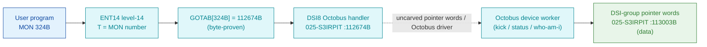

# MON 324B (octal) - OctobusFunction (OCTIO)

Performs various functions on an **old Octobus** (earlier than version 3): `0` = kick, `1` = wait for
kick, `5` = read Octobus status, `6` = who-am-I. This is an ND-100 monitor call.

**Status:** `partial`. `GOTAB[324B] = 112674B` (byte-proven) routes to the `DSI8` Octobus level-14
handler in overlay `025-S3IRPIT` - **real code** that validates the caller argument, folds the device
number (`AND 103` / `ADD 103`), and dispatches the Octobus operation through indirect worker pointer
words (`[113003B]..[113013B]`). The concrete Octobus device routines reached through those pointer
words are in the resident/runtime Octobus driver, which is **not in any carved segment**, so the
`DSI8 -> device worker` link is not byte-followable (see [Honest caveats](#honest-caveats)). All
addresses/values are **octal**.

> **UPDATE 2026-07-15 — the "not in any carved segment" claim above is OBSOLETE.**
> The Octobus driver bodies WERE subsequently located in the MPIT overlay
> [`../../segments-ref/026-S3IMPIT/026-S3IMPIT.asm`](../../segments-ref/026-S3IMPIT/026-S3IMPIT.asm)
> (load base 32000B, byte-identical twin `017-S3SMPIT` over 035400-041100):
> SOCTO=035546, IOCTO=035551, SOCTW=036342, SKICK=037254, KICKS=036047,
> MBSEND=037425, OMBREAD=037660, CONOMD=040062, ECONID=040467. The earlier failure
> was resolving the 03xxxx symbol addresses against commoncode instead of the
> PIT-mapped image (trap 5). Whether the DSI-group pointer words `[113003B]..[113013B]`
> point at THESE routines has not been byte-followed yet (the pointer cells are
> runtime-initialized), so the dashed hop below remains unproven — but the driver
> itself is now carved. See
> `E:\Dev\Ronny\NDInsight\SINTRAN\ND5000\OCTOBUS-ND100-ND5000-REFERENCE.md` §6.4.

- **Full disassembly:** [`324B-OctobusFunction.ASM`](324B-OctobusFunction.ASM) - the DSI8 handler + the DSI-group pointer/data words it dispatches through.
- **Bytes live once in** the canonical segment layer: [`../../segments-ref/`](../../segments-ref/).

---

## Dispatch path

The dashed hop (`D ⇢ E`) is the indirect dispatch through the DSI-group pointer words into the
Octobus device driver - **not present in any carved segment**, so it cannot be followed statically.
The `DSI8` handler (D) is real code; the pointer words (F) are real data whose final callees are
outside this carve.

---

## Code location (dispatch path)

Every row is a real region you can open. Byte offset = `(addr − loadbase)` in octal words × 2
(decimal); commoncode load base is `0`, `025-S3IRPIT` load base is `32000B`.

| Role | Segment (full disasm) | Addr range (octal) | Byte offset | Symbol | Verdict |
|------|------------------------|--------------------|-------------|--------|---------|
| GOTAB[324] dispatch word | [commoncode.asm](../../segments-ref/SINTRAN-DATA_commoncode/SINTRAN-DATA_commoncode.asm) · [.hex](../../segments-ref/SINTRAN-DATA_commoncode/SINTRAN-DATA_commoncode.hex) | `071557B` (1 word) | 59102 | `GOTAB+324` = `112674B` | **VERIFIED** |
| DSI8 Octobus handler | [025-S3IRPIT.asm](../../segments-ref/025-S3IRPIT/025-S3IRPIT.asm) · [.hex](../../segments-ref/025-S3IRPIT/025-S3IRPIT.hex) | `112674B-112722B` (23 words) | 50040 | `DSI8` | **VERIFIED** (real handler) |
| DSI-group pointer words | [025-S3IRPIT.asm](../../segments-ref/025-S3IRPIT/025-S3IRPIT.asm) · [.hex](../../segments-ref/025-S3IRPIT/025-S3IRPIT.hex) | `113003B-113013B` (data) | 50182 | (unnamed) | real bytes = **DATA** |
| Octobus device driver | — (uncarved) | — | — | Octobus driver | **UNVERIFIED** |

**Verify by hand (GOTAB word):** `grep '^71557 ' ../../segments-ref/SINTRAN-DATA_commoncode/SINTRAN-DATA_commoncode.hex`
→ `71557  112674  225 274  59102`; then
`dd if=../../../resident/SINTRAN-DATA_commoncode.bin bs=1 skip=59102 count=2 2>/dev/null | od -An -tx1`
→ `95 bc` (= octal `112674`, the DSI8 dispatch address).

**Verify by hand (DSI8 handler):** `grep '^112674 ' ../../segments-ref/025-S3IRPIT/025-S3IRPIT.hex`
→ byte offset `50040`, value `054412`; then
`dd if=../../../segments/025-S3IRPIT.bin bs=1 skip=50040 count=2 2>/dev/null | od -An -tx1`
→ `59 0a` (= octal `054412`, `LDX ,B 12`, the handler's first word). `prove-mon.py 324` reports the
same `GOTAB[324]=112674 -> DSI8`.

---

## Instruction walkthrough

Full listing: [`324B-OctobusFunction.ASM`](324B-OctobusFunction.ASM). All addresses octal; `X` =
result/param pointer, `B` = per-call Octobus datafield (roles inferred from the access pattern).

**DSI8 Octobus handler (112674-112722)** — `LDX ,B 12` loads the caller status/param slot, and
`JPL I 106 -> [113003]` runs a setup worker. `LDA ,X 1` fetches the function/param, and after a
second worker call the result is stored to `,B 21`. The device number is then folded:
`112701 LDA ,B 17 / 112702 AND 103 / 112703 ADD 103` masks and offsets it into a selector stored to
`,B 23`. The core Octobus operation is dispatched at `112705 JPL I 102 -> [113007]`. The result is
checked (`SKP IF DD UEQ 0`), and on a present result the handler reads a status word
(`LDA ,X 1 / LDT I 77 / SKP IF DA UEQ ST`), sets a status code (`SAA 5`) on mismatch, tests a result
bit (`BSKP ZRO 130 DA`), and returns through one of the pointer words `[113010]/[113012]/[113013]`.
**VERIFIED (bytes); the Octobus operations themselves live behind the pointer words.**

**DSI-group pointer/data words (113003-113013)** — the `JPL-I`/`JMP-I` targets used above. They
disassemble as bogus instructions because they are pointer cells, not code; their final callees are
in the uncarved Octobus driver.

---

## Parameter / register contract

Manual-side names/types are from [`324B_OctobusFunction.yaml`](../../../../../../../Developer/MON/calls/324B_OctobusFunction.yaml).

| Reg / field | Dir | Meaning | Verdict |
|-------------|-----|---------|---------|
| `FunctionCode` | in | Octobus function: `0`=kick, `1`=wait for kick, `5`=read status, `6`=who-am-I | inferred (manual) |
| `,B 17` | in | logical device number (folded via `AND 103` / `ADD 103`) | VERIFIED fold (112701-112704); role inferred |
| `,B 23` | work | folded device selector | VERIFIED (112704) |
| `,B 21` | work | prepared function result slot | VERIFIED (112700) |
| `Parameter` | io | function-dependent: func 0 returns destination station; func 5/6 return status | inferred (manual) |
| status code | out | `SAA 5` loaded on a status mismatch before the status return | VERIFIED (112715); meaning inferred |

The concrete Octobus device operations (kick / status / who-am-I) are reached through the DSI-group
pointer words and run in the uncarved Octobus driver; they are **not** resolvable from these bytes.

---

## Pseudo-code (for an emulator)

See **[`324B-OctobusFunction.pseudo.c`](324B-OctobusFunction.pseudo.c)** — a pseudo-C model for
emulator authors. The `DSI8` control flow (argument validation, the device-number fold, the indirect
dispatch pattern) is byte-verified; the concrete Octobus operations behind the pointer words are
modelled as opaque calls with the manual's documented behaviour.

Every instruction in the `.pseudo.c` is translated against the canonical
[`ND100-INSTRUCTION-SEMANTICS.md`](../../instruction-semantics/ND100-INSTRUCTION-SEMANTICS.md)
(`LDX ,B 12` = `X = mem[B+12]`; bare `AND 103` / `ADD 103` = P-relative `mem[P+disp]` masks, not
literals; `RADD CLD SD DX` = `X = D` COPY; `SKP IF DD UEQ 0` = `if (D != 0) skip`;
`SKP IF DA UEQ ST` = `if (A != T) skip`; `BSKP ZRO 130 DA` = `if (A bit11 == 0) skip`, bit number =
printed field `>>3`; `JPL I n` = call through `mem[P+n]`).

---

## Honest caveats

**What is byte-proven:** `GOTAB[324B] = 112674B` routes to `DSI8` (real code, first word `054412` =
`LDX ,B 12`); the `DSI8` handler's argument validation, the device-number fold (`AND 103` / `ADD
103`), the indirect dispatch at `JPL I 102 -> [113007]`, the result check (`SKP IF DD UEQ 0`), the
status compare (`LDT I 77` / `SKP IF DA UEQ ST` / `SAA 5`), and the three pointer-word returns; and
that `113003B..113013B` are real data (pointer cells).

**What is NOT proven:** the concrete Octobus operations. `DSI8` dispatches through the DSI-group
pointer words into the Octobus device driver, which is **not present in any carved segment** (a
resident/runtime overlay). The `who-am-i` / `kick` / `status` semantics come from the manual, not from
followed pointers. The nearby symbol `MOCTU=71032B` is a small 6-word Octobus leaf (an `EXIT`-bounded
helper), not the main handler body - the real device workers are the uncarved pointer callees.

This reconciles into one story: the dispatch head (`GOTAB[324] -> DSI8`) is solid; `DSI8` is a real,
fully-decoded Octobus handler; but its leaf device operations cross the uncarved pointer/driver layer.
Confirming them needs a live trace (break at `112674B` on a real `MON 324`, single-step the `JPL I`
dispatches, and record where P lands in the Octobus driver).

Method: [../../../../../EXTRACTING-RESIDENT-CODE.md](../../../../../EXTRACTING-RESIDENT-CODE.md) · dispatch reality:
[../../TASK-05-mismatches.md](../../TASK-05-mismatches.md) · master map: [../../MON-CALL-INDEX.md](../../MON-CALL-INDEX.md).
