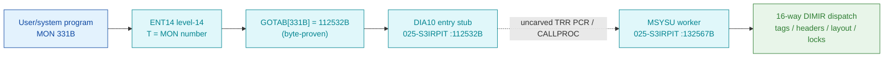

# MON 331B (octal) - DiskMirroring (MSYSU)

Internal-use disk-mirroring control (manual section 2.14). A sub-function index selects one of
**16 DIMIR operations** that manage disk-mirror tags, headers, layout and locks. Not intended for
user programs. This is an ND-100 monitor call.

**Status:** `partial`. `GOTAB[331B] = 112532B` (byte-proven) routes to the `DIA10` disk-device
entry stub in overlay `025-S3IRPIT` - real code that saves the caller register block and switches
page context (`TRR PCR`). The worker `MSYSU = 132567B` (same overlay) is **real code**: a 16-way
sub-function jump table whose shape matches the DiskMirroring contract. The `DIA10 -> MSYSU` link
crosses the `TRR PCR` context switch / resident `CALLPROC` bridge (uncarved), so it is attributed by
symbol + the 16-way dispatch, not a followed pointer (see [Honest caveats](#honest-caveats)). All
addresses/values are **octal**.

- **Full disassembly:** [`331B-DiskMirroring.ASM`](331B-DiskMirroring.ASM) - both regions (DIA10 entry stub + the MSYSU 16-way dispatcher).
- **Bytes live once in** the canonical segment layer: [`../../segments-ref/`](../../segments-ref/).

---

## Dispatch path

The dashed hop (`D ⇢ E`) is the page-context switch (`TRR PCR`) plus the resident `CALLPROC`
second-level dispatch - **not present in any carved segment**, so the exact `DIA10 -> MSYSU`
transfer cannot be followed statically. Both endpoints (the `DIA10` stub and the `MSYSU` body) are
real bytes in `025-S3IRPIT`.

---

## Code location (dispatch path)

Every row is a real region you can open. Byte offset = `(addr − loadbase)` in octal words × 2
(decimal); commoncode load base is `0`, `025-S3IRPIT` load base is `32000B`.

| Role | Segment (full disasm) | Addr range (octal) | Byte offset | Symbol | Verdict |
|------|------------------------|--------------------|-------------|--------|---------|
| GOTAB[331] dispatch word | [commoncode.asm](../../segments-ref/SINTRAN-DATA_commoncode/SINTRAN-DATA_commoncode.asm) · [.hex](../../segments-ref/SINTRAN-DATA_commoncode/SINTRAN-DATA_commoncode.hex) | `071564B` (1 word) | 59112 | `GOTAB+331` = `112532B` | **VERIFIED** |
| DIA10 entry stub | [025-S3IRPIT.asm](../../segments-ref/025-S3IRPIT/025-S3IRPIT.asm) · [.hex](../../segments-ref/025-S3IRPIT/025-S3IRPIT.hex) | `112532B-112560B` (25 words) | 49844 | `DIA10` | **VERIFIED** (real stub) |
| context switch / CALLPROC bridge | — (uncarved) | — | — | `TRR PCR` / `CALLPROC` | **UNVERIFIED** |
| MSYSU worker body | [025-S3IRPIT.asm](../../segments-ref/025-S3IRPIT/025-S3IRPIT.asm) · [.hex](../../segments-ref/025-S3IRPIT/025-S3IRPIT.hex) | `132567B-132733B` (code) | 66286 | `MSYSU` | real bytes; link **inferred** |

**Verify by hand (GOTAB word):** `grep '^71564 ' ../../segments-ref/SINTRAN-DATA_commoncode/SINTRAN-DATA_commoncode.hex`
→ `71564  112532  225 132  59112`; then
`dd if=../../../resident/SINTRAN-DATA_commoncode.bin bs=1 skip=59112 count=2 2>/dev/null | od -An -tx1`
→ `95 5a` (= octal `112532`, the DIA10 dispatch address).

**Verify by hand (DIA10 stub):** `grep '^112532 ' ../../segments-ref/025-S3IRPIT/025-S3IRPIT.hex`
→ byte offset `49844`, value `006017`; then
`dd if=../../../segments/025-S3IRPIT.bin bs=1 skip=49844 count=2 2>/dev/null | od -An -tx1`
→ `0c 0f` (= octal `006017`, `STA ,X 17`, the stub's first word).

**Verify by hand (MSYSU worker):** `grep '^132567 ' ../../segments-ref/025-S3IRPIT/025-S3IRPIT.hex`
→ byte offset `66286`, value `135145`; then
`dd if=../../../segments/025-S3IRPIT.bin bs=1 skip=66286 count=2 2>/dev/null | od -An -tx1`
→ `ba 65` (= octal `135145`, `JPL I 145`, the worker's first word). `prove-mon.py 331` reports the
same `GOTAB[331]=112532 -> DIA10`.

---

## Instruction walkthrough

Full listing: [`331B-DiskMirroring.ASM`](331B-DiskMirroring.ASM). All addresses octal; `X` = saved
register block, `B` = per-call disk datafield (roles inferred from the access pattern).

**DIA10 entry stub (112532-112560)** — the level-14 disk entry. It saves the caller's `A`/`T`/`L`
into a register block (`STA ,X 17` / `STT ,X 0` / `RADD CLD SL DX`), toggles the interrupt system
(`IOF` / `ION`) around a `TRR PCR` page-context switch, re-fetches the worker block pointer
(`LDX I 120 -> [112661B]`), and stores an initial status word (`STA ,B 12`). It then `JMP 62 ->
112630` into the shared disk-stub tail. **VERIFIED (bytes).**

**MSYSU 16-way dispatcher (132567-132644)** — after mirror-state setup (`JPL I 145/142/137` through
pointer words) and a mirror-flag check, `132620 LDA ,B 20` fetches the sub-function index, `SAT 17 /
SKP IF DT MGRE SA` bounds it to `0..17`, and `132624 RADD SA DP` performs `P = P + index` - a
computed jump into the 16-entry `JMP` table at `132625-132644`. Each entry vectors to a `JPL I`
through a pointer word (`[132747]..[132765]`) - the 16 DIMIR sub-function workers. **VERIFIED
(bytes); the operation each index performs is inferred.**

**Status store + return (132723-132733)** — the success path sets `SAA 0`, increments a counter
(`MIN ,B 7`), stores the status word (`STA ,B 12`), and returns via the caller link word
(`JMP I 7 -> [132742]`). Words `132734-132765` are the `JPL-I` pointer/data table (they disassemble
as bogus instructions); their final callees live outside this carve.

---

## Parameter / register contract

Manual-side names/types are from [`331B_DiskMirroring.yaml`](../../../../../../../Developer/MON/calls/331B_DiskMirroring.yaml).

| Reg / field | Dir | Meaning | Verdict |
|-------------|-----|---------|---------|
| `SubFunction` | in | disk-mirror sub-function index, one of 16 DIMIR functions (`0..17` octal) | VERIFIED range (132621-132624); meaning inferred (manual) |
| `,B 20` | in | sub-function index fetched by the worker | VERIFIED (132620) |
| `,B 25` | work | mirror-state word cleared/tested during setup | VERIFIED (132601/132617/132727) |
| `,B 7` | work | per-call counter incremented on success | VERIFIED (132724) |
| `,B 12` | out | status word stored to caller (error code or 0) | VERIFIED (132610/132726) |
| `,X 0/17` | work | saved register block (MON number, caller A) | VERIFIED (DIA10 stub) |
| error return | out | standard error code (appendix A) | inferred (manual) |

The 16 concrete DIMIR operations are reached through the `JPL I` pointer words and need live
`X`/`B` context; their final callees are outside the carved window and are **not** resolvable from
these bytes.

---

## Pseudo-code (for an emulator)

See **[`331B-DiskMirroring.pseudo.c`](331B-DiskMirroring.pseudo.c)** — a pseudo-C model for emulator
authors. The `DIA10` register-block save + `TRR PCR` context switch and the `MSYSU` 16-way jump
table + status store are byte-verified; the meaning of each DIMIR sub-function and the caller-side
parameter convention are inferred from the manual.

Every instruction in the `.pseudo.c` is translated against the canonical
[`ND100-INSTRUCTION-SEMANTICS.md`](../../instruction-semantics/ND100-INSTRUCTION-SEMANTICS.md)
(`RADD CLD SL DX` = `X = L` COPY; `RADD SA DP` = `P = P + A` computed jump; `SKP IF DT MGRE SA` =
unsigned skip when `17 >= index`; bare `LDA 132`/`LDA 101` = P-relative `mem[P+disp]`, not literals;
`MIN ,B 7` = increment-and-skip-on-zero; `MST PIE` = masked-set of the interrupt-enable register).

---

## Honest caveats

**What is byte-proven:** `GOTAB[331B] = 112532B` routes to `DIA10` (real code, first word `006017` =
`STA ,X 17`); the `DIA10` stub's register-block save + `IOF`/`TRR PCR`/`ION` critical section; the
`MSYSU` worker at `132567B` (first word `135145` = `JPL I 145`); the `0..17` sub-function range check
and the `RADD SA DP` computed jump into a 16-entry table; the status store at `,B 12`; return via the
caller link word.

**What is NOT proven:** the `DIA10 -> MSYSU` link and the 16 concrete DIMIR operations. `DIA10`
switches page context with `TRR PCR` and re-enters through the resident `CALLPROC` bridge, which
lives in an **uncarved overlay**; the 16 sub-function workers sit past the `JPL I` pointer cells,
also outside this carve. Attributing the body to `MSYSU` rests on the symbol name (`MSYSU` = Mirror
SYStem Utility) plus the 16-way dispatch shape that matches the manual's "16 DIMIR functions", not a
followed pointer.

This reconciles into one story: the dispatch head (`GOTAB[331] -> DIA10`) is solid; the `DIA10` stub
and the `MSYSU` 16-way dispatcher are both real bytes in `025-S3IRPIT`; the transfer between them and
the leaf DIMIR workers cross the uncarved context-switch/pointer layer. Confirming the exact link
needs a live trace (break at `112532B` on a real `MON 331`, single-step the `TRR PCR` switch, and
record where P lands).

Method: [../../../../../EXTRACTING-RESIDENT-CODE.md](../../../../../EXTRACTING-RESIDENT-CODE.md) · dispatch reality:
[../../TASK-05-mismatches.md](../../TASK-05-mismatches.md) · master map: [../../MON-CALL-INDEX.md](../../MON-CALL-INDEX.md).
