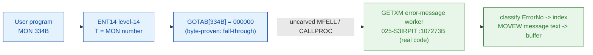

# MON 334B (octal) - GetErrorMessage (GETXM)

Gets a **SINTRAN III error-message text** for the input error number (appendix A lists the message
for each number) into a caller buffer and then **returns - the program continues**. Convenient for
advanced terminal use (e.g. show the error text in inverse video at the bottom line). Error number
`0` is illegal. This is an ND-100 monitor call.

**Status:** `partial`. `GOTAB[334B] = 000000` (byte-proven) - a **fall-through**: there is no direct
GOTAB handler word, so the level-14 handler is reached through the resident MFELL/CALLPROC path
(uncarved). The named worker `GETXM = 107273B` in `025-S3IRPIT` is real SINTRAN L bytes (executable
code: an error-number range classifier that copies message text with `MOVEW`); the exact
`MON 334 -> worker` link crosses an uncarved kernel bridge (see [Honest caveats](#honest-caveats)).
All addresses/values are **octal**.

- **Full disassembly:** [`334B-GetErrorMessage.ASM`](334B-GetErrorMessage.ASM) - the `GETXM` worker
  body (there is no entry stub because the GOTAB slot is zero).
- **Bytes live once in** the canonical segment layer: [`../../segments-ref/`](../../segments-ref/).

---

## Dispatch path

The GOTAB slot is zero, so there is **no per-call entry stub**. The dashed hop (`C ⇢ E`) is the
resident `MFELL`/`CALLPROC` fall-through second-level dispatch - it is **not present in any carved
segment**, so it is the one link that cannot be followed statically. `GETXM` (E) is the named worker
for this call and **is** real executable code.

---

## Code location (dispatch path)

Every row is a real region you can open. Byte offset = `(addr - loadbase)` in octal words x 2; for
`025-S3IRPIT` (load base `32000B`) that is `(addr - 32000B)` octal words x 2 (decimal).

| Role | Segment (full disasm) | Addr range (octal) | Byte offset | Symbol | Verdict |
|------|------------------------|--------------------|-------------|--------|---------|
| GOTAB[334] dispatch word | [commoncode.asm](../../segments-ref/SINTRAN-DATA_commoncode/SINTRAN-DATA_commoncode.asm) · [.hex](../../segments-ref/SINTRAN-DATA_commoncode/SINTRAN-DATA_commoncode.hex) | `071567B` (1 word) | 59118 | `GOTAB+334` = `000000` | **VERIFIED** (fall-through) |
| resident MFELL/CALLPROC bridge | - (uncarved) | - | - | `MFELL`/`CALLPROC` | **UNVERIFIED** |
| GETXM worker body | [025-S3IRPIT.asm](../../segments-ref/025-S3IRPIT/025-S3IRPIT.asm) · [.hex](../../segments-ref/025-S3IRPIT/025-S3IRPIT.hex) | `107273B-107464B` (code) + `107465B-107525B` (data) | 46454 | `GETXM` | real bytes = **CODE**; body link **MISATTRIBUTED** |
| GETER alternate name | [commoncode.asm](../../segments-ref/SINTRAN-DATA_commoncode/SINTRAN-DATA_commoncode.asm) · [.hex](../../segments-ref/SINTRAN-DATA_commoncode/SINTRAN-DATA_commoncode.hex) | `074104B` (5 words) | 61576 | `GETER` | **NOT CARVED** (zero-filled) |

**Verify by hand:** the GOTAB slot is zero (fall-through):
`grep '^71567 ' ../../segments-ref/SINTRAN-DATA_commoncode/SINTRAN-DATA_commoncode.hex`
-> `71567  000000  000 000  59118`; then
`dd if=../../../resident/SINTRAN-DATA_commoncode.bin bs=1 skip=59118 count=2 2>/dev/null | od -An -tx1`
-> `00 00` (= `000000`, fall-through). For the `GETXM` worker first words:
`dd if=../../../segments/025-S3IRPIT.bin bs=1 skip=46454 count=8 2>/dev/null | od -An -tx1`
-> `ba 7a 5a 7a 49 0f cc 69` (= octal `135172 055172 044417 146151` = `JPL I 172` / `LDX I 172` /
`LDA ,B 17` / `RADD CLD SA DD`, real code, confirming the region is code). `prove-mon.py 334`
reports the same `GOTAB[334]=000000` fall-through.

---

## Instruction walkthrough

Full listing: [`334B-GetErrorMessage.ASM`](334B-GetErrorMessage.ASM). The functional body is the
`GETXM` worker; there is no entry stub because `GOTAB[334] = 0`.

**Entry + setup (`107273-107321`)** - `107275 LDA ,B 17` fetches the caller error number;
`107276 RADD CLD SA DD` copies it to `D`; `107310 SAA 4` / `107311 MST PIE` raise the level and
enable PIE; several `JPL I` calls (`-> 107465/107467/107471/107473`, resident helpers via link cells)
prepare the lookup.

**Range-classification chain (`107322-107463`)** - a repeated pattern classifies the error number:
`LDT <threshold>` / `SKP IF DA MLST ST` or `SKP IF DA MGRE ST` (compare the number against a bound),
`SUB <base>` / `RADD CLD SA DX` (`X := number - base`, the message index), then either
`LDA I ,X <n>` or `JPL I -> 107505` (fetch the message-table entry) and, for the longer ranges,
`MOVEW` (a block word move, count `11` = 9. words in `L`) to copy the message text. Every in-range
path ends `JMP -> 107464`, the common exit.

> SYMBOL NOTE: the flat symbol map places `X21RD`/`X21DC`/`DMLP2`/`X21CH`/`X21BR`/`DILP2`/`X21C`
> labels inside `107344-107457`, but the bytes there decode as the *same* GETXM classification
> pattern - those labels do **not** correspond to this instruction stream (a symbol/overlay artefact;
> bytes are ground truth). The body is one continuous routine.

**Common exit (`107464`)** - `JMP 42 -> 107526` reaches the shared message-copy/return code (outside
this window), which delivers the text and returns (the program continues). Words `107465-107525` are
a message-offset / pointer table (**data**); nd100-dis renders them as bogus instructions.

---

## Parameter / register contract

Manual-side names/types are from [`334B_GetErrorMessage.yaml`](../../../../../../../Developer/MON/calls/334B_GetErrorMessage.yaml).

| Reg / field | Dir | Meaning | Verdict |
|-------------|-----|---------|---------|
| `A` (ErrorNo) | in | error number of the message to retrieve; **0 is illegal** (`MAC` example `LDA ERRNO`) | inferred (manual); fetched by `107275 LDA ,B 17`, classified by the range chain (VERIFIED as an in-value) |
| `X` (Buffer) | out | address of the buffer that receives the message text (128 chars) (`MAC` `LDX (BUF`) | inferred (manual); the body uses `X` as the message index then `MOVEW` copies text |
| `MOVEW` block | internal | message text copy, `L = 11` (9. words) per copy (`107413/107434/107455 RADD CLD SA DL` + `MOVEW`) | **VERIFIED** (bytes) |
| return | out | none - the program continues; error status on the `STA STAT` return | inferred (manual) |

The worker's classification/copy staging is VERIFIED from bytes, but the mapping onto the
user-visible `ErrorNo`-in / `Buffer`-out contract lives in the caller-side `MON 334` wrapper and the
uncarved `CALLPROC` frame, so that part of the contract is **inferred**, not byte-proven here.

---

## Pseudo-code (for an emulator)

See **[`334B-GetErrorMessage.pseudo.c`](334B-GetErrorMessage.pseudo.c)** - a pseudo-C model of the
`GETXM` worker for emulator authors. The range-classification chain and the `MOVEW` message copies
are byte-verified; the appendix-A message table and the caller buffer are inferred from the manual.
The fall-through `-> GETXM` bridge is modelled but not proven. Every ND-100 instruction in the model
is translated per the canonical
[`ND100-INSTRUCTION-SEMANTICS.md`](../../instruction-semantics/ND100-INSTRUCTION-SEMANTICS.md)
(`SKP IF DA MLST ST` = skip if `A < T` unsigned; `SKP IF DA MGRE ST` = skip if `A >= T` unsigned;
`RADD CLD SA DX` = `X := A`; `MOVEW` = block word move, count in `L`, source `A:D`, dest `X:T`;
`MST PIE` = masked set of PIE by A).

---

## Honest caveats

**What is byte-proven:** `GOTAB[334B] = 000000` (level-14 dispatch, a fall-through with no per-call
vector; `prove-mon.py 334` reads commoncode file byte `0xe6ee = 00 00`). The `GETXM` worker body at
`107273B` is real code - its first words `135172 055172 044417 146151` are genuine `JPL I` / `LDX I` /
`LDA ,B` / `RADD` instructions, the body is a clean error-number range classifier with `MOVEW`
message copies, and every in-range path converges on the common exit `107464 -> 107526`.

**What is NOT proven:** the link from the zero GOTAB slot to the `GETXM` worker. Because the vector
is zero there is no stub to disassemble and no pointer to dereference; dispatch drops into the
resident `MFELL`/`CALLPROC` second-level path, which lives in an **uncarved overlay**. So the
`MON 334 -> GETXM` attribution rests on the `GETXM` symbol name (= the `334B` short name in the
manual) + the classify/copy behaviour, not a followed pointer - hence **MISATTRIBUTED** in the strict
sense (a fall-through worker attached by name). A secondary honesty note: the alternate-named region
`GETER=074104B` (commoncode, "GET ERror") is **zero-filled (not carved)** in this L image, so it
offers no body; and the `X21xx`/`DMLP2`/`DILP2` symbol labels inside the body range are a
symbol/overlay artefact that does not match the decoded bytes.

This reconciles into one story: the dispatch head (`GOTAB[334]=0`, fall-through) is solid; there is
no stub; and `GETXM` is a real, self-contained error-message-lookup worker whose attribution to
MON 334 is by name + behaviour, not by a followed link. Confirming it needs a live trace: issue a
real `MON 334`, single-step the level-14 fall-through into the resident `CALLPROC`, and confirm P
lands on `GETXM=107273`.

Method: [../../../../../EXTRACTING-RESIDENT-CODE.md](../../../../../EXTRACTING-RESIDENT-CODE.md) · dispatch reality:
[../../TASK-05-mismatches.md](../../TASK-05-mismatches.md) · master map: [../../MON-CALL-INDEX.md](../../MON-CALL-INDEX.md).
