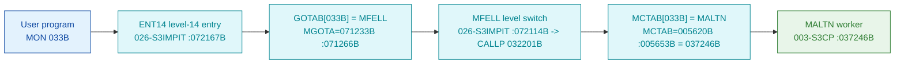

# MON 033B (octal) - MALTN (AltPageTable)

Handles the MMU **alternative** page table (manual: MON 33B). The worker `MALTN` is carved in
`003-S3CP` and heads a small family of sibling entries (`SKICK`, `SIDEN`) that share a common
body. All addresses/values are **octal**.

**Status:** **byte-verified** (dispatch chain + worker entry). The worker is real carved code
in `003-S3CP`.

> **CORRECTED 2026-07-13.** Earlier versions of this folder used the disproven dispatch model
> (GOTAB as the monitor-call table, an "uncarved CALLPROC bridge") and named the worker `ALTON`.
> MON calls dispatch through **`MCTAB @ 005620B`** (segment `044-S3IDPIT`), not `GOTAB` (which is
> `MFELL` for 224 of 256 calls). `MCTAB[33B] = 037246B = MALTN`, carved in `003-S3CP`. See
> [`../317B-ExecuteCommand/README.md`](../317B-ExecuteCommand/README.md) and
> `SINTRAN/CARVING-HANDOFF.md` section 3a.

- **Full disassembly:** [`33B-AltPageTable.ASM`](33B-AltPageTable.ASM).
- **Emulator model:** [`33B-AltPageTable.pseudo.c`](33B-AltPageTable.pseudo.c).

---

## Dispatch path



---

## Code location (dispatch path)

Byte offset = `(addr - loadbase)` in octal words x 2 (decimal). Every offset was reproduced
with `dd`.

| Role | Segment | Addr (octal) | Byte offset | Symbol | Verdict |
|------|---------|--------------|-------------|--------|---------|
| GOTAB[033B] slot | [026-S3IMPIT.asm](../../segments-ref/026-S3IMPIT/026-S3IMPIT.asm) | `071266B` = `072114B` | 32108 | -> `MFELL` | **VERIFIED** |
| MFELL level switch | [026-S3IMPIT.asm](../../segments-ref/026-S3IMPIT/026-S3IMPIT.asm) | `072114B` | 32920 | `MFELL` | **VERIFIED** |
| MCTAB[033B] slot | [044-S3IDPIT.asm](../../segments-ref/044-S3IDPIT/044-S3IDPIT.asm) | `005653B` = `037246B` | 1878 | -> `MALTN` | **VERIFIED** |
| MALTN worker body | [003-S3CP.asm](../../segments-ref/003-S3CP/003-S3CP.asm) | `037246B-037253B` | 7500 | `MALTN` | **VERIFIED** |

**Verify by hand** (from `tools/sintran-segment-carver/versions/L-VSX-500/segments/`):
```
dd if=026-S3IMPIT.bin bs=1 skip=32108 count=2 | od -An -tx1   ->  74 4c   (= 072114B = MFELL)
dd if=044-S3IDPIT.bin bs=1 skip=1878  count=2 | od -An -tx1   ->  3e a6   (= 037246B = MALTN)
dd if=003-S3CP.bin    bs=1 skip=7500  count=2 | od -An -tx1   ->  50 54   (= 050124B, MALTN entry word)
```

---

## Instruction walkthrough

Full listing: [`33B-AltPageTable.ASM`](33B-AltPageTable.ASM).

**Entry (`037246B-037253B`).** `050124 LDT 124` loads a page-table selector, `042515 MIN ,X ,B 115`
and `041105 MIN I 105` bump page-table bookkeeping fields, `051040 LDT I 40` / `023400 STD I ,B ,X 0`
write a double word into a page-table slot (indirect indexed), and `047503 LDA I ,B ,X 103` reads
back a status word. The sibling entries `SKICK` (`037254B`) and `SIDEN` (`037256B`) share the same
page-table body.

**Shared body (`037272B+`).** `146146 RADD CLD SL DT` / `010600 STT ,B -200` save the return link,
then a normalize/count loop (`037300B-037303B`: `AAA -12` / `JAN` / `RADD AD1 0 DD` / `JMP -3`),
`120074 MPY 74` (index times entry-size 074) and `135075 JPL I 75` (helper `@037404B`) index and
update a page-table entry. This is page-table (alternative-map) manipulation.

The exact page-table field semantics are **inferred** from structure; the entry, the sibling
family and the loop/index arithmetic are byte-proven.

---

## Parameter / register contract

| Reg / field | Dir | Meaning | Verdict |
|-------------|-----|---------|---------|
| `T` (`LDT 124`) | in | page-table selector / bank | VERIFIED (bytes); meaning inferred |
| `,B -200` | frame | saved return link (`STT ,B -200`) | VERIFIED (bytes) |
| `,B -175`,`,B -177` | frame | staged operands (`STT ,B -175`, `STA ,B -177`) | VERIFIED (bytes); meaning inferred |
| page-table slot | in/out | updated via `STD I ,B ,X 0` and the `MPY 74`/`JPL I 75` helper | VERIFIED (bytes); layout inferred |

---

## Pseudo-code (for an emulator)

See **[`33B-AltPageTable.pseudo.c`](33B-AltPageTable.pseudo.c)**. The entry, the sibling family and
the index/loop arithmetic are byte-verified; the alternative-page-table field layout is inferred.

---

## Honest caveats

**What is byte-proven:** the full dispatch chain - `GOTAB[033B] = MFELL`, `MFELL` switches program
level to `CALLP`, `MCTAB[033B] = MALTN = 037246B`, and the `MALTN` entry bytes at `037246B` in
`003-S3CP` match the disassembly. `MALTN`/`SKICK`/`SIDEN` share one page-table body.

**What is NOT proven:** the exact alternative-page-table entry layout, the meaning of each staged
field, and the internals of the `037404B` helper. Those are inferred from structure, not these bytes.

Method: [../../../../../EXTRACTING-RESIDENT-CODE.md](../../../../../EXTRACTING-RESIDENT-CODE.md) ·
master map: [../../MON-CALL-INDEX.md](../../MON-CALL-INDEX.md).
