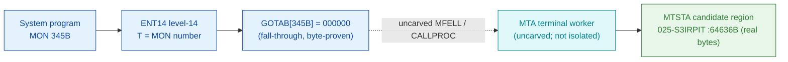

# MON 345B (octal) - MTAFunction (MTAD)

MTA terminal-line function (manual sections 2.14 / 2.17; short name `MTAD`, also printed as
`MTADFunction`). Connects or disconnects a terminal line to a datafield. Internal-use call; not
intended for user programs. This is an ND-100 monitor call.

**Status:** `documented` (fall-through). `GOTAB[345B] = 000000` (byte-proven) - a **fall-through**:
there is no direct GOTAB handler word, so the level-14 handler is reached through the resident
`MFELL`/`CALLPROC` path (uncarved). The MTA terminal-line handler exists as real code in overlay
`025-S3IRPIT` near the `MTSTA` symbol, but the fall-through bridge to it is uncarved and the exact
worker is **not statically isolable** from these bytes. `MTSTA` is shown as a **candidate** (real
bytes) only, attributed by the symbol-name family, not a followed pointer (see
[Honest caveats](#honest-caveats)). All addresses/values are **octal**.

- **Full disassembly:** [`345B-MTAFunction.ASM`](345B-MTAFunction.ASM) - the zero GOTAB head + the candidate MTSTA terminal-line region.
- **Bytes live once in** the canonical segment layer: [`../../segments-ref/`](../../segments-ref/).

---

## Dispatch path

The dashed hop (`C ⇢ D`) is the resident `MFELL`/`CALLPROC` fall-through - **not present in any
carved segment**, so it cannot be followed statically. `GOTAB[345B]` is literally `000000`, so there
is no entry stub to disassemble. `MTSTA` (E) is a real-bytes terminal-line routine in the same
overlay, offered as a candidate for the worker family, not a proven target.

---

## Code location (dispatch path)

Every row is a real region you can open. Byte offset = `(addr − loadbase)` in octal words × 2
(decimal); commoncode load base is `0`, `025-S3IRPIT` load base is `32000B`.

| Role | Segment (full disasm) | Addr range (octal) | Byte offset | Symbol | Verdict |
|------|------------------------|--------------------|-------------|--------|---------|
| GOTAB[345] dispatch word | [commoncode.asm](../../segments-ref/SINTRAN-DATA_commoncode/SINTRAN-DATA_commoncode.asm) · [.hex](../../segments-ref/SINTRAN-DATA_commoncode/SINTRAN-DATA_commoncode.hex) | `071600B` (1 word) | 59136 | `GOTAB+345` = `000000` | **VERIFIED** (fall-through) |
| resident MFELL/CALLPROC bridge | — (uncarved) | — | — | `MFELL`/`CALLPROC` | **UNVERIFIED** |
| MTSTA candidate terminal region | [025-S3IRPIT.asm](../../segments-ref/025-S3IRPIT/025-S3IRPIT.asm) · [.hex](../../segments-ref/025-S3IRPIT/025-S3IRPIT.hex) | `64636B-64647B` (real bytes) | 27452 | `MTSTA` | real bytes; link **MISATTRIBUTED** |

There is no entry-stub row: `GOTAB[345]` is `000000`, so the level-14 handler is a resident
fall-through, not a `025-S3IRPIT` stub.

**Verify by hand (GOTAB word):** `grep '^71600 ' ../../segments-ref/SINTRAN-DATA_commoncode/SINTRAN-DATA_commoncode.hex`
→ `71600  000000  000 000  59136`; then
`dd if=../../../resident/SINTRAN-DATA_commoncode.bin bs=1 skip=59136 count=2 2>/dev/null | od -An -tx1`
→ `00 00` (the zero = fall-through). `prove-mon.py 345` reads the same GOTAB zero.

**Verify by hand (MTSTA candidate):** `grep '^64636 ' ../../segments-ref/025-S3IRPIT/025-S3IRPIT.hex`
→ byte offset `27452`, value `135026`; then
`dd if=../../../segments/025-S3IRPIT.bin bs=1 skip=27452 count=2 2>/dev/null | od -An -tx1`
→ `ba 16` (= octal `135026`, `JPL I 26`, the candidate region's first word - real code).

---

## Instruction walkthrough

Full listing: [`345B-MTAFunction.ASM`](345B-MTAFunction.ASM). There is **no entry stub**
(fall-through dispatch), so there is no in-path walkthrough for the dispatch head.

**GOTAB[345] = 000000 (fall-through)** — the dispatch word is zero; dispatch enters the resident
`MFELL`/`CALLPROC` handler, which is uncarved.

**MTSTA candidate region (64636-64647)** — real code: `JPL I 26 -> [064664]` runs a setup worker,
then `LDA ,B 21 / STATX` and `LDA ,B 23 / STATX` write two terminal-line status words to the device
via the physical device-status transfer `STATX`, and control returns through a caller link word
(`JMP I ,B 42`). This is consistent with a terminal-line connect/disconnect routine, but its link to
`MON 345B` is **not** byte-proven - it is attributed by the `MTSTA`/`MTSTART` name family only.

---

## Parameter / register contract

Manual-side names/types are from [`345B_MTAFunction.yaml`](../../../../../../../Developer/MON/calls/345B_MTAFunction.yaml)
(the yaml declares no user-visible parameters - an internal-use call).

| Reg / field | Dir | Meaning | Verdict |
|-------------|-----|---------|---------|
| (internal) | — | connect/disconnect a terminal line to a datafield | inferred (manual sections 2.14 / 2.17) |
| `,B 21` / `,B 23` | work | terminal-line status words written via `STATX` (in the MTSTA candidate) | VERIFIED bytes (64637-64642); MON 345 link not proven |
| caller convention | in | register/CALLG mapping not confirmed from the available source | UNVERIFIED |

Because `GOTAB[345]` is zero and the worker sits past the uncarved fall-through, **nothing** in the
user-visible contract is byte-proven for this call.

---

## Pseudo-code (for an emulator)

See **[`345B-MTAFunction.pseudo.c`](345B-MTAFunction.pseudo.c)** — a pseudo-C model for emulator
authors. Because `GOTAB[345]` is a fall-through and the real MTA worker sits past the uncarved
`MFELL`/`CALLPROC`, the model is of the **documented** behaviour only (connect/disconnect a terminal
line to a datafield), NOT the carved code. The `MTSTA` candidate is modelled separately as real
bytes, flagged not-proven. The fall-through `MON 345 -> worker` bridge is modelled but not proven.

Instruction semantics follow the canonical reference:
[`../../instruction-semantics/ND100-INSTRUCTION-SEMANTICS.md`](../../instruction-semantics/ND100-INSTRUCTION-SEMANTICS.md)
(`STATX` = `phys[EL] = A` with `EL = ((T & 0xFF) << 16) | ((X + disp) & 0xFFFF)`, a 24-bit physical
device transfer; `RADD CLD 0 DA` = `A = 0`; `JMP I ,B 42` = jump through `mem[B+42]`).

---

## Honest caveats

**What is byte-proven:** `GOTAB[345B] = 000000` (level-14 fall-through; `prove-mon.py 345` reads
commoncode file byte `0xe700 = 00 00`). That is the only fact these carved bytes establish for the
dispatch of this call. Separately, the `MTSTA` region at `64636B` is real code (first word `135026` =
`JPL I 26`) that drives terminal-line status via `STATX`.

**What is NOT proven:** that `MTSTA` is the `MON 345B` worker, and any link from the fall-through to
it. Because `GOTAB[345]` is `000000`, there is no stub to follow; dispatch enters the resident
`MFELL`/`CALLPROC` handler in an **uncarved overlay**. The yaml names the handler `MTSTART`
(`MP-P2-TERM-DRIV.NPL`), and the carved `MTSTA` symbol is a plausible name-family match with real
terminal-line code, but that is **inferred**, not a followed pointer - hence `MISATTRIBUTED` for the
candidate.

This reconciles into one story: the dispatch head (`GOTAB[345]=0`, fall-through) is solid; the MTA
terminal-line code exists in `025-S3IRPIT` (`MTSTA` and neighbours are real bytes); but the exact
`MON 345 -> worker` link crosses the uncarved fall-through and is not isolable from these bytes.
Confirming the actual worker needs a live trace (break on a real `MON 345`, single-step the
fall-through, and record where P lands).

Method: [../../../../../EXTRACTING-RESIDENT-CODE.md](../../../../../EXTRACTING-RESIDENT-CODE.md) · dispatch reality:
[../../TASK-05-mismatches.md](../../TASK-05-mismatches.md) · master map: [../../MON-CALL-INDEX.md](../../MON-CALL-INDEX.md).
