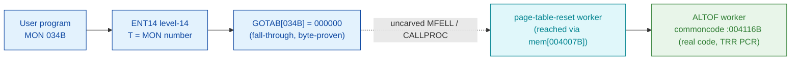

# MON 034B (octal) - NormalPageTable (ALTOF)

> **CORRECTED 2026-07-15 (byte-verified).** The worker + dispatch described below are on the
> DEBUNKED model and are WRONG. Byte truth from the carved L07 image:
> `MCTAB[34B] = 005654B = MALTF=037313B` in segment 003-S3CP, reached by the real dispatch
> `MON 34B -> ENT14(072167B) -> GOTAB[34B]=MFELL(072114B) -> CALLP(032201B) -> MCTAB[34B]=MALTF`.
> Any "GOTAB from commoncode" / "uncarved CALLPROC bridge" / "F16xx stub" / old worker name below
> is an artefact of the wrong table. Verified: `dd if=044-S3IDPIT.bin bs=1 skip=1880 count=2`
> -> `3e cb`. Cross-ref ../317B-ExecuteCommand/README.md and SINTRAN/CARVING-HANDOFF.md sec 3a.

Sets the alternative page table **equal to the normal page table**: after this call all
memory addresses are mapped through the normal page table again (it undoes AltPageTable,
MON 033B). This is an ND-100 monitor call. The documented short-name is **ALTOFF**; the
internal SYMBOL-1 worker is **ALTOF = 004116B**.

**Status:** `partial`. `GOTAB[034B] = 000000` (byte-proven) is a **fall-through**: there is no
direct GOTAB handler word, so the level-14 handler is reached through the resident
MFELL/CALLPROC path (uncarved). The named worker `ALTOF = 004116B` in resident commoncode **is
real executable code** that rewrites the paging-control register (`TRR PCR`) so the alternative
page table equals the normal one - exactly the documented behaviour. The exact
`MON 034B -> ALTOF` edge crosses the uncarved bridge, so it is not byte-followable; `ALTOF` is
attached by symbol **name**, its position immediately after `ALTON` (MON 033B) and the shared
PCR-image pointer `004007B` (see [Honest caveats](#honest-caveats)). All addresses/values are
**octal**.

- **Full disassembly:** [`34B-NormalPageTable.ASM`](34B-NormalPageTable.ASM) - the GOTAB fall-through word + the ALTOF worker.
- **Bytes live once in** the canonical segment layer: [`../../segments-ref/`](../../segments-ref/).

---

## Dispatch path

The dashed hop (`C -> D`) is the resident `MFELL`/`CALLPROC` fall-through - **not present in
any carved segment**, so it is the one link that cannot be followed statically. `GOTAB[034B]`
is literally `000000`, so there is no entry stub to disassemble; dispatch enters the resident
handler, which reaches the reset worker. `ALTOF` (E) is the named commoncode worker; unlike
some fall-through siblings whose named region is zero-filled, `ALTOF` holds **real code**.

---

## Code location (dispatch path)

Every row is a real region you can open. Byte offset = `(addr - loadbase)` in octal words x 2;
the commoncode load base is `0`, so the byte offset is simply `octal-addr x 2` (decimal).

| Role | Segment (full disasm) | Addr range (octal) | Byte offset | Symbol | Verdict |
|------|------------------------|--------------------|-------------|--------|---------|
| GOTAB[034] dispatch word | [commoncode.asm](../../segments-ref/SINTRAN-DATA_commoncode/SINTRAN-DATA_commoncode.asm) - [.hex](../../segments-ref/SINTRAN-DATA_commoncode/SINTRAN-DATA_commoncode.hex) | `071267B` (1 word) | 58734 | `GOTAB+034` = `000000` | **VERIFIED** (fall-through) |
| resident MFELL/CALLPROC bridge | - (uncarved) | - | - | `MFELL`/`CALLPROC` | **UNVERIFIED** |
| ALTOF worker body | [commoncode.asm](../../segments-ref/SINTRAN-DATA_commoncode/SINTRAN-DATA_commoncode.asm) - [.hex](../../segments-ref/SINTRAN-DATA_commoncode/SINTRAN-DATA_commoncode.hex) | `004116B-004133B` (14 words) | 4252 | `ALTOF`/`SINAL` (SYMBOL-1) | real SINTRAN L bytes = **CODE**; body link **MISATTRIBUTED** |

There is no entry-stub row: `GOTAB[034]` is `000000`, so the level-14 handler is a resident
fall-through, not a `025-S3IRPIT` stub.

**Verify by hand:** the GOTAB word is a zero (fall-through):
`grep '^71267 ' ../../segments-ref/SINTRAN-DATA_commoncode/SINTRAN-DATA_commoncode.hex`
-> `71267  000000  000 000  58734`; then
`dd if=../../../resident/SINTRAN-DATA_commoncode.bin bs=1 skip=58734 count=2 | od -An -tx1`
-> `00 00`. For the ALTOF worker first word:
`grep '^4116 ' ../../segments-ref/SINTRAN-DATA_commoncode/SINTRAN-DATA_commoncode.hex`
-> `4116  150401  321 001  4252`; then
`dd if=../../../resident/SINTRAN-DATA_commoncode.bin bs=1 skip=4252 count=2 | od -An -tx1`
-> `d1 01` (= octal `150401`, `IOF` - a real instruction, confirming the region is code).
`prove-mon.py 34` reports the same `GOTAB[34]=000000` fall-through.

---

## Instruction walkthrough

Full listing: [`34B-NormalPageTable.ASM`](34B-NormalPageTable.ASM). There is no entry stub
(fall-through dispatch).

**ALTOF worker (004116-004133)** - real page-table-reset code (14 words). It (1) turns
interrupts off (`IOF`, privileged) and saves `A`/`X`, (2) selects a level with `SAA 10` and
reads the paging-control for that level (`TRA PGC`), (3) masks it (`AND 14` -> `074000B`) and
ORs in the normal-table select bits (`ORA 14` -> `001616B`), (4) writes the result to the
hardware paging-control register (`TRR PCR`) - making the alternative page table equal the
normal one - and updates the PCR image via the shared `004007B` pointer (`LDX I 7` /
`STA ,X 17`), then (5) restores `A`/`X`, turns interrupts on and `EXIT`s. `ALTOF` sits
directly after `ALTON` (MON 033B) and shares the constant pool at `004134B-004140B`.

---

## Parameter / register contract

Manual-side names/types are from [`34B_NormalPageTable.yaml`](../../../../../../../Developer/MON/calls/34B_NormalPageTable.yaml).

| Reg / field | Dir | Meaning | Verdict |
|-------------|-----|---------|---------|
| (none) | in | NormalPageTable takes no parameters | VERIFIED (the ALTOF body reads no param block) |
| PCR (paging-control reg) | out | rewritten so alternative page table = normal page table | VERIFIED (`TRR PCR` at `004125B`) |
| `ErrCode` / `A` | out | standard error code (0 = OK) | inferred (manual) |

The zero-parameter shape and the PCR reset are byte-proven from the ALTOF body. The error
return is a manual convention filled in by the caller/CALLPROC frame, so that row is
**inferred**.

---

## Pseudo-code (for an emulator)

See **[`34B-NormalPageTable.pseudo.c`](34B-NormalPageTable.pseudo.c)** - a pseudo-C model for
emulator authors. The `ALTOF` control flow (read PGC, mask, OR in the normal-table bits,
`TRR PCR`) is byte-verified; the fall-through `MON 034 -> ALTOF` bridge is modelled but not
proven. Every instruction is translated per the canonical
[`../../instruction-semantics/ND100-INSTRUCTION-SEMANTICS.md`](../../instruction-semantics/ND100-INSTRUCTION-SEMANTICS.md)
(`TRA PGC` / `TRR PCR` per section 9.7; `AND`/`ORA` per the cheat-sheet).

---

## Honest caveats

**What is byte-proven:** `GOTAB[034B] = 000000` (level-14 fall-through; `prove-mon.py 34` reads
the commoncode zero word). The `ALTOF` region at `004116B` is **real code** - its first word
`150401B` is `IOF`, and the body ends in a clean `TRR PCR` / `EXIT` that resets the
paging-control register.

**What is NOT proven:** the static edge from `GOTAB[034]=000000` to `ALTOF`. A `000000` GOTAB
word gives no target address; the transfer runs through the resident `MFELL`/`CALLPROC`
second-level dispatch in an **uncarved overlay**, so no byte-level edge connects entry 034 to
`004116B`. Attributing the worker to `ALTOF` rests on the symbol **name** (`ALTOF` =
ALTernative-page-table OFF, documented short-name ALTOFF), its position immediately after
`ALTON` (the MON 033B worker), and the shared PCR-image pointer `004007B` - strong, but not a
followed pointer - hence `misattributed` in the strict sense.

This reconciles into one story: the dispatch head (`GOTAB[034]=0`, fall-through) is solid; the
named `ALTOF` region is real, coherent page-table-reset code that undoes `ALTON` and matches
the documented NormalPageTable behaviour. Confirming the actual edge needs a live trace (break
on a real `MON 34`, single-step the fall-through, and confirm P lands on `004116B`).

Method: [../../../../../EXTRACTING-RESIDENT-CODE.md](../../../../../EXTRACTING-RESIDENT-CODE.md) - dispatch reality:
[../../TASK-05-mismatches.md](../../TASK-05-mismatches.md) - master map: [../../MON-CALL-INDEX.md](../../MON-CALL-INDEX.md).
