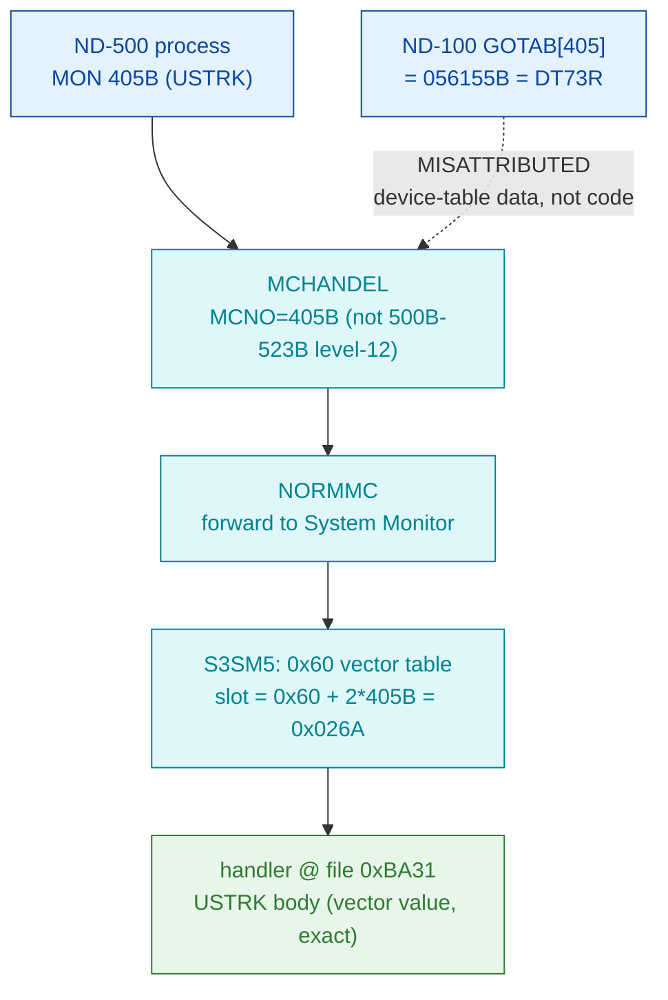

# MON 405B (octal) — SwitchUserBreak (USTRK)

Switches the **user-defined ESCAPE handling** of an ND-500 program on or off. When on, pressing
the ESCAPE key transfers control to a user routine and lets the register set be saved (read back
later with `GetUserRegisters`, MON 420B). This is an **ND-500 monitor call** (octal >= 0400), not
an ND-100 native call.

**Status:** routing byte-proven (ND-500 call via the S3SM5 0x60 vector table, **not** the ND-100
GOTAB); the handler body is real SINTRAN L bytes carved from `030-S3SM5.bin` at the exact vector
value `0xBA31` (no +5 correction needed), but the byte stream does **not** decode as a clean
subroutine — the window is at least partly misaligned, so the body is UNVERIFIED past the routing.
See [Honest caveats](#honest-caveats). ND-100 addresses are octal; ND-500 offsets are hex byte
offsets (the code is byte-addressed).

- **Full disassembly:** [`405B-SwitchUserBreak.ASM`](405B-SwitchUserBreak.ASM) — the carved ND-500 handler region (single contiguous slice).
- **Bytes live once in** the canonical segment layer: [`../../segments-ref/`](../../segments-ref/).

---

## Dispatch path

Unlike 410B (whose raw vector pointed into an error string and needed a +5 correction), the 405B
vector value `0xBA31` points **directly** at the handler entry. The `X ⇢ B` hop marks the ND-100
GOTAB[405] read as a red herring — a coincidental read into device-table data (`DT73R`), not a
handler.

---

## Code location (dispatch path)

Rows are in execution order. Byte offset for the ND-100 GOTAB row = `(addr − loadbase)` octal
words × 2; ND-500 rows in `030-S3SM5` are **byte-addressed** (byte offset is direct, no ×2).

| Role | Segment (full disasm) | Addr / file offset | Byte offset (dec) | Symbol | Verdict |
|------|------------------------|--------------------|-------------------|--------|---------|
| GOTAB[405] read (does NOT apply) | [commoncode.asm](../../segments-ref/SINTRAN-DATA_commoncode/SINTRAN-DATA_commoncode.asm) · [.hex](../../segments-ref/SINTRAN-DATA_commoncode/SINTRAN-DATA_commoncode.hex) | `071640B` (=071233B+405B) | 59200 | reads `056155B` = `DT73R` (device table) | **MISATTRIBUTED** — coincidental read into device-table data, not a handler |
| S3SM5 0x60 vector slot 405B | [030-S3SM5.asm](../../segments-ref/030-S3SM5/030-S3SM5.asm) · [.hex](../../segments-ref/030-S3SM5/030-S3SM5.hex) | file off `0x026A` | 618 | value `0xBA31` (points AT entry) | **VERIFIED** (routing) |
| Handler body (USTRK) | [030-S3SM5.asm](../../segments-ref/030-S3SM5/030-S3SM5.asm) · [.hex](../../segments-ref/030-S3SM5/030-S3SM5.hex) | file off `0xBA31..0xBA6B` | 47665..47723 (59 bytes) | `USTRK` (L07 name only; not in carved window) | real bytes; alignment UNVERIFIED |

**Verify by hand:** `grep '^47665 ' ../../segments-ref/030-S3SM5/030-S3SM5.hex` → `47665  064`
(octal `064` = `0x34`); then
`dd if=../../../segments/030-S3SM5.bin bs=1 skip=47665 count=2 | od -An -tx1` → `34 ba` (matches the
`.ASM` first line). The vector slot:
`dd if=../../../segments/030-S3SM5.bin bs=1 skip=618 count=2 | od -An -tx1` → `ba 31` (the vector
value, which equals the entry offset).

---

## Instruction walkthrough

Full listing: [`405B-SwitchUserBreak.ASM`](405B-SwitchUserBreak.ASM). The 59-byte region carries a
short routine: frame-field compares/loads, an `entsn` at `0xBA52`, and forward `go` branches — a
skeleton *consistent* with a small "set the user-break flag and stash the handler address" routine
(the documented USTRK behaviour). But the stream opens with `w1 comp` (not an `ENT*` prologue) and
byte `0xBA4C` is an undecodable opcode (`0x00F2`), so the aligned decode is **not trustworthy** past
the first few bytes. This is ND-500 code; the RAW BYTES are ground truth but the instruction
boundaries inside the window are not proven — the individual mnemonics are provisional.

---

## Parameter / register contract

This is an ND-500 call; argument transport is the ND-500 MON message block (`CALLG Func, Address`),
not ND-100 A/X/T registers.

| Field | Dir | Meaning | Verdict |
|-------|-----|---------|---------|
| MON number | in | `405B` routes via MCHANDEL → NORMMC → S3SM5 0x60 vector slot `0x026A` | **VERIFIED** (bytes) |
| `Func` (INTEGER2) | in | `1` = enable user ESCAPE handling, `0` = disable | inferred (manual) |
| `Address` (INTEGER2) | in | program address entered when ESCAPE is pressed | inferred (manual) |
| status / skip | out | not attributed to a byte-proven field (window misaligned) | UNVERIFIED |

The user-visible argument layout lives in the ND-500 MON caller wrapper and the S3SM5 message frame;
the two documented IN parameters are from the manual, not byte-proven against this carve.

---

## Pseudo-code (for an emulator)

See **[`405B-SwitchUserBreak.pseudo.c`](405B-SwitchUserBreak.pseudo.c)** — a pseudo-C model for
emulator authors. Because the byte stream does not decode as a clean subroutine, only the
**documented** on/off + handler-address contract is expressed; no instruction-level behaviour is
modelled as verified. Instruction semantics reference:
[`../../instruction-semantics/ND500-INSTRUCTION-SEMANTICS.md`](../../instruction-semantics/ND500-INSTRUCTION-SEMANTICS.md)
(register model, addressing modes, branch conditions; `C=1` means **no-borrow**, inverted). The
routing is byte-verified; the body is provisional.

---

## Honest caveats

**What is byte-proven:** 405B is an ND-500 call, NOT an ND-100 native MON call. The
`prove-mon.py 405` GOTAB[405] result (`056155B` = `DT73R`) is a **device-table datafield** (the
`DT70..DT75` device series in `SYMBOL-2-LIST.SYMB.TXT`) — a red herring, not a handler. The S3SM5
0x60 vector slot for 405B (`0x026A`) holds `0xBA31`, and that value points **directly** at the
carved handler bytes at file offset `0xBA31` — routing and entry offset are real bytes on disk.

**What is NOT proven:** the exact instruction alignment / behaviour of the body. The window opens
with `w1 comp` rather than an `ENT*` prologue and contains an undecodable opcode at `0xBA4C`, so the
aligned mnemonics are untrustworthy even though the raw bytes are ground truth (reference Sec.9).
The L07 `USTRK` symbol confirms the *name/behaviour* only; its address does not fall inside the
carved `030-S3SM5.bin` window, so it cannot anchor the entry byte-exactly beyond the vector. The
argument block and status/skip contract are UNVERIFIED. Confirming the body needs an S3SM5 symbol
map or a clean-boundary re-carve; treat the *routing* as reliable and the *body* as provisional.

Method: [../../../../../EXTRACTING-RESIDENT-CODE.md](../../../../../EXTRACTING-RESIDENT-CODE.md) · dispatch reality:
[../../TASK-05-mismatches.md](../../TASK-05-mismatches.md) · master map: [../../MON-CALL-INDEX.md](../../MON-CALL-INDEX.md).
