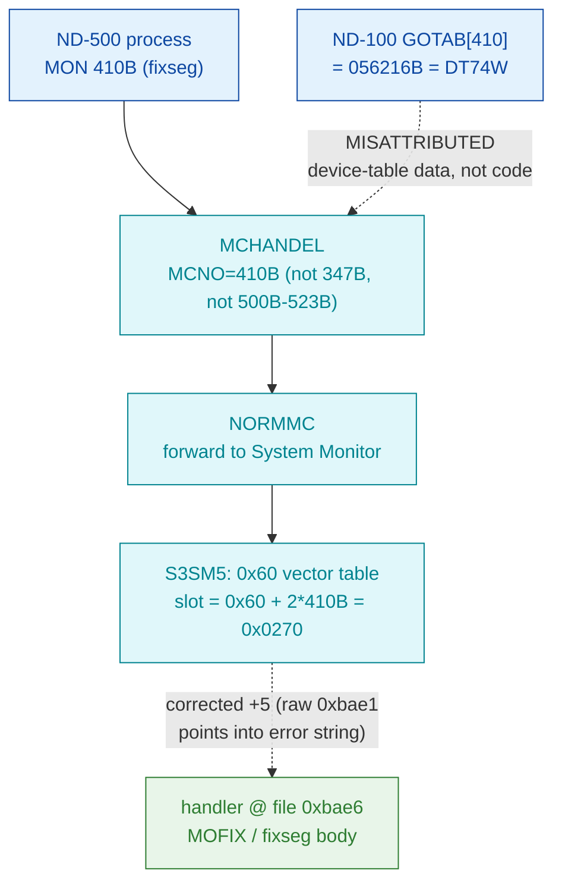

# MON 410B (octal) - FixInMemory (MOFIX)

Locks (FIXes) an ND-500 segment resident in physical memory so it cannot be paged or
swapped out. This is an **ND-500 monitor call** (octal >= 0400), not an ND-100 native call.

**Status:** routing byte-proven (ND-500 call via the S3SM5 0x60 vector table, **not** the
ND-100 GOTAB); the worker body is real SINTRAN L bytes carved from `030-S3SM5.bin`, but the
exact entry (`0xbae6`) is a **+5 heuristic correction** of an anomalous vector value and the
body is only partly coherent - see [Honest caveats](#honest-caveats). ND-100 addresses are
octal; ND-500 offsets are hex byte offsets (the code is byte-addressed).

- **Full disassembly:** [`410B-FixInMemory.ASM`](410B-FixInMemory.ASM) - the actual ND-500 handler body (single carved region).
- **Bytes live once in** the canonical segment layer: [`../../segments-ref/`](../../segments-ref/).

---

## Dispatch path



The dashed hop (`D ⇢ E`) is the +5 entry correction: the raw 0x60 vector value `0xbae1` points
into an inline error string, so the true entry was inferred as the next instruction boundary.
The `X ⇢ B` hop marks the ND-100 GOTAB[410] read as a red herring - a coincidental read into
device-table data, not a handler.

---

## Code location (dispatch path)

Rows are in execution order. Byte offset for the ND-100 GOTAB row = `(addr - loadbase)` octal
words x 2; ND-500 rows in `030-S3SM5` are **byte-addressed** (byte offset is direct, no x2).

| Role | Segment (full disasm) | Addr / file offset | Byte offset (dec) | Symbol | Verdict |
|------|------------------------|--------------------|-------------------|--------|---------|
| GOTAB[410] read (does NOT apply) | [commoncode.asm](../../segments-ref/SINTRAN-DATA_commoncode/SINTRAN-DATA_commoncode.asm) · [.hex](../../segments-ref/SINTRAN-DATA_commoncode/SINTRAN-DATA_commoncode.hex) | `071643B` (=071233B+410B) | 59206 | reads `056216B` = `DT74W` (device table) | **MISATTRIBUTED** - coincidental read into device-table data, not a handler |
| S3SM5 0x60 vector slot 410B | [030-S3SM5.asm](../../segments-ref/030-S3SM5/030-S3SM5.asm) · [.hex](../../segments-ref/030-S3SM5/030-S3SM5.hex) | file off `0x0270` | 624 | value `0xbae1` (points into `'...direct transfer'` string) | inferred - anomalous raw value, corrected +5 |
| Handler body (MOFIX / fixseg) | [030-S3SM5.asm](../../segments-ref/030-S3SM5/030-S3SM5.asm) · [.hex](../../segments-ref/030-S3SM5/030-S3SM5.hex) | file off `0xbae6..0xbb38` | 47846..47928 (82 bytes) | `MOFIX` (L07 name only; not in carved window) | real bytes; +5 entry heuristic, misaligned past prologue |

**Verify by hand:** `grep '^47846 ' ../../segments-ref/030-S3SM5/030-S3SM5.hex` -> `47846  110`
(octal `110` = `0x48`); then
`dd if=../../../segments/030-S3SM5.bin bs=1 skip=47846 count=8 | od -An -tx1` ->
`48 13 ba 13 2c 10 ba 12` (matches the `.ASM` prologue: `by stz $0x13` / `entsn $0x13,$0x2C`).
The vector slot: `dd if=../../../segments/030-S3SM5.bin bs=1 skip=624 count=2 | od -An -tx1` ->
`ba e1` (the anomalous raw value).

---

## Instruction walkthrough

Full listing: [`410B-FixInMemory.ASM`](410B-FixInMemory.ASM). Key points, by file offset into
`030-S3SM5.bin` (the whole region was carved as one contiguous ND-500 slice):

```
0xBAE6  48 13        by stz  $0x13      ; heuristic +5 entry byte -- see caveats
0xBAE8  BA 13 2C     entsn   $0x13,$0x2C; ND-500 frame prologue (first clean op)
0xBAEB  10 BA        f1 :=   r.0xE8     ; load a frame field (candidate seg-descr ptr)
0xBAEF  12 BA        f3 :=   r.0xE8     ; second candidate arg slot
0xBAF6  D9 01 BA     if << go $0x1BA    ; the one conditional (signed <) forward branch
0xBB03  AD 5F 93 5F  w2 lind ...        ; indexed/indirect load -- table walk (descriptor?)
0xBB25  82           retd               ; return-from-subroutine (one clean exit path)
0xBB28  DD ...       entf    $0xFFFF... ; DECODES AS GARBAGE -- misalignment marker
```

Readable structure: an `entsn` frame prologue near the top, several frame-field loads, one
conditional branch, an indexed indirect load (`lind`, plausibly a segment-descriptor table
access), and a `retd` return. That skeleton is *consistent* with a short "look up a segment
descriptor, set its fixed/locked flag, return" routine - i.e. MOFIX behaviour. But several
mid-block instructions (`entf $0xFFFF...`, the trailing `cind`) decode incoherently, so the
stream is at least partly **misaligned** past the first few instructions. This is ND-500 code;
the only control transfers are the `if << go $0x1BA` forward branch and the `retd`.

---

## Parameter / register contract

This is an ND-500 call; argument transport is the ND-500 MON message block, not ND-100
A/X/T registers.

| Field | Dir | Meaning | Verdict |
|-------|-----|---------|---------|
| MON number | in | `410B` routes via MCHANDEL -> NORMMC -> S3SM5 0x60 vector slot `0x0270` | **VERIFIED** (bytes) |
| segment number | in | segment to fix in memory; candidate slots = frame-field loads `r.0xE8` at 0xBAEB/0xBAEF | inferred |
| status word | out | `retd` at 0xBB25 is the return; no status field attributed with confidence | UNVERIFIED |
| error / skip | out | error string `'...direct transfer'` (0xbaaf-0xbae5) sits just before entry; linkage not byte-proven | UNVERIFIED |

The user-visible register/message convention lives in the ND-500 MON caller wrapper and the
S3SM5 message frame, so the precise argument layout is **inferred**, not byte-proven here.

---

## Pseudo-code (for an emulator)

See **[`410B-FixInMemory.pseudo.c`](410B-FixInMemory.pseudo.c)** - a pseudo-C model of the
handler for emulator authors. Every modelled line gives the **real ND-500 operation** taken
from the instruction-semantics reference:
[`../../instruction-semantics/ND500-INSTRUCTION-SEMANTICS.md`](../../instruction-semantics/ND500-INSTRUCTION-SEMANTICS.md)
(register model, addressing modes, branch conditions; note `C=1` means **no-borrow**, i.e.
inverted). The routing and the presence of an `entsn`/`retd` pair are byte-verified.

**Misalignment warning:** the entry `0xbae6` is a **+5 heuristic** correction of an anomalous
vector value, so the carve start is **not** a proven instruction boundary. Per the reference
(Section 9) a wrong start byte makes the decoded mnemonics untrustworthy even though the raw
bytes are ground truth - a `by stz` precedes the `entsn`, the `if << go` branch has no
preceding compare to set its carry flag, and the tail past `0xbb26` (`entf $0xFFFF...`, the
trailing `cind`) decodes incoherently. Those lines are marked **UNVERIFIED (possible
misalignment)** in the pseudo-C and are NOT modelled as behaviour. The segment-descriptor
semantics, the argument block, and the status/error contract are **UNVERIFIED**.

---

## Honest caveats

**What is byte-proven:** 410B is an ND-500 call, NOT an ND-100 native MON call. The
`prove-mon.py 410` GOTAB[410] result (`056216B` = `DT74W`) is a **device-table datafield**,
verified by its regular `DT70..DT75` series neighbours (11-word stride) in
`SYMBOL-2-LIST.SYMB.TXT` - a red herring, not a handler. The S3SM5 0x60 vector slot for 410B
(`0x0270`) and the carved handler bytes at `0xbae6` are real bytes on disk.

**What is NOT proven:** the exact entry point. The raw 0x60 vector value `0xbae1` points
**into** the inline error string `'...direct transfer'` (message body 0xbaaf-0xbae4,
`'`-terminator 0x27 at 0xbae5) - the "vector decodes as text" symptom. The entry `0xbae6` is a
**+5 heuristic correction**: the first instruction boundary right after the string terminator
and immediately before the verified 411B entry (0xbb38). If the vector table is not the true
routing mechanism, or if the +5 correction is wrong, the whole 82-byte window is suspect. The
disassembly is only partly coherent (`entsn`/`retd` bracket a plausible short routine, but
`entf $0xFFFF...` and the trailing `cind` decode as garbage), so the slice may include trailing
bytes of the previous routine or leading bytes of 411B. The L07 `MOFIX` symbol
(`067130` / `112463`) confirms the *name/behaviour* only - neither address falls inside the
carved `030-S3SM5.bin` window, so it cannot anchor the entry byte-exactly. The argument block
and error/skip contract are entirely UNVERIFIED. Confirming this needs an S3SM5 symbol map or a
clean-boundary re-carve; treat the *routing* as reliable and the *exact entry/body* as
provisional.

Method: [../../../../../EXTRACTING-RESIDENT-CODE.md](../../../../../EXTRACTING-RESIDENT-CODE.md) · dispatch reality:
[../../TASK-05-mismatches.md](../../TASK-05-mismatches.md) · master map: [../../MON-CALL-INDEX.md](../../MON-CALL-INDEX.md).
