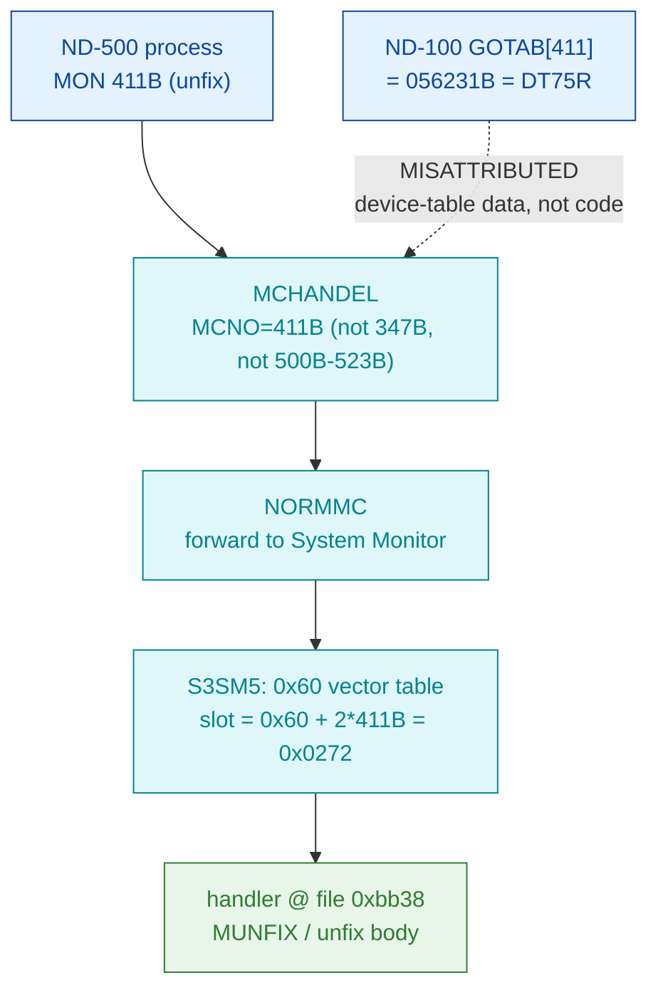

# MON 411B (octal) - MemoryUnfix (MUNFIX)

Releases (UNFIXes) an ND-500 segment that was previously locked in physical memory by
MON 410B FIX, so it may again be paged/swapped out. This is an **ND-500 monitor call**
(octal >= 0400), not an ND-100 native call - it is the inverse of MON 410B.

**Status:** routing byte-proven (ND-500 call via the S3SM5 0x60 vector table, **not** the
ND-100 GOTAB); the worker body is real SINTRAN L bytes carved from `030-S3SM5.bin`, and the
entry (`0xbb38`) is the **exact** 0x60 vector value (no correction needed). BUT `0xbb38` is a
**mid-block** entry into a shared fix-family body and the decode is noisy - see
[Honest caveats](#honest-caveats). ND-100 addresses are octal; ND-500 offsets are hex byte
offsets (the code is byte-addressed).

- **Full disassembly:** [`411B-MemoryUnfix.ASM`](411B-MemoryUnfix.ASM) - the actual ND-500 handler body (single carved region).
- **Bytes live once in** the canonical segment layer: [`../../segments-ref/`](../../segments-ref/).

---

## Dispatch path



Unlike its FIX neighbour (410B, whose raw vector points into an error string and needs a +5
correction), the 411B vector value `0xbb38` lands directly on code bytes, so the entry needs
**no** correction. The `X ⇢ B` dashed hop marks the ND-100 GOTAB[411] read as a red herring -
a coincidental read into device-table data (`DT75R`), not a handler.

---

## Code location (dispatch path)

Rows are in execution order. Byte offset for the ND-100 GOTAB row = `(addr - loadbase)` octal
words x 2; ND-500 rows in `030-S3SM5` are **byte-addressed** (byte offset is direct, no x2).

| Role | Segment (full disasm) | Addr / file offset | Byte offset (dec) | Symbol | Verdict |
|------|------------------------|--------------------|-------------------|--------|---------|
| GOTAB[411] read (does NOT apply) | [commoncode.asm](../../segments-ref/SINTRAN-DATA_commoncode/SINTRAN-DATA_commoncode.asm) · [.hex](../../segments-ref/SINTRAN-DATA_commoncode/SINTRAN-DATA_commoncode.hex) | `071644B` (=071233B+411B) | 59208 | reads `056231B` = `DT75R` (device table) | **MISATTRIBUTED** - coincidental read into device-table data, not a handler |
| S3SM5 0x60 vector slot 411B | [030-S3SM5.asm](../../segments-ref/030-S3SM5/030-S3SM5.asm) · [.hex](../../segments-ref/030-S3SM5/030-S3SM5.hex) | file off `0x0272` | 626 | value `0xbb38` (points directly at code) | **VERIFIED** |
| Handler body (MUNFIX / unfix) | [030-S3SM5.asm](../../segments-ref/030-S3SM5/030-S3SM5.asm) · [.hex](../../segments-ref/030-S3SM5/030-S3SM5.hex) | file off `0xbb38..0xbb73` | 47928..47987 (59 bytes) | `MUNFIX` (L07 name only; not in carved window) | real bytes; VERIFIED location / UNVERIFIED semantics (mid-block entry) |

**Verify by hand:** `grep '^47928 ' ../../segments-ref/030-S3SM5/030-S3SM5.hex` -> `47928  262`
(octal `262` = `0xb2`); then
`dd if=../../../segments/030-S3SM5.bin bs=1 skip=47928 count=8 | od -An -tx1` ->
`b2 0f ba 11 48 11 ba 11` (matches the `.ASM` entry and `411B-MemoryUnfix.bin`).
The vector slot: `dd if=../../../segments/030-S3SM5.bin bs=1 skip=626 count=2 | od -An -tx1` ->
`bb 38` (the exact handler file offset, big-endian).

---

## Instruction walkthrough

Full listing: [`411B-MemoryUnfix.ASM`](411B-MemoryUnfix.ASM). The whole region was carved as one
contiguous ND-500 slice, `0xbb38..0xbb73` (59 bytes), ending exactly where the next vector entry
(413B = `0xbb73`) begins. Key points, by file offset into `030-S3SM5.bin`:

```
0xBB38  B2 0F BA 11   w3 cind $0xF,r.0xE8,$0x11  ; mid-block entry (no clean prologue)
0xBB3E  BA 11 48      entsn   $0x11,b.0x20       ; frame-ish op, candidate arg staging
0xBB4D  C9 2C 46      if > go $0x2C46            ; first conditional transfer
0xBB5B  D3 64 85      if -k go $0x6485           ; second conditional transfer
0xBB6D  FB            ??? (opcode 0x00FB)         ; DECODES AS GARBAGE -- misalignment
0xBB70  2C 0A 21      d move  $0xA,$0x21          ; last bytes before 413B entry (0xbb73)
```

Byte-level facts (VERIFIED): the entry is at `0xbb38` (`b2 0f ba 11 48 11 ...`); the block is 59
bytes and terminates exactly where the next vector entry (413B) begins, so it is one member of a
contiguous family of short fix-family stubs that set a function selector and fall into a common
worker - consistent with FIX/UNFIX sharing one body and entering at different points. There is
**no** embedded ASCII text; the slice is code, not a string island (unlike the 410B raw value).

Decode-level (UNVERIFIED, from nd500-dis, do **not** trust literally): the two conditional
transfers `if > go $0x2C46` (0xBB4D) and `if -k go $0x6485` (0xBB5B) are plausibly the
argument/range validation and the "already unfixed -> return" test that the native `MUNFIX`
performs (`IF D0=0 OR A>>SGMAX GO FAR ERRIL`; `IF A BIT 5FIX ...`), but the literal target
addresses are meaningless because `0xbb38` is a mid-instruction-stream entry. The stray `???`
opcode at `0xbb6d` and the implausible operand fields confirm the window is at least partly
misaligned; the shared worker body is reached by falling through into code beyond `0xbb73`,
outside this carved window.

---

## Parameter / register contract

This is an ND-500 call; argument transport is the ND-500 MON message block, not ND-100
A/X/T registers.

| Field | Dir | Meaning | Verdict |
|-------|-----|---------|---------|
| MON number | in | `411B` routes via MCHANDEL -> NORMMC -> S3SM5 0x60 vector slot `0x0272` | **VERIFIED** (bytes) |
| segment number | in | segment to unfix; native `MUNFIX` validates it against `SGMAX`, rejects `0` | inferred (native MUNFIX, different NPL revision) |
| effect | - | clears `5FIX`/`5FIXC`, detaches exchange segment (XCSEGS), removes from PIT (UREMSG), clears the page FIX protect bit, relinks into the segment list, returns pages to swapping | inferred (native NPL) |
| status word | out | success/error return; no status field attributed with confidence from the slice | UNVERIFIED |
| error / skip | out | native `ERRIL` (illegal seg / D0=0), `ERRPF` (SPT-fixed); ND-500 skip/error convention not extractable from the 59-byte mid-block window | UNVERIFIED |

Nothing in the register contract is VERIFIED from the L bytes themselves; the carved slice proves
only **location and identity**, not the argument passing. The user-visible convention lives in the
ND-500 MON caller wrapper and the S3SM5 message frame.

---

## Pseudo-code (for an emulator)

See **[`411B-MemoryUnfix.pseudo.c`](411B-MemoryUnfix.pseudo.c)** - a pseudo-C model of the
handler for emulator authors. Every modelled line gives the **real ND-500 operation** taken
from the instruction-semantics reference:
[`../../instruction-semantics/ND500-INSTRUCTION-SEMANTICS.md`](../../instruction-semantics/ND500-INSTRUCTION-SEMANTICS.md)
(register model, addressing modes, branch conditions; note `C=1` means **no-borrow**, i.e.
inverted). Only the routing and the exact entry byte are byte-verified.

**Misalignment warning:** `0xbb38` is a **mid-block** entry into a shared fix-family body and
the 59-byte window does not decode as a correctly-aligned stream. It holds **two** `entsn`
entry ops (`0xbb3e`, `0xbb50`) - per the reference an `ENT*` is the single first instruction
reached by a CALL (Section 8.2), so two cannot belong to one aligned handler - plus a stray
`??? opcode 0x00FB` at `0xbb6d` (Section 9: an operand/prefix byte, **not** an instruction)
and implausibly large operand fields (e.g. `d test b.0x62AE46CB` at `0xbb5e`). The raw bytes
are ground truth but those mnemonics are unreliable; the affected lines are marked
**UNVERIFIED (possible misalignment)** in the pseudo-C and are **not** modelled as behaviour.
Any earlier invented domain calls (`load_seg_descriptor` / `is_fixed` / `clear_fixed`) have
been removed - they are not provable from these bytes. The unfix action, argument-slot
mapping, and status/error contract are **UNVERIFIED**.

---

## Honest caveats

**What is byte-proven:** 411B is an ND-500 call, NOT an ND-100 native MON call. The
`prove-mon.py 411` GOTAB[411] result (`056231B` = `DT75R`) is a **device-table datafield** - the
`DT74W -> DT75R` pair sits on the same regular `DT70..DT75` 11-word stride verified for its 410B
neighbour, a red herring, not a handler. The S3SM5 0x60 vector slot for 411B (`0x0272`) holds the
big-endian word `0xbb38`, and the carved handler bytes at file offset `0xbb38` are real bytes on
disk: `411B-MemoryUnfix.bin` is a byte-identical (`cmp` MATCH) copy of `030-S3SM5.bin[0xbb38:0xbb73]`,
and the window closes exactly at the next table entry (413B = `0xbb73`).

**What is NOT proven:** the instruction-level semantics. `0xbb38` is a **mid-block** entry into a
shared fix-family body, so the nd500-dis decode is noisy (stray `???` at `0xbb6d`, implausible
operands, no clean prologue/return); the step-by-step logic is inferred from the native `MUNFIX`
(a **different** NPL revision - its addresses `067341`/`067130` are NOT L addresses and fall
outside the carved `030-S3SM5.bin` window, so they cannot anchor the entry byte-exactly). The
argument block and the status/error/skip contract are entirely UNVERIFIED; the shared worker body
past `0xbb73` is outside the carved 59-byte window. One consistency note: the 0x60 table is
**not** globally sorted (410B=`0xbae1`, 411B=`0xbb38`, 413B=`0xbb73` are monotonic, but
412B=`0x98dd` is far below), so identity rests on the exact slot offset, not on ordering.
Confirming the body needs an S3SM5 symbol map or a live ND-500 MON trace; treat the *routing and
entry* as reliable and the *body semantics* as provisional.

Method: [../../../../../EXTRACTING-RESIDENT-CODE.md](../../../../../EXTRACTING-RESIDENT-CODE.md) · dispatch reality:
[../../TASK-05-mismatches.md](../../TASK-05-mismatches.md) · master map: [../../MON-CALL-INDEX.md](../../MON-CALL-INDEX.md).
