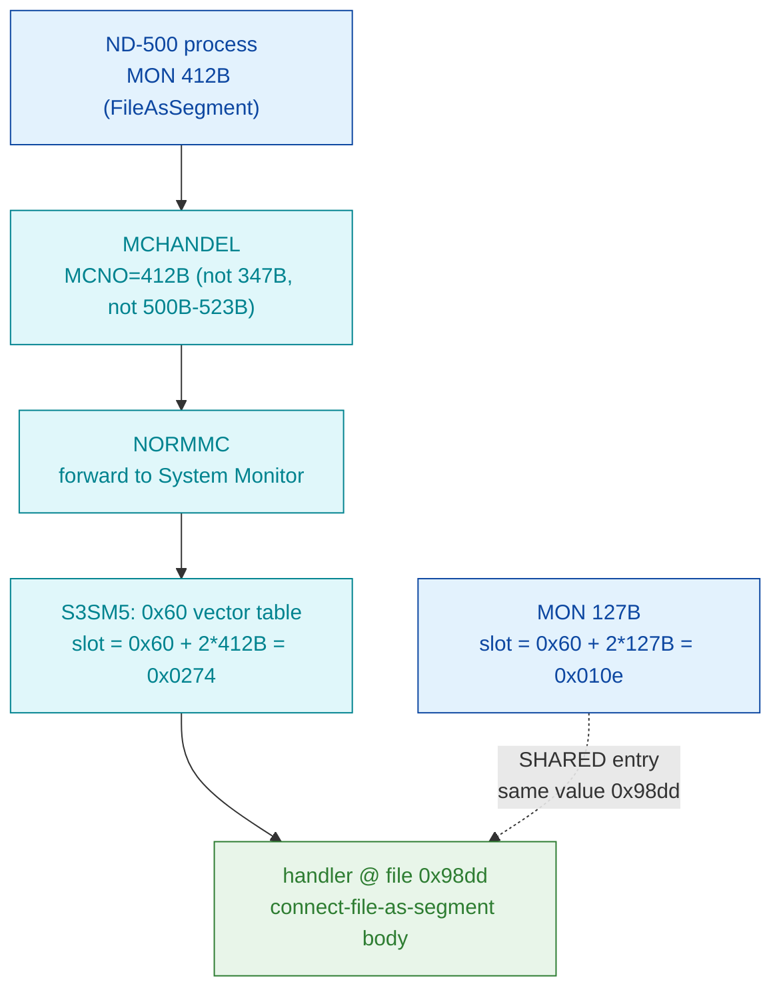

# MON 412B (octal) - FileAsSegment (FSCNT)

Connects an **open file** as a logical segment in the calling domain, so the file
can then be accessed as a segment (faster than `ReadFromFile`/`WriteToFile`, which
become disallowed on that file). The file is disconnected when it is closed. This
is an **ND-500 monitor call** (octal >= 0400), not an ND-100 native call.

**Status:** routing byte-proven (ND-500 call via the S3SM5 0x60 vector table,
**not** the ND-100 GOTAB); the worker body is real SINTRAN L bytes carved from
`030-S3SM5.bin` as one contiguous region. The entry `0x98dd` is **SHARED** with
MON 127B (both vector slots hold `0x98dd`, byte-proven), so **which call owns this
body is INFERRED** - see [Honest caveats](#honest-caveats). ND-100 addresses are
octal; ND-500 offsets are hex byte offsets (the code is byte-addressed).

- **Full disassembly:** [`412B-FileAsSegment.ASM`](412B-FileAsSegment.ASM) - the actual ND-500 handler body (single carved region).
- **Bytes live once in** the canonical segment layer: [`../../segments-ref/`](../../segments-ref/).

---

## Dispatch path



The dashed hop (`F ⇢ E`) marks the **shared entry**: the 0x60 vector slot for MON
127B (`0x010e`) holds the same value `0x98dd` as the 412B slot (`0x0274`). Both
"connect file as segment" entries dispatch to the one body; which MON number the
body was *written for* is not byte-decidable from the segment alone.

---

## Code location (dispatch path)

Rows are in execution order. ND-500 rows in `030-S3SM5` are **byte-addressed**
(byte offset is the file offset directly, no x2).

| Role | Segment (full disasm) | Addr / file offset | Byte offset (dec) | Symbol | Verdict |
|------|------------------------|--------------------|-------------------|--------|---------|
| S3SM5 0x60 vector slot 412B | [030-S3SM5.asm](../../segments-ref/030-S3SM5/030-S3SM5.asm) · [.hex](../../segments-ref/030-S3SM5/030-S3SM5.hex) | file off `0x0274` | 628 | value `0x98dd` | **VERIFIED** (bytes) |
| S3SM5 0x60 vector slot 127B (shared) | [030-S3SM5.asm](../../segments-ref/030-S3SM5/030-S3SM5.asm) · [.hex](../../segments-ref/030-S3SM5/030-S3SM5.hex) | file off `0x010e` | 270 | value `0x98dd` (SAME) | **VERIFIED** (bytes) - shared entry |
| Handler body (connect-file-as-segment) | [030-S3SM5.asm](../../segments-ref/030-S3SM5/030-S3SM5.asm) · [.hex](../../segments-ref/030-S3SM5/030-S3SM5.hex) | file off `0x98dd..0x9937` | 39133..39223 (90 bytes) | `FSCNT` (L07 name only; not in carved window) | real SINTRAN L bytes; owner 412B/127B **INFERRED** |

**Verify by hand:** `grep '^39133 ' ../../segments-ref/030-S3SM5/030-S3SM5.hex` -> `39133  023`
(octal `023` = `0x13`); then
`dd if=../../../segments/030-S3SM5.bin bs=1 skip=39133 count=8 | od -An -tx1` ->
`13 aa 13 ba 13 aa 13 29` (matches the `.ASM` prologue `f4 := r.0xA8` / `f4 := r.0xE8`).
The vector slots:
`dd if=../../../segments/030-S3SM5.bin bs=1 skip=628 count=2 | od -An -tx1` -> `98 dd` (412B), and
`dd if=../../../segments/030-S3SM5.bin bs=1 skip=270 count=2 | od -An -tx1` -> `98 dd` (127B - the shared value).

---

## Instruction walkthrough

Full listing: [`412B-FileAsSegment.ASM`](412B-FileAsSegment.ASM). Key points, by file
offset into `030-S3SM5.bin` (the whole region was carved as one contiguous ND-500 slice):

```
0x98DD  13 AA        f4 := r.0xA8       ; stage a frame/arg field (candidate: FileNo)
0x98E3  13 29        f4 := $0x29        ; small immediate constant
0x98E5  CB BA 12     if < go ...        ; one signed-< conditional guard near the top
0x98EC  BA 10 ...    entsn $0x10,...    ; ND-500 frame prologue (enter subroutine)
0x9917  DC ...       init ...           ; init-block (plausibly a descriptor setup)
0x9935  16 51        d3 := b.0x44        ; last op inside the 90-byte region
```

Readable structure: a few frame/argument-field loads, an early signed-`<`
conditional guard, an `entsn` frame prologue, and an `init` block that is
*consistent* with "validate the file/segment arguments, connect the open file to a
free segment descriptor, return". One mid-block op (`0x98ff`) decodes as garbage,
so the stream is at least partly **misaligned** past the prologue and the
mid-block arithmetic is not a reliable guide to real control flow. This is ND-500
code carved as one region bounded by the next handler entry (`0x9937`).

---

## Parameter / register contract

This is an ND-500 call; argument transport is the ND-500 MON message block
(`CALLG` argument list), not ND-100 A/X/T registers. Parameter names/order are from
the manual (ND-860228.2 EN p.193); the mapping onto the handler's frame slots is
**inferred**, not byte-proven.

| Field | Dir | Meaning | Verdict |
|-------|-----|---------|---------|
| MON number | in | `412B` routes via MCHANDEL -> NORMMC -> S3SM5 0x60 vector slot `0x0274` = `0x98dd` | **VERIFIED** (bytes) |
| FileNo | in | file number; must be open (see OpenFile). Candidate frame-field loads `r.0xA8`/`r.0xE8` at 0x98dd | inferred |
| LogSegmentNo | in | wanted logical segment number; `0` = first free | inferred |
| AccessType | in | `0`=initial data, `1`=empty, `2`=sequential, `3`=1+2 | inferred |
| SegmentNo | out | logical segment number selected (returned if LogSegmentNo was 0) | inferred |
| status / error | out | no status field attributed with confidence | UNVERIFIED |

The user-visible message convention lives in the ND-500 MON caller wrapper and the
S3SM5 message frame, so the precise argument layout is **inferred**, not byte-proven here.

---

## Pseudo-code (for an emulator)

See **[`412B-FileAsSegment.pseudo.c`](412B-FileAsSegment.pseudo.c)** - a pseudo-C
model of the handler for emulator authors. Every modelled line gives the **real
ND-500 operation** taken from the instruction-semantics reference:
[`../../instruction-semantics/ND500-INSTRUCTION-SEMANTICS.md`](../../instruction-semantics/ND500-INSTRUCTION-SEMANTICS.md)
(register model, addressing modes, branch conditions; note `C=1` means **no-borrow**,
i.e. inverted). The routing and the entry loads are byte-verified.

**Misalignment warning:** the stream is misaligned past the first few loads. `0x98ff`
decodes as `??? ; opcode 0x00F1` - per the reference (Section 9) that is an
operand/prefix byte, **not** an instruction; the `f set1 $<double>` at `0x98f3` is an
impossible decode (`set1` sets a destination to 1, it takes no 8-byte immediate); and
the `if < go` guard at `0x98e5` precedes the `entsn` (an entry prologue should START
with an `ENT*`). Those mid-block lines are marked **UNVERIFIED (possible
misalignment)** in the pseudo-C and are NOT modelled as behaviour. The
connect-file-as-segment action, the argument-slot mapping, the returned SegmentNo, and
the status/error contract are **UNVERIFIED**; ownership between MON 412B and 127B is
**INFERRED**.

---

## Honest caveats

**What is byte-proven:** 412B is an ND-500 call, NOT an ND-100 native MON call. The
S3SM5 0x60 vector slot for 412B (`0x0274`) holds `0x98dd`, and the carved handler
bytes at `0x98dd` are real SINTRAN L bytes on disk. The MON 127B vector slot
(`0x010e`) holds the **same** value `0x98dd` - byte-verified - so 412B and 127B
dispatch to one shared body.

**What is NOT proven:** which of MON 412B / 127B this body was authored for. Both
are documented "connect file as a segment" entries; the segment image alone cannot
decide ownership, so treat that as **INFERRED**. The `FSCNT` symbol confirms the
*name/behaviour* only; it is not in the carved window and cannot anchor the entry
byte-exactly. The disassembly is only partly coherent (one op at `0x98ff` decodes
as garbage), so the stream is at least partly misaligned past the prologue - the
mid-block arithmetic ops are not a reliable guide, and the slice may include
trailing bytes of a neighbouring routine. The argument-slot mapping and the
status/error contract are entirely **inferred / UNVERIFIED** (parameter names come
from the manual, not from proven byte semantics). Confirming this needs an S3SM5
symbol map or a clean-boundary re-carve; treat the *routing* as reliable and the
*exact body semantics and 412B/127B ownership* as provisional.

Method: [../../../../../EXTRACTING-RESIDENT-CODE.md](../../../../../EXTRACTING-RESIDENT-CODE.md) · dispatch reality:
[../../TASK-05-mismatches.md](../../TASK-05-mismatches.md) · master map: [../../MON-CALL-INDEX.md](../../MON-CALL-INDEX.md).
