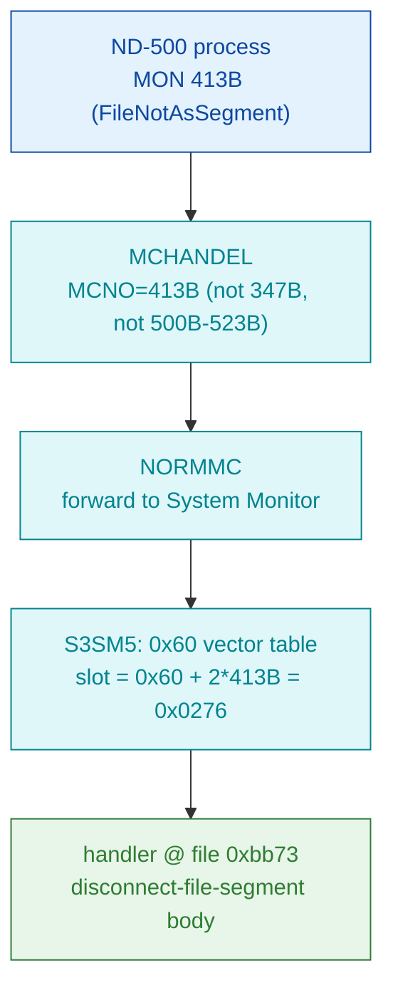

# MON 413B (octal) - FileNotAsSegment (FSCDNT)

Disconnects a file that was connected as a segment by `FileAsSegment` (MON 412B).
The file is **not closed** (a file is also disconnected automatically by
`CloseFile`). This is an **ND-500 monitor call** (octal >= 0400), not an ND-100
native call.

**Status:** routing byte-proven (ND-500 call via the S3SM5 0x60 vector table,
**not** the ND-100 GOTAB); the worker body is real SINTRAN L bytes carved from
`030-S3SM5.bin` as one contiguous region bounded by the next handler entry. The
body semantics are largely **INFERRED** - see [Honest caveats](#honest-caveats).
ND-100 addresses are octal; ND-500 offsets are hex byte offsets (the code is
byte-addressed).

- **Full disassembly:** [`413B-FileNotAsSegment.ASM`](413B-FileNotAsSegment.ASM) - the actual ND-500 handler body (single carved region).
- **Bytes live once in** the canonical segment layer: [`../../segments-ref/`](../../segments-ref/).

---

## Dispatch path



The 413B slot (`0x0276`) holds `0xbb73`, a **distinct** handler (unlike 412B, this
entry is not shared). The region is bounded above by the next handler entry
`0xbb9e` (the MON 414B vector target), giving a proven single contiguous slice.

---

## Code location (dispatch path)

Rows are in execution order. ND-500 rows in `030-S3SM5` are **byte-addressed**
(byte offset is the file offset directly, no x2).

| Role | Segment (full disasm) | Addr / file offset | Byte offset (dec) | Symbol | Verdict |
|------|------------------------|--------------------|-------------------|--------|---------|
| S3SM5 0x60 vector slot 413B | [030-S3SM5.asm](../../segments-ref/030-S3SM5/030-S3SM5.asm) · [.hex](../../segments-ref/030-S3SM5/030-S3SM5.hex) | file off `0x0276` | 630 | value `0xbb73` | **VERIFIED** (bytes) |
| Handler body (disconnect-file-segment) | [030-S3SM5.asm](../../segments-ref/030-S3SM5/030-S3SM5.asm) · [.hex](../../segments-ref/030-S3SM5/030-S3SM5.hex) | file off `0xbb73..0xbb9e` | 47987..48030 (43 bytes) | `FSCDNT` (L07 name only; not in carved window) | real SINTRAN L bytes; body semantics **inferred** |

**Verify by hand:** `grep '^47987 ' ../../segments-ref/030-S3SM5/030-S3SM5.hex` -> `47987  332`
(octal `332` = `0xda`); then
`dd if=../../../segments/030-S3SM5.bin bs=1 skip=47987 count=8 | od -An -tx1` ->
`da 29 94 c8 0d 61 8f c8` (matches the `.ASM` head `if <<= go $0x29` / `f1 neg` / `if > go`).
The vector slot:
`dd if=../../../segments/030-S3SM5.bin bs=1 skip=630 count=2 | od -An -tx1` -> `bb 73`.

---

## Instruction walkthrough

Full listing: [`413B-FileNotAsSegment.ASM`](413B-FileNotAsSegment.ASM). Key points, by file
offset into `030-S3SM5.bin` (the whole region was carved as one contiguous ND-500 slice):

```
0xBB73  DA 29        if <<= go $0x29    ; conditional guard at the entry
0xBB76  C8 0D        if > go $0xD       ; second short conditional guard
0xBB7C  BA 19 ...    entsn $0x19,...    ; ND-500 frame prologue (enter subroutine)
0xBB8A  BA 15 48     entsn $0x15,b.0x20 ; nested frame / inner routine
0xBB9C  BA 10 48     entsn $0x10,b.0x20 ; last op starting inside the 43-byte region
```

Readable structure: two short conditional guards at the entry, then one or more
`entsn` frame prologues and frame-field loads. That skeleton is *consistent* with
"validate that the file is connected, locate its segment descriptor, detach it from
the domain (leaving the file open), return" - i.e. FSCDNT behaviour. The trailing
`entsn` at `0xbb9c` is a 3-byte op whose last byte lands on the `0xbb9e` boundary
(the next handler entry); it is shown because it starts inside the region. This is
ND-500 code carved as one region bounded by the next handler entry.

---

## Parameter / register contract

This is an ND-500 call; argument transport is the ND-500 MON message block
(`CALLG` argument list), not ND-100 A/X/T registers. Parameter names/order are from
the manual (ND-860228.2 EN p.195); the mapping onto the handler's frame slots is
**inferred**, not byte-proven.

| Field | Dir | Meaning | Verdict |
|-------|-----|---------|---------|
| MON number | in | `413B` routes via MCHANDEL -> NORMMC -> S3SM5 0x60 vector slot `0x0276` = `0xbb73` | **VERIFIED** (bytes) |
| FileNumber | in | file number (see OpenFile). Candidate frame-field loads `r.0xE8` at 0xbb8d | inferred |
| LogSegmentNumber | in | segment number (OPTIONAL parameter) | inferred |
| status / error | out | no status field attributed with confidence | UNVERIFIED |

The user-visible message convention lives in the ND-500 MON caller wrapper and the
S3SM5 message frame, so the precise argument layout is **inferred**, not byte-proven here.

---

## Pseudo-code (for an emulator)

See **[`413B-FileNotAsSegment.pseudo.c`](413B-FileNotAsSegment.pseudo.c)** - a
pseudo-C model of the handler for emulator authors. Every modelled line gives the
**real ND-500 operation** taken from the instruction-semantics reference:
[`../../instruction-semantics/ND500-INSTRUCTION-SEMANTICS.md`](../../instruction-semantics/ND500-INSTRUCTION-SEMANTICS.md)
(register model, addressing modes, branch conditions; note `C=1` means **no-borrow**,
i.e. inverted). Only the routing is byte-verified.

**Misalignment warning:** the body does not decode as a correctly-aligned stream. The
very first op at the entry is a conditional branch (`if <<= go`) with **no preceding
compare** to set its flags, and the 43-byte region holds **three** `entsn` entry ops
(`0xbb7c`, `0xbb8a`, `0xbb9c`) plus a mid-body `init` (`0xbb83`). Per the reference an
`ENT*` is the single first instruction reached by a CALL (Section 8.2) and `init` runs
once at program start (Section 8.1), so multiple `ENT*` and a mid-body `init` cannot
belong to one aligned handler - the raw bytes are ground truth but the mnemonics are
unreliable (Section 9). Those lines are marked **UNVERIFIED (possible misalignment)**
in the pseudo-C and are NOT modelled as behaviour. The descriptor-detach semantics, the
argument-slot mapping, and the status/error contract are **UNVERIFIED**.

---

## Honest caveats

**What is byte-proven:** 413B is an ND-500 call, NOT an ND-100 native MON call. The
S3SM5 0x60 vector slot for 413B (`0x0276`) holds `0xbb73`, and the carved handler
bytes at `0xbb73` are real SINTRAN L bytes on disk. Unlike its sibling 412B, this
entry is **not** shared - `0xbb73` is unique to the 413B slot.

**What is NOT proven:** the body semantics. The `FSCDNT` symbol confirms the
*name/behaviour* only; it is not in the carved window and cannot anchor the entry
byte-exactly. The 43-byte region is bounded above by the next handler entry
(`0xbb9e`, the MON 414B vector target) - a structural bound, not a proven
control-flow `retd` exit inside the window. The argument-slot mapping and the
status/error contract are entirely **inferred / UNVERIFIED** (parameter names come
from the manual, not from proven byte semantics). Confirming this needs an S3SM5
symbol map or runtime tracing; treat the *routing* as reliable and the *exact body
semantics* as provisional.

Method: [../../../../../EXTRACTING-RESIDENT-CODE.md](../../../../../EXTRACTING-RESIDENT-CODE.md) · dispatch reality:
[../../TASK-05-mismatches.md](../../TASK-05-mismatches.md) · master map: [../../MON-CALL-INDEX.md](../../MON-CALL-INDEX.md).
