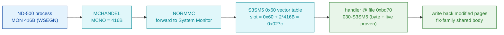

# MON 416B (octal) - SaveND500Segment (WSEGN)

Writes all modified (dirty) pages of an ND-500 segment back to disk ("save
segment"). Per the SINTRAN III Monitor Calls manual it takes
`LogSegmentNo, FirstPage, LastPage` and returns a standard error code; it is one
of the ND-500 41xB memory/segment family.

**Status:** dispatch byte-proven (ND-500 vector table, not the ND-100 GOTAB);
handler body is real SINTRAN L bytes at file offset `0xbd70`; the body decodes
only **partially** under `nd500-dis` (mid-block fix-family entry), so per-page
write-back semantics are **inferred** from the manual (see [Honest caveats](#honest-caveats)).
Vector/file offsets are hex (`0x...`); MON numbers are octal.

- **Full disassembly:** [`416B-SaveND500Segment.ASM`](416B-SaveND500Segment.ASM) - the actual ND-500 handler region.
- **Bytes live once in** the canonical segment layer: [`../../segments-ref/`](../../segments-ref/).

---

## Dispatch path

Ground truth is `python3 scripts/prove-mon.py 416`: 416B is an **ND-500 call**,
**not** GOTAB-dispatched - it routes through the S3SM5 `0x60` vector table, so
`GOTAB[416]` in the ND-100 resident image is meaningless here.

---

## Code location (dispatch path)

Every row is a real region you can open. This is ND-500 32-bit code, so the byte
offset is the file/vector offset directly (not the ND-100 `(A-L)*2` rule).
Canonical segment: `030-S3SM5` (SINTRAN in-memory ND-500 SEG image, load base
`40000B`).

| Role | Segment (full disasm) | Addr range (file off, hex) | Byte offset (dec) | Symbol | Verdict |
|------|------------------------|----------------------------|-------------------|--------|---------|
| 0x60 vector slot for MON 416B (holds BE `0xbd70`) | [030-S3SM5.asm](../../segments-ref/030-S3SM5/030-S3SM5.asm) · [.hex](../../segments-ref/030-S3SM5/030-S3SM5.hex) | `0x027c..0x027e` (1 word) | 636 | `0x60` vector table + 2*416B | **VERIFIED** |
| Handler body (ND-500 code, big-endian as carved) | [030-S3SM5.asm](../../segments-ref/030-S3SM5/030-S3SM5.asm) · [.hex](../../segments-ref/030-S3SM5/030-S3SM5.hex) | `0xbd70..0xbdf6` | 48496..48630 (len 134) | fix-family group (mid-block entry) | real bytes; decode **PARTIAL** |

**Verify by hand (vector slot):** `grep -E '^636 |^637 ' ../../segments-ref/030-S3SM5/030-S3SM5.hex`
-> octal `275 160` = `0xbd 0x70` = big-endian `0xbd70` (the handler offset).

**Verify by hand (handler entry bytes):**
`dd if=../../../segments/030-S3SM5.bin bs=1 skip=48496 count=8 2>/dev/null | od -An -tx1`
-> `2c 44 b3 04 f2 0f c7 0e` (the first four ND-500 words at `0xbd70`).

The local [`416B-SaveND500Segment.bin`](416B-SaveND500Segment.bin) is exactly
bytes `[48496..48630)` of the canonical segment; the `.ASM` is that slice run
through `nd500-dis`. Both are a GENERATED convenience slice - regenerate from
canonical, do not hand-edit.

---

## Instruction walkthrough

Full listing: [`416B-SaveND500Segment.ASM`](416B-SaveND500Segment.ASM). The
handler is entered mid-block into a packed ND-500 fix-family group, and the
134-byte window decodes only partially under `nd500-dis`. What is solid:

- **Entry (`0xbd70`)** `2c 44 b3 ...` - the vector target lands on **code**, not
  ASCII/text (contrast MON 410B, whose slot points at a text word). This is the
  positive check that `0xbd70` is a real handler entry.
- **Shape (`0xbd70..0xbdf6`)** - repeating `04 F2 0F / C7 0E A8 / 03 F1`-style
  groups (`by1 := DESC(r3) $0xF ; if >< go ...`) recur several times across the
  window. That is the normal shape for a **shared body entered at different
  points** to set a function code, consistent with 410B..421B sharing one body.
- **`??? opcode` lines** (`0x00F1`, `0x00F2`, `0x0001`) - these are the mid-block
  misalignment artefacts: the true instruction boundaries begin at the fix-family
  common entry, not at `0xbd70` exactly, so a standalone slice cannot fully align.
  Do **not** read the `??? opcode`/`entsn`/`mulad` lines as literal semantics.

The per-page write-back loop, `FirstPage`/`LastPage` bounding, and error path are
in the shared body this slice enters into; they were **not** decoded here.

---

## Parameter / register contract

From the manual (documentation revision - behaviour hint, not L byte-truth):

| Field | Dir | Meaning | Verdict |
|-------|-----|---------|---------|
| `LogSegmentNo` | in | logical segment number in the domain; `0` => number taken from the parameter address | VERIFIED (manual) |
| `FirstPage` | in | first logical page in the segment | VERIFIED (manual) |
| `LastPage` | in | last logical page in the segment | VERIFIED (manual) |
| return | out | standard SINTRAN error code (appendix A); non-zero on error | VERIFIED (manual) |
| constraint | - | not allowed while the segment is fixed in memory | VERIFIED (manual) |
| ND-500 register mapping | in | which ND-500 registers carry the three parameters at `0xbd70` | **inferred** (body not fully decoded) |

The exact parameter->register mapping lives in the ND-500 handler body, which
decodes only partially here, so the register assignment is **inferred**, not
byte-proven.

---

## Pseudo-code (for an emulator)

See **[`416B-SaveND500Segment.pseudo.c`](416B-SaveND500Segment.pseudo.c)** - a
pseudo-C model of the handler for emulator authors. Every modelled line gives the
**real ND-500 operation** taken from the instruction-semantics reference:
[`../../instruction-semantics/ND500-INSTRUCTION-SEMANTICS.md`](../../instruction-semantics/ND500-INSTRUCTION-SEMANTICS.md)
(register model, addressing modes, branch conditions; note `C=1` means
**no-borrow**, i.e. inverted). Only the routing and the entry are byte-verified.

**Misalignment warning:** `0xbd70` is a **mid-block** entry into a packed
fix-family body and the 134-byte window does not decode as a correctly-aligned
stream. It contains several `??? opcode` lines (`0x00F1` at `0xbd7a`/`0xbd8e`/
`0xbda2`, `0x00F2`/`0x0001` at `0xbdce`/`0xbdcf`) that are operand/prefix bytes,
**not** instructions (Section 9); a mid-body `entsn` (`0xbdd0`) - per the
reference an `ENT*` is the single first instruction reached by a CALL
(Section 8.2); a `bp` breakpoint (`0xbded`, Section 5.9); and nonsensical 8-byte
immediates and branch targets (e.g. `go $0xFFFFFFFFCC6949C1` at `0xbdc5`). The
raw bytes are ground truth but those mnemonics are unreliable; the affected lines
are marked **UNVERIFIED (possible misalignment)** in the pseudo-C and are **not**
modelled as behaviour. Any earlier invented domain calls (`segment_is_fixed` /
`page_is_modified` / `write_page_to_disk` and a page loop) have been removed -
they are not provable from these bytes. The dirty-page write-back action,
argument-slot mapping, and status/error contract are **UNVERIFIED**.

---

## Honest caveats

**What is byte-proven:**
- The S3SM5 `0x60` vector slot for MON 416B is at file byte `0x027c` and holds
  big-endian `0xbd70` (grep `636/637` in the `.hex` = octal `275 160`).
- The handler entry bytes at `0xbd70` are real SINTRAN L code (`2c 44 b3 04 ...`),
  landing on code, not text.
- `prove-mon.py 416` confirms 416B is an ND-500 vector call, **not** an ND-100
  GOTAB call.

**What is NOT proven:** the per-page write-back logic. The 134-byte handler
window is a **mid-block entry** into a packed fix-family group and decodes only
partially under `nd500-dis` (several `??? opcode` lines). The parameter->register
mapping and the error path were not traced.

**Reconciling the earlier competing theory:** an earlier `ANALYSIS.md` in this
folder modelled 416B as an **ND-100 GOTAB** call landing at `056320` in
`025-S3IRPIT.bin` (symbol `DT77W`), based on an older `prove-mon.py` that read a
`GOTAB[416]` word. The **current** `prove-mon.py 416` supersedes that: for the
410B-427B range the ND-100 GOTAB is not the dispatch path - those calls route
through the ND-500 System Monitor's `0x60` vector table, and `GOTAB[416]` is
meaningless. So the single correct story is: **416B is an ND-500 call, handler at
`030-S3SM5` file offset `0xbd70`.** The old ND-100 `056320` reading is a
byte-real ND-100 address, but it is **not** the MON 416B handler.

---

Method: [../../../../../EXTRACTING-RESIDENT-CODE.md](../../../../../EXTRACTING-RESIDENT-CODE.md) · dispatch reality:
[../../TASK-05-mismatches.md](../../TASK-05-mismatches.md) · master map: [../../MON-CALL-INDEX.md](../../MON-CALL-INDEX.md).
