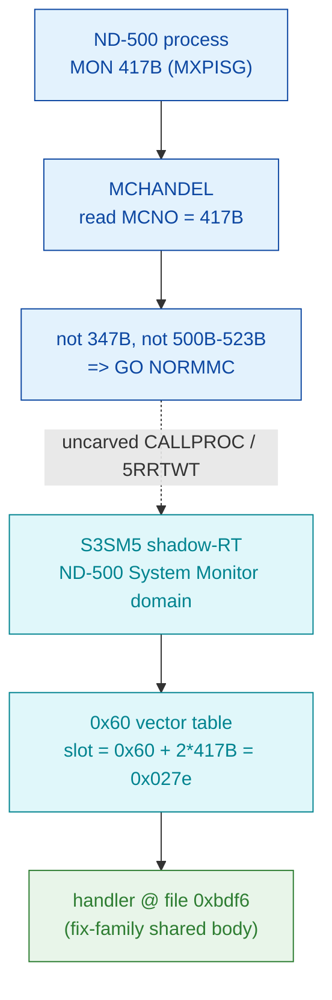

# MON 417B (octal) - MaxPagesInMemory (MXPISG)

Sets the maximum number of pages a segment may have in physical memory at a time
(ND-500 logical segments only; the segment must be in use).

**Status:** dispatch geometry byte-proven (S3SM5 0x60 vector slot -> handler window);
the name and public parameter contract are VERIFIED from the official manual; the
handler window is a mid-block entry into shared fix-family code, so its instruction
semantics are LOW confidence and the physical page-ceiling write lives in an uncarved
shared tail (see [Honest caveats](#honest-caveats)). File offsets are hex; MON numbers
and ND-100 addresses are octal.

- **Full disassembly:** [`417B-MaxPagesInMemory.ASM`](417B-MaxPagesInMemory.ASM) - the actual 417B handler region.
- **Bytes live once in** the canonical segment layer: [`../../segments-ref/`](../../segments-ref/).

---

## Dispatch path

MON 417B is an **ND-500** call. It is NOT dispatched through the ND-100 GOTAB; it is
routed by the SINTRAN in-memory ND-500 System Monitor (`030-S3SM5`) via its `0x60` MON
vector table. The ND-100 GOTAB row is shown only to record why it is a false lead.

The dashed hop (`C -> D`) is the resident `CALLPROC` / `5RRTWT` shadow-RT restart that
crosses into the ND-500 System Monitor domain - it is **not present in any carved
segment**, so it is the one link that cannot be followed statically.

---

## Code location (dispatch path)

ND-500 offsets are **file byte offsets** into the canonical `030-S3SM5` image (not the
ND-100 `(addr - loadbase) x 2` word rule). The handler window `[0xbdf6 .. 0xbe0f)` is
closed by the NEXT vector entry (420B = 0xbe0f), giving 25 bytes.

| Role | Segment (full disasm) | Addr / offset | Byte offset (dec) | Symbol | Verdict |
|------|------------------------|---------------|-------------------|--------|---------|
| ND-100 GOTAB[417] slot (false lead) | [commoncode.asm](../../segments-ref/SINTRAN-DATA_commoncode/SINTRAN-DATA_commoncode.asm) - [.hex](../../segments-ref/SINTRAN-DATA_commoncode/SINTRAN-DATA_commoncode.hex) | `071652B` (GOTAB `071233B`+417) | 59220 | value `056333B` = `DT78R` (terminal #78 buffer) | **MISATTRIBUTED** (points at data, not code) |
| S3SM5 `0x60` vector slot 417B | [030-S3SM5.asm](../../segments-ref/030-S3SM5/030-S3SM5.asm) - [.hex](../../segments-ref/030-S3SM5/030-S3SM5.hex) | file `0x027e` | 638 | vector cell; BE value = `0xbdf6` | **VERIFIED** |
| Handler body (fix-family, mid-block entry) | [030-S3SM5.asm](../../segments-ref/030-S3SM5/030-S3SM5.asm) - [.hex](../../segments-ref/030-S3SM5/030-S3SM5.hex) | file `0xbdf6 .. 0xbe0f` | 48630 (len 25) | (no symbol; enters 400B..421B body) | bytes **VERIFIED**; behaviour LOW |

**Verify by hand (handler entry bytes):**
`grep '^48630 ' ../../segments-ref/030-S3SM5/030-S3SM5.hex` -> byte `362` (= `0xf2`); then
`dd if=../../../segments/030-S3SM5.bin bs=1 skip=48630 count=25 2>/dev/null | xxd` ->
`f2 01 ba 04 c9 00 aa 03 6b ad 6c a6 6a da 2c 40 b3 04 f2 08 c7 0e a8 03 f1`.

**Verify the vector slot:**
`dd if=../../../segments/030-S3SM5.bin bs=1 skip=638 count=2 2>/dev/null | xxd` -> `bdf6`
(handler entry), and `skip=640` -> `be0f` (next entry, 420B = window close).

**Verify the false lead:**
`dd if=../../../resident/SINTRAN-DATA_commoncode.bin bs=1 skip=59220 count=2 2>/dev/null | xxd`
-> `5c db` = octal `056333` = `DT78R`, a per-terminal data-transfer buffer, not code.

---

## Instruction walkthrough

Full listing: [`417B-MaxPagesInMemory.ASM`](417B-MaxPagesInMemory.ASM). Source of the
disassembly: `nd500-dis -a -noansi -s bdf6 ../../../segments/030-S3SM5.bin`, window
`[0xbdf6 .. 0xbe0f)`.

`0xbdf6` is a **mid-block entry** into shared fix-family code, so the disassembler starts
inside an instruction stream whose true alignment is fixed by the caller, not by this
entry point. The first two bytes decode as bare opcodes (`0xF2`, `0x01`) with no operands
resolved - the classic symptom of entering between instruction boundaries. Treat the
mnemonics as **LOW confidence**; the byte values are ground truth, the decoded operations
are not.

- **`0xbdf6/0xbdf7` (`F2 01`)** - mid-block prologue; appears to set this call's function
  selector before joining the common 400B..421B body. Meaning **inferred**.
- **`0xbdf8` (`entsn ...`) / `0xbdfc` (`w3 mulad`) / `0xbdff` (`w2 lind ...`)** - shared
  body: frame/enter, then load a per-segment descriptor field (the `lind`).
- **`0xbe03` (`if <<= go $0x2C`) + `0xbe05` (`comp2 ...,$0x4`)** - a compare against the
  literal `4` and a conditional branch; consistent with a range/type check (e.g. the
  `SegType` 0/1 or a page-count bound) but **not proven** from this slice.
- **`0xbe08..0xbe0e`** - the last decoded instruction reads **past** `0xbe0f` into the
  MON 420B entry - expected for shared code, and further evidence the handler is not
  self-contained in 25 bytes.

There is **no** clean `prologue / skip-return / exit` structure inside this window: the
actual store of the new page ceiling and the return live in the shared tail below
`0xbe0f`, which was not carved into this per-call file.

---

## Parameter / register contract

The ND-500 System Monitor receives its arguments in the ND-500 MON message block, not in
ND-100 A/T/X registers. The public contract is from the official manual; the mapping onto
message-block bytes is not provable from the 25-byte window.

| Item | Value / meaning | Verdict |
|------|-----------------|---------|
| `SegmentNo` (Param1, in) | logical segment number in the caller's domain; `0` = derive from the parameter address | name/role **VERIFIED** (manual); byte offset inferred |
| `SegType` (Param2, in) | `0` = data segment, `1` = program segment | name/role **VERIFIED** (manual); byte offset inferred |
| `NoOfPages` (Param3, in) | new ceiling on resident pages for the segment | name/role **VERIFIED** (manual); byte offset inferred |
| `ErrCode` (out) | standard error code (see appendix A); `0` = OK | name/role **VERIFIED** (manual); exit path in uncarved tail |
| Compare-against-`4` | `comp2 ...,$0x4` in the shared code | present **VERIFIED** (bytes); role **inferred** |
| ND-100 A/T/X contract | N/A - ND-500 handler, not an ND-100 GOTAB handler | N/A |
| Precondition | segment must be in use | **VERIFIED** (manual) |

---

## Pseudo-code (for an emulator)

See **[`417B-MaxPagesInMemory.pseudo.c`](417B-MaxPagesInMemory.pseudo.c)** - a pseudo-C
model of the handler for emulator authors. Every modelled line gives the **real ND-500
operation** taken from the instruction-semantics reference:
[`../../instruction-semantics/ND500-INSTRUCTION-SEMANTICS.md`](../../instruction-semantics/ND500-INSTRUCTION-SEMANTICS.md)
(register model, addressing modes, branch conditions; note `C=1` means **no-borrow**, i.e.
inverted). Only the routing and dispatch geometry are byte-verified; the public parameter
contract is from the official manual.

**Misalignment warning:** `0xbdf6` is a **mid-block** entry into the packed 400B..421B
fix-family body - the reference cites this exact address as its worked example of
misalignment (Section 9). The **very first** bytes at the entry decode as
`??? opcode 0x00F2` / `??? opcode 0x0001` (`0xbdf6`/`0xbdf7`), i.e. operand/prefix bytes,
**not** instructions; the window also holds an `entsn` entry op (`0xbdf8`) and a last op
(`0xbe09`) that reads **past** `0xbe0f` into the 420B body. The raw bytes are ground truth
but those mnemonics are unreliable; the affected lines are marked
**UNVERIFIED (possible misalignment)** in the pseudo-C and are **not** modelled as
behaviour. Any earlier invented domain calls (`segment_in_use` / `set_max_resident_pages`)
have been removed - they are not provable from these bytes. The mapping of parameters onto
the ND-500 message block, the exact store of the page ceiling, and the status/error
contract are **UNVERIFIED** (the store lives in the uncarved shared tail).

---

## Honest caveats

**What is byte-proven:** the S3SM5 `0x60` vector slot for 417B (file `0x027e`) holds
big-endian `0xbdf6`; the handler window is exactly 25 bytes `[0xbdf6 .. 0xbe0f)`, closed
by the next vector entry (420B = `0xbe0f`); the carved bytes match the disassembly; and
417B sits in a contiguous, monotonically ordered 400B..421B fix-family block
(`416B->0xbd70`, `417B->0xbdf6`, `420B->0xbe0f`, `421B->0xbfcf`).

**What is VERIFIED from the manual (not from bytes):** the name `MaxPagesInMemory`
(`MXPISG`), the ND-500-only scope, the "segment must be in use" precondition, and the
`SegmentNo / SegType / NoOfPages -> ErrCode` contract. (This supersedes an earlier internal
note that called the name unverified: it is attested in ND-860228.2 EN.)

**What is NOT proven:**
1. **ND-100 GOTAB is a false lead.** `prove-mon.py 417` returns GOTAB[417] -> `DT78R`
   (`056333B`), but `DT78R`/`DT78W` are consecutive per-terminal data-transfer buffers
   ("TERMINAL #78"), i.e. a *data* address, not a code handler. The ND-500 vector table is
   the trustworthy path; the GOTAB hit is a data-address coincidence.
2. **Instruction semantics.** `0xbdf6` is a mid-block entry; `nd500-dis` emits `???` for
   the leading bytes and the last decoded instruction runs past the window. Only the raw
   bytes are reliable.
3. **No exit / no page-ceiling store captured.** The shared body that performs the actual
   store and return lives below `0xbe0f` and was not carved into this per-call file. Unlike
   the neighbours 410B `fixseg` (back-end `MOFIX`) and 416B `wsegn` (back-end `WSEG`), no
   NPL back-end routine was located for 417B, so the physical page-ceiling write is
   UNVERIFIED at the byte level. Full behaviour needs the shared tail disassembled with
   correct alignment (Phase 2 deep S3SM5 work).

---

Method: [../../../../../EXTRACTING-RESIDENT-CODE.md](../../../../../EXTRACTING-RESIDENT-CODE.md) - dispatch reality: [../../TASK-05-mismatches.md](../../TASK-05-mismatches.md) - master map: [../../MON-CALL-INDEX.md](../../MON-CALL-INDEX.md).
