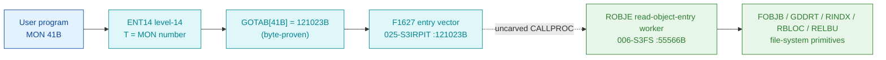

# MON 41B (octal) - ReadObjectEntry (ROBJE)

> **CORRECTED 2026-07-15 (byte-verified).** The worker + dispatch described below are on the
> DEBUNKED model and are WRONG. Byte truth from the carved L07 image:
> `MCTAB[41B] = 005661B = MROBJ=104035B` in segment 006-S3FS, reached by the real dispatch
> `MON 41B -> ENT14(072167B) -> GOTAB[41B]=MFELL(072114B) -> CALLP(032201B) -> MCTAB[41B]=MROBJ`.
> Any "GOTAB from commoncode" / "uncarved CALLPROC bridge" / "F16xx stub" / old worker name below
> is an artefact of the wrong table. Verified: `dd if=044-S3IDPIT.bin bs=1 skip=1890 count=2`
> -> `88 1d`. Cross-ref ../317B-ExecuteCommand/README.md and SINTRAN/CARVING-HANDOFF.md sec 3a.

Gets information about an opened file. Each file has an *object entry* - a 64-byte
record holding the file name, access rights, the dates last opened for read and
write, the size, and the device/unit number where the mass-storage file resides.
The caller passes the file number and the address of a 64-byte receive buffer.

**Status:** GOTAB dispatch head byte-proven (`GOTAB[41B] = 121023B`, the `F1627`
level-14 vector in `025-S3IRPIT`); the `ROBJE` worker body is real SINTRAN L
bytes and walks the object-entry structure via the file-system primitives
(`FOBJB`, `GDDRT`, `RINDX`, `RBLOC`, `RELBU`); the exact `MON 41 -> worker` link
crosses an uncarved kernel bridge (see [Honest caveats](#honest-caveats)). All
addresses/values are **octal**.

- **Full disassembly:** [`41B-ReadObjectEntry.ASM`](41B-ReadObjectEntry.ASM) - the actual code, both regions (F1627 entry vector + ROBJE worker).
- **Bytes live once in** the canonical segment layer: [`../../segments-ref/`](../../segments-ref/).

---

## Dispatch path

The dashed hop (`D -> E`) is the resident `CALLPROC`/segment-switch - it is **not
present in any carved segment**, so it is the one link that cannot be followed
statically.

---

## Code location (dispatch path)

Every row is a real region you can open. The byte offset is the authoritative
decimal byte offset from the segment `.hex` (the `025-S3IRPIT` carve has an
unmapped hole before the vector, so its offset is not the plain
`(addr - loadbase) x 2`).

| Role | Segment (full disasm) | Addr range (octal) | Byte offset | Symbol | Verdict |
|------|------------------------|--------------------|-------------|--------|---------|
| GOTAB[41] dispatch word | [commoncode.asm](../../segments-ref/SINTRAN-DATA_commoncode/SINTRAN-DATA_commoncode.asm) - [.hex](../../segments-ref/SINTRAN-DATA_commoncode/SINTRAN-DATA_commoncode.hex) | `071274B` (1 word) | 58744 | `GOTAB+41` = `121023B` | **VERIFIED** |
| F1627 entry vector | [025-S3IRPIT.asm](../../segments-ref/025-S3IRPIT/025-S3IRPIT.asm) - [.hex](../../segments-ref/025-S3IRPIT/025-S3IRPIT.hex) | `121023B-121032B` (8w) | 56358 | `F1627` | **VERIFIED** (vector/link-cell data) |
| resident CALLPROC bridge | - (uncarved) | - | - | `CALLPROC` | **UNVERIFIED** |
| ROBJE worker body | [006-S3FS.asm](../../segments-ref/006-S3FS/006-S3FS.asm) - [.hex](../../segments-ref/006-S3FS/006-S3FS.hex) | `55566B-55747B` (code to `55725B`) | 24300 | `ROBJE` | real bytes; link **MISATTRIBUTED** |

**Verify by hand:** `grep '^55566 ' ../../segments-ref/006-S3FS/006-S3FS.hex` -> byte offset `24300`;
then `dd if=../../../segments/006-S3FS.bin bs=1 skip=24300 count=8 | od -An -tx1` -> `22 60 cc 65 cc 59 f0 08`
(= octal `021140 146145 146131 170010` = `STD I 140` / `RADD CLD SL DA` / `RADD CLD SB DD` / `SAB 10`, the ROBJE entry).

The GOTAB slot itself:
`dd if=../../../resident/SINTRAN-DATA_commoncode.bin bs=1 skip=58744 count=2 | od -An -tx1` -> `a2 13` (big-endian word = `121023B`).

The F1627 vector: `grep '^121023 ' ../../segments-ref/025-S3IRPIT/025-S3IRPIT.hex` -> byte offset `56358`;
then `dd if=../../../segments/025-S3IRPIT.bin bs=1 skip=56358 count=2 | od -An -tx1` -> `62 70` (= `061160B`, the first vector word).

---

## Instruction walkthrough

Full listing: [`41B-ReadObjectEntry.ASM`](41B-ReadObjectEntry.ASM). Two regions:

**Region A - F1627 entry vector (`121023-121032`, `025-S3IRPIT`)** is the
8-word block pointed at by `GOTAB[41]`, bounded strictly to the next symbol
`BISIZ = 121033B`. Its words (`061160`, `116234`, `061157`, ...) are
**vector / link-cell data**, not executable code - nd100-dis renders them as
bogus `ADD/FDV/STZ/STA` instructions. The identical words appear as explicitly
labelled link cells in the `F1656` stub tail of
[MON 117B](../117B-ReadFromFile/README.md), confirming the pattern. The resident
`CALLPROC` uses this vector to reach the worker.

**Region B - ROBJE worker (`55566-55725`, `006-S3FS`; link cells `55726-55747`)**
is the functional body. All calls to shared file-system workers are **indirect**
(`JPL I` / `JMP I`) through the pointer table at `55726-55747`; those words are
**data (link cells)**, not code, and their resolved worker addresses are
annotated in the `.ASM`.

- **Entry prologue (`55566-55571`)** - `55566 STD I 140` stashes the caller's
  double-word; `55571 SAB 10` builds the local frame `B`; `55572 JPL I 135` ->
  `003752` is the shared resident prologue worker.
- **Locate the object block (`55573-55576`)** - `55573 JPL I 135` -> `FOBJB`
  (`55563`, find-object-block, in-segment) returns the entry pointer in `X`;
  `55576 JPL I 133` -> `010500` is a resident setup worker.
- **Version / index match (`55577-55637`)** - the caller's version and index
  words (`B+1`, `B+2`) are compared against the entry fields (`X+1`, `X+2`,
  `X+3`); mismatches steer into the directory-read (`55613`) and block-read
  (`55653`) paths.
- **Directory / index / block read (`55640-55704`)** - `55643 JPL I 71` ->
  `GDDRT` (`50121`, get-directory); `55651 JPL I 64` -> `RINDX` (`51453`,
  read-index); `55667 JPL I 52` -> `RBLOC` (`35531`, read-block); then
  `55702 JPL I 42` -> `001224` (resident) and `55704 JPL I 41` -> `RELBU`
  (`35476`, release-buffer).
- **Copy back + exit (`55705-55725`)** - `55705-55713` write the resolved entry
  words back through `X` into the caller's slots; `55721 STA ,B 2` stores the
  status word into the caller's status slot `B+2`; `55724 JPL I 23` -> `010506`
  (resident) and the paths funnel into the resident return `55715 JMP I` ->
  `003776`.

The calls to `FOBJB`, `GDDRT`, `RINDX`, `RBLOC` and `RELBU` are the byte-level
reason `ROBJE` is the ReadObjectEntry worker - it walks the file-system object
entry the way the manual describes.

---

## Parameter / register contract

| Reg / field | Dir | Meaning | Verdict |
|-------------|-----|---------|---------|
| entry point (vector) | in | `121023B` = `F1627`, the `GOTAB[41]` level-14 vector | VERIFIED (bytes) |
| entry point (worker) | in | `55566B` = ROBJE worker entry | VERIFIED (bytes) |
| `D` (double) | in | caller parameter, saved first (`STD I 140`) | VERIFIED (copy); layout inferred |
| local frame `B` | internal | `SAB 10` = 10B-word working frame | VERIFIED (bytes) |
| `T` (manual) | in | file number (returned when the file was opened) | inferred (manual MAC example) |
| `A` (manual) | in | address of the 64-byte object-entry receive buffer | inferred (manual) |
| `A` (manual) | out | error number on the error return | inferred (manual) |
| `B+2` | out | returned status word (`STA ,B 2` at `55721`) | VERIFIED (bytes) |

The user-visible `T`/`A` register convention lives in the caller-side `MON 41`
wrapper and the uncarved `CALLPROC` frame, so the precise
user-register-to-field assignment is **inferred** from the manual, not
byte-proven here. The `-1` / `-10` status leaders (`SAA -1`, `SAA -10`) are
VERIFIED in the code; their mapping to the SINTRAN error/status table is
**UNVERIFIED**.

---

## Pseudo-code (for an emulator)

See **[`41B-ReadObjectEntry.pseudo.c`](41B-ReadObjectEntry.pseudo.c)** - a
pseudo-C model of the handler for emulator authors. Control flow + the calls to
the file-system primitives are byte-verified; the object-entry field semantics
and status meanings are inferred from the call structure and the manual.

Every instruction in the model is translated per the canonical
[`ND100-INSTRUCTION-SEMANTICS.md`](../../instruction-semantics/ND100-INSTRUCTION-SEMANTICS.md)
(bare `LDA disp` = `mem[P+disp]`; `RADD CLD Sx Dy` = `y = x`; skip-return polarity;
`MIN ,B 4` success bump).

---

## Honest caveats

**What is byte-proven:** `GOTAB[41B] = 121023B` (level-14 dispatch); the `F1627`
block at `121023B` in `025-S3IRPIT` is real (8 words of vector/link-cell data);
the `ROBJE` worker body at `55566B` in `006-S3FS` is real code (entry bytes
`021140 146145 146131 170010` match the disassembly); and it belongs to the
file-system object-entry family - it calls `FOBJB`, `GDDRT`, `RINDX`, `RBLOC`
and `RELBU`.

**What is NOT proven:** the link from the `F1627` vector (in `025-S3IRPIT`) to
the `ROBJE` worker (in `006-S3FS`). `F1627` is a vector/link-cell block, not
directly-followable code; the stub->worker transfer is the resident
`CALLPROC`/segment switch in an **uncarved overlay**. So the `MON 41 -> ROBJE`
attribution rests on the `ROBJE` symbol name + its object-entry calls + the
matching behaviour, not a followed pointer - hence **MISATTRIBUTED** in the
strict sense. Confirming it needs a live trace: break at `121023B` on a real
`MON 41`, single-step the segment switch, and confirm P lands on `ROBJE = 55566`.

**Region-B bound:** the `ROBJE` worker is bounded strictly to the next FILSYS
symbol `WOBJE = 55750B`. Code runs `55566-55725`; `55726-55747` are the pointer
table (link cells). Every direct branch lands inside `55566-55725`.

Several link-cell contents (`003752`, `010500`, `001224`, `010506`, `003776`)
match no `FILSYS-SYMBOLS` entry; their low addresses suggest resident-monitor /
save-restore routines outside the file-system segment and are not resolved here.

Method: [../../../../../EXTRACTING-RESIDENT-CODE.md](../../../../../EXTRACTING-RESIDENT-CODE.md) - dispatch reality:
[../../TASK-05-mismatches.md](../../TASK-05-mismatches.md) - master map: [../../MON-CALL-INDEX.md](../../MON-CALL-INDEX.md).
