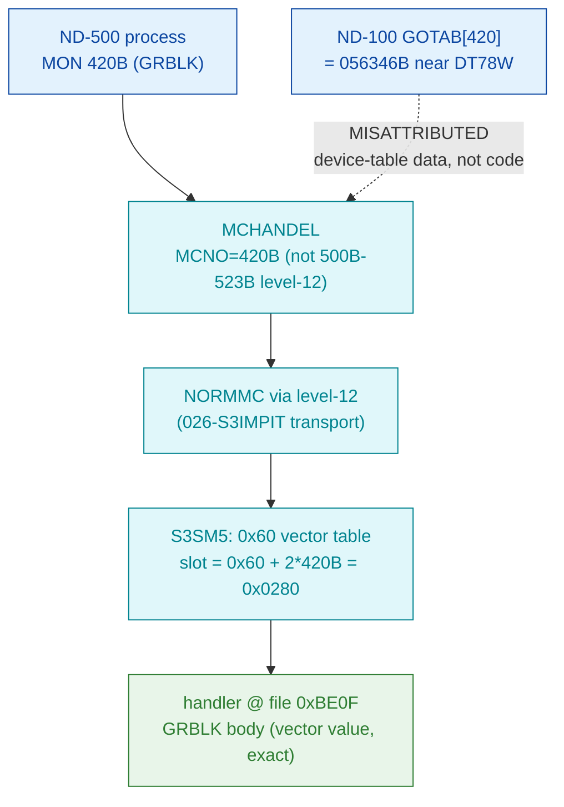

# MON 420B (octal) — GetUserRegisters (GRBLK)

Returns the ND-500 register set that was saved when a program was terminated with the ESCAPE key
(the user-break handler armed by `SwitchUserBreak`, MON 405B). The manual says **39 registers** are
saved into a **154-byte (77-word)** caller buffer. This is an **ND-500 monitor call** (octal >=
0400), not an ND-100 native call.

**Status:** routing byte-proven (ND-500 call via the S3SM5 0x60 vector table, **not** the ND-100
GOTAB); the handler body is real SINTRAN L bytes carved from `030-S3SM5.bin` at the exact vector
value `0xBE0F` (no correction). The 448-byte window does **not** decode as one clean subroutine, so
per-instruction alignment is UNVERIFIED — but it shows a **repeating unrolled pattern with
descending immediates** bracketed by returns, structurally consistent with copying the 39 saved
registers. See [Honest caveats](#honest-caveats). ND-100 addresses are octal; ND-500 offsets are
hex byte offsets.

- **Full disassembly:** [`420B-GetUserRegisters.ASM`](420B-GetUserRegisters.ASM) — the carved ND-500 handler region (single contiguous slice).
- **Bytes live once in** the canonical segment layer: [`../../segments-ref/`](../../segments-ref/).

---

## Dispatch path

The ND-500 MON message reaches the ND-100 side over the level-12 mechanism (transport in
`026-S3IMPIT`, the same path the 500B–515B level-12 calls use), then `NORMMC` forwards the
non-level-12 call `420B` to the System Monitor, which vectors it through the S3SM5 0x60 table. The
vector value `0xBE0F` points **directly** at the handler entry. The `X ⇢ B` hop marks the ND-100
GOTAB[420] read as a red herring — a coincidental read into device-table data, not a handler.

---

## Code location (dispatch path)

Rows are in execution order. Byte offset for the ND-100 GOTAB row = `(addr − loadbase)` octal
words × 2; ND-500 rows in `030-S3SM5` are **byte-addressed** (byte offset is direct, no ×2).

| Role | Segment (full disasm) | Addr / file offset | Byte offset (dec) | Symbol | Verdict |
|------|------------------------|--------------------|-------------------|--------|---------|
| GOTAB[420] read (does NOT apply) | [commoncode.asm](../../segments-ref/SINTRAN-DATA_commoncode/SINTRAN-DATA_commoncode.asm) · [.hex](../../segments-ref/SINTRAN-DATA_commoncode/SINTRAN-DATA_commoncode.hex) | `071653B` (=071233B+420B) | 59222 | reads `056346B` (near `DT78W`, device table) | **MISATTRIBUTED** — coincidental read into device-table data, not a handler |
| S3SM5 0x60 vector slot 420B | [030-S3SM5.asm](../../segments-ref/030-S3SM5/030-S3SM5.asm) · [.hex](../../segments-ref/030-S3SM5/030-S3SM5.hex) | file off `0x0280` | 640 | value `0xBE0F` (points AT entry) | **VERIFIED** (routing) |
| Handler body (GRBLK) | [030-S3SM5.asm](../../segments-ref/030-S3SM5/030-S3SM5.asm) · [.hex](../../segments-ref/030-S3SM5/030-S3SM5.hex) | file off `0xBE0F..0xBFCE` | 48655..49102 (448 bytes) | `GRBLK` (L07 name only; not in carved window) | real bytes; alignment UNVERIFIED |

**Verify by hand:** `grep '^48655 ' ../../segments-ref/030-S3SM5/030-S3SM5.hex` → `48655  010`
(octal `010` = `0x08`); then
`dd if=../../../segments/030-S3SM5.bin bs=1 skip=48655 count=2 | od -An -tx1` → `08 a8` (matches the
`.ASM` first line). The vector slot:
`dd if=../../../segments/030-S3SM5.bin bs=1 skip=640 count=2 | od -An -tx1` → `be 0f` (the vector
value, which equals the entry offset).

---

## Instruction walkthrough

Full listing: [`420B-GetUserRegisters.ASM`](420B-GetUserRegisters.ASM). The 448-byte region does not
decode as a single clean subroutine (several undecodable opcodes; no `ENT*` at entry), so the
aligned mnemonics are **not** a reliable guide. What *is* a real structural observation is a
**repeating unrolled block** whose immediate operands **descend** (`… $0x1A, $0x18, $0x16 …` and,
near the tail, `… $0x35, $0x33 …`), separated by `retd`/`rett` returns — the shape one expects from
an **unrolled copy over the 39 saved registers** into the caller buffer. The RAW BYTES are ground
truth; the individual instructions are provisional and are not modelled as verified.

---

## Parameter / register contract

This is an ND-500 call; argument transport is the ND-500 MON message block (`CALLG Buffer`), not
ND-100 A/X/T registers.

| Field | Dir | Meaning | Verdict |
|-------|-----|---------|---------|
| MON number | in | `420B` routes via MCHANDEL → NORMMC → S3SM5 0x60 vector slot `0x0280` | **VERIFIED** (bytes) |
| `Buffer` (ARRAY) | in/out | 154 bytes (77 words) receiving the 39 registers in number order | inferred (manual) |
| register count | internal | 39 registers saved by the ESCAPE user-break handler | inferred (manual) |
| status / skip | out | not attributed to a byte-proven field (window misaligned) | UNVERIFIED |

The user-visible buffer layout lives in the ND-500 MON caller wrapper and the S3SM5 message frame;
the 154-byte / 39-register figures are from the manual, corroborated only structurally by the
unrolled copy pattern.

---

## Pseudo-code (for an emulator)

See **[`420B-GetUserRegisters.pseudo.c`](420B-GetUserRegisters.pseudo.c)** — a pseudo-C model for
emulator authors. Because the window does not decode at proven alignment, only the **documented**
register-buffer-copy contract is expressed (a loop over 39 registers, noting the carve realises it
unrolled); no instruction-level behaviour is modelled as verified. Instruction semantics reference:
[`../../instruction-semantics/ND500-INSTRUCTION-SEMANTICS.md`](../../instruction-semantics/ND500-INSTRUCTION-SEMANTICS.md)
(register model, addressing modes, branch conditions; `C=1` means **no-borrow**, inverted). The
routing is byte-verified; the body is provisional.

---

## Honest caveats

**What is byte-proven:** 420B is an ND-500 call, NOT an ND-100 native MON call. The
`prove-mon.py 420` GOTAB[420] result (`056346B`, in the `DT7x` device-table series of
`SYMBOL-2-LIST.SYMB.TXT`) is a **device-table datafield** — a red herring, not a handler. The S3SM5
0x60 vector slot for 420B (`0x0280`) holds `0xBE0F`, and that value points **directly** at the
carved handler bytes at file offset `0xBE0F` — routing and entry offset are real bytes on disk. The
region also carries a real, observable unrolled/descending-immediate copy structure.

**What is NOT proven:** the exact instruction alignment / behaviour of the 448-byte body. There is
no `ENT*` prologue at entry and several opcodes are undecodable, so the aligned mnemonics are
untrustworthy even though the raw bytes are ground truth (reference Sec.9). The L07 `GRBLK` symbol
confirms the *name/behaviour* only; its address does not fall inside the carved `030-S3SM5.bin`
window. The precise buffer layout, the per-register widths, and the status/skip contract are
UNVERIFIED — the 39-register / 154-byte figures come from the manual and are only structurally
corroborated. Confirming the body needs an S3SM5 symbol map or a clean-boundary re-carve; treat the
*routing* as reliable and the *body* as provisional.

Method: [../../../../../EXTRACTING-RESIDENT-CODE.md](../../../../../EXTRACTING-RESIDENT-CODE.md) · dispatch reality:
[../../TASK-05-mismatches.md](../../TASK-05-mismatches.md) · master map: [../../MON-CALL-INDEX.md](../../MON-CALL-INDEX.md).
