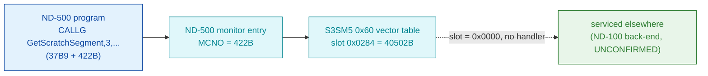

# MON 422B (octal) - GetScratchSegment (GSWSP)

Connects an empty data segment to the caller's domain and reserves space for it on the
swap file. The new segment gets the default name `SCRATCH-SEGMENT:DSEG`. It belongs to the
ND-500 monitor-call family (`410B-427B`) dispatched through the S3SM5 numeric vector table -
**but its vector slot is empty**, so no handler code exists in the carved `030-S3SM5` segment.

**Status:** the empty vector slot is **byte-proven** (slot `0x0284` = `0x0000`); the actual
servicing point is **NOT LOCATED / UNVERIFIED**. All addresses/values are **octal** unless a
`0x` prefix or `(dec)` marks them hex/decimal.

- **No code body:** this call has no worker in any carved segment - there is **no `.ASM` and
  no `.pseudo.c`** here on purpose. Fabricating one would be wrong; the table below documents
  the absence instead. The manual short name is `GSWSP`; no such symbol appears in any carved
  segment's symbol table.
- **Bytes live once in** the canonical segment layer: [`../../segments-ref/`](../../segments-ref/)
  (segment `030-S3SM5`, load base `40000B`).

---

## Dispatch path



The dashed hop (`C -> D`) is where a real call would jump to its handler word. For MON 422B
that word is **`0x0000`**, so no jump target exists inside `030-S3SM5`. Where the call is
actually serviced is not carved here (see [Honest caveats](#honest-caveats)).

---

## Code location (dispatch path)

`030-S3SM5` holds a numeric MON-dispatch vector table based at byte offset `0x60`. The slot
for MON number `N` is at byte `0x60 + 2*N` (with `N` the decimal value of the octal MON
number). Byte offset -> segment word address = load base `40000B` + `(offset / 2)` words.

| Role | Segment (full disasm) | Addr / slot (octal) | Byte offset (dec) | Symbol | Verdict |
|------|------------------------|---------------------|-------------------|--------|---------|
| ND-500 monitor entry (numeric dispatch, `MCNO=422B`) | - (uncarved ND-500 resident) | n/a | n/a | ND-500 MON entry | **UNVERIFIED** |
| S3SM5 `0x60` vector slot for 422B | [030-S3SM5.asm](../../segments-ref/030-S3SM5/030-S3SM5.asm) - [.hex](../../segments-ref/030-S3SM5/030-S3SM5.hex) | word `40502B` (slot `0x0284`) | 644 | (empty) | **VERIFIED empty (`0x0000`)** |
| Worker body | none in `030-S3SM5` | n/a | n/a | expected ND-100 back-end (`GSWSP`, not located) | **UNVERIFIED** |

Slot byte offset = `0x60 + 2*422B` = `96 + 548 = 644 (dec)` = `0x0284`. Canonical binary:
`../../../segments/030-S3SM5.bin`.

**Verify by hand:** `grep '^644 ' ../../segments-ref/030-S3SM5/030-S3SM5.hex` -> byte `644  000`
(and `645  000`); then
`dd if=../../../segments/030-S3SM5.bin bs=1 skip=644 count=2 2>/dev/null | od -An -tx1` -> `00 00`
(the empty slot). For contrast, the populated MON 410B slot at byte `624` reads `ba e1`.

---

## Instruction walkthrough

There are **no instructions to walk** - the vector slot is data (`0x0000`), not a jump target,
so no worker body was carved and there is no `.ASM`.

What the dispatch would do for a *populated* neighbour: the ND-500 monitor takes the MON number,
indexes the `0x60` table, and transfers to the 16-bit handler word found there. Slots `410B-421B`
hold real handler words (e.g. `410B -> ba e1`, `421B -> bf cf`); slots **`422B-427B` are all
`0x0000`**, i.e. no S3SM5 handler for the `GetScratchSegment / CopyCapability / process` family.
MON 422B is the first of those empty slots.

Vector-table dump (byte offsets, 16-bit words) for the fix/process family:

```
410B off 624 = ba e1     420B off 640 = be 0f
411B off 626 = bb 38     421B off 642 = bf cf
412B off 628 = 98 dd     422B off 644 = 00 00   <-- GetScratchSegment
413B off 630 = bb 73     423B off 646 = 00 00
414B off 632 = bb 9e     424B off 648 = 00 00
415B off 634 = bc 20     425B off 650 = 00 00
416B off 636 = bd 70     426B off 652 = 00 00
417B off 638 = bd f6     427B off 654 = 00 00
```

---

## Parameter / register contract

From the manual (ND-860228.2 EN, p.462) and `Developer/MON/calls/422B_GetScratchSegment.yaml`;
**not** byte-proven here because no handler was located.

| Field | Dir | Meaning | Verdict |
|-------|-----|---------|---------|
| call form | in | ND-500 `CALLG GetScratchSegment, 3, ...` (`37B9 + 422B`) | manual (inferred) |
| `SizeInBytes` | in | `INTEGER` - segment size in bytes | manual (inferred) |
| `LogSegmentNo` | in | `INTEGER` - logical segment number to use; `0` = system picks first free | manual (inferred) |
| `RetLogSegmentNo` | out | `INTEGER` - logical segment number actually selected (when `0` was passed) | manual (inferred) |
| availability | - | user + RT programs (per manual); not ND-100 / system programs | manual (inferred) |
| handler slot | - | S3SM5 vector `0x0284` = `0x0000` (no ND-500 handler) | **VERIFIED (bytes)** |

Full YAML contract: `../../../../../../../Developer/MON/calls/422B_GetScratchSegment.yaml`.

---

## Honest caveats

**What is byte-proven:** the S3SM5 `0x60` vector slot for MON 422B, at byte offset `644`
(segment word `40502B`, slot `0x0284`), reads **`0x0000`** in the real SINTRAN L bytes of
`030-S3SM5.bin`. The whole `422B-427B` slot run is `0x0000`, while `410B-421B` hold non-zero
handler words - so the empty slot is a genuine "no S3SM5 handler", not a carve artefact.

**What is NOT proven:** where MON 422B is actually serviced. A `0x0000` slot means "not routed
to S3SM5"; the expected back-end (documented short name `GSWSP`) has **not been located or
carved** - no `GSWSP` symbol exists in any carved segment's symbol table. Confirming the real
dispatch needs a live trace of a `GetScratchSegment` call, or locating the ND-100 back-end that
consumes it. Until then this folder correctly holds **no code**.

This is consistent, not contradictory: the *slot* is verified empty, and the *worker* is
unverified/absent.

---

Method: [../../../../../EXTRACTING-RESIDENT-CODE.md](../../../../../EXTRACTING-RESIDENT-CODE.md) - dispatch reality:
[../../TASK-05-mismatches.md](../../TASK-05-mismatches.md) - master map: [../../MON-CALL-INDEX.md](../../MON-CALL-INDEX.md).
