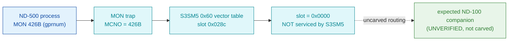

# MON 426B (octal) - GetProcessNo (gprnum)

An ND-500 call intended to return an ND-500 process number. Its slot in the ND-500 System
Monitor (`030-S3SM5`) 0x60 dispatch vector table is **empty (0x0000)**, so this segment does
**not** service the call - there is no code body to disassemble here.

**Status:** the empty vector slot is **byte-proven**; there is **no worker body in any carved
segment**. The actual servicing point (expected ND-100-side) is **UNVERIFIED**. This is an
absent/fall-through call, so no `.ASM`, `.pseudo.c`, or `.bin` is produced - fabricating one
would be wrong. All addresses are **octal** unless a `0x` / "file offset" says otherwise.

- **No code body:** the routing evidence is the vector table itself in the canonical segment
  layer: [`030-S3SM5.asm`](../../segments-ref/030-S3SM5/030-S3SM5.asm) (file-offset dump) and
  [`030-S3SM5.hex`](../../segments-ref/030-S3SM5/030-S3SM5.hex).
- **Bytes live once in** the canonical segment layer: [`../../segments-ref/`](../../segments-ref/).

---

## Dispatch path

Unlike the ND-100 MON calls, 426B is **not** dispatched through the ND-100 `GOTAB`
(`python3 scripts/prove-mon.py 426` confirms: `410-427B -> S3SM5 0x60 vector table`; the GOTAB
entry is meaningless here). The dashed hop is the routing to whatever handler would service the
call once S3SM5 declines it - that bridge is **not present in any carved segment**, so it cannot
be followed statically.

---

## Code location (dispatch path)

The ND-500 monitor uses a numeric-dispatch vector table based at **file byte 0x60**, so for
MON `N` the slot is at file byte `0x60 + 2*N`. For 426B (= 278 decimal) that is
`0x60 + 2*278 = 0x028c = 652`. Byte offset here is the **ND-500 vector file offset**, not the
`(addr - loadbase)` word rule used for the ND-100 segments.

| Role | Segment (full disasm) | Vector slot (file offset) | Byte offset | Symbol | Verdict |
|------|------------------------|---------------------------|-------------|--------|---------|
| S3SM5 0x60 vector slot for 426B | [030-S3SM5.asm](../../segments-ref/030-S3SM5/030-S3SM5.asm) · [.hex](../../segments-ref/030-S3SM5/030-S3SM5.hex) | `0x028c` (2 bytes = `0x0000`) | 652 | (0x60 dispatch table) | **VERIFIED empty** |
| Handler body | - (none carved) | - | - | `GPRNU` (inferred ND-100 companion) | **UNVERIFIED** |

**Verify by hand:** `grep -E '^65[23] ' ../../segments-ref/030-S3SM5/030-S3SM5.hex` -> `652 000` /
`653 000`; then `dd if=../../../segments/030-S3SM5.bin bs=1 skip=652 count=2 2>/dev/null | od -An -tx1`
-> ` 00 00` (the empty slot).

---

## Instruction walkthrough

There is **no code body to walk** - the slot is empty, so no instructions belong to this call in
any carved segment. What is byte-verifiable is the shape of the table around it:

- Slots **410B-421B** hold **non-zero** big-endian handler addresses (real fix-family / ND-500
  handlers): `410B=0xbae1 411B=0xbb38 412B=0x98dd 413B=0xbb73 414B=0xbb9e 415B=0xbc20
  416B=0xbd70 417B=0xbdf6 420B=0xbe0f 421B=0xbfcf`.
- Slots **422B-430B** are all **0x0000**, 426B (file offset `0x028c`) among them.

So 426B falls in a contiguous run of unused/empty vector slots: S3SM5 explicitly does not route it.

---

## Parameter / register contract

No handler is present, so no register contract is byte-proven here. The expected (documented, not
verified) intent:

| Reg / field | Dir | Meaning | Verdict |
|-------------|-----|---------|---------|
| MCNO | in | MON number `426B` presented at the ND-500 monitor trap | VERIFIED (dispatch class) |
| process number | out | expected ND-500 process number result | inferred (no carved handler) |
| servicing point | - | expected ND-100-side companion (`GPRNU`) | **UNVERIFIED** |

The user-visible register convention would live in whatever handler actually services the call;
since none is carved, the contract above is **inferred**, not byte-proven.

---

## Honest caveats

**What is byte-proven:** the S3SM5 0x60 vector slot for MON 426B (file offset `0x028c` = 652) holds
`0x0000`. The whole `422B-430B` run is empty while `410B-421B` hold real handler addresses - so the
"426B is not serviced by S3SM5" reading is verified against the actual segment bytes.

**What is NOT proven:** where the call is actually serviced. A `0x0000` slot means "not routed to
S3SM5"; the real servicing point is expected on the ND-100 monitor side but has **not** been located
or carved. The name `GPRNU` (and short name `gprnum`) is the **expected/documented** ND-100 companion,
**not** a symbol proven against these bytes - treat it as a label, not a confirmed target. Confirming
the real handler needs a live trace (present MON 426B to the ND-500 monitor and follow where control
lands after S3SM5 declines the empty slot). This reconciles into one story: **the slot is provably
empty; the downstream handler is provably absent from the carve.**

Method: [../../../../../EXTRACTING-RESIDENT-CODE.md](../../../../../EXTRACTING-RESIDENT-CODE.md) · dispatch reality:
[../../TASK-05-mismatches.md](../../TASK-05-mismatches.md) · master map: [../../MON-CALL-INDEX.md](../../MON-CALL-INDEX.md).
