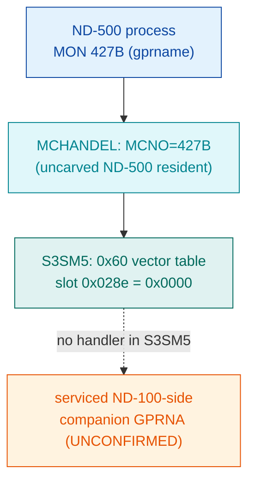

# MON 427B (octal) - GetOwnProcessInfo (GPRNA, expected)

Get own ND-500 process info / name. The `0x60` numeric MON dispatch vector table in the
ND-500 System Monitor segment `030-S3SM5` has an **empty slot** for MON 427B, so this call is
**not serviced by S3SM5**. There is no code body to disassemble here - the README documents
the absence.

**Status:** absence **byte-proven** (S3SM5 `0x60` vector slot for 427B holds `0x0000`); the
actual servicing point is **UNCONFIRMED** (expected ND-100-side companion `GPRNA`, not located
or carved). No `.ASM`/`.pseudo.c`/`.bin` is produced - fabricating one would be wrong. All
ND-100 addresses/values are octal; the S3SM5 vector uses big-endian file byte offsets.

- **No code body:** this MON number has an empty S3SM5 vector slot, so there is no worker
  region and no `427B-GetOwnProcessInfo.ASM`.
- **Bytes live once in** the canonical segment layer: [`../../segments-ref/`](../../segments-ref/)
  (see `030-S3SM5/`); single-source binary at `../../../segments/030-S3SM5.bin` (load base 40000B).

---

## Dispatch path



The dashed hop (`E ⇢ X`) is the routing to the real handler - it leaves S3SM5 entirely and is
**not present in any carved segment**, so it cannot be followed statically from here.

---

## Code location (dispatch path)

MON 427B is an **ND-500 call** (octal 427 >= 0400): it is **NOT** dispatched via the ND-100
GOTAB (confirmed by `prove-mon.py 427`: "not dispatched via the ND-100 GOTAB"). Its numeric
dispatch goes through the S3SM5 `0x60` vector table, whose slot for 427B is empty, so no worker
body exists in the carved segment. Rows in execution order:

| Role | Segment (full disasm) | Vector / addr | Bin byte-offset (dec) | Symbol | Verdict |
|------|------------------------|---------------|-----------------------|--------|---------|
| MON 427B entry (ND-500 numeric dispatch, MCNO=427B) | uncarved ND-500 resident (MCHANDEL) | n/a - not GOTAB-dispatched | n/a | `MCHANDEL` | UNVERIFIED (resident not carved) |
| S3SM5 `0x60` vector slot for 427B | [030-S3SM5.asm](../../segments-ref/030-S3SM5/030-S3SM5.asm) · [.hex](../../segments-ref/030-S3SM5/030-S3SM5.hex) | file offset `0x028e` (not load-relative) | 654 (0x028e) | (empty slot) | **VERIFIED** empty = `0x0000` |
| Worker body | none carved (expected ND-100-side companion) | n/a | n/a | `GPRNA` (expected) | UNVERIFIED - servicing point not located |

Slot offset = `0x60 + 2*427B` = `96 + 2*279` = **654 dec (0x028e)**, a big-endian file byte
offset into `../../../segments/030-S3SM5.bin` (this table is a numeric-dispatch vector, not a
load-relative `(A-load)*2` address).

**Verify by hand** (reads the empty slot straight from the canonical binary):

```
dd if=../../../segments/030-S3SM5.bin bs=1 skip=654 count=2 2>/dev/null | xxd
# 00000000: 0000   -> slot 0x028e is empty; 427B not serviced by S3SM5
```

Neighbouring slots confirm the pattern: 421B (skip=642) = `bfcf` (a real handler), while
424B/425B/426B/427B/430B (skip 648/650/652/654/656) are all `0000`.

---

## Instruction walkthrough

There is **no code** to walk through: the S3SM5 `0x60` vector slot for MON 427B is `0x0000`,
so no handler region exists in `030-S3SM5.bin` and no `.ASM` is generated. The only fact this
folder establishes at the instruction level is the empty dispatch slot, reproduced by the
`dd`/`xxd` line above. Any worker for this call lives outside the carved ND-500 segment and has
not been located.

---

## Parameter / register contract

| Item | Value | Verdict |
|------|-------|---------|
| MON number | 427B (octal), ND-500 class (>= 0400B) | VERIFIED |
| Dispatch method | S3SM5 `0x60` numeric vector table (not ND-100 GOTAB) | VERIFIED (prove-mon) |
| Vector slot offset | `0x60 + 2*427B` = 654 dec (0x028e) | VERIFIED |
| Vector slot contents | `0x0000` (empty - no S3SM5 handler) | VERIFIED (bytes) |
| Servicing point | expected ND-100-side companion `GPRNA` | inferred / UNVERIFIED |
| Register / argument convention | unknown (handler not located) | UNVERIFIED |

The user-visible register/argument convention lives in whatever handler actually services this
call; since that handler is not in the carved segment, the contract is **not** byte-proven here.

---

## Honest caveats

**What is byte-proven:** the S3SM5 `0x60` vector slot for MON 427B (file offset 654 / 0x028e)
holds `0x0000`, i.e. this call is **not** routed to a handler inside `030-S3SM5.bin`. The
formula and offset check out against real SINTRAN L bytes, and the neighbouring non-empty slot
(421B = `bfcf`) confirms the vector base and stride.

**What is NOT proven:** the actual servicing point. A `0x0000` entry means "not routed to
S3SM5"; it does not name where the call *is* handled. The `GPRNA` name is the *expected*
ND-100-side companion to the `SPRNA`/`GPRNA` process-name family - it is **not** confirmed and
**not** carved here. Confirming it needs either the ND-100 resident monitor image (MCHANDEL /
the process-name back end) carved and disassembled, or a live trace of a real MON 427B on
hardware/emulator to see where P lands after the S3SM5 slot is found empty.

The current README supersedes any earlier "vector slot empty" note; the two agree, and this is
the single consolidated story: **absence proven, destination unknown.**

---

Method: [../../../../../EXTRACTING-RESIDENT-CODE.md](../../../../../EXTRACTING-RESIDENT-CODE.md) · dispatch reality:
[../../TASK-05-mismatches.md](../../TASK-05-mismatches.md) · master map: [../../MON-CALL-INDEX.md](../../MON-CALL-INDEX.md).
