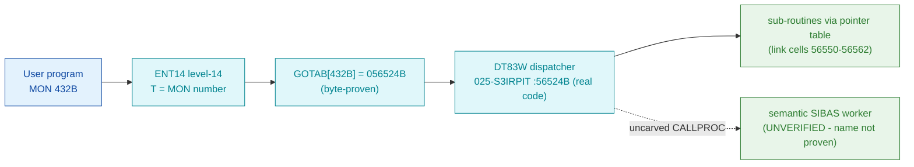

# MON 432B (octal) - SIBASFunction (SIBFU)

"**Various SIBAS functions**" (manual section 2.14, short name `SIBFU`) - a system-program monitor
call into the SIBAS database interface. The manual lists it **name-only**: no parameter block, return
values, or caller convention are documented. This is an ND-100 monitor call.

**Status:** `partial`. GOTAB dispatch head byte-proven (`GOTAB[432B] = 056524B`); that value is an
address in `025-S3IRPIT` (load `32000B`, the overlay mapped for level-14 dispatch), where it resolves
to `DT83W = 56524B`, a compact **function dispatcher** (real SINTRAN L bytes: it loads a selector into
`X`, calls sub-routines through a pointer table, and checks results against `-1`). Whether `DT83W` is
the true semantic "various SIBAS functions" worker - or a dispatch-table slot from which the real
SIBAS worker is reached across the uncarved `CALLPROC` - is **UNVERIFIED**; the symbol name does not
confirm SIBAS (see [Honest caveats](#honest-caveats)). All addresses/values are **octal**.

- **Full disassembly:** [`432B-SIBASFunction.ASM`](432B-SIBASFunction.ASM) - the `DT83W` dispatcher
  (the byte-proven `GOTAB[432]` target) + its shared sibling tail / link cells.
- **Bytes live once in** the canonical segment layer: [`../../segments-ref/`](../../segments-ref/).

---

## Dispatch path



The solid edge (`C -> D -> E`) is byte-proven: `GOTAB[432]` = `056524B` = `DT83W`, which loads the
selector into `X` and calls sub-routines indirectly through link cells in its `56550-56562` tail. The
dashed hop (`D ⇢ F`) covers the possibility that `DT83W` is a dispatch-table slot and the true
semantic SIBAS worker is reached across the resident `CALLPROC` - that path is **not present in any
carved segment**, so it cannot be followed statically, and the `DT83W`-is-SIBAS identity is not
name-proven.

---

## Code location (dispatch path)

Every row is a real region you can open. Byte offset = `(addr - loadbase)` in octal words x 2; for
`025-S3IRPIT` (load base `32000B`) that is `(addr - 32000B)` octal words x 2 (decimal); for
commoncode (load base `0`) it is `octal-addr x 2`.

| Role | Segment (full disasm) | Addr range (octal) | Byte offset | Symbol | Verdict |
|------|------------------------|--------------------|-------------|--------|---------|
| GOTAB[432] dispatch word | [commoncode.asm](../../segments-ref/SINTRAN-DATA_commoncode/SINTRAN-DATA_commoncode.asm) · [.hex](../../segments-ref/SINTRAN-DATA_commoncode/SINTRAN-DATA_commoncode.hex) | `071665B` (1 word) | 59242 | `GOTAB+432` = `056524B` | **VERIFIED** (stored word `5d 54`) |
| DT83W dispatcher (GOTAB target) | [025-S3IRPIT.asm](../../segments-ref/025-S3IRPIT/025-S3IRPIT.asm) · [.hex](../../segments-ref/025-S3IRPIT/025-S3IRPIT.hex) | `56524B-56536B` (code) + `56537B-56563B` (tail/link) | 21160 | `DT83W` | real bytes = **CODE**; SIBAS identity **UNVERIFIED** |
| resident CALLPROC bridge | - (uncarved) | - | - | `CALLPROC` | **UNVERIFIED** |
| same address in commoncode | [commoncode.asm](../../segments-ref/SINTRAN-DATA_commoncode/SINTRAN-DATA_commoncode.asm) · [.hex](../../segments-ref/SINTRAN-DATA_commoncode/SINTRAN-DATA_commoncode.hex) | `56524B` (1 word) | 47784 | (`DT83W` alias) = `124025` `JMP 25` | not the dispatch overlay - **the 025-S3IRPIT overlay is authoritative** |

**Verify by hand:** the GOTAB slot:
`grep '^71665 ' ../../segments-ref/SINTRAN-DATA_commoncode/SINTRAN-DATA_commoncode.hex`
-> `71665  056524  135 124  59242`; then
`dd if=../../../resident/SINTRAN-DATA_commoncode.bin bs=1 skip=59242 count=2 2>/dev/null | od -An -tx1`
-> `5d 54` (the stored word = octal `056524`). For the `DT83W` dispatcher head:
`grep '^56524 ' ../../segments-ref/025-S3IRPIT/025-S3IRPIT.hex`
-> `56524  146157  314 157  21160`; then
`dd if=../../../segments/025-S3IRPIT.bin bs=1 skip=21160 count=12 2>/dev/null | od -An -tx1`
-> `cc 6f ba 18 ba 1b f2 ff c4 35 a8 06` (= octal `146157 135030 135033 171377 142065 124006` =
`RADD CLD SA DX` / `JPL I 30` / `JPL I 33` / `SAT -1` / `SKP IF DA UEQ ST` / `JMP 6` - real
dispatcher code). At the same address in commoncode
(`dd ... skip=47784 count=2` -> `a8 15` = octal `124025`, a lone `JMP 25`), so the `025-S3IRPIT`
overlay is the real-code region for this vector. `prove-mon.py 432` reports the same
`GOTAB[432]=056524` -> `DT83W`.

---

## Instruction walkthrough

Full listing: [`432B-SIBASFunction.ASM`](432B-SIBASFunction.ASM). One region.

**DT83W dispatcher (`56524-56536`)** is the level-14 code `GOTAB[432]` points at. It loads the
caller's function selector into `X` (`56524 RADD CLD SA DX`, `X := A`), then runs sub-routine calls
through a pointer table:

```
56524  146157  RADD CLD SA DX     ; X := A (function selector)
56525  135030  JPL I 30           ; call *(56555) = 050710
56526  135033  JPL I 33           ; call *(56561) = 063743
56527  171377  SAT -1             ; T := -1 (error sentinel)
56530  142065  SKP IF DA UEQ ST   ; skip if A != -1
56531  124006  JMP 6              ; -> 56537 (result == -1: error path)
56532  135016  JPL I 16           ; call *(56550) = 063661
56535  125025  JMP I 25           ; -> *(56562) = 057177 (dispatch onward)
```

Each call is followed by a `SAT -1` / `SKP IF DA UEQ ST` result check (`-1` = error). `DT84R=56537B`
is a **sibling entry** in the same dispatch-table block; `DT83W`'s error path (`56531 JMP 6`) and its
`56536 JMP 3` fall into that shared tail (`56537-56543`), which clears two caller status words
(`STZ ,B 25` / `STZ ,B 26`) and finishes through more `JPL I` / `JMP I` link-cell calls. Words
`56544-56563` are pointer/constant cells (**data**), shared by the `DT83W`/`DT84R`/`DT84W`/`SCGLB`/
`SCGLN` entries; nd100-dis renders them as bogus instructions. Their contents (`050710`, `063743`,
`063661`, `057177`, `050661`, `063775`, `057161`) are the real sub-worker addresses.

---

## Parameter / register contract

Manual-side names/types are from [`432B_SIBASFunction.yaml`](../../../../../../../Developer/MON/calls/432B_SIBASFunction.yaml) -
which lists this call **name-only** (no documented parameters).

| Reg / field | Dir | Meaning | Verdict |
|-------------|-----|---------|---------|
| `A` (selector) | in | function selector, copied to `X` at entry (`56524 RADD CLD SA DX`) | **VERIFIED** as a copy `X := A`; its "function selector" meaning is inferred |
| `X` (index) | internal | selector used to reach the sub-routine table | **VERIFIED** (bytes) |
| result `-1` | internal | error sentinel checked after each sub-call (`SAT -1` / `SKP IF DA UEQ ST`) | **VERIFIED** (bytes); its error meaning inferred |
| `,B 25` / `,B 26` | out | two caller status words cleared on the shared tail (`STZ ,B 25/26`) | **VERIFIED** (bytes); field meaning inferred |
| parameter block | in | none documented in the manual | UNVERIFIED (manual name-only) |

The user-visible register convention lives in the caller-side `MON 432` wrapper and (if `DT83W` is a
dispatch slot) the uncarved `CALLPROC` frame, so the precise `A/X/T` assignment is **inferred**, not
byte-proven here. The manual documents no parameters at all.

---

## Pseudo-code (for an emulator)

See **[`432B-SIBASFunction.pseudo.c`](432B-SIBASFunction.pseudo.c)** - a pseudo-C model of the
`DT83W` dispatcher for emulator authors. The selector copy, the indirect sub-routine calls, and the
`-1` result checks are byte-verified; the SIBAS meaning of each sub-routine and the parameter contract
are not (the manual is name-only). Every ND-100 instruction in the model is translated per the
canonical [`ND100-INSTRUCTION-SEMANTICS.md`](../../instruction-semantics/ND100-INSTRUCTION-SEMANTICS.md)
(`RADD CLD SA DX` = `X := A`; `SAT -1` = `T := -1`; `SKP IF DA UEQ ST` = skip if `A != T`;
`JPL I disp` / `JMP I disp` = call/jump through the link cell at `P+disp`).

---

## Honest caveats

**What is byte-proven:** `GOTAB[432B] = 056524B` (level-14 dispatch; stored word `5d 54`). In the
`025-S3IRPIT` overlay (mapped for level-14 dispatch) `056524B` is `DT83W`, real code - its head
`146157 135030 135033 171377 142065 124006` decodes as a clean function dispatcher (selector into `X`,
`JPL I` sub-calls through link cells, `-1` error checks). At the same virtual address in resident
commoncode the bytes are only a lone `124025 JMP 25`, so the `025-S3IRPIT` overlay is the real-code
region for this vector.

**What is NOT proven:** that `DT83W` is the semantic "various SIBAS functions" worker. The symbol name
`DT83W` (one of a regular `DT80R`/`DT80W`.../`DT85R` dispatch-table series) does **not** say SIBAS; the
manual (section 2.14) lists `MON 432` name-only, so its parameter block and behaviour are undocumented.
Two readings are consistent with the bytes: (1) `DT83W` *is* the SIBAS-function dispatcher (its shape -
selector + sub-routine pointer table + `-1` error checks - fits "various SIBAS functions"); or (2)
`DT83W` is a dispatch-table slot and the true SIBAS worker is reached from it across the resident
`CALLPROC` in an **uncarved overlay**. Neither can be settled from these bytes - hence the SIBAS
identity is **UNVERIFIED**, and the sub-worker pointers (`050710`, `063743`, `063661`, ...) are
link-cell data whose bodies are not resolved here.

Confirming it needs a live trace: issue a real `MON 432`, capture the first PC after the trap (expect
`056524B` = `DT83W`), single-step the sub-routine calls, and identify the pointer-table workers.

Method: [../../../../../EXTRACTING-RESIDENT-CODE.md](../../../../../EXTRACTING-RESIDENT-CODE.md) · dispatch reality:
[../../TASK-05-mismatches.md](../../TASK-05-mismatches.md) · master map: [../../MON-CALL-INDEX.md](../../MON-CALL-INDEX.md).
