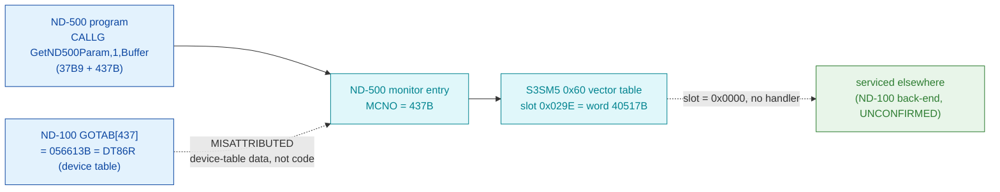

# MON 437B (octal) - GetND500Param (5PAGET)

Gets the five per-background-user parameters that record why the last ND-500
program terminated (user / directory index, terminal device, error code, and two
user-defined words); the companion [MON 436B SetND500Param](../436B-SetND500Param/)
sets them. It is an **ND-500 monitor call** (manual: ND-500 only, not callable from
the ND-100 side).

**Status:** the S3SM5 numeric vector slot for 437B is **byte-proven empty** (slot
`0x029E` = `0x0000`, inside the `422B`-`440B` zero run), so **no handler code
exists in the carved `030-S3SM5` segment**; the ND-100 `GOTAB[437]` read is a
**coincidental hit into the device-table** (`DT86R`), not a handler; and the actual
servicing point is **NOT LOCATED / UNVERIFIED**. All addresses/values are **octal**
unless a `0x` prefix or `(dec)` marks them hex/decimal.

- **No code body:** this call has no worker in any carved segment - there is **no
  `.ASM` and no `.pseudo.c`** here. The table below documents the absence.
- **Bytes live once in** the canonical segment layer: [`../../segments-ref/`](../../segments-ref/)
  (segment `030-S3SM5`, load base `40000B`).

---

## Dispatch path



The dashed hop (`C -> D`) is where a real call would jump to its handler word; for
437B that word is `0x0000`, so no jump target exists inside `030-S3SM5`. The
`X -> B` hop marks the ND-100 GOTAB[437] read as a red herring - `056613B` is
`DT86R`, one entry of the regular device-table series (`DT01`..`DT99`, 11-word
stride), not a handler. Where the call is actually serviced is not carved here (see
[Honest caveats](#honest-caveats)).

---

## Code location (dispatch path)

`030-S3SM5` holds a numeric MON-dispatch vector table based at byte offset `0x60`.
The slot for MON number `N` is at byte `0x60 + 2*decimal(N)`. Byte offset ->
segment word address = load base `40000B` + `(offset / 2)` words.

| Role | Segment (full disasm) | Addr / slot | Byte offset (dec) | Symbol | Verdict |
|------|------------------------|-------------|-------------------|--------|---------|
| GOTAB[437] read (does NOT apply) | [commoncode.asm](../../segments-ref/SINTRAN-DATA_commoncode/SINTRAN-DATA_commoncode.asm) · [.hex](../../segments-ref/SINTRAN-DATA_commoncode/SINTRAN-DATA_commoncode.hex) | `071672B` (=071233B+437B) | 59252 | reads `056613B` = `DT86R` (device table) | **MISATTRIBUTED** - coincidental read into device-table data, not a handler |
| ND-500 monitor entry (numeric dispatch, `MCNO=437B`) | - (uncarved ND-500 resident) | n/a | n/a | ND-500 MON entry | **UNVERIFIED** |
| S3SM5 `0x60` vector slot for 437B | [030-S3SM5.asm](../../segments-ref/030-S3SM5/030-S3SM5.asm) · [.hex](../../segments-ref/030-S3SM5/030-S3SM5.hex) | word `40517B` (slot `0x029E`) | 670 | (empty) | **VERIFIED empty (`0x0000`)** |
| Worker body | none in `030-S3SM5` | n/a | n/a | expected ND-100 back-end (not located) | **UNVERIFIED** |

Slot byte offset = `0x60 + 2*decimal(437B)` = `96 + 2*287 = 670 (dec)` = `0x029E`.

**Verify by hand (empty S3SM5 slot):** `grep '^670 ' ../../segments-ref/030-S3SM5/030-S3SM5.hex`
-> `670  000` (and `671  000`); then
`dd if=../../../segments/030-S3SM5.bin bs=1 skip=670 count=2 | od -An -tx1` -> `00 00`.
The whole `422B`-`440B` slot run reads `0x0000`, while `410B`-`421B` and `446B`
hold non-zero handler words - so the empty slot is a genuine "no S3SM5 handler".

**Verify by hand (GOTAB[437] is device-table data):**
```
grep '^71672 ' ../../segments-ref/SINTRAN-DATA_commoncode/SINTRAN-DATA_commoncode.hex
# -> 71672  056613  135 213  59252     (value 056613B = DT86R)
grep -oE 'DT8[0-9][RW]=[0-7]+' ../../../../../../../SINTRAN/NPL-SOURCE/SYMBOLS/L07/SYMBOL-2-LIST.SYMB.TXT | sort -u
# -> DT85W=056600 DT86R=056613 DT86W=056626 DT87R=056641 ...  (11-word stride device table)
```

---

## Instruction walkthrough

There are **no instructions to walk** - the vector slot is `0x0000` (data, not a
jump target), so no worker body was carved and there is no `.ASM`. The ND-100
`GOTAB[437]` value (`DT86R`) is a device-table datafield, not code, so it is not
walked either. For a *populated* neighbour the ND-500 monitor would index the
`0x60` table and transfer to the 16-bit handler word found there
(e.g. `411B -> 0xBB38`, `446B -> 0xC1F0`); slots `422B`-`440B` are all `0x0000`.

---

## Parameter / register contract

From [`437B_GetND500Param.yaml`](../../../../../../../Developer/MON/calls/437B_GetND500Param.yaml)
and the manual (ND-860228.2 EN, p.259); **not** byte-proven here because no handler
was located.

| Field | Dir | Meaning | Verdict |
|-------|-----|---------|---------|
| call form | in | ND-500 `CALLG GetND500Param, 1, Buffer` (`37B9 + 437B`) | manual (inferred) |
| `Buffer` | out | 5-word array receiving: [0] user/dir index, [1] terminal device, [2] error code, [3][4] user-defined | manual (inferred) |
| availability | - | ND-500 only; not callable from the ND-100 side (see GetUserParam for the ND-100 equivalent) | manual (inferred) |
| handler slot | - | S3SM5 vector `0x029E` = `0x0000` (no ND-500 handler in this segment) | **VERIFIED (bytes)** |

---

## Honest caveats

**What is byte-proven:** the S3SM5 `0x60` vector slot for MON 437B, at byte offset
`670` (segment word `40517B`, slot `0x029E`), reads **`0x0000`** in the real
SINTRAN L bytes of `030-S3SM5.bin`. The whole `422B`-`440B` slot run is `0x0000`,
while `410B`-`421B` hold non-zero handler words - so the empty slot is a genuine
"no S3SM5 handler", not a carve artefact. Separately, the ND-100 `GOTAB[437]` read
(`056613B` = `DT86R`) is a **device-table datafield**, proven by its regular
`DT85W`/`DT86R`/`DT86W`/`DT87R` neighbours (11-word stride) - the same coincidental
device-table hit seen for the ND-500 call 410B (`DT74W`), not a handler.

**What is NOT proven:** where MON 437B is actually serviced. A `0x0000` S3SM5 slot
means "not routed to this segment"; the manual marks the call ND-500-only and points
the ND-100 side to `GetUserParam`, so the expected back-end is an ND-100-side
companion, but **that handler has not been located or carved**. Confirming the real
dispatch needs a live trace of an ND-500 `GetND500Param` call, or locating the
ND-100 back-end that consumes it. Until then this folder correctly holds **no code**.
This reconciles into one story: the S3SM5 *slot* is verified empty and the GOTAB
read is a verified misattribution, while the *worker* is unverified/absent -
consistent, not contradictory.

Method: [../../../../../EXTRACTING-RESIDENT-CODE.md](../../../../../EXTRACTING-RESIDENT-CODE.md) · dispatch reality:
[../../TASK-05-mismatches.md](../../TASK-05-mismatches.md) · master map: [../../MON-CALL-INDEX.md](../../MON-CALL-INDEX.md).
