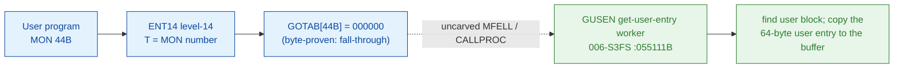

# MON 44B (octal) - GetUserEntry (GUSEN)

> **CORRECTED 2026-07-15 (byte-verified).** The worker + dispatch described below are on the
> DEBUNKED model and are WRONG. Byte truth from the carved L07 image:
> `MCTAB[44B] = 005664B = MRUSE=105010B` in segment 006-S3FS, reached by the real dispatch
> `MON 44B -> ENT14(072167B) -> GOTAB[44B]=MFELL(072114B) -> CALLP(032201B) -> MCTAB[44B]=MRUSE`.
> Any "GOTAB from commoncode" / "uncarved CALLPROC bridge" / "F16xx stub" / old worker name below
> is an artefact of the wrong table. Verified: `dd if=044-S3IDPIT.bin bs=1 skip=1896 count=2`
> -> `8a 08`. Cross-ref ../317B-ExecuteCommand/README.md and SINTRAN/CARVING-HANDOFF.md sec 3a.

Gets the user entry of a user: the name, the default file accesses, the pages in
use, the password, the table of friends, and more. Only user RT and user SYSTEM
may read the user entries of other users. Available to all programs on the ND-100
and ND-500.

**Status:** GOTAB dispatch head byte-proven as **fall-through** (`GOTAB[44B] =
000000`, no per-call stub); the `GUSEN` worker body is real SINTRAN L bytes in the
file-system segment `006-S3FS` (a `FILSYS-SYMBOLS` symbol). The worker is real
executable code with a two-entry SSK idiom (`GUSEN`/`NGUSN`), several
resident-worker calls, bit tests on the returned access word, an entry copy-out and
an error tail (it closes at `055173B`, bounded by the next routine prologue at
`055206B`). The exact `MON 44 -> worker` link crosses an uncarved kernel bridge
(see [Honest caveats](#honest-caveats)). All addresses/values are **octal**.

- **Full disassembly:** [`44B-GetUserEntry.ASM`](44B-GetUserEntry.ASM) - the actual code (the GUSEN worker body; there is no entry stub because the GOTAB slot is zero).
- **Bytes live once in** the canonical segment layer: [`../../segments-ref/`](../../segments-ref/).

---

## Dispatch path

The GOTAB slot is zero, so there is **no per-call entry stub**. The dashed hop
(`C -> E`) is the resident `MFELL`/`CALLPROC` fall-through second-level dispatch -
it is **not present in any carved segment**, so it is the one link that cannot be
followed statically.

---

## Code location (dispatch path)

Every row is a real region you can open. Byte offset = `(addr - loadbase)` in octal
words x 2; for `006-S3FS` (load base `26000B`) it is `(addr - 26000B) x 2`, and for
commoncode (load base `0`) it is the octal address x 2 (decimal).

| Role | Segment (full disasm) | Addr range (octal) | Byte offset | Symbol | Verdict |
|------|------------------------|--------------------|-------------|--------|---------|
| GOTAB[44] dispatch word | [commoncode.asm](../../segments-ref/SINTRAN-DATA_commoncode/SINTRAN-DATA_commoncode.asm) - [.hex](../../segments-ref/SINTRAN-DATA_commoncode/SINTRAN-DATA_commoncode.hex) | `071277B` (1 word) | 58750 | `GOTAB+44` = `000000` | **VERIFIED** (fall-through) |
| resident MFELL/CALLPROC bridge | - (uncarved) | - | - | `MFELL`/`CALLPROC` | **UNVERIFIED** |
| GUSEN worker body | [006-S3FS.asm](../../segments-ref/006-S3FS/006-S3FS.asm) - [.hex](../../segments-ref/006-S3FS/006-S3FS.hex) | `055111B-055173B` (code) + `055174B` (pad) + `055175B-055205B` (link cells) | 23698 | `GUSEN` | real bytes = **CODE**; body link **MISATTRIBUTED** |

The window is bounded strictly by the next routine prologue at `055206B` (61 words).
Words `055111B-055173B` are code, `055174B` is a one-word `ROP NOOP` pad, and
`055175B-055205B` are a pointer table (link cells) the `JPL I` / `JMP I`
indirections dereference - `nd100-dis` renders them as bogus instructions but they
are **data**.

**Verify by hand:** `grep '^55111 ' ../../segments-ref/006-S3FS/006-S3FS.hex`
-> byte offset `23698`; then
`dd if=../../../segments/006-S3FS.bin bs=1 skip=23698 count=2 2>/dev/null | od -An -tx1`
-> `f8 10` (the stored word = octal `174020`, a genuine `BSET ZRO SSK`
instruction, the GUSEN entry). The GOTAB slot itself:
`grep '^71277 ' ../../segments-ref/SINTRAN-DATA_commoncode/SINTRAN-DATA_commoncode.hex`
-> `71277  000000  000 000  58750`; then
`dd if=../../../resident/SINTRAN-DATA_commoncode.bin bs=1 skip=58750 count=2 2>/dev/null | od -An -tx1`
-> `00 00` (= `000000`, fall-through). `prove-mon.py 44` reads the same GOTAB zero.

---

## Instruction walkthrough

Full listing: [`44B-GetUserEntry.ASM`](44B-GetUserEntry.ASM). The body is the `GUSEN`
worker (there is no F16xx stub because `GOTAB[44] = 0`).

**Two-entry prologue (055111-055120)** - `055111 BSET ZRO SSK` clears the skip flag
(GUSEN entry), the sibling `055113 BSET ONE SSK` sets it (NGUSN alt entry); both
join at `055114 STD I 60` which saves the incoming `A/D` pair. `055115-055116` copy
the return link and frame pointer, `055117 SAB 7` and `055120 JPL I 55 -> [055175]`
call the resident prologue worker.

**Validation (055121-055150)** - `055121 BSKP ONE SSK` selects the status word by
entry; `055130 JPL I 47` calls a resident worker (returning an access descriptor in
`A`); the `BSKP` bit tests (`055132`, `055141`) branch to the error tail with the
standard codes `26` / `147`; `055147 JPL I 31 -> [055200]` finds the user block.

**Entry copy-out (055151-055166)** - `055151 LDA ,X 25` reads a flag word; `055152
BSKP ONE 170 DA` branches on bit 15; on the main path `055161 JPL I 21 -> [055202]`
copies the user entry to the caller's buffer (`SAT 20` = transfer/access flag);
`055166 JPL I 16 -> [055204]` finishes.

**Success + error return (055167-055173)** - `055167 MIN ,B 4` advances the return;
`055170 SAA -7` loads a standard error code and `055171 JMP I 14 -> [055205]`
returns indirectly. The error tail `055172-055173` stores the error code first.

---

## Parameter / register contract

Manual-side names/types are from [`44B_GetUserEntry.yaml`](../../../../../../../Developer/MON/calls/44B_GetUserEntry.yaml).

| Reg / field | Dir | Meaning | Verdict |
|-------------|-----|---------|---------|
| `A` (Buff) | in | address of a 64-byte buffer to receive the user entry (`MAC` `LDA (BUFF`) | inferred (manual) |
| `X` (UserName) | in | address of a string holding the user name; may include directory name, e.g. `PACK-ONE:P-HANSEN` (`MAC` `LDX (USER`) | inferred (manual) |
| `B+6` | internal | SSK-selected status word (`STA ,B 6` / `STZ ,B 6`) | VERIFIED (bytes); meaning inferred |
| access word bit 15 | internal | branch on the returned descriptor (`BSKP ZRO 170 DA` / `BSKP ONE 170 DA`) | VERIFIED (bytes); meaning inferred |
| error return | out | standard error code in `A` (`055170 SAA -7`, tail codes `26`/`147`) | VERIFIED (bytes); code value inferred |

The worker's register staging and stores are VERIFIED from bytes, but the mapping
onto the user-visible buffer / name contract lives in the caller-side `MON 44`
wrapper and the uncarved CALLPROC frame, so the contract is **inferred**, not
byte-proven here.

---

## Pseudo-code (for an emulator)

See **[`44B-GetUserEntry.pseudo.c`](44B-GetUserEntry.pseudo.c)** - a pseudo-C model of
the handler for emulator authors. The control flow (the SSK two-entry idiom, the
resident-worker calls, the bit tests, the entry copy-out and the error tail) is
byte-verified; the register/field semantics are inferred from the manual and the
code shape.

Every instruction in the pseudo-code is translated against the canonical
[ND-100 instruction semantics reference](../../instruction-semantics/ND100-INSTRUCTION-SEMANTICS.md)
(`BSET ZRO/ONE SSK` skip-flag set/clear, `RADD CLD` copy idiom, `RADD SB DA` /
`RADD SX DA` register add, `BSKP` bit test, `SKP IF DX EQL 0`, `MIN ,B` increment
and skip, `JPL I`/`JMP I` indirect call/return, addressing-mode effective
addresses).

---

## Honest caveats

**What is byte-proven:** `GOTAB[44B] = 000000` (level-14 dispatch, a fall-through
with no per-call vector; `prove-mon.py 44` reads commoncode file byte
`0xe57e = 00 00`); the `GUSEN` worker body at `055111B` in `006-S3FS` is real code
(first word `174020B = BSET ZRO SSK` matches the disassembly); and it is a
get-user-entry routine (find-user-block call, entry copy-out, standard error tail),
consistent with GetUserEntry.

**Which segment and why:** `GUSEN=055111B` is a `FILSYS-SYMBOLS` symbol, so it lives
in the file-system segment `006-S3FS` (the same segment that carries the
directory/user workers). The window `055111B-055205B` is bounded strictly by the
next routine prologue at `055206B` (61 words): `055111-055173` are code, `055174` is
a `ROP NOOP` pad, and `055175-055205` are the `JPL I`/`JMP I` link-cell table.

**What is NOT proven:** the link from the zero GOTAB slot to the `GUSEN` worker.
Because the vector is zero there is no stub to disassemble and no pointer to
dereference; dispatch drops into the resident `MFELL`/`CALLPROC` second-level path,
which lives in an **uncarved overlay**. So the `MON 44 -> GUSEN` attribution rests
on the `GUSEN` symbol name (Get USer ENtry) + the matching behaviour, not a followed
pointer - hence **MISATTRIBUTED** in the strict sense. The worker's `JPL I`
indirections target the link cells `055175..055205`, whose runtime targets are not
resolved here. Confirming the dispatch link needs a live trace: issue a real
`MON 44`, single-step the level-14 fall-through into the resident `CALLPROC`, and
confirm P lands on `GUSEN = 055111`.

Method: [../../../../../EXTRACTING-RESIDENT-CODE.md](../../../../../EXTRACTING-RESIDENT-CODE.md) - dispatch reality:
[../../TASK-05-mismatches.md](../../TASK-05-mismatches.md) - master map: [../../MON-CALL-INDEX.md](../../MON-CALL-INDEX.md).
