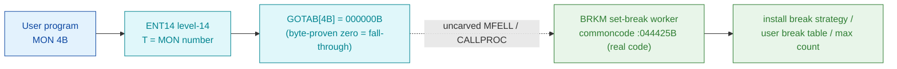

# MON 4B (octal) - SetBreak (BRKM)

Sets the **break characters** for a terminal. A program normally waits for input; when a break
character is typed the program restarts (most subsystems break on the RETURN-key). Break strategy
selects a predefined or user-defined 128-bit break table (`<0` none, `0` all, `1` control chars,
`2` MAC, `3-6` system, `7` user table, `8` last user table, `9` max chars only), with an optional
max-character count. For RT programs a logical device number selects the terminal. This is an ND-100
monitor call.

**Status:** `partial`. `GOTAB[4B] = 000000B` (byte-proven **zero**) is a **fall-through**: there is
**no** entry stub for MON 4 in overlay `025-S3IRPIT`. Level-14 dispatch falls through the resident
`MFELL`/`CALLPROC` machinery (uncarved) to the worker. The named worker for this call,
`BRKM = 044425B` in resident commoncode, **is** real executable code (the SetBreak entry of the shared
break/echo terminal-message module). But with `GOTAB[4]=0` there is no byte-followable dispatch, and the
fall-through `MFELL/CALLPROC -> BRKM` hop is uncarved, so `BRKM` is attached by symbol **name** only
(see [Honest caveats](#honest-caveats)). All addresses/values are **octal**.

- **Full disassembly:** [`4B-SetBreak.ASM`](4B-SetBreak.ASM) - the fall-through note + the BRKM worker body.
- **Bytes live once in** the canonical segment layer: [`../../segments-ref/`](../../segments-ref/).

---

## Dispatch path

The dashed hop (`C ⇢ D`) is the resident `MFELL`/`CALLPROC` fall-through - **not present in any carved
segment**. Because `GOTAB[4]=0` there is no stub and no pointer word to follow; the transfer to the real
set-break routine is resolved at runtime. `BRKM` (D) is the named commoncode worker for this call, and
it **is** real executable code - but the link from the fall-through dispatch to it is not
byte-followable.

---

## Code location (dispatch path)

Every row is a real region you can open. Byte offset = `(addr - loadbase)` in octal words x 2; for
commoncode (load base `0`) the byte offset is simply `octal-addr x 2` (decimal).

| Role | Segment (full disasm) | Addr range (octal) | Byte offset | Symbol | Verdict |
|------|------------------------|--------------------|-------------|--------|---------|
| GOTAB[4] dispatch word | [commoncode.asm](../../segments-ref/SINTRAN-DATA_commoncode/SINTRAN-DATA_commoncode.asm) · [.hex](../../segments-ref/SINTRAN-DATA_commoncode/SINTRAN-DATA_commoncode.hex) | `071237B` (1 word) | 58686 | `GOTAB+4` = `000000B` | **VERIFIED** (zero = fall-through) |
| resident MFELL / CALLPROC | - (uncarved) | - | - | `MFELL`/`CALLPROC` | **UNVERIFIED** |
| BRKM worker body | [commoncode.asm](../../segments-ref/SINTRAN-DATA_commoncode/SINTRAN-DATA_commoncode.asm) · [.hex](../../segments-ref/SINTRAN-DATA_commoncode/SINTRAN-DATA_commoncode.hex) | `044425B-044537B` (75 words) | 37418 | `BRKM` | real bytes = **CODE**; body link **MISATTRIBUTED** |

**Verify by hand:** the GOTAB word:
`grep '^71237 ' ../../segments-ref/SINTRAN-DATA_commoncode/SINTRAN-DATA_commoncode.hex`
-> `71237  000000  000 000  58686` (the GOTAB word = `000000B`, a fall-through); then
`dd if=../../../resident/SINTRAN-DATA_commoncode.bin bs=1 skip=58686 count=2 2>/dev/null | od -An -tx1`
-> `00 00` (a big-endian word = octal `000000`). For the BRKM worker first word:
`grep '^44425 ' ../../segments-ref/SINTRAN-DATA_commoncode/SINTRAN-DATA_commoncode.hex`
-> `44425  000200  000 200  37418`; then
`dd if=../../../resident/SINTRAN-DATA_commoncode.bin bs=1 skip=37418 count=2 2>/dev/null | od -An -tx1`
-> `00 80` (= octal `000200`, BRKM's first word - a real `STZ -200` instruction, confirming the region
is code). `prove-mon.py 4` reports the same `GOTAB[4]=000000 -> FALL-THROUGH`.

---

## Instruction walkthrough

Full listing: [`4B-SetBreak.ASM`](4B-SetBreak.ASM).

**GOTAB[4] dispatch word (071237)** - a single zero word. `GOTAB[4]=0` means MON 4 has no direct handler
stub in `025-S3IRPIT`; level-14 dispatch falls through the resident `MFELL`/`CALLPROC` machinery to the
worker. There are no stub bytes to list (contrast MON 3, which routes through the `F1610` stub).

**BRKM worker body (044425-044537)** - this **is** real executable code (label `BRKM`, next peer worker
`ECHOM=044540B`). It sets up I/O (`044426 IOT 1000`), runs an indirect-indexed scan loop
(`044430 LDA I ,B ,X -37`, `044432 SKP IF DA UEQ ST`, `044442 JMP -12 -> 044430`), builds the
break-table words with index math (`MPY ,B -44`, `STA ,B -42/-43/-41`), calls shared terminal-message
helpers (`044500 JPL I 112 -> [044612]`, `044513 JPL I 73 -> [044606]`) and returns through the frame
pointer (`044506 JMP I ,B -30`). `CTRMA/PL007/CTR2M/PL008/REECE/REECT/TMMT1/SSSLE/SSLEA` are internal
labels inside this flow. It is the SetBreak **entry** into the shared break/echo module; it also
branches out of the window (`044443 JMP 150 -> 044613`, the shared `PL009` block), so the window is the
named SetBreak entry region, not a fully self-contained subroutine.

---

## Parameter / register contract

Manual-side names/types are from [`4B_SetBreak.yaml`](../../../../../../../Developer/MON/calls/4B_SetBreak.yaml).

| Reg / field | Dir | Meaning | Verdict |
|-------------|-----|---------|---------|
| `T` (DeviceNo) | in | terminal's logical device number; only used by RT programs (`MAC` example `LDT DEVNO`) | inferred (manual) |
| `A` (BreakStrategy) | in | `<0`=none, `0`=all, `1`=control, `2`=MAC, `3-6`=system, `7`=user table, `8`=last user, `9`=max chars (`LDA STRAT`) | inferred (manual) |
| `X` (Table) | in | address of an 8-word (128-bit) user break table; used only when `BreakStrategy=7` (`LDX (TABLE`) | inferred (manual) |
| `A`/`D` (NoOfChar) | in | max characters before break; dummy for strategies 0/1/2 (`LDA NOCHR` / `COPY SA DD`) | inferred (manual) |
| error return | out | standard error code (appendix A) | inferred (manual) |

The worker's register staging (`IOT 1000`, the `LDA I ,B ,X -37` scan, the `MPY ,B -44` index math,
the shared-helper `JPL I` calls) is VERIFIED from bytes, but the mapping onto the user-visible
device/strategy/table/count contract lives in the caller-side `MON 4` wrapper and the uncarved
`MFELL`/`CALLPROC` frame, so the contract is **inferred**, not byte-proven here.

---

## Pseudo-code (for an emulator)

See **[`4B-SetBreak.pseudo.c`](4B-SetBreak.pseudo.c)** - a pseudo-C model for emulator authors. The
`BRKM` worker body is byte-verified; the field semantics (which input is device / strategy / table /
count) are inferred from the manual. The fall-through `MFELL/CALLPROC -> BRKM` bridge is modelled but
not proven. Every ND-100 instruction in the model is translated per the canonical
[`ND100-INSTRUCTION-SEMANTICS.md`](../../instruction-semantics/ND100-INSTRUCTION-SEMANTICS.md).

---

## Honest caveats

**What is byte-proven:** `GOTAB[4B] = 000000B` (level-14 dispatch; `prove-mon.py 4` reads commoncode
file byte `0xe53e = 00 00 = 000000`, a fall-through). The `BRKM` worker at `044425B` is real code - its
first word `000200B` is a genuine `STZ -200` instruction, and the 75-word block (`044425-044537`,
bounded by the next peer worker `ECHOM=044540B`) has coherent scan loops, index math, shared-helper
calls and a frame-pointer return.

**What is NOT proven:** that `BRKM=044425B` is the executable worker for MON 4, and the link from the
fall-through dispatch to it. With `GOTAB[4]=0` there is no stub and no pointer word to follow; the
transfer goes through the resident `MFELL`/`CALLPROC`, which lives in an **uncarved overlay**, so the
real set-break routine is not reachable from these bytes. Attributing the call body to `BRKM` rests on
the symbol **name** (`BRKM` = BReaK Monitor, matching the `4B` short name) plus its position, not a
followed pointer - hence `partial` (fall-through dispatch head; worker by name). The worker is also an
entry into a larger shared break/echo module: it calls/branches into shared cells
(`044606/044612/044613`) past the carved window, so the window is the named entry region, not a fully
self-contained subroutine.

This reconciles into one story: the dispatch head is a proven zero (`GOTAB[4]=0`, fall-through); the
real transfer is the uncarved `MFELL`/`CALLPROC`; and `BRKM` is a real set-break entry whose attribution
to MON 4 is by name, not by a followed link. Confirming the actual worker needs a live trace (break on a
real `MON 4`, single-step through `MFELL`/`CALLPROC`, and record that P lands on `BRKM=044425`).

Method: [../../../../../EXTRACTING-RESIDENT-CODE.md](../../../../../EXTRACTING-RESIDENT-CODE.md) · dispatch reality:
[../../TASK-05-mismatches.md](../../TASK-05-mismatches.md) · master map: [../../MON-CALL-INDEX.md](../../MON-CALL-INDEX.md).
