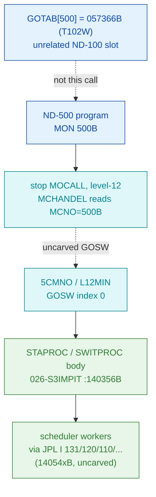

# MON 500B (octal) — StartProcess (STAPROC)

Starts an ND-500 process identified by a process number plus a magic/reservation word. It
shares one code body with SwitchProcess (`SWITP`) — both enter the same word `140356B` — and
with the stop/next-process branch (`NSTOP` at `140511B`); the body validates the process
number, compares the stored magic word, then dispatches resident ND-500 level-12 scheduler
workers.

**Status:** handler body is real SINTRAN L bytes, symbol-pinned (`STAPR=SWITP=140356B`); the
`MON 500B → handler` dispatch is an ND-500 **level-12 GOSW** that no tool here byte-proves, and
`GOTAB[500]` is an unrelated ND-100 slot (see [Honest caveats](#honest-caveats)). All
addresses/values are **octal**.

- **Full disassembly:** [`500B-StartProcess.ASM`](500B-StartProcess.ASM) — the actual handler body (`140356B–140515B`).
- **Bytes live once in** the canonical segment layer: [`../../segments-ref/`](../../segments-ref/).

---

## Dispatch path

The dashed hop (`B ⇢ C`) is the ND-500 level-12 GOSW branch — **not byte-proven by any tool
here**. `GOTAB[500]` is shown only to say plainly that it is *not* the StartProcess handler.

---

## Code location (dispatch path)

Every row that is carved is a real region you can open. Byte offset = `(addr − loadbase)` in
octal words × 2.

| Role | Segment (full disasm) | Addr range (octal) | Byte offset | Symbol | Verdict |
|------|------------------------|--------------------|-------------|--------|---------|
| GOTAB[500] slot (NOT this call) | [commoncode.asm](../../segments-ref/SINTRAN-DATA_commoncode/SINTRAN-DATA_commoncode.asm) · [.hex](../../segments-ref/SINTRAN-DATA_commoncode/SINTRAN-DATA_commoncode.hex) | `071733B` (1 word) | 59318 | `GOTAB+500` = `057366B` (`T102W`) | **MISATTRIBUTED** — unrelated ND-100 handler; ND-500 calls are not GOTAB-dispatched |
| Level-12 GOSW dispatch | — (uncarved) | — | — | `5CMNO` / `L12MIN` GOSW idx 0 | **UNVERIFIED** — no tool byte-proves the GOSW word |
| STAPROC / SWITPROC body | [026-S3IMPIT.asm](../../segments-ref/026-S3IMPIT/026-S3IMPIT.asm) · [.hex](../../segments-ref/026-S3IMPIT/026-S3IMPIT.hex) | `140356B–140515B` (96w) | 72156 | `STAPR`=`SWITP`=`140356B`; `NSTOP`=`140511B` | **VERIFIED** — symbol-pinned; bytes match canonical |
| Shared scheduler / return workers | [026-S3IMPIT.asm](../../segments-ref/026-S3IMPIT/026-S3IMPIT.asm) (targets past body) | `~140543B–140560B` | not carved | `JPL I 131/120/110/107/106/101/102/66/76/62/44/35` | **UNVERIFIED** — worker bodies not carved |

**Verify by hand:** `grep '^140356 ' ../../segments-ref/026-S3IMPIT/026-S3IMPIT.hex` → byte offset
`72156`; then `dd if=../../../segments/026-S3IMPIT.bin bs=1 skip=72156 count=8 | od -An -tx1` →
`52 6e f7 40 c6 c2 52 6c` (= octal `051156 173500 143302 051154 …`, the `STAPR` entry). Symbols:
`grep -iE 'STAPR|SWITP|NSTOP' ../../segments-ref/026-S3IMPIT/026-S3IMPIT.symbols.txt`.

---

## Instruction walkthrough

Full listing: [`500B-StartProcess.ASM`](500B-StartProcess.ASM). `I nn` = indirect through the
pointer word at frame offset `nn`; those pointer words live just past the code (targets like
`140543B`) and are the shared-worker entry addresses.

**Entry prologue + bounds check (140356–140366)** — `LDT I 156` / `AAX 100` / `LDDTX` fetch the
descriptor-table limit pair; `SKP IF DT LST SA` and `SKP IF DT MGRE SA` are a two-sided range test
on the caller's process number. Failing either side does `JMP 17 → 140405` (return/error block).

**Index + magic compare (140367–140404)** — `SUB I 146` normalises the number, `MPY 147` / `ADD 147`
scale it by descriptor size; the code follows into the descriptor, loads the stored magic/reservation
word, and `SKP IF DA EQL SD` compares it. A mismatch (`JMP 3 → 140405`) is the classic "illegal
process" rejection (`EILPROC`-style). `LDA ,X 1` then loads the state field; `JAF 6 → 140412` takes
the active-process path if it is non-zero.

**Return / error block (140405–140411)** — three consecutive indirect entries through pointer `134`
(`JPL I 134 → 140543/140544`, `JMP I 134 → 140545`) implement the multi-way (normal / skip / error)
return convention: the pointed worker sets status and performs the MON skip-return.

**Active-process main path (140412–140455)** — inspects a descriptor bit (`BSKP ONE 60 DD`),
dispatches on a mode selector (`SAT 13` vs `SAT 16` — meaning inferred), and calls a chain of
resident scheduler workers via pointer words `131/120/110/107/106/101/102`. `SAA 1` before the `102`
calls looks like a "start" flag. `RAND 0 0` words are alignment/no-op fill between call clusters.

**Alternate / NSTOP tail path (140456–140515)** — `BSET ONE 170 DA` sets a status bit; `NSTOP`
(`140511B`) is the stop / next-process branch that shares this body. The carve deliberately extends
through it so every direct branch resolves inside the file; the window ends at `140515B`, one word
before the next named symbol `SBTPH=140515B`.

---

## Parameter / register contract

| Reg / field | Dir | Meaning | Verdict |
|-------------|-----|---------|---------|
| ND-500 process number | in | caller's process id in `A`; range-checked at `140356–140366` | VERIFIED (bounds test in bytes) |
| Magic / reservation word | in | compared with stored descriptor word at `140400–140402` | VERIFIED (compare + reject branch) |
| `A` (entry) | in | carries the process number into the bounds/index math (`LDDTX`/`SUB`/`MPY`) | VERIFIED (bytes) |
| Mode selector (13 / 16) | internal | selects start vs switch behaviour at `140420–140425` | inferred (numeric constants; meaning not proven) |
| Status / result | out | set by the shared return workers via pointer `134` / `35` | worker call VERIFIED; exact code inferred (bodies uncarved) |
| Skip return | out | multi-way return through pointer-`134`/pointer-`35` workers | VERIFIED (`JPL I` / `JMP I` return funnel) |
| Error (illegal process) | out | magic-mismatch / out-of-range → return block `140405B` | path VERIFIED; exact error code (`EILPROC`?) set in an uncarved worker — inferred |

The ND-500 message-buffer field names (`NPROC`, `Status`, `EILPROC`, `OKMONICO`) are behaviour
hints from the NPL source revision, not proven from these L bytes. The bytes prove the *shape*
(bounds check, magic compare, worker dispatch, skip-return); the field offsets and error-code
constants live in workers this file does not contain.

---

## Pseudo-code (for an emulator)

See **[`500B-StartProcess.pseudo.c`](500B-StartProcess.pseudo.c)** — a pseudo-C model of the handler
for emulator authors. Control flow (bounds check → index → magic compare → state fork → worker
dispatch → skip-return) is byte-verified; the shared-worker semantics and the meaning of mode
selectors 13/16 are inferred from the call structure.

Every instruction is modelled against the canonical
[`../../instruction-semantics/ND100-INSTRUCTION-SEMANTICS.md`](../../instruction-semantics/ND100-INSTRUCTION-SEMANTICS.md).
The `LDDTX`/`LDATX`/`LDXTX`/`STATX` operations are **T/X physical (bank) transfers**: they read and
write the ND-500 message buffer at a 24-bit PHYSICAL address `EL = ((T & 0377) << 16) | (X & 0177777)`
that BYPASSES the MMU (section 5). `T` holds the message-buffer bank, so the process number and its
descriptor words are read FROM the message buffer via `phys[ELADDR(T,X)]`, not from ND-100 registers.

---

## Honest caveats

**What is byte-proven:** the 96 carved words are real SINTRAN L bytes; the local `.bin` and `.ASM`
agree word-for-word and match the canonical `026-S3IMPIT.bin` at byte offset `72156` (first word
`051156B`). The L07 symbol table pins `STAPR=140356B`, `SWITP=140356B`, `NSTOP=140511B` to this exact
window, so the handler identity is symbol-verified, and every direct branch resolves inside
`140356B–140515B` (control-flow complete).

**What is NOT proven — the dispatch bridge.** `prove-mon.py 500` reads **GOTAB** (the ordinary ND-100
MON dispatch table) and reports `GOTAB[500] = 057366B → T102W`. That is a *different, unrelated*
ND-100 handler that merely occupies slot 500; MON 500B is an ND-500 **level-12 GOSW** call
(`5CMNO`/`L12MIN`, GOSW index 0) and is **not** dispatched through GOTAB. No tool here byte-proves the
GOSW dispatch word, so the `MON 500B → STAPROC` link rests on the L07 symbol table + the carved bytes,
not a followed pointer. Confirming it needs a live trace (break on the level-12 ND-500 command handler
for `MCNO=500B`, single-step the GOSW, confirm P lands on `STAPR=140356B`).

**Worker bodies are outside this file.** All the deeper semantics — start vs switch vs stop, exact
status/error codes, the meaning of mode selectors 13/16 — live in the shared workers reached by
`JPL I 131/120/110/107/106/101/102/66/76/62/44/35` (pointer targets `14054xB–14056xB`), which are not
in this carve. This reconciles the two prior notes into one story: the *body* is proven, the *entry
into it* and its *called workers* are not.

Method: [../../../../../EXTRACTING-RESIDENT-CODE.md](../../../../../EXTRACTING-RESIDENT-CODE.md) · dispatch reality:
[../../TASK-05-mismatches.md](../../TASK-05-mismatches.md) · master map: [../../MON-CALL-INDEX.md](../../MON-CALL-INDEX.md).
