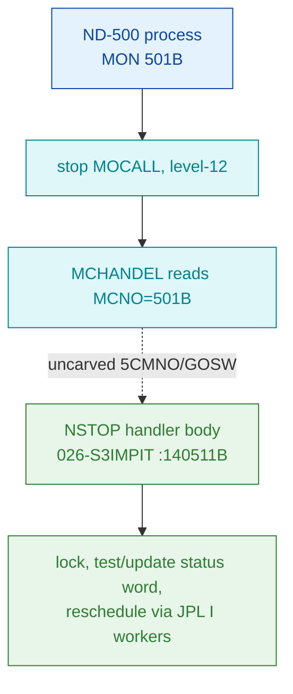

# MON 501B (octal) - StopProcess (NSTOP)

Stops an ND-500 process: takes the system lock, tests/updates the process status word,
and returns through `OKMON` (reschedule via `XACTR`) or updates the status via `WN5ST`,
releasing the lock (`SUNLO`) on every arm.

**Status:** handler body is real SINTRAN L bytes (symbol-span closed, all six `JPL I`
pointer words resolve to real L07 workers); the `MON 501B -> NSTOP` dispatch link crosses
the uncarved ND-500 level-12 GOSW table and is **asserted, not byte-proven** (see
[Honest caveats](#honest-caveats)). All addresses/values are **octal**.

- **Full disassembly:** [`501B-StopProcess.ASM`](501B-StopProcess.ASM) - the actual NSTOP handler region.
- **Bytes live once in** the canonical segment layer: [`../../segments-ref/`](../../segments-ref/).

---

## Dispatch path



The dashed hop (`C ⇢ E`) is the ND-500 level-12 message dispatch (`5CMNO` / GOSW code
table). It is **not byte-located** by the available tools - `prove-mon.py 501` indexes the
ordinary MON `GOTAB`, which this ND-500 call bypasses - so the GOSW-index -> NSTOP link
cannot be followed statically.

---

## Code location (dispatch path)

Every row is a real region you can open. Byte offset = `(addr − loadbase)` in octal words × 2.

| Role | Segment (full disasm) | Addr range (octal) | Byte offset | Symbol | Verdict |
|------|------------------------|--------------------|-------------|--------|---------|
| GOTAB[501] slot (NOT this handler) | [commoncode.asm](../../segments-ref/SINTRAN-DATA_commoncode/SINTRAN-DATA_commoncode.asm) · [.hex](../../segments-ref/SINTRAN-DATA_commoncode/SINTRAN-DATA_commoncode.hex) | `071734B` (1 word) | 59320 | `057401` = `T103R` (4-word stub) | **MISATTRIBUTED** - ND-500 calls bypass GOTAB; slot holds an unrelated stub |
| Level-12 GOSW dispatch (`5CMNO`) | — (uncarved) | — | — | `5CMNO`/GOSW | **UNVERIFIED** - dispatcher not in any carved window |
| NSTOP handler body | [026-S3IMPIT.asm](../../segments-ref/026-S3IMPIT/026-S3IMPIT.asm) · [.hex](../../segments-ref/026-S3IMPIT/026-S3IMPIT.hex) | `140511B–141026B` (206 words) | 72338 | `NSTOP` (next symbol `DVIO=141027B`) | real bytes; link **MISATTRIBUTED** |

**Verify by hand:** `grep '^140511 ' ../../segments-ref/026-S3IMPIT/026-S3IMPIT.hex` → byte offset `72338`;
then `dd if=../../../segments/026-S3IMPIT.bin bs=1 skip=72338 count=8 | od -An -tx1` → `ba 23 c9 00 52 11 f7 ff`
(= octal `135043 144400 051021 173777 …`, the `JPL I 43 → SLOCK` entry). The GOTAB stub is
`grep '^71734 ' ../../segments-ref/SINTRAN-DATA_commoncode/SINTRAN-DATA_commoncode.hex` → `057401` = `T103R`, not NSTOP.

---

## Instruction walkthrough

Full listing: [`501B-StopProcess.ASM`](501B-StopProcess.ASM). Every `JPL I <d>` below reaches
a **pointer word** at `140511+d`; each was cross-checked against the L07 tables and every one
resolves to a real resident worker:

| Pointer word | Value | L07 symbol | Role |
|--------------|-------|------------|------|
| `140544` | `145466` | `XACTR` | activate/reschedule ND-500 process |
| `140552` | `023025` | `OKMON` | normal monitor return |
| `140554` | `023706` | `SLOCK` | take system lock |
| `140557` | `024041` | `SUNLO` | release system lock |
| `140562` | `023670` | `WN5ST` | ND-500 process status worker |

**Entry / prologue (140511–140521)** - lock, then test-and-set a status bit:
```
140511  135043  JPL I 43       ; CALL SLOCK  (ptr 140554 = 023706)
140513  051021  LDT I 21       ; T <- status-table pointer (indirect)
140514  173777  AAX -1
140515  143300  LDATX          ; A <- status word for this process (T indexed by X)
140516  175375  BSKP ONE 170 DA ; skip if the tested status bit is already 1
140517  124010  JMP 10         ; -> 140527 (bit already set: alternate arm)
140520  174175  BSET ZRO 170 DA ; else clear that bit in A
140521  143304  STATX          ; store status word back
```
The classic ND-100 "load status word / test a flag bit / conditionally set-or-clear / store
back" idiom. The README maps this to `55REP`/STOPPED handling; that semantic mapping is
**inferred** (see contract).

**Clean exit vs status-update arms (140522–140533)**:
```
140523  135034  JPL I 34       ; CALL SUNLO   (ptr 140557)  release lock
140524  135026  JPL I 26       ; CALL OKMON   (ptr 140552)  normal return
140525  135017  JPL I 17       ; CALL XACTR   (ptr 140544)  reschedule
140527  135030  JPL I 30       ; CALL SUNLO   (bit-already-set arm)
140532  135030  JPL I 30       ; CALL WN5ST   (ptr 140562)  update status
140533  125012  JMP I 12       ; indirect return through ptr word 140545
```
Both arms unlock (`SUNLO`) and finish by returning normally (`OKMON`/`XACTR`) or updating the
status word (`WN5ST`) - the shape of a "stop this process, or clear-and-restart it" routine.

**Body / loops (140563–140731)** - a second `SLOCK`-guarded block (`JPL I 147 -> 140732`)
drives two counted scans (`LDDTX` with `AAX 2` stride; `SAT -1` sentinel compare, `JAP`
loop-back) over a resident ND-500 process/message table. The table is not named by a symbol
inside the window, so its identity is **UNVERIFIED**.

**Pointer / constant tail (140732–141026)** - data, the address constants the `JPL I`/`JMP I`
words above dereference (`140732=SLOCK`, `140734=024041`, `140746=023670`, plus zero words at
`140750–140752`). Inside the symbol span (`< DVIO=141027`), so correctly part of NSTOP.

---

## Parameter / register contract

| Reg / field | Dir | Meaning | Verdict |
|-------------|-----|---------|---------|
| System lock | internal | taken via `SLOCK`, released via `SUNLO` on every arm | VERIFIED (ptr words 140554/140557) |
| Process status word | in/out | `LDATX` load, `BSKP ONE` test, `BSET` set/clear, `STATX` store; finalized via `WN5ST` | VERIFIED (instr seq + ptr 140562) |
| ND-500 process reschedule | out | `XACTR` called on the "was-clear" arm | VERIFIED (ptr 140544) |
| Normal return | out | via `OKMON` and indirect `JMP I 12` | VERIFIED (ptr 140552) |
| `55REP` / restart-vs-stop semantic | in | which status bit is tested and its meaning (STOPPED vs clear-and-restart) | inferred - behaviour hint only; the `170 DA` bit field is byte-verified, its name is not |
| `ZAREG`/`ZXREG`/`ZTREG` entry values | in | how the level-12 dispatcher passes the target process id/message | inferred - dispatcher not in this window |
| Skip / error return | out | none observed in the window; exits via `OKMON`/indirect `JMP` | inferred |

---

## Pseudo-code (for an emulator)

See **[`501B-StopProcess.pseudo.c`](501B-StopProcess.pseudo.c)** - a pseudo-C model of the
handler for emulator authors. The lock pairing, the two status-bit arms, and the six pointer-word
call targets are byte-verified; the status-bit meaning and the iterated-table semantics are
inferred from the call structure.

Every instruction is modelled against the canonical
[`../../instruction-semantics/ND100-INSTRUCTION-SEMANTICS.md`](../../instruction-semantics/ND100-INSTRUCTION-SEMANTICS.md).
The `LDATX`/`STATX`/`LDDTX`/`STDTX` operations are **T/X physical (bank) transfers**: they read and
write the ND-500 message buffer / process table at a 24-bit PHYSICAL address
`EL = ((T & 0377) << 16) | (X & 0177777)` that BYPASSES the MMU (section 5). `T` holds the bank, so
the status word acted on is read/written via `phys[ELADDR(T,X)]`, not in an ND-100 register. Note
the `140516 BSKP ONE 170 DA` skip **fires when bit15 is SET** (bit-set → clear-and-restart arm,
bit-clear → report arm); the pseudo-C follows that polarity.

---

## Honest caveats

**What is byte-proven** (independently of dispatch): the handler bytes at `140511B` are genuine,
complete NSTOP code. (a) The first on-disk word `0xBA23` big-endian = `135043` octal = `JPL I 43`
matches the `.ASM`. (b) The 206-word window equals exactly one L07 symbol span: `NSTOP=140511`,
next symbol `DVIO=141027` (`141027 − 140511 = 316B = 206` words) - no truncation, no overrun.
(c) All six indirect `JPL I` pointer words resolve to real L07 workers (SLOCK/SUNLO/OKMON/WN5ST/XACTR).

**What is NOT proven:** the `MON 501B -> NSTOP` dispatch link. `prove-mon.py 501` reports the
call is "NOT dispatched via the ND-100 GOTAB"; `GOTAB[501] = 057401 = T103R` (a 4-word stub), not
NSTOP. That is expected for an ND-500 level-12 message call - it is routed through the `5CMNO`/GOSW
message-code table, which sits in an **uncarved** part of the resident driver - but it means the
"level-12 GOSW index" claim is asserted, not byte-followed. Confirming it needs a live trace
(intercept a real ND-500 MON 501B and confirm P lands on `NSTOP=140511`).

**Naming:** the folder is named "StopProcess" (descriptive). The byte-truth L07 symbol at
`140511B` is `NSTOP` (`SYMBOL-2-LIST.SYMB.TXT:3929`); there is **no** symbol `NSTOPROC` in L07.

**Overlay note (cosmetic):** `prove-mon.py` reads the low-load `025-S3IRPIT.bin`; the NSTOP bytes
here come from the sibling PIT copy `026-S3IMPIT.bin` (both load `32000B`) at the overlaid virtual
`140511B`, outside the `025-S3IRPIT` low range - so `prove-mon` could not surface NSTOP even if
GOTAB pointed at it. The `.bin`/`.ASM` are big-endian as carved; the disassembly requires a
byte-swap (a tooling requirement, never applied to the `.bin`).

Method: [../../../../../EXTRACTING-RESIDENT-CODE.md](../../../../../EXTRACTING-RESIDENT-CODE.md) §7.6/7.7 · dispatch reality:
[../../TASK-05-mismatches.md](../../TASK-05-mismatches.md) · master map: [../../MON-CALL-INDEX.md](../../MON-CALL-INDEX.md).
