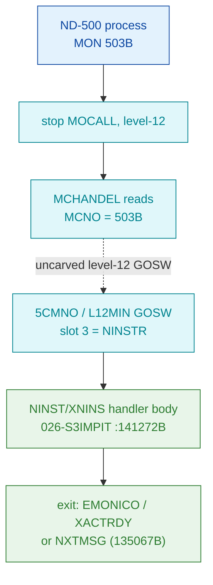

# MON 503B (octal) - InputString (NINST / XNINS)

Reads a line of input into the calling ND-500 process and returns the number of
bytes actually read - the input-only counterpart of the fused terminal
output+input call [`511B-DVIO`](../511B-DVIO/README.md) (whose input phase,
`XNINSTR`, is this call's body). NPL name **DVINST**; ND-500 System-Monitor GOSW
handler name **NINSTR**. All addresses/values are **octal**.

**Status:** handler identity byte-proven (real SINTRAN L bytes at `NINST=141272B`,
extended worker `XNINS=141277B`; every indirect worker pointer resolves to a named
resident). The `MON 503B -> NINSTR` dispatch crosses an **uncarved level-12 GOSW**
table, so that one link stays UNVERIFIED (see [Honest caveats](#honest-caveats)).

- **Full disassembly:** [`503B-InputString.ASM`](503B-InputString.ASM) - the actual code (NINST/XNINS body + part-2 continuation + inline pools).
- **Bytes live once in** the canonical segment layer: [`../../segments-ref/`](../../segments-ref/).

---

## Dispatch path

MON 503B is an **ND-500 level-12 monitor call**. It is **not** dispatched through
the ND-100 monitor `GOTAB` - a `GOTAB[503]` probe is meaningless (`prove-mon.py 503`
reports "500-523B -> level-12 5CMNO GOSW; GOTAB[503] is meaningless"). It arrives at
the handler via the resident level-12 GOSW, slot 3 (`NINSTR`).

The dashed hop (`C -> E`) is the resident level-12 GOSW (`5CMNO-L12MIN`, slot 3) -
it is **not present in any carved segment**, so it is the one link that cannot be
followed statically. The GOSW-slot-3 -> `NINSTR` mapping is VERIFIED from NPL
(`MP-P2-N500.NPL` lines 1385-1389: `STAPROC, NSTOPROC, SWITPROC, NINSTR, ...`); the
runtime dispatch remains UNVERIFIED because the GOSW overlay is uncarved.

---

## Code location (dispatch path)

Every row is a real region you can open. Byte offset = `(addr - loadbase)` in octal
words x 2 (decimal). Handler load base = `32000B`.

| Role | Segment (full disasm) | Addr range (octal) | Byte offset | Symbol | Verdict |
|------|------------------------|--------------------|-------------|--------|---------|
| GOTAB[503] probe | — (ND-500 call, not GOTAB-dispatched) | — | — | (none) | **MISATTRIBUTED** - `prove-mon.py 503` reports GOTAB[503] meaningless |
| Level-12 GOSW dispatch | — (uncarved resident level-12) | `MCHANDEL` reads `MCNO=503B`; `5CMNO-L12MIN` slot 3 | — | `5CMNO` / `L12MIN` -> `NINSTR` | **UNVERIFIED** - dispatch mechanism, not carved |
| Level-12 restart tag | [026-S3IMPIT.asm](../../segments-ref/026-S3IMPIT/026-S3IMPIT.asm) · [.hex](../../segments-ref/026-S3IMPIT/026-S3IMPIT.hex) | `141266B` (1 word) | 73068 | `MO503=141266B` | **VERIFIED** (byte; restart tag just before NINST) |
| Input-string entry | [026-S3IMPIT.asm](../../segments-ref/026-S3IMPIT/026-S3IMPIT.asm) · [.hex](../../segments-ref/026-S3IMPIT/026-S3IMPIT.hex) | `141272B` | 73076 | `NINST=141272B` | **VERIFIED** |
| Extended worker entry | [026-S3IMPIT.asm](../../segments-ref/026-S3IMPIT/026-S3IMPIT.asm) · [.hex](../../segments-ref/026-S3IMPIT/026-S3IMPIT.hex) | `141277B` | 73086 | `XNINS=141277B` | **VERIFIED** |
| Part-2 continuation (MO600 tag) | [026-S3IMPIT.asm](../../segments-ref/026-S3IMPIT/026-S3IMPIT.asm) · [.hex](../../segments-ref/026-S3IMPIT/026-S3IMPIT.hex) | `141565B–141612B` | 73450 | `MO600` / `PT2OK` / `PT2AO` / `ERRFP` / `PT2YE` / `PT2ER` | **VERIFIED** (byte; internal restart tags, reached by the body's own direct jumps) |
| Handler body (closure) | [026-S3IMPIT.asm](../../segments-ref/026-S3IMPIT/026-S3IMPIT.asm) · [.hex](../../segments-ref/026-S3IMPIT/026-S3IMPIT.hex) | `141272B–141623B` (218 words) | 73076 | `NINST` .. pool end | **VERIFIED** (self-contained control flow) |

**Verify by hand:** `grep '^141272 ' ../../segments-ref/026-S3IMPIT/026-S3IMPIT.hex`
-> byte offset `73076`; then
`dd if=../../../segments/026-S3IMPIT.bin bs=1 skip=73076 count=8 | od -An -tx1`
-> `52 56 5a 56 f7 42 c6 c2` (= octal `051126 055126 173502 143302`, the NINST entry
`LDT I 126 / LDX I 126 / AAX 102 / LDDTX`).

---

## Instruction walkthrough

Full listing: [`503B-InputString.ASM`](503B-InputString.ASM). The 218-word window is
one self-contained routine (control-flow closure confirmed) with two embedded
**pointer/parameter pools** the disassembler mis-renders as instructions:
`141420B..141447B` and `141613B..141623B` are data (indirect-jump targets +
parameter words), not executable code.

**Indirect worker pointers, resolved against L07 symbols** - the identity proof.
Each pointer word resolves one-to-one to this call's worker set (the same family as
DVIO), confirming the body:

| Ptr word | Value | Symbol (L07, 5-char) | Worker |
|----------|-------|----------------------|--------|
| 141423 / 141620 | 023021 | `EMONI` | EMONICO - restart ND-500 proc with error |
| 141424 / 141621 | 145466 | `XACTR` | XACTRDY - reactivate ND-500 executor queue |
| 141425 / 141623 | 135067 | `NXTMS` | NXTMSG - handle next ND-500 message (exit) |
| 141426 | 147440 | `5GTDF` | 5GTDF - get terminal datafield |
| 141427 | 137167 | `NORMM` | NORMMC - non-terminal MON fallback |
| 141430 | 027212 | `SET12` | SET12 - level-12 setup helper (role inferred) |
| 141431 | 023624 | `GCPUD` | GCPUDF - get ND-500 CPU datafield |
| 141613 | 023670 | `WN5ST` | WN5STATUS - write ND-500 process status |

**Entry / terminal check (141272..141313)** - `141272 LDT I 126 / 141273 LDX I 126`
load the message-field base/index (indirect through `141420=004654`, `141421=011260`);
`141274..141276` index and fetch a control word. `141277 JAF 4` (this is the `XNINS`
entry) branches on that field. The error branch `141303..141307` loads `SAA 174`
(error `174`) then leaves via `EMONICO`/`XACTRDY`/`NXTMSG`. `141310..141313` store to
msg field `136B`, then `141312 JPL I -> 5GTDF` (get terminal datafield) with
`141313 JMP I -> NORMMC` as the not-a-terminal skip-return.

**Line-status check + setup (141314..141417)** - `141314..141317` test a
datafield status bit (`LDA,X 3 / BSKP ONE`); `141320..141321 JMP I -> NORMMC` on the
not-a-terminal case. `141322..141325 JPL I -> SET12` prepares the level-12 transfer.
`141326..141341` range/status-check the request; the error branch builds a code and
exits via `EMONICO`/`XACTRDY`. `141342..141417` scale field indices and build the
input-transfer descriptor (max-bytes and destination-array fields read from the
message buffer - layout inferred); the block ends `141417 JMP 31 -> 141450`, jumping
**over** the pool at `141420..141447`.

**Transfer processing part 2a (141450..141564)** - a `SAT`-driven decision ladder
(`SAT -1 / SAT 11 / SAT 7 / SAT 10`, each with `SKP IF DA EQL/MLST ST`) classifies
the current character/state and accumulates the running result in msg field `-11B`
(`STA,B -11`). `141514 SAA 14` marks the process, `JPL I -> WN5STATUS`.

**Part 2 continuation (141565..141612, MO600 tag)** - the finish/echo/error tags
`PT2OK=141567`, `PT2AO=141570`, `ERRFP=141574`, `PT2YE=141576`, `PT2ER=141600`
finalise the returned byte count (`STD` into a msg field), and select the exit
(`JPL I -> EMONICO`/`XACTRDY` on error tags, else `JMP I -> NXTMSG` via pool word
`141623=135067`). This block is reached by the body's **own** direct jumps
`141544 -> 141605` and `141562 -> 141571`, which is why the closed region extends to
`141623` (see caveats).

---

## Parameter / register contract

ND-500 monitor calls pass parameters in the **ND-500 message buffer** (indexed by
`5MBBANK` + field displacement), not in ND-100 A/T/X user registers. The register
use below is level-12 driver-internal.

| Item | Dir | Meaning | Verdict |
|------|-----|---------|---------|
| `X` / `T` (entry) | in | ND-500 message base + field index | VERIFIED (bytes: `LDT I 126 / LDX I 126` msg indexing) |
| open / LDN file number (msg) | in | source file/terminal to read from | inferred (reference manual; NPL DVINST - not isolatable in these bytes) |
| max bytes to read (msg) | in | destination buffer size / max input length | inferred (read in the 141342..141417 setup; exact field UNVERIFIED) |
| destination array (msg) | in | where the input line is written | inferred (message-buffer layout, not byte-isolated) |
| returned byte count (msg) | out | number of bytes actually read | inferred (finalised in the part-2 block, written to a msg field) |
| terminal datafield | in | fetched via `5GTDF`; `NORMMC` skip if not a terminal | VERIFIED (indirect ptr resolves to `5GTDF`/`NORMMC`) |
| Error `174` (`EC174`) | out | illegal parameter -> `EMONICO` | VERIFIED (`SAA 174` byte) |
| Error `316` | out | terminal line not connected | inferred (NPL only; not byte-isolated here) |
| Error `3` | out | end-of-file on nowait input | inferred (NPL/reference manual only) |
| Exit | out | `EMONICO`/`XACTRDY` (error restart) or `NXTMSG` (done) | VERIFIED (indirect ptrs resolve) |
| Skip-return | — | none in the ND-100 sense; control leaves via the workers above | VERIFIED (none in-window) |

---

## Pseudo-code (for an emulator)

The pseudo-C is grounded in the ND-100 instruction-semantics reference
[`../../instruction-semantics/ND100-INSTRUCTION-SEMANTICS.md`](../../instruction-semantics/ND100-INSTRUCTION-SEMANTICS.md):
the T/X transfers are 24-bit **physical** accesses `EL = ((T & 0377) << 16) | ((X + disp3) & 0177777)`
(T = the message-buffer bank, MMU-bypassed), and `RADD CLD Sx Dy` = `y = x`.

See **[`503B-InputString.pseudo.c`](503B-InputString.pseudo.c)** - a pseudo-C model of
the input-string worker for emulator authors. Control flow, the eight indirect
worker pointers (`EMONICO`, `XACTRDY`, `NXTMSG`, `5GTDF`, `NORMMC`, `SET12`,
`GCPUDF`, `WN5STATUS`), and the `SAA 174` error path are byte-verified; the
byte-count / buffer-copy arithmetic and the message-field layout are inferred from
the code structure and the reference manual (a different revision than L). ND-500
parameters are passed in the ND-500 message buffer, not in A/T/X.

---

## Honest caveats

**What is byte-proven:** the handler at `NINST=141272B` (with extended entry
`XNINS=141277B`) is real SINTRAN L code carved from `026-S3IMPIT` (load `32000B`).
Two independent anchors agree: (1) `NINST=141272` / `XNINS=141277` in the L07
symbol table, and (2) every indirect worker pointer resolves to exactly this call's
worker set (`EMONICO`, `XACTRDY`, `NXTMSG`, `5GTDF`, `NORMMC`, `SET12`, `GCPUDF`,
`WN5STATUS`). The illegal-parameter error path (`SAA 174 -> EMONICO`) is
byte-verified. The carved slice is byte-identical to the canonical segment (`dd`
above reproduces the entry words).

**Closure note (why the window is 141272..141623, past MO600=141565).** The body's
own direct jumps `141544 -> 141605` and `141562 -> 141571` land in the part-2 block
that begins at the `MO600=141565` tag. `MO600` is an **internal** level-12
restart/continuation tag (analogous to `MO503=141266` which sits just before
`NINST`), not a separate handler - the `PT2OK/PT2AO/PT2YE/PT2ER/ERRFP` symbols are
this routine's own finish/error labels. The genuinely next handler,
`MOVTA/GERRC=141624B` (MON 505 GetTrapReason), is **excluded**. So closing the
control flow to `141623` includes this routine's part-2 code plus its trailing
pointer pool (`141613..141623`) without swallowing a foreign routine.
`validate-mon-carves.py` confirms SIZE/CONTIG/CLOSURE with zero direct escapes.

**What is NOT proven:**
- **The dispatch.** MON 503 is an ND-500 level-12 call; it is not in `GOTAB`
  (`prove-mon.py 503` reports GOTAB[503] meaningless). The real path is the resident
  level-12 GOSW (`MCHANDEL` reads `MCNO`, `5CMNO-L12MIN` slot 3 = `NINSTR`), which is
  in an uncarved overlay and cannot be followed statically. The GOSW-slot-3 ->
  `NINSTR` mapping is VERIFIED from NPL; the runtime arrival is UNVERIFIED.
- **The exact parameter fields.** The open/file number, max-byte-count and
  destination-array message fields, and the returned byte-count write-back, are read
  from the ND-500 message buffer whose exact displacements are not byte-isolated in
  this window - marked inferred.
- **The NPL-only errors.** `316` (line not connected) and `3` (end-of-file on nowait
  input) come from the reference manual / NPL DVINST; only the `174` error is
  byte-proven here.
- **NPL is a different revision than L.** NPL names the routine `DVINST`/`NINSTR`;
  the L bytes place `NINST=141272` / `XNINS=141277`. Only the behaviour and worker
  names carry over - the worker names were re-verified against the L07 pointer words
  above.

Confirming the full chain needs a live trace (break at the level-12 GOSW on a real
ND-500 `MON 503`, single-step, confirm P lands on `NINST=141272`).

---

Method: [../../../../../EXTRACTING-RESIDENT-CODE.md](../../../../../EXTRACTING-RESIDENT-CODE.md) §7.6/7.7 · dispatch reality:
[../../TASK-05-mismatches.md](../../TASK-05-mismatches.md) · master map: [../../MON-CALL-INDEX.md](../../MON-CALL-INDEX.md).
