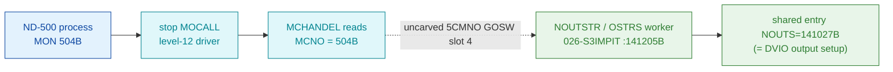

# MON 504B (octal) - OutputString (DVOUTS / NPL NOUTSTR)

Writes a string of bytes to a device or open file from an ND-500 process - the
pure output half of the DVIO output+input pair. All addresses/values are **octal**.

**Status:** handler body byte-proven (real SINTRAN L bytes at `OSTRS=141205B`, the
level-12 output-string restart worker; shared entry `NOUTS=141027B` = `DVIO`). The
`MON 504B -> NOUTSTR` GOSW-slot mapping is **VERIFIED-from-NPL**; the runtime
level-12 GOSW dispatch that reaches it is an **uncarved** kernel path, so the
`MON 504 -> OSTRS` link stays **UNVERIFIED** (see [Honest caveats](#honest-caveats)).

- **Full disassembly:** [`504B-OutputString.ASM`](504B-OutputString.ASM) - the actual code, the OSTRS worker region.
- **Bytes live once in** the canonical segment layer: [`../../segments-ref/`](../../segments-ref/).

---

## Dispatch path

MON 504B is an **ND-500 level-12 monitor call** (NPL name `DVOUTS`, System-Monitor
GOSW handler `NOUTSTR`). It is **not** dispatched through the ND-100 monitor
`GOTAB` - a `GOTAB[504]` probe lands on an unrelated datafield-pointer word
(spurious). It arrives at the worker via the resident level-12 GOSW
`5CMNO-L12MIN`, **slot 4** (base `STAPROC=500B`), VERIFIED from
`SINTRAN/NPL-SOURCE/NPL/MP-P2-N500.NPL` (`NOUTSTR` is the 5th name in the GOSW).

The dashed hop (`C -> D`) is the resident level-12 GOSW (`5CMNO-L12MIN`, slot 4) -
it is **not present in any carved segment**, so it is the one link that cannot be
followed statically. The GOSW-slot-4 -> `NOUTSTR` mapping IS proven from the NPL
source; only the runtime pointer-follow is unproven.

---

## Code location (dispatch path)

Every row is a real region you can open. Byte offset = `(addr - loadbase)` in octal
words x 2 (decimal). Handler load base = `32000B`.

| Role | Segment (full disasm) | Addr range (octal) | Byte offset | Symbol | Verdict |
|------|------------------------|--------------------|-------------|--------|---------|
| GOTAB[504] probe (spurious) | [commoncode.asm](../../segments-ref/SINTRAN-DATA_commoncode/SINTRAN-DATA_commoncode.asm) · [.hex](../../segments-ref/SINTRAN-DATA_commoncode/SINTRAN-DATA_commoncode.hex) | `071735B` reads `057414B` | 59322 | (datafield-pointer word, not code) | **MISATTRIBUTED** - ND-500 call is not in GOTAB |
| Level-12 GOSW dispatch | — (uncarved resident level-12) | `MCHANDEL` reads `MCNO=504B`; `5CMNO-L12MIN` slot 4 | — | `5CMNO` / `L12MIN` / `NOUTSTR` | **UNVERIFIED** (runtime) / GOSW slot **VERIFIED-from-NPL** |
| Shared output entry | [026-S3IMPIT.asm](../../segments-ref/026-S3IMPIT/026-S3IMPIT.asm) · [.hex](../../segments-ref/026-S3IMPIT/026-S3IMPIT.hex) | `141027B` (= `DVIO`) | 72750 | `NOUTS=141027B` (shared with `DVIO`) | **VERIFIED** (symbol) |
| OSTRS worker body | [026-S3IMPIT.asm](../../segments-ref/026-S3IMPIT/026-S3IMPIT.asm) · [.hex](../../segments-ref/026-S3IMPIT/026-S3IMPIT.hex) | `141205B–141266B` (EXIT) | 72970 | `OSTRS=141205B`; internal `PT5RS=141256B` | **VERIFIED** |
| Trailing slice words | [026-S3IMPIT.asm](../../segments-ref/026-S3IMPIT/026-S3IMPIT.asm) · [.hex](../../segments-ref/026-S3IMPIT/026-S3IMPIT.hex) | `141267B–141270B` | 73074 | next-region entry; `@141270B=141205B` (-> OSTRS) | **VERIFIED** (data; targets exact) |

**Verify by hand:** `grep '^141205 ' ../../segments-ref/026-S3IMPIT/026-S3IMPIT.hex` → byte offset `72970`;
then `dd if=../../../segments/026-S3IMPIT.bin bs=1 skip=72970 count=8 | od -An -tx1` → `cc 65 08 fe ba 13 ba 13`
(= octal `146145 004376 135023 135023 …`, the `OSTRS` entry `RADD CLD SL DA / STA -2 / JPL I 23 / JPL I 23`).

---

## Instruction walkthrough

Full listing: [`504B-OutputString.ASM`](504B-OutputString.ASM). The 52-word slice
is the `OSTRS` worker (`141205B..141266B`, closing at `EXIT`) plus two trailing
words carved in only to make one contiguous block.

**Entry / dispatch setup (141205..141231)** - `141205 RADD CLD SL DA / 141206 STA -2`
compose a value in A, then `141207 / 141210 JPL I 23` dispatch **indirectly** through
the pool at `141232..141233`. `141211..141225` index a datafield (`LDT I 22`, `AAX 37`,
`LDATX`, then `AAX 134`, `LDDTX`, `STX I 11`) and `141217 SKP IF DA EQL ST` compares a
loaded word - the equal case takes `141220 JMP 7 -> 141227` (the only in-window direct
branch). `141226..141230 JPL I 11` dispatch again indirectly; `141231 JMP I -25` is the
indirect exit of the not-selected path.

**Pointer / literal pool (141232..141236) - data.** nd100-dis renders these as
instructions (`STD I,B,X`, `STZ`, `STA,B`, `STT I`), but they are the indirect-jump
targets/literals the body reaches via `JPL I 23` / `JPL I 11` / `STX I 11`. Their
exact worker addresses are **not** resolved from this segment's symbol table
(UNVERIFIED - see caveats).

**Device-output sequence (141237..141255)** - a critical section: `141242 IOF`
disables interrupts, `IRW 120 DB` / `IRW 120 DP` write device control/data registers
(`LDA 6 / LDA 5` supply the values), `141250 MST PID` sets status, `141251 ION`
re-enables interrupts, `141252 JMP I 3 -> 141255` continues indirectly. This is the
byte-level "push the string out to the device" step (the exact device is INFERRED).

**PT5RS continuation (141256..141265)** - labelled `PT5RS` in the L07 SYMBOL-2-LIST;
a second register block (`IRW 140 DX/DL/DP`, `LDA 7/6/5`, `MST PID`) - INFERRED to
program the return-status / second channel path.

**Exit (141266)** - `EXIT`. The worker returns here into the level-12 message loop
(reached indirectly, outside this slice). `141267 JPL I 75 -> 141364` and
`141270` (data word = `141205B`, a pointer back to `OSTRS`) are **not** part of the
worker - they are the trailing words that round the slice to 52 contiguous words.

---

## Parameter / register contract

ND-500 monitor calls pass parameters in the **ND-500 message buffer** (indexed by
`5MBBANK` + field displacement), **not** in ND-100 A/T/X user registers. The
register use below is level-12 driver-internal.

| Item | Dir | Meaning | Verdict |
|------|-----|---------|---------|
| arg 1: LDN / open file number | in | device or open-file selector | manual (DVOUTS spec); not observed in these bytes |
| arg 2: number of bytes to write | in | output byte count | manual (DVOUTS spec); range check is in the shared `DVIO` entry, not here |
| arg 3: string / array to write | in | the bytes to output | manual (DVOUTS spec) |
| `X` / `T` (entry) | in | index the output datafield (`LDT I 22`, `AAX 37`, `LDATX`) | VERIFIED (bytes) |
| `141217 SKP IF DA EQL ST` | in | select branch on a datafield compare | VERIFIED (byte); meaning inferred |
| `IRW 120` / `IRW 140` writes | out | device control/data register writes under `IOF..ION` | VERIFIED (bytes); target device inferred |
| Error `EC174` (count > 4000B) | out | illegal output byte count | **inferred / shared with DVIO entry** (`SAA 174` lives at the `141041B` DVIO region, not in this OSTRS slice) |
| Exit | out | `EXIT` at `141266B`, then indirect return to the level-12 loop | VERIFIED (byte) |

Skip-return: none in the ND-100 sense; control leaves via the indirect jumps back
into the level-12 dispatch loop.

---

## Pseudo-code (for an emulator)

See **[`504B-OutputString.pseudo.c`](504B-OutputString.pseudo.c)** - a pseudo-C model
of the OSTRS worker for emulator authors. Control flow (datafield indexing, the
`IOF..ION` device-register writes, the `PT5RS` continuation, `EXIT`) is byte-verified;
the semantic labels (which field, which device, the message-buffer layout) are
inferred from the code and the manual's DVOUTS argument list, not independently
proven from these bytes.

Every instruction is translated per
[`../../instruction-semantics/ND100-INSTRUCTION-SEMANTICS.md`](../../instruction-semantics/ND100-INSTRUCTION-SEMANTICS.md)
(the authoritative ND-100 semantics reference). The datafield indexing uses the T/X
**physical** transfers `LDATX` / `LDDTX`: these form a 24-bit **PHYSICAL** address
`EL = ((T & 0377) << 16) | ((X + disp3) & 0177777)` where `T` is the memory bank
(the ND-500 message-buffer bank `5MBBANK`) and `X` the word offset - the access
**bypasses the MMU / page tables** (reference section 5). `disp3 = 0` here because
the code pre-adjusts `X` with `AAX`.

---

## Honest caveats

**What is byte-proven:** the worker at `OSTRS=141205B` is real SINTRAN L code carved
from `026-S3IMPIT` (load `32000B`). `OSTRS=141205B` and the shared entry
`NOUTS=141027B` (= `DVIO`) both match the L07 SYMBOL-2-LIST; the internal
continuation label `PT5RS=141256B` also matches. The entry bytes
(`146145 004376 135023 135023 …`) reproduce from the canonical segment (`dd` above),
and the `IOF..ION` device-output critical section is present in the bytes. The
`MON 504 -> NOUTSTR` GOSW-slot-4 mapping is proven from the NPL `5CMNO-L12MIN` GOSW
(`NOUTSTR` is the 5th name, base `STAPROC=500`).

**What is NOT proven:**
- **The runtime dispatch.** MON 504 is an ND-500 level-12 call; it is not in `GOTAB`.
  `GOTAB[504]=071735B` reads `057414B`, an unrelated datafield-pointer word, not a
  handler - a false lead reported only for honesty. The real path is the resident
  level-12 GOSW (`MCHANDEL` reads `MCNO`, `5CMNO-L12MIN` slot 4), which lives in an
  uncarved overlay and cannot be followed statically. The NPL proves the slot; the
  pointer-follow does not.
- **The pool.** Words `141232..141236` are data (indirect-jump targets/literals),
  not the instructions the disassembler prints, and their exact worker addresses are
  not resolved from this segment's symbol table.
- **The output-count range check.** DVOUTS' `> 4000B -> EC174` guard is in the
  **shared `DVIO` entry region** (`~141041B`, `SAA 174`), not in this OSTRS slice -
  hence marked inferred here.
- **NPL is a different revision than L.** NPL carries the names (`DVOUTS`, `NOUTSTR`);
  the L bytes place the worker at `OSTRS=141205B`. Only behaviour and names carry
  over; the names were re-verified against the L07 symbol table above.

Confirming the full chain needs a live trace (break at the level-12 GOSW on a real
ND-500 `MON 504`, single-step, confirm P lands on `OSTRS=141205B`).

---

Method: [../../../../../EXTRACTING-RESIDENT-CODE.md](../../../../../EXTRACTING-RESIDENT-CODE.md) §7.6/7.7 · dispatch reality:
[../../TASK-05-mismatches.md](../../TASK-05-mismatches.md) · master map: [../../MON-CALL-INDEX.md](../../MON-CALL-INDEX.md).
