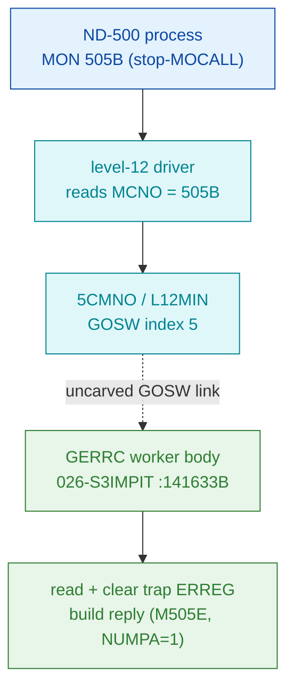

# MON 505B (octal) - GetTrapReason (GERRC)

Reads the per-process ND-500 trap error code after a programmed trap, clears it, and returns
it to the caller (GERRC = "get error code"): the reply message carries the code in field
`M505E` with `NUMPA=1`.

**Status:** ND-500 level-12 call - the carved 51-word handler body is **real SINTRAN L bytes**
(symbol boundary `GERRC=141633B .. 5SIBM=141716B` confirmed in L07); the level-12
`GOSW[5] -> GERRC` dispatch link is **asserted, not tool-proven** (see
[Honest caveats](#honest-caveats)). All addresses/values are **octal**.

- **Full disassembly:** [`505B-GetTrapReason.ASM`](505B-GetTrapReason.ASM) - the actual code (the GERRC worker body).
- **Bytes live once in** the canonical segment layer: [`../../segments-ref/`](../../segments-ref/).

---

## Dispatch path

MON 505B is an **ND-500 level-12** call. It is **not** ND-100 GOTAB-dispatched
(`prove-mon.py 505`: "NOT dispatched via the ND-100 GOTAB"). The dashed hop is the level-12
GOSW routing, which no tool run here proves.

The dashed hop (`C ⇢ D`) is the ND-500 level-12 GOSW entry into `GERRC`. `prove-mon.py` only
walks the ND-100 GOTAB, so it can neither confirm nor deny this link - it is asserted by the
folder attribution, not followed from a proven pointer.

---

## Code location (dispatch path)

Every row is a real region you can open. Byte offset = `(addr - loadbase)` in octal words x 2.
Segment `026-S3IMPIT` load base = `32000B`. Rows are in dispatch order.

| Role | Segment (full disasm) | Addr range (octal) | Byte offset (dec) | Symbol | Verdict |
|------|------------------------|--------------------|-------------------|--------|---------|
| ND-100 `GOTAB[505]` slot (NOT this call's path) | [commoncode.asm](../../segments-ref/SINTRAN-DATA_commoncode/SINTRAN-DATA_commoncode.asm) · [.hex](../../segments-ref/SINTRAN-DATA_commoncode/SINTRAN-DATA_commoncode.hex) | `071740B` (1 word) | 59328 | slot -> `T105R`=`057455B` | **MISATTRIBUTED** - ND-500 call; the GOTAB slot is meaningless here (its `T105R` target lives in `025-S3IRPIT`) |
| Level-12 GOSW dispatch (`5CMNO`/`L12MIN`, index 5) | - (resident level-12 driver, not byte-located here) | - | - | `5CMNO` GOSW[5] | **UNVERIFIED** - GOSW[5] -> `GERRC` is asserted by the folder, not proven by any tool run |
| `GERRC` worker body (read + clear trap error code) | [026-S3IMPIT.asm](../../segments-ref/026-S3IMPIT/026-S3IMPIT.asm) · [.hex](../../segments-ref/026-S3IMPIT/026-S3IMPIT.hex) | `141633B-141715B` (51 words) | 73526 | `GERRC` (next sym `5SIBM`=`141716B`) | real bytes; entry `051050`=`LDT I 50` matches on disk. **VERIFIED** (window); GOSW link MISATTRIBUTED |
| Indirect worker targets via pointer words `141711B`/`141712B`/`141713B` | `026-S3IMPIT` + `023044B` (below `026` base) | `023044B`, `145466B`, `135067B` | not byte-confirmed | (unnamed) | **UNVERIFIED** - those words are indirect-pointer DATA; targets not confirmed as code |

**Verify by hand:** `grep '^141633 ' ../../segments-ref/026-S3IMPIT/026-S3IMPIT.hex` -> byte offset `73526`;
then `dd if=../../../segments/026-S3IMPIT.bin bs=1 skip=73526 count=8 status=none | od -An -tx1` ->
`52 28 c6 e0 6a 27 f5 01` (= octal `051050 143340 065047 172401`, the `GERRC` entry `LDT I 50 / LDATX / ...`).

Canonical layers for the handler segment: [`../../segments-ref/026-S3IMPIT/`](../../segments-ref/026-S3IMPIT/)
(`026-S3IMPIT.asm`, `.hex`, `.symbols.txt`, `.meta.md`); canonical bytes at `../../../segments/026-S3IMPIT.bin`.

---

## Instruction walkthrough

Full listing: [`505B-GetTrapReason.ASM`](505B-GetTrapReason.ASM). Because this is overlay-recovered
code and several words double as indirect-pointer data, the semantic reading is annotated but marked
UNVERIFIED where the decode is ambiguous.

**Entry prologue (141633-141641)** - `LDT I 50 / LDATX / SUB I 47 / AAA 1 / MPY 46 / ADD 46 / RADD`.
Loads a table base indirectly, indexes it, and does `MPY`/`ADD` index arithmetic - consistent with
computing a per-process slot address (`process_index * record_size + base`). INFERRED which table.

**Record fetch (141642-141653)** - `LDX 45 / LDA ,X 57 / ADD ,X 60` then a `RADD` register-shuffle
chain. Reads two fields at fixed displacements (`57`, `60`) off an X base - plausibly the per-proc
trap/error record. INFERRED.

**Clear-and-store (141654-141657)** - `LDDTX` then `STZTX / AAX 1 / STZTX`: a **double-word zero store**
to the indexed location. This is the strongest byte-level match to GERRC's documented "clear the error
register after reading". VERIFIED as a zeroing store; INFERRED as to the target register.

**Output setup (141660-141677)** - a run of `LDX I 30 / LDT I 22 / AAX .. / STDTX / STATX / STZTX`
staging words into an indexed block - plausibly building the reply message (`M505E` field + `NUMPA=1`).
INFERRED mapping.

**Indirect escapes (141700-141702)** - every exit is indirect through a pointer word:
`141700 JPL I 11` -> `@141711 = 023044B`; `141701 JPL I 11` -> `@141712 = 145466B`;
`141702 JMP I 11` -> `@141713 = 135067B` (tail jump). Words `141711/141712/141713` are
**indirect-pointer DATA**, so the disassembler's in-line decode of them (`STD I ,X 44` /
`RORA ST DT` / `JPL I 67`) is a data/code overlap artefact, not real instructions - and exact flow
past `141702` is NOT byte-provable. **Tail (141714-141715)** is `000000 000000`: alignment/padding.

There is no plain skip-return (`EXIT`/`SKP`) visible; every escape is `JMP I`/`JPL I`, which is why
the validator reports `ok`.

---

## Parameter / register contract

| Item | Dir | Source | Verdict |
|------|-----|--------|---------|
| (no input parameter documented) | in | README/folder | inferred (none decodable from bytes) |
| `M505E` (ND-500 message field) = trap error code | out | README | inferred (field displacement not proven from bytes) |
| `NUMPA` = 1 | out | README | inferred |
| double-word zero store at `141654-141657` | internal | .ASM | VERIFIED as a zeroing store; INFERRED that the target is the trap ERREG |
| ND-100 registers `ZAREG`/`ZXREG`/`ZTREG` | - | - | N/A - the caller ABI is the ND-500 message buffer, not the ND-100 MON register set; the code uses A/D/T/X internally only |
| skip return | out | .ASM | none present; exit is via indirect `JMP I`/`JPL I`. VERIFIED (absence of direct skip) |

The caller-visible convention lives in the ND-500 level-12 message buffer, not in this window, so the
`M505E`/`NUMPA` field mapping is **inferred**, not byte-proven here.

---

## Pseudo-code (for an emulator)

See **[`505B-GetTrapReason.pseudo.c`](505B-GetTrapReason.pseudo.c)** - a pseudo-C model of the handler
for emulator authors. Control flow inside the carved window is byte-verified; the semantic labels
(which table, which field, which register is cleared) are inferred from the instruction shape and the
folder description.

Every instruction in the `.pseudo.c` is translated against the canonical
[`ND100-INSTRUCTION-SEMANTICS.md`](../../instruction-semantics/ND100-INSTRUCTION-SEMANTICS.md)
(bare `LDx`/`LDT`/`AND disp` = P-relative `mem[P+disp]`, not literals; `SKP`/`BSKP` skip
polarity; `RADD CLD SD DA` = `A = D`; T/X transfers `LDATX`/`STATX`/`LDDTX`/`STDTX`/`STZTX` =
physical `EL = ((T & 0377) << 16) | ((X + disp3) & 0177777)`).

---

## Honest caveats

**What is byte-proven:** the carved 51-word window is byte-exact, and its symbol boundary
(`GERRC=141633B .. 5SIBM=141716B`) is confirmed in L07 (`SYMBOL-2-LIST.SYMB.TXT`). The entry word
decodes cleanly (`051050 = LDT I 50`, on-disk bytes `52 28`), the double-word zero store
(`141654-141657`) matches the "read then clear" behaviour, and every direct branch stays in-file
(validator `ok`).

**What is NOT proven - one clear story:** there are two independent dispatch facts and they do not
agree. `prove-mon.py`'s ND-100 `GOTAB[505]` points at `T105R=057455B` (a 4-word stub in overlay
`025-S3IRPIT`), **not** at `GERRC`. The folder's "MON 505B == GERRC" rests entirely on the ND-500
**level-12 GOSW index-5** path (`5CMNO`/`L12MIN`), which is a *separate* dispatch chain that
`prove-mon.py` does not walk - so it can neither confirm nor deny it. The reconciliation: MON 505B is
an ND-500 call routed by the level-12 driver, so `GOTAB[505]` is simply the wrong table to read (it is
**MISATTRIBUTED** for this call); but the `GOSW[5] -> GERRC` link itself is **asserted by the folder,
not followed from a proven pointer** - hence **UNVERIFIED**. Additionally the pointer words
`141711-141713` are indirect-pointer DATA, so control flow past `141702` and the worker targets
(`023044B`/`145466B`/`135067B`) are not byte-provable, and the `M505E`/`NUMPA` field displacements are
behavioural claims, not proven from the bytes. Confirming the dispatch needs the carved resident
level-12 GOSW table decoded to show entry 5 -> `GERRC=141633B`.

Method: [../../../../../EXTRACTING-RESIDENT-CODE.md](../../../../../EXTRACTING-RESIDENT-CODE.md) §7.6/7.7 · dispatch reality:
[../../TASK-05-mismatches.md](../../TASK-05-mismatches.md) · master map: [../../MON-CALL-INDEX.md](../../MON-CALL-INDEX.md).
