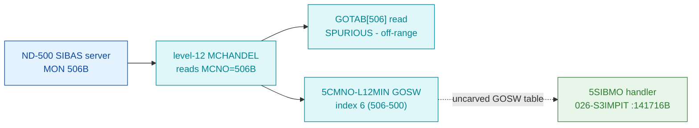

# MON 506B (octal) - AnswerSIBAS (5SIBMO)

Services a SIBAS-server request from the ND-500: validates the SIBAS number, checks the
datafield reservation, and either returns an error status (illegal number / reserved by
another) or reactivates the SIBAS server. It is an **ND-500 level-12 driver call**, not an
ND-100 `GOTAB` monitor call.

**Status:** dispatch is the level-12 `5CMNO` GOSW (index 6), not GOTAB - `prove-mon.py 506`
returns a spurious GOTAB row (see [Honest caveats](#honest-caveats)); the handler body is
real SINTRAN L bytes carved from `026-S3IMPIT`, and blocks A-C are byte-verified. All
addresses/values are **octal**.

- **Full disassembly:** [`506B-AnswerSIBAS.ASM`](506B-AnswerSIBAS.ASM) - the actual code
  (the `5SIBMO` region carved from the memory-resident `S3MPIT` segment).
- **Bytes live once in** the canonical segment layer: [`../../segments-ref/`](../../segments-ref/).

The local `506B-AnswerSIBAS.bin` is a **generated single-region slice** of the canonical
`026-S3IMPIT` segment (kept because this is an ND-500 call with a proven contiguous body) -
regenerate from canonical, do not hand-edit.

---

## Dispatch path

The `GOTAB[506]` branch is what `prove-mon.py 506` prints; it runs off the end of the real
ND-100 MON range into unrelated data (symbol `T105W`) - **ignore it for 506B**. The dashed
hop (`D ⇢ E`) is the level-12 `5CMNO` GOSW dispatch table inside `MCHANDEL`; the table
itself was not carved, so the index-6 → `5SIBMO` link is established from the NPL GOSW
ordering, not from a followed pointer.

---

## Code location (dispatch path)

Every row is a real region you can open. Byte offset = `(addr − loadbase)` in octal words × 2.
For `026-S3IMPIT` the load base is `32000B`; for `commoncode` it is `0` (GOTAB@`071233B`).

| Role | Segment (full disasm) | Addr range (octal) | Byte offset | Symbol | Verdict |
|------|------------------------|--------------------|-------------|--------|---------|
| `GOTAB[506]` read (spurious) | [commoncode.asm](../../segments-ref/SINTRAN-DATA_commoncode/SINTRAN-DATA_commoncode.asm) · [.hex](../../segments-ref/SINTRAN-DATA_commoncode/SINTRAN-DATA_commoncode.hex) | `071741B` (=`071233B`+`506`) | 59330 | `T105W` (unrelated) | **MISATTRIBUTED** |
| level-12 `5CMNO` GOSW index 6 (`L12MIN=500`) | [026-S3IMPIT.asm](../../segments-ref/026-S3IMPIT/026-S3IMPIT.asm) · [.hex](../../segments-ref/026-S3IMPIT/026-S3IMPIT.hex) | GOSW table in `MCHANDEL` (addr not carved) | — | `5CMNO` / `L12MIN` | inferred (NPL `MP-P2-N500`) |
| `5SIBMO` handler body proper | [026-S3IMPIT.asm](../../segments-ref/026-S3IMPIT/026-S3IMPIT.asm) · [.hex](../../segments-ref/026-S3IMPIT/026-S3IMPIT.hex) | `141716B–141752B` (29 words) | 73628 | `5SIBM` (`5SIBMO`) | **VERIFIED** |
| trailing driver routines + pointer cells (rest of 157-word carve) | [026-S3IMPIT.asm](../../segments-ref/026-S3IMPIT/026-S3IMPIT.asm) · [.hex](../../segments-ref/026-S3IMPIT/026-S3IMPIT.hex) | `141753B–142152B` | 73686 | `TYPFU`=`141731B` + neighbours | inferred (carve sized to control-flow closure) |

**Verify by hand:** `grep '^141716 ' ../../segments-ref/026-S3IMPIT/026-S3IMPIT.hex` →
word `051101`, byte offset `73628`; then
`dd if=../../../segments/026-S3IMPIT.bin bs=1 skip=73628 count=8 | od -An -tx1` →
`52 41 f7 40 c6 c2 b3 06` (= octal `051101 173500 143302 131406` after big-endian byte-swap,
the `5SIBMO` prologue `LDT I 101 / AAX 100 / LDDTX / JAF 6`). The whole 157-word
(`314`-byte) carve is byte-for-byte identical to the canonical slice:
`dd if=../../../segments/026-S3IMPIT.bin bs=1 skip=73628 count=314 | cmp - 506B-AnswerSIBAS.bin`
→ identical.

---

## Instruction walkthrough

Full listing: [`506B-AnswerSIBAS.ASM`](506B-AnswerSIBAS.ASM). Entry register contract (from
the NPL `5SIBMO` header): `X = current message (N5MESSAGE)`, `B = ND-500 CPU datafield`.

**Block A - validate the SIBAS number (141716–141726).** `T:=5MBBANK` (message-bank base,
cell 101); `AAX 100` indexes by the `SIBNO` field; `LDDTX` loads the SIBAS-number word pair
into `A`/`D`. Then the three-way guard: `141721 JAF 6` (if `A =/= 0` → illegal),
`141722–141724` compares `D` against `MXSIBAS` (if `D > MXSIBAS` → illegal), `141725–141726
SKP IF DT EQL 0` (if entry `T = 0` → illegal). This is the NPL guard
`IF A><0 OR D>>MXSIBAS OR T=0 THEN illegal SIBAS number`.

**Block B - illegal-number return (141727–141733).** `LDX I 72` (X:=N5MESSAGE), `SAA 174`
(A:=`EC174`), then the worker triple: `JPL I 71` → `EMONICO` (restart ND-500 proc with error
code), `JPL I 71` → `XACTRDY`, `JMP I 71` → `NXTMSG`.

**Block C - resolve datafield, check reservation (141734–141752).** `RADD SD DX` moves the
SIBAS number into `X` (`STX -21` saves `CSIBNO`); `LDX I ,X 67` loads `SIBBDEVS(CSIBNO)` (the
datafield address); `LDA ,X 1` reads `X.RTRES` (current reservation owner); `LDX I 64` /
`LDT ,X 1` reads `PROCAD.RTRES`; `SKP IF DA UEQ ST` compares them. If they differ
(reserved by ANOTHER process): `SAA 5` (status 5 = reserved) then the worker triple
`EMONICO` / `XACTRDY` / `NXTMSG`. This matches NPL
`IF X.RTRES><PROCAD.RTRES THEN X:=N5MESSAGE; 5; CALL EMONICO; CALL XACTRDY; GO NXTMSG FI`.

**Block D - mark running / restart waiter / arm timer / reactivate (141753 onward).**
Described from NPL, not annotated line by line in this pass: `1=:D.SIB500` (mark SIBAS
running in the ND-500), fetch `SIBAPDEVS(CSIBNO)` and clear `SRTCSTAT`, and - if a process
is waiting (`X.RTRES><0 AND X.STATUS BIT 5WAIT`) - `CALL RTACT` to restart it; then arm the
survey timer (`CSIBDF.TTMR =: X.TMR`), re-read the message `SIBST` word, and branch: stop →
`NSTOPROC`, otherwise `CALL OKMONICO` (reactivate SIBAS server) / `XACTRDY` / `GO NXTMSG`.

**Shared-worker calls / "data disassembled as code" caveat.** All calls to shared workers
are `JPL I` / `JMP I` through **pointer cells** that live inside the carved window (roughly
`142017–142031` and `142133–142152`). nd100-dis renders those pointer/constant cells as if
they were instructions - they are **not** executable code (the printed `USER1`, `USER7`,
`FMU I`, `STD I` lines). Treat each `JPL I`/`JMP I` as an indirect call whose target address
is stored in the cell; the workers themselves (EMONICO / XACTRDY / NXTMSG / RTACT / OKMONICO)
live elsewhere in the resident driver, outside this 157-word slice.

**Exit model.** There is no ND-100 skip-return. Every path ends with a worker triple
(`EMONICO`/`OKMONICO` → `XACTRDY`) and `GO NXTMSG`, i.e. control returns to the level-12
message loop; the ND-500 process is resumed with a status word by `EMONICO`/`OKMONICO`.

---

## Parameter / register contract

Entry is at level 12 (from the NPL `5SIBMO` header and the carved code):

| Reg / field | Dir | Meaning | Verdict |
|-------------|-----|---------|---------|
| `X = N5MESSAGE` | in | current ND-500 message buffer | VERIFIED (NPL header; used at 141727/141736) |
| `B = ND-500 datafield` | in | ND-500 CPU datafield base | VERIFIED (NPL header) |
| `SIBNO` (msg cell 100, via `5MBBANK` cell 101) | in | SIBAS number to service | VERIFIED (141716–141720 bytes) |
| `SIBST` (msg cell) | in | requested SIBAS state (stop vs run) | inferred (NPL tail block D; not in verified slice) |
| status word (via EMONICO/OKMONICO) | out | `0` = OK / `5` = reserved by another / `EC174` = illegal SIBAS number | VERIFIED (`SAA 174`@141730, `SAA 5`@141747); OK value inferred |

Error/return constants seen in the bytes: `EC174` (`SAA 174`, 141730) - illegal SIBAS
number (VERIFIED); `5` (`SAA 5`, 141747) - reserved by another (VERIFIED). The OK path
(block D) reactivates via `OKMONICO`; that an OK path exists is VERIFIED, but the exact
status value `OKMONICO` writes is outside this slice (inferred). Symbolic offsets
(`MXSIBAS`, `5MBBANK`, `SIBBDEVS`, `SIBAPDEVS`, `RTRES`, `PROCAD`) are NPL names for
readability only; the numeric pointer cells (`101`, `76`, `72`, `67`, `64`, ...) are the
VERIFIED L bytes.

---

## Pseudo-code (for an emulator)

See **[`506B-AnswerSIBAS.pseudo.c`](506B-AnswerSIBAS.pseudo.c)** - a pseudo-C model of the
handler for emulator authors. The SIBAS-number guard and reservation check (blocks A-C) are
byte-verified; block D (mark-running / RTACT restart / timer arm / OKMONICO vs NSTOPROC) is
inferred from the NPL `5SIBMO` tail, and the worker semantics are inferred from the call
structure.

Every instruction is modelled against the canonical
[`../../instruction-semantics/ND100-INSTRUCTION-SEMANTICS.md`](../../instruction-semantics/ND100-INSTRUCTION-SEMANTICS.md).
The `LDDTX`/`LDATX`/`LDXTX`/`STATX` operations are **T/X physical (bank) transfers**: they read and
write the ND-500 message buffer at a 24-bit PHYSICAL address
`EL = ((T & 0377) << 16) | (X & 0177777)` that BYPASSES the MMU (section 5). Here `T := 5MBBANK`
(the message-buffer bank), so the SIBAS-number pair and the status words are read/written via
`phys[ELADDR(T,X)]`, not in ND-100 A/T/X registers.

---

## Honest caveats

**What is byte-proven:** the `5SIBMO` handler body at `141716B–141752B` is real SINTRAN L
code, byte-for-byte identical to the `026-S3IMPIT.bin` canonical slice at byte offset
`73628`. Its prologue `T:=5MBBANK; *AAX SIBNO; LDDTX`, the three-way SIBAS-number guard, and
the reservation check map 1:1 onto NPL `5SIBMO`; both error paths (`EC174`, `5`) match NPL in
code shape and constants; the GOSW index (6 under `L12MIN=500`) is confirmed from the NPL
`5CMNO` table ordering.

**What is NOT proven:**
- **`prove-mon.py 506` is misleading here.** 506B is an ND-500 level-12 call (call number
  `>= 0400`), so it is not dispatched through the ND-100 `GOTAB`. `prove-mon.py 506` reads
  `GOTAB[506]` off the end of the real ND-100 MON range and reports the unrelated symbol
  `T105W` at `057470` - a false positive; do not cite it as this handler. The real path is
  the level-12 `5CMNO` GOSW inside `MCHANDEL`.
- **The GOSW → handler link is inferred, not followed.** The `5CMNO-L12MIN` dispatch table
  address in `MCHANDEL` was not carved; index-6 → `5SIBMO` rests on the NPL GOSW ordering
  plus the L07 truncated symbol `5SIBM=141716`, not on a statically followed pointer.
- **Symbol truncation.** L07 lists `5SIBM` (5 chars) where NPL has `5SIBMO`; naming, not byte,
  uncertainty. The NPL revision differs from L (NPL has `5SIBMO=141516`, L has `5SIBM=141716`)
  and is used only for control-flow and field names, never as L byte truth.
- **Block D not annotated line by line**, and the worker targets
  (EMONICO/XACTRDY/NXTMSG/RTACT/OKMONICO) sit in pointer cells but the workers themselves are
  outside this 157-word window (not carved here). The carve is sized to control-flow closure,
  so it spans a few small level-12 routines that follow `5SIBMO` in memory
  (`TYPFU=141731` and neighbours).

Confirming the dispatch end-to-end needs a live trace: break in `MCHANDEL` on a real ND-500
MON 506B, single-step the `5CMNO` GOSW, and confirm P lands on `5SIBMO=141716B`.

---

Method: [../../../../../EXTRACTING-RESIDENT-CODE.md](../../../../../EXTRACTING-RESIDENT-CODE.md) §7.6/7.7 · dispatch reality:
[../../TASK-05-mismatches.md](../../TASK-05-mismatches.md) · master map: [../../MON-CALL-INDEX.md](../../MON-CALL-INDEX.md).
