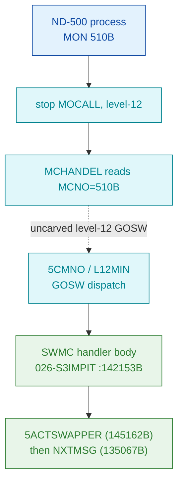

# MON 510B (octal) - CallSwapper (SWMC)

Level-12 ND-500 monitor entry that packs a swapper trap code into an ND-500
message word, activates the memory-resident swapper (`CALL 5ACTSWAPPER`), then
tail-jumps into the next-message loop (`NXTMSG`).

**Status:** handler identity byte-proven (entry symbol `SWMC=142153B`, both
worker pointers resolve to named residents); the `MON 510B -> SWMC` dispatch
crosses an **uncarved level-12 GOSW** table (see [Honest caveats](#honest-caveats)).
All addresses/values are **octal**.

- **Full disassembly:** [`510B-CallSwapper.ASM`](510B-CallSwapper.ASM) - the actual code (SWMC body + inline data).
- **Bytes live once in** the canonical segment layer: [`../../segments-ref/`](../../segments-ref/).

---

## Dispatch path



The dashed hop (`C ⇢ E`) is the resident level-12 GOSW jump table - it is **not
present in any carved segment**, so that link cannot be followed statically. MON
510B is an ND-500 call and is **not** dispatched through the ND-100 GOTAB;
`GOTAB[510]` is a meaningless index for it (it lands on unrelated table data,
symbol `T106W`).

---

## Code location (dispatch path)

Regions are in execution order. Byte offset = `(addr - loadbase)` in octal words
x 2 (decimal). Handler load base = `32000B`.

| Role | Segment (full disasm) | Addr range (octal) | Byte offset | Symbol | Verdict |
|------|------------------------|--------------------|-------------|--------|---------|
| GOTAB[510] index (false lead) | [commoncode.asm](../../segments-ref/SINTRAN-DATA_commoncode/SINTRAN-DATA_commoncode.asm) · [.hex](../../segments-ref/SINTRAN-DATA_commoncode/SINTRAN-DATA_commoncode.hex) | `071743B` (1 word) | 59334 | `T106W` | **MISATTRIBUTED** (ND-500 call, not GOTAB-dispatched) |
| Level-12 GOSW dispatch | — (uncarved `5CMNO`/`L12MIN`) | — | — | `5CMNO` / `L12MIN` | **UNVERIFIED** (not tied to bytes) |
| SWMC handler body | [026-S3IMPIT.asm](../../segments-ref/026-S3IMPIT/026-S3IMPIT.asm) · [.hex](../../segments-ref/026-S3IMPIT/026-S3IMPIT.hex) | `142153B–142166B` | 73942 | `SWMC` | **VERIFIED** |
| Inline pointer/literal words | [026-S3IMPIT.asm](../../segments-ref/026-S3IMPIT/026-S3IMPIT.asm) · [.hex](../../segments-ref/026-S3IMPIT/026-S3IMPIT.hex) | `142167B–142172B` | 73966 | ->`5ACTS`=145162B, ->`NXTMS`=135067B | **VERIFIED** (data, targets exact) |
| Unlabelled data table | [026-S3IMPIT.asm](../../segments-ref/026-S3IMPIT/026-S3IMPIT.asm) · [.hex](../../segments-ref/026-S3IMPIT/026-S3IMPIT.hex) | `142173B–142252B` | 73974 | (none) | **UNVERIFIED** (purpose unproven) |

**Verify by hand:** `grep '^142153 ' ../../segments-ref/026-S3IMPIT/026-S3IMPIT.hex`
→ byte offset `73942`; then
`dd if=../../../segments/026-S3IMPIT.bin bs=1 skip=73942 count=8 | od -An -tx1`
→ `f1 17 dd 08 cc 69 52 09` (= octal `170427 156410 146151 051011`, the SWMC entry).

Provenance note: this folder cites the `026-S3IMPIT` Image copy; `prove-mon.py`
reads the `025-S3IRPIT` Restart copy - the same resident code in two save-copies.
The canonical byte truth used here is `026-S3IMPIT`.

---

## Instruction walkthrough

Full listing: [`510B-CallSwapper.ASM`](510B-CallSwapper.ASM). Only `142153B..142166B`
is executable; the rest is data.

**Entry / body (142153–142166) — executable**
```
142153  170427  SAA 27          ; A := 27 (trap seed; composed value INFERRED)
142154  156410  SHA ZIN 10      ; shift/combine A
142155  146151  RADD CLD SA DD
142156  051011  LDT I 11        ; T := (( 142167 )) = 004654  message-field base
142157  173416  AAX 16          ; X += 16 (index into message field)
142160  143300  LDATX           ; A := phys[EL]  PHYSICAL read (MMU-bypass), EL=T:X
142161  070007  AND 7           ; P-relative: A &= mem[142170B]=0377 (low 8 bits)
142162  146015  RADD SD DA       ; A := A + D  (merge the 013400 seed => trap code)
142163  143304  STATX           ; phys[EL] := A  PHYSICAL write of the trap code
142164  173762  AAX -16         ; X -= 16 (restore index)
142165  135004  JPL I 4         ; CALL (( 142171 )) = 145162 = 5ACTS (5ACTSWAPPER)
142166  125004  JMP I 4         ; JMP  (( 142172 )) = 135067 = NXTMS (NXTMSG)
```
Plain language: compute an index into the ND-500 message buffer, read a word,
mask/merge the low bits (the swapper trap sub-code), store it back, then **call
the resident swapper** `5ACTSWAPPER` as a subroutine and, on return,
**tail-jump** to the `NXTMSG` next-message dispatch loop.

**Inline pointer / literal words (142167–142172) — data.** nd100-dis renders
these as instructions, but the body indirects through them:
`@142167=004654` (msg-field base), `@142170=000377` (8-bit mask literal),
`@142171=145162` -> `5ACTS`, `@142172=135067` -> `NXTMS`. Both jump targets are
VERIFIED by exact L07 symbol match (`5ACTS=145162` SYMBOL-2-LIST:3963;
`NXTMS=135067`/`NNJ08` :3882-3883).

**Data table (142173–142252) — unlabelled.** 48 words of small values that fall
inside the `SWMC..A5XMS` symbol gap with no symbol of their own (a per-trap
parameter table is plausible but **UNVERIFIED**). nd100-dis renders them as `STZ`
ops - disregard those mnemonics.

---

## Parameter / register contract

| Reg / field | Dir | Meaning | Verdict |
|-------------|-----|---------|---------|
| `mem[msgbase+16]` (base via ptr `004654B`) | in/out | body reads it, masks low 3 bits (`AND 7`), merges, writes back | VERIFIED (bytes) |
| `SAA 27` seed constant | in | constant `27` loaded into A at entry | VERIFIED (byte); meaning inferred |
| `000377` mask literal (142170B) | in | 8-bit mask constant present in region | VERIFIED (byte); use inferred |
| Swapper activation | out | `JPL I` -> `5ACTSWAPPER` (`5ACTS=145162B`) | VERIFIED |
| Exit | out | `JMP I` -> `NXTMSG` (`NXTMS=135067B`); tail-jump, no skip-return | VERIFIED |
| Error / skip-return | — | none in this block (unconditional tail-jump) | VERIFIED (none in-window) |
| "TRAPN low 8 bits; ORs MSM510<<8" (README legacy) | in/out | code masks with `7` (3 bits) not `377`; exact TRAPN packing not proven | inferred / partial conflict |

`MSWMC=000014` (N500-SYMBOLS:5462) is the swapper-message trap-code symbol for
this call; note `14B` does not equal the legacy "GOSW index 8" claim (open item).

---

## Pseudo-code (for an emulator)

The pseudo-C is grounded in the ND-100 instruction-semantics reference
[`../../instruction-semantics/ND100-INSTRUCTION-SEMANTICS.md`](../../instruction-semantics/ND100-INSTRUCTION-SEMANTICS.md):
the T/X transfers are 24-bit **physical** accesses `EL = ((T & 0377) << 16) | ((X + disp3) & 0177777)`
(T = the bank, MMU-bypassed), and `RADD CLD Sx Dy` = `y = x`.

See **[`510B-CallSwapper.pseudo.c`](510B-CallSwapper.pseudo.c)** — a pseudo-C model
of the handler for emulator authors. Control flow (msg-field read/mask/store,
swapper call, tail-jump) is byte-verified; the trap-code build-up arithmetic and
the message-buffer layout are inferred from the code, not independently proven.

---

## Honest caveats

**What is byte-proven:** the handler identity. Entry symbol `SWMC=142153B` matches
the L07 symbol table; the entry bytes (`170427 156410 146151 051011 ...`) match a
live read of the canonical `026-S3IMPIT` segment; and both indirect worker
pointers resolve **exactly** to named resident routines (`5ACTSWAPPER=145162B`,
`NXTMSG=135067B`).

**What is NOT proven:** the dispatch link `MON 510B -> SWMC`. This is an ND-500
level-12 call routed through the level-12 GOSW jump table, which lives in an
**uncarved** region; the `MON 510B -> SWMC` step therefore rests on the symbol
name + behaviour, not a followed pointer. `prove-mon.py 510` indexes the ND-100
GOTAB and yields `T106W` — that is a **false lead** for this call (500-series calls
are not GOTAB-dispatched), reported here only for honesty. Reconciling the two
old notes: ANALYSIS and DISPATCH agreed the GOTAB line is misattributed and the
handler is `SWMC`; that single story is carried above. Open items: the `SAA 27`
seed and the GOSW index are not tied to symbols, and `MSWMC=14B` does not match
the legacy "index 8" claim.

**How this was carved:** these bytes read as zero in the flat resident common
image (`142153B` is in the overlaid window `0o104000-0o170000`); they are
recovered via the PIT-overlay model from the memory-resident `S3MPIT` segment
(`026-S3IMPIT.bin`, load `32000B`), identified by call-target density + byte
anchors. See §7.6/7.7 of the method doc.

---

Method: [../../../../../EXTRACTING-RESIDENT-CODE.md](../../../../../EXTRACTING-RESIDENT-CODE.md) · dispatch reality:
[../../TASK-05-mismatches.md](../../TASK-05-mismatches.md) · master map: [../../MON-CALL-INDEX.md](../../MON-CALL-INDEX.md).
