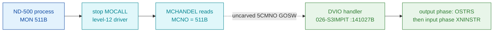

# MON 511B (octal) - Combined terminal output+input (DVIO)

Writes a prompt string to a terminal and then reads a line of input back into the
ND-500 process, returning the number of bytes read - the fused form of DVOUTST
(output) + DVINST (input). All addresses/values are **octal**.

**Status:** handler identity byte-proven (real SINTRAN L bytes at `DVIO=141027B`);
the level-12 GOSW dispatch that reaches it is an uncarved kernel path; the input
phase (byte count / write-back) lives in adjacent code outside this carve (see
[Honest caveats](#honest-caveats)).

- **Full disassembly:** [`511B-DVIO.ASM`](511B-DVIO.ASM) - the actual code, the DVIO handler body region.
- **Bytes live once in** the canonical segment layer: [`../../segments-ref/`](../../segments-ref/).

---

## Dispatch path

MON 511B is an **ND-500 level-12 monitor call**. It is **not** dispatched through
the ND-100 monitor `GOTAB` - a `GOTAB[511]` probe lands in the terminal-datafield
pointer region (spurious). It arrives at the handler via the level-12 GOSW.

The dashed hop (`C ⇢ D`) is the resident level-12 GOSW (`5CMNO-L12MIN`, index 9) -
it is **not present in any carved segment**, so it is the one link that cannot be
followed statically.

---

## Code location (dispatch path)

Every row is a real region you can open. Byte offset = `(addr − loadbase)` in octal
words × 2 (decimal).

| Role | Segment (full disasm) | Addr range (octal) | Byte offset | Symbol | Verdict |
|------|------------------------|--------------------|-------------|--------|---------|
| GOTAB[511] probe (spurious) | [commoncode.asm](../../segments-ref/SINTRAN-DATA_commoncode/SINTRAN-DATA_commoncode.asm) · [.hex](../../segments-ref/SINTRAN-DATA_commoncode/SINTRAN-DATA_commoncode.hex) | `071744B` reads `057531B` | 59336 | `T107R` (terminal-107 datafield ptr, not code) | **MISATTRIBUTED** - ND-500 call is not in GOTAB |
| Level-12 GOSW dispatch | — (uncarved resident level-12) | `MCHANDEL` reads `MCNO=511B`; `5CMNO-L12MIN` GOSW index 9 | — | `5CMNO` / `L12MIN` | **UNVERIFIED** - dispatch mechanism, not carved |
| DVIO handler body | [026-S3IMPIT.asm](../../segments-ref/026-S3IMPIT/026-S3IMPIT.asm) · [.hex](../../segments-ref/026-S3IMPIT/026-S3IMPIT.hex) | `141027B–141166B` (96 words) | 72750 | `DVIO=141027B` (shared entry `NOUTS`) | **VERIFIED** |
| Input phase (adjacent) | [026-S3IMPIT.asm](../../segments-ref/026-S3IMPIT/026-S3IMPIT.asm) · [.hex](../../segments-ref/026-S3IMPIT/026-S3IMPIT.hex) | `~141072B` region (`XNINSTR`/`NECHO`) | — | `XNINSTR` | **UNVERIFIED** - outside the carved 96-word window |

**Verify by hand:** `grep '^141027 ' ../../segments-ref/026-S3IMPIT/026-S3IMPIT.hex` → byte offset `72750`;
then `dd if=../../../segments/026-S3IMPIT.bin bs=1 skip=72750 count=8 | od -An -tx1` → `ba 33 aa 33 cc 4d 5a 32`
(= octal `135063 125063 146115 055062 …`, the DVIO entry `JPL I 63 / JMP I 63` idiom).

---

## Instruction walkthrough

Full listing: [`511B-DVIO.ASM`](511B-DVIO.ASM). The 96-word window is two code
blocks separated by a **pointer/literal pool** at `141112..141125`; the
disassembler mis-renders that pool as instructions (`ROP NOOP`, `STT I`, …) - those
words are the indirect-jump targets, not executable code.

**Pointer pool (141112..141125), resolved against L07 symbols** - the decisive
identity proof: all seven words resolve one-to-one to DVIO's worker set, in NPL order.

| Ptr word | Value | Symbol (L07, 5-char) | Worker |
|----------|-------|----------------------|--------|
| 141112 | 147440 | `5GTDF` | get terminal datafield |
| 141113 | 137167 | `NORMM` | NORMMC - non-terminal MON fallback |
| 141117 | 023021 | `EMONI` | EMONICO - restart ND-500 proc w/ error |
| 141120 | 145466 | `XACTR` | XACTRDY - reactivate ND-500 exec queue |
| 141121 | 135067 | `NXTMS` | NXTMSG - handle next ND-500 message |
| 141122 | 141205 | `OSTRS` | OSTRS - output-string restart (level-12) |
| 141124 | 023670 | `WN5ST` | WN5STATUS - write ND-500 process status |

**Entry / output setup (141027..141055)** - `141027 JPL I 63 → 5GTDF` (is this a
terminal? get its datafield); `141030 JMP I 63 → NORMMC` skip-return handles the
not-a-terminal case. `141031..141040` build the output-datafield pointer via
`TODF`/`STATX`/`LDDTX` and load `DNOBY`. `141041..141050` range-check the count:
`DNOBY > 4000B` (or negative) → `SAA 174` (error `EC174`) then `EMONICO`/`XACTRDY`/
`NXTMSG`. `141052..141055` a zero-length prompt skips output and enters `OSTRS`.

**Read-data-memory setup (141056..141111)** - `141056 LDA,B -10 / BSKP ZRO` tests
the `MIFLAG` bit `WSMC` (buffer already in the COM-buffer?); if not, `141061..141105`
build the ND-500 micro-function `XMICF = read-data-memory` (byte count `NRBYT`,
`5DITN`, ND-500 logical addr, ND-100 physical addr, `SPFLA` restart flag), then
`WN5STATUS`/`XACTRDY`/`NXTMSG`.

**STTDRIV - start terminal output driver (141126..141166)** - `141126 STX -1` saves
the message; `141127..141145` index `TODF` to the terminal output datafield and call
`XSTDFADDR`. `141146 LDA,X3 / BSKP ONE` tests `TYPRING` bit `5BAD`: bad line →
`L12STDV` (TAD path), else `L3STDV` (normal). `141157..141160` store `MFUNC`;
`141161 SAA 14` marks the proc `N5IOWAIT`; then `WN5STATUS` / `GCPUDF` / `RTACT`
start the driver; `141166 JMP I 14 → NXTMSG` exits (driver continues asynchronously).

On output completion the terminal driver re-enters level-12 via `OSTRS`, which for
`SMCNO=511` runs the input phase (`XNINSTR`) and reports the returned byte count.

---

## Parameter / register contract

ND-500 monitor calls pass parameters in the **ND-500 message buffer** (indexed by
`5MBBANK` + field displacement), not in ND-100 A/T/X user registers. The register
use below is level-12 driver-internal.

| Item | Dir | Meaning | Verdict |
|------|-----|---------|---------|
| `X` (entry) | in | current ND-500 message address (`N5MESSAGE`) | VERIFIED (bytes: N5MESSAGE indexing) |
| `B` (entry) | in | ND-500 CPU datafield | inferred (NPL asserts; not provable from this window) |
| `TODF` (msg) | in | output datafield pointer | VERIFIED (STATX via TODF index) |
| `DNOBY` (msg) | in | output byte count, max 4000B | VERIFIED (range check → EC174) |
| `11DMA` / `DMAXB` (msg) | in | max input bytes (input phase) | inferred - lives in `XNINSTR` (141072 region), not carved here |
| `11NOCHRET` (msg) | out | number of bytes actually read | inferred - written in NECHO/EOF path, outside carve |
| `NUMPAR` (msg) | out | monitor-call write-back mask = 100000B | inferred - set in the input phase, outside carve |
| Error `EC174` | out | illegal output byte count (>4000B or negative) | VERIFIED (SAA 174 → EMONICO) |
| Error `316` | out | terminal line not connected | inferred (NPL only; in `XNINSTR`) |
| Error `3` | out | end-of-file on nowait input | inferred (NPL only) |

Skip-return: none in the ND-100 sense. Control leaves via `NORMMC` (not a terminal),
`NXTMSG` (done/error), or the async driver (`RTACT`).

---

## Pseudo-code (for an emulator)

The pseudo-C is grounded in the ND-100 instruction-semantics reference
[`../../instruction-semantics/ND100-INSTRUCTION-SEMANTICS.md`](../../instruction-semantics/ND100-INSTRUCTION-SEMANTICS.md):
the T/X transfers are 24-bit **physical** accesses `EL = ((T & 0377) << 16) | ((X + disp3) & 0177777)`
(T = the message-buffer bank, MMU-bypassed), and `RADD CLD Sx Dy` = `y = x`.

See **[`511B-DVIO.pseudo.c`](511B-DVIO.pseudo.c)** - a pseudo-C model of the handler
for emulator authors. Control flow and the seven indirect worker pointers
(141112..141124) are byte-verified; the semantic labels (which worker does what) are
inferred from the call structure and the NPL DVIO body (a different revision).

---

## Honest caveats

**What is byte-proven:** the handler at `DVIO=141027B` is real SINTRAN L code carved
from `026-S3IMPIT` (load `32000B`). Two independent anchors agree: (1) `DVIO=141027`
in the L07 symbol table, and (2) all seven indirect pointer words (141112–141124)
resolve to exactly DVIO's worker set (`5GTDF`, `NORMMC`, `EMONICO`, `XACTRDY`,
`NXTMSG`, `OSTRS`, `WN5STATUS`) in NPL order. The output-count range check (`SAA 174`
→ `EMONICO`, error `EC174`) is byte-verified. The carved slice is byte-identical to
the canonical segment (`dd` above reproduces the entry words).

**What is NOT proven:**
- **The dispatch.** MON 511 is an ND-500 level-12 call; it is not in `GOTAB`. The
  `prove-mon.py` probe is misleading here - `GOTAB[511]=057531=T107R` is the
  terminal-107 datafield pointer, not a handler. The real path is the resident
  level-12 GOSW (`MCHANDEL` reads `MCNO`, `5CMNO-L12MIN` index 9), which is in an
  uncarved overlay and cannot be followed statically.
- **The input phase.** `11DMA`, `11NOCHRET`, `NUMPAR`, error `316` and EOF-error `3`
  are set in `XNINSTR`/`NECHO`, adjacent code outside the `141027..141166` window -
  hence marked inferred. A follow-up carve of the `NINSTR/XNINSTR` block would close
  this.
- **The pool.** Words `141112..141125` in the `.ASM` are data (indirect-jump
  targets), not the `ROP NOOP`/`STT I` instructions the disassembler prints.
- **NPL is a different revision than L.** NPL places DVIO at 140627; the L bytes place
  `DVIO=141027`. Only the behaviour and worker names carry over - the worker names
  were re-verified against the L07 pointer words above.

Confirming the full chain needs a live trace (break at the level-12 GOSW on a real
ND-500 `MON 511`, single-step, confirm P lands on `DVIO=141027`).

---

Method: [../../../../../EXTRACTING-RESIDENT-CODE.md](../../../../../EXTRACTING-RESIDENT-CODE.md) §7.6/7.7 · dispatch reality:
[../../TASK-05-mismatches.md](../../TASK-05-mismatches.md) · master map: [../../MON-CALL-INDEX.md](../../MON-CALL-INDEX.md).
