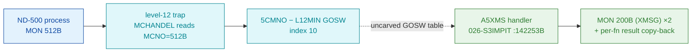

# MON 512B (octal) — XMSGCallA (A5XMS)

The ND-100-resident level-12 handler that services an XMSG request made by an ND-500 process:
it decodes an XMSG sub-function from the ND-500 message buffer, re-issues the request to the
ND-100 XMSG system via `MON 200B`, then copies the selected result words back into the message
buffer per sub-function. MON 512B and MON 513B share one body — L07 symbols `A5XMS` and `B5XMS`
sit at the same address `142253B`.

**Status:** handler body is real SINTRAN L bytes (byte-verified, `A5XMS=142253B`); the two
`MON 200B` XMSG re-issues are proven from the bytes; the `MON 512B → A5XMS` dispatch runs through
the uncarved ND-500 level-12 GOSW (`5CMNO` index 10), which is **not** byte-proven here (see
[Honest caveats](#honest-caveats)). All addresses/values are **octal**.

- **Full disassembly:** [`512B-XMSGCallA.ASM`](512B-XMSGCallA.ASM) — the actual handler code, one proven contiguous region.
- **Bytes live once in** the canonical segment layer: [`../../segments-ref/`](../../segments-ref/). The per-call `.ASM`/`.bin` here are a GENERATED single-region slice of `026-S3IMPIT`.

---

## Dispatch path

The dashed hop (`C ⇢ D`) is the ND-500 level-12 GOSW table (`5CMNO`, index 10) — it is **not in
the carve set**, so the `MON 512B → A5XMS` link cannot be followed statically. This is an ND-500
call (octal 512B, in the 500–523B level-12 range), so it does **not** go through the ND-100 GOTAB:
`prove-mon.py 512` confirms *"ND-500 call: NOT dispatched via the ND-100 GOTAB … 500-523B → level-12
5CMNO GOSW."*

---

## Code location (dispatch path)

Every row is a real region you can open. Byte offset = `(addr − loadbase)` in octal words × 2.

| Role | Segment (full disasm) | Addr range (octal) | Byte offset | Symbol | Verdict |
|------|------------------------|--------------------|-------------|--------|---------|
| Level-12 dispatch (`5CMNO − L12MIN` GOSW, index 10) | — (uncarved level-12 GOSW table) | — | — | `5CMNO` | **UNVERIFIED** |
| GOTAB[512B] slot — NOT the ND-500 path (red herring) | [commoncode.asm](../../segments-ref/SINTRAN-DATA_commoncode/SINTRAN-DATA_commoncode.asm) · [.hex](../../segments-ref/SINTRAN-DATA_commoncode/SINTRAN-DATA_commoncode.hex) | `71745B` (1 word) → `57544B` stub | 59338 | `T107W` | **MISATTRIBUTED** |
| Handler body (single contiguous region) | [026-S3IMPIT.asm](../../segments-ref/026-S3IMPIT/026-S3IMPIT.asm) · [.hex](../../segments-ref/026-S3IMPIT/026-S3IMPIT.hex) | `142253B–142611B` (223w) | 74070 | `A5XMS` / `B5XMS` | **VERIFIED** |

- **Handler** is the only proven region: load base `32000B`, word offset `(142253B − 32000B) =
  110253B = 37035 dec`, byte offset `37035 × 2 = 74070`, length 223 words = 446 bytes. First word
  `146173` confirmed at that offset in the canonical bin.
- **GOTAB[512B]** points at the 11-word stub `T107W=57544B`, a *different* ND-100-side routine; it
  is NOT how MON 512B reaches `A5XMS`. Documented here only so the anomaly is not mistaken for the
  dispatch path.
- **Level-12 GOSW** (`5CMNO` index 10) is the real dispatch but its table is not in the carve set,
  so the `512B → A5XMS` link is **UNVERIFIED** by available tooling.

**Verify by hand:** `grep '^142253 ' ../../segments-ref/026-S3IMPIT/026-S3IMPIT.hex` → byte offset
`74070`; then `dd if=../../../segments/026-S3IMPIT.bin bs=1 skip=74070 count=8 | od -An -tx1` →
`cc 7b 52 57 f7 41 c6 c0` (= octal `146173 051127 173501 143300`, the `A5XMS` entry `RADD CLD SX DB
/ LDT I 127 / AAX 101 / LDATX`).

---

## Instruction walkthrough

Full listing: [`512B-XMSGCallA.ASM`](512B-XMSGCallA.ASM). One contiguous region `142253B–142611B`;
every direct branch resolves inside it.

**Function decode + range gate (142253–142263)** — `142254 LDT I 127` loads the ND-500 message
base pointer; `142255 AAX 101 / 142256 LDATX` fetches the XMSG function word; `142257 AND 125` masks
it; `142261 AAA -57 / 142262 SKP IF 0 GRE SA` range-checks the function code and `142263 JMP 142420`
falls out to the common worker on out-of-range.
**Second decode + validity gate (142264–142271)** — `142265 LDATX` fetches a flag word; `142266
JAF 26 → 142314` branches into the sub-function jump table when A is false.
**First XMSG re-issue (142272–142300)** — stages the sub-arg (`142275 SAT 43`) and issues `142277
MON 200` (the XMSG monitor call); `142300 JMP I 105` dispatches on return via a pointer word.
**Result test + second XMSG re-issue (142301–142313)** — `142301 SKP IF DT GRE 0 / 142302 JMP I 104`
routes a failed result to the error branch; on success `142307 STATX` stores a result word back,
then `142310 SAT 42 / 142311 LDA 76 / 142312 MON 200` issues the second XMSG call.
**Sub-function jump table (142314–142402)** — re-decodes the sub-function (`142321 AND 63 / 142322
RADD SA DP`) and falls into a dense `JMP`/`JMP I` dispatch vector; most entries land on `142420`
(common worker) or `142445`/`142454`/`142555`/`142567`/`142574` (result-copy helpers).
**Pointer-word block (142403–142417)** — **data**, not code (the disassembler renders it as
`STA`/`STZ`/`SBYT`/`USER9`): these are the indirect targets used by the `JMP I`/`JPL I` above —
`142405=142643 142406=143414 142410-142412=142611 142413/142414=142555 142415=142567 142416=142574
142417=142611`. The recurring `142611` is the common exit.
**Common worker + result copy (142420 onward)** — the `142445`/`142555`/`142567`/`142574` helpers
each `AAX n / LDDTX / … / LDXTX / JMP …611` copy a selected count of result words from `(T+off)`
back into the message buffer (the per-function XMRETMASK-driven copy-back). Error paths load a fixed
negative code (`142462 / 142602 SAA -36`) before the common return `JMP I 142631`.

---

## Parameter / register contract

| Reg / field | Dir | Meaning | Verdict |
|-------------|-----|---------|---------|
| `T := (127)` indirect | in | pointer to the ND-500 message / parameter block | VERIFIED (access pattern); layout inferred |
| XMSG function word | in | fetched at `142256`, masked `AND 125`; re-masked `AND 63` at `142321` as jump-table index | VERIFIED (masked selector); `N5XFU`/`X5MASK` names inferred (NPL) |
| `MON 200B` calls | internal | two XMSG re-issues at `142277` and `142312`; args staged in `A`/`T` (`SAT 43`, `SAT 42`, `LDA 76`) | VERIFIED (bytes) |
| result words | out | `STATX`/`STDTX`/`STZTX` writes copy selected words back to the buffer per sub-function | VERIFIED (selective copy-back); mask contents inferred |
| error code | out | fixed `SAA -36` on XMSG-fail paths (`142462`, `142602`) then `JMP I 142631` | VERIFIED (`-36` loaded); its meaning inferred |
| final return | out | control leaves via `JMP 142611` / `JMP I 142631` (beyond carved window) | UNVERIFIED |

The ND-500 message-buffer field layout and the mask array (`XMRETMASK`) are inferred from access
patterns and the NPL source (a **different** revision), not byte-proven from L.

---

## Pseudo-code (for an emulator)

See **[`512B-XMSGCallA.pseudo.c`](512B-XMSGCallA.pseudo.c)** — a pseudo-C model of the handler for
emulator authors, translated line-by-line against the canonical
[`../../instruction-semantics/ND100-INSTRUCTION-SEMANTICS.md`](../../instruction-semantics/ND100-INSTRUCTION-SEMANTICS.md).
Every `LDATX`/`LDXTX`/`LDDTX`/`STATX`/`STZTX`/`STDTX` is modelled as a **24-bit PHYSICAL,
MMU-bypassing** access `phys[EL]` with `EL = ((T & 0xFF) << 16) | ((X + disp3) & 0xFFFF)` — T is the
message-buffer **bank**, X the physical word cursor (reference §5); `RADD CLD` is a register COPY and
`RADD SA DP` is the computed jump `P = P + A` (reference §3). Control flow, the two `MON 200B` XMSG
re-issues, and the selective result copy-back are byte-verified; the `MON 200B` skip-return
convention, the out-of-carve worker/return pointers (142433–142437, 142631+), and the field/label
semantics are marked `UNVERIFIED` / inferred from the call structure and the NPL revision.

---

## Honest caveats

**What is byte-proven:** `A5XMS=142253` and `B5XMS=142253` in the L07 symbol table (both at the same
address → MON 512B and 513B share one body); the carved handler entry bytes at `142253B` match the
disassembly (`146173 …`); the body issues `MON 200B` (XMSG) twice at `142277`/`142312`; the
structure (function decode → jump table → selective result copy-back) is exactly a message-gateway
shape; the direct-branch control-flow closes inside `142253B–142611B` (223 words).

**What is NOT proven:** the dispatch link `MON 512B → A5XMS`. `prove-mon.py 512` resolves the
ordinary ND-100 GOTAB[512B] to `T107W=57544B` (an 11-word stub, byte offset 59338) — a **different**
routine. That is expected, not a contradiction: `A5XMS` is reached through the ND-500 **level-12
GOSW** (`5CMNO`, index 10), a table `prove-mon.py` does not model and that is **not in the carve
set**. So the `512B → A5XMS` attribution rests on the L07 symbol name + the matching XMSG behaviour,
not a followed pointer — hence **UNVERIFIED** in the strict sense. Confirming it needs a live trace
(break at the level-12 GOSW on a real ND-500 `MON 512B`, single-step, confirm P lands on
`A5XMS=142253`). Two further items are inferred, not proven: the `XMRETMASK` result-selection array
(said to follow the code; the copy-back is proven, the array contents are not) and the ND-500
message-buffer field layout (`N5XFU`/`X5MASK`/`XMRETMASK` are NPL-revision names).

Method: [../../../../../EXTRACTING-RESIDENT-CODE.md](../../../../../EXTRACTING-RESIDENT-CODE.md) §7.6/7.7 · dispatch reality:
[../../TASK-05-mismatches.md](../../TASK-05-mismatches.md) · master map: [../../MON-CALL-INDEX.md](../../MON-CALL-INDEX.md).
