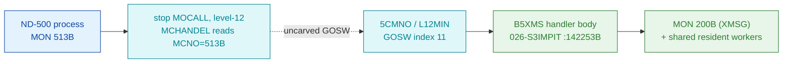

# MON 513B (octal) — XMSGCallB (B5XMS)

The buffer-carrying entry into the ND-500 → ND-100 XMSG gateway. It decodes the XMSG
function number from the ND-500 message buffer, demuxes through a jump table to the right
subfunction, calls shared resident XMSG workers, and issues the underlying `MON 200B` (XMSG)
on behalf of the ND-500 process. It shares one code body byte-for-byte with MON 512B
(`A5XMS`); both symbols resolve to the same entry `142253B`.

**Status:** handler body is real SINTRAN L bytes (carved, control-flow closed); the entry
`142253B` = `B5XMS` is L07-symbol-proven; the level-12 GOSW dispatch that reaches it and the
shared XMSG workers it calls live in an uncarved resident overlay (see [Honest caveats](#honest-caveats)).
All addresses/values are **octal**.

- **Full disassembly:** [`513B-XMSGCallB.ASM`](513B-XMSGCallB.ASM) — the actual code, one region (the level-12 handler body, entry + jump table + tails).
- **Bytes live once in** the canonical segment layer: [`../../segments-ref/`](../../segments-ref/).

---

## Dispatch path

MON 513B is an **ND-500 level-12 call** (call number `513B ≥ 0400`): it is **not** dispatched
through the ND-100 GOTAB. The `GOTAB[513]` word lands on `T108R`, a 1-word filler stub, and
must not be presented as the handler.

The dashed hop (`B ⇢ C`) is the resident level-12 GOSW dispatch (`5CMNO`/`L12MIN`, index 11) —
it is **not present in any carved segment**, so it is inferred, not followed statically.

---

## Code location (dispatch path)

Every carved row is a real region you can open. Byte offset = `(addr − loadbase)` in octal words × 2.

| Role | Segment (full disasm) | Addr range (octal) | Byte offset | Symbol | Verdict |
|------|------------------------|--------------------|-------------|--------|---------|
| GOTAB[513] slot (NOT this call path) | [commoncode.asm](../../segments-ref/SINTRAN-DATA_commoncode/SINTRAN-DATA_commoncode.asm) · [.hex](../../segments-ref/SINTRAN-DATA_commoncode/SINTRAN-DATA_commoncode.hex) | word at `071746B` (1 word) | 59340 | `T108R` filler = `057557B` | **MISATTRIBUTED** |
| Level-12 GOSW dispatch (5CMNO index 11) | — (uncarved resident image) | — | — | `5CMNO` / `L12MIN` | **UNVERIFIED** (inferred) |
| Handler body (shared with 512B) | [026-S3IMPIT.asm](../../segments-ref/026-S3IMPIT/026-S3IMPIT.asm) · [.hex](../../segments-ref/026-S3IMPIT/026-S3IMPIT.hex) | `142253B–142611B` (223w) | 74070 | `B5XMS` = `A5XMS` = `142253B` | **VERIFIED** |
| Shared XMSG workers (via pointer words 142433–142437, 142631+) | — (uncarved resident image) | — | — | resident XMSG workers | **UNVERIFIED** |

Handler byte offset: `(142253B − 32000B) = 110253B = 37035 dec`, `× 2 = 74070`.

**Verify by hand:** `grep '^142253 ' ../../segments-ref/026-S3IMPIT/026-S3IMPIT.hex` → byte offset `74070`;
then `dd if=../../../segments/026-S3IMPIT.bin bs=1 skip=74070 count=8 | od -An -tx1` → `cc 7b 52 57 f7 41 c6 c0`
(= octal `146173 051127 173501 143300`, the `B5XMS` entry — matches the local `513B-XMSGCallB.bin` head, sha256
`fc9553472ab54c6d28302488b1e6a8bc79d5023e62f2d57d55cde26b8d2a82c1`).

---

## Instruction walkthrough

Full listing: [`513B-XMSGCallB.ASM`](513B-XMSGCallB.ASM). Addresses octal.

**Entry / prologue (142253–142263)** — loads a pointer via `LDT I 127`, indexes with `AAX 101`
+ `LDATX` to fetch a field from the ND-500 message/PIT block, masks it (`AND 125`), then computes
`AAA -57` and `SKP IF 0 GRE SA`. If the value is out of the low range it jumps to the generic tail
at `142420` (`JMP 135`).

**Range/validity check (142264–142271)** — re-indexes (`AAX -131`, `LDATX`), `JAF 26` to the
dispatch decoder at `142314`; else `SKP IF DA UEQ SD` and `JMP I 114 → 142405` (error/return path).

**First XMSG issue (142272–142302)** — builds arguments (`AAX 140`, `LDATX`, `SAT 43`,
`RADD CLD 0 DL`) and executes `MON 200` at `142277` — the underlying XMSG monitor call. On return
`JMP I 105 → 142405`; a second guard `SKP IF DT GRE 0` selects success (`142303`) vs. error
(`JMP I 104 → 142406`).

**Function dispatch table (142314–142402)** — at `142314` it re-reads the message function field
(`LDT I 66`, `AAX 101`, `LDATX`, `AAX -101`, `AND 63`), forms an index with `RADD SA DP`, then falls
into a dense **jump table** (`142324–142402`) of ~55 entries. Most slots funnel to a small set of
shared tails: `142420` (generic), `142445`, `142454`, and the pointer-indirect handlers
`142410/142411/142412` (`SBYT` data words used as JMP-I targets), `142413/142414 → 142555`,
`142415 → 142567`, `142416 → 142574`. This is the per-XMSG-subfunction demux (LFREA/LFWRI/LFWRT
and siblings).

**Shared worker calls via pointers (142420–142453)** — the `142420` block sets up (`SAA -22`,
`SAD SHR 20`, `SAT 1`) and calls shared workers through indirect `JPL I` using the pointer words at
`142433–142437`. Those pointer words are **DATA** (addresses of common XMSG worker routines living
elsewhere in the resident image), not executable here. `142445` loads a buffer descriptor chain
(`AAX 104`, `LDDTX/LDATX/LDXTX`) and joins the exit at `142611`.

**Result marshalling (142454–142610)** — the `142504–142535` block does the heavier work: strings
of `STATX/STZTX/LDDTX/STDTX` build/copy the return descriptor and call out via `JPL I 103 →
142640/142641` and `JMP I 103 → 142642` (more resident-worker pointers). Several near-identical tails
(`142545`, `142555`, `142562`, `142567`, `142574`, `142604`) each reload a descriptor at a different
offset and converge on `142611`. The `142454` and `142574` tails include an error branch
`SAA -36` / `JMP I → 142631` (negative error code −36 = XMSG error return).

**Exit (142611+)** — `LDT I 24 …` restores context and returns to the level-12 dispatcher; the
return/skip is via saved pointer words at `142631/142633/142640`, just past the carved-for-closure
window edge.

Plain language: fetch XMSG function code from the ND-500 message block → validate/range-check →
demux through the jump table to the correct subfunction → call shared resident XMSG worker(s) via
indirect pointers → issue `MON 200B` (XMSG) and/or copy the data buffer → marshal the result/error
code back into the message block → return to the level-12 gateway.

---

## Parameter / register contract

Inputs (ND-500 message-buffer / PIT fields):

| Reg / field | Dir | Meaning | Verdict |
|-------------|-----|---------|---------|
| XMSG function number (`LDT I 127` + `AAX 101`, later `AND 63`) | in | selects the XMSG subfunction | VERIFIED (decoded at 142253–142322) |
| data buffer descriptor (`AAX 104` chains) | in | buffer for LFREA/LFWRI/LFWRT | VERIFIED (loaded at 142445/142504) |
| `MON 200B` argument block (`SAT 43`/`SAT 42`, `LDA 76`) | in | passed to underlying XMSG | VERIFIED (built before MON 200 at 142277/142312) |

Outputs:

| Reg / field | Dir | Meaning | Verdict |
|-------------|-----|---------|---------|
| result descriptor written back into msg block (`STATX`/`STDTX`) | out | per-subfunction results | VERIFIED (142504–142535, tails) |
| error code `−36` (`SAA -36`) | out | XMSG error return | VERIFIED (142462, 142602) |
| success vs. error path (`SKP IF DT GRE 0`) | out | branch on MON 200 T-register status | VERIFIED (142301) |
| skip return | out | control returns to the level-12 GOSW via saved pointer words (`142631`+) | inferred |

The exact field-offset names (`+101`, `+104`, `+130`, `+131` …) are indexes into the message/PIT
base register; the L07 table does not resolve these numeric literals to symbolic field names inside
the carved window, so their names are **UNVERIFIED**.

---

## Pseudo-code (for an emulator)

See **[`513B-XMSGCallB.pseudo.c`](513B-XMSGCallB.pseudo.c)** — a pseudo-C model of the handler for
emulator authors, translated line-by-line against the canonical
[`../../instruction-semantics/ND100-INSTRUCTION-SEMANTICS.md`](../../instruction-semantics/ND100-INSTRUCTION-SEMANTICS.md).
Every `LDATX`/`LDXTX`/`LDDTX`/`STATX`/`STZTX`/`STDTX` is modelled as a **24-bit PHYSICAL,
MMU-bypassing** access `phys[EL]` with `EL = ((T & 0xFF) << 16) | ((X + disp3) & 0xFFFF)` — T is the
message-buffer **bank**, X the physical word cursor (reference §5); `RADD CLD` is a register COPY and
`RADD SA DP` is the computed jump `P = P + A` (reference §3). The control flow, the function-field
decode, the jump table, and the two `MON 200B` issue points are byte-verified; the `MON 200B`
skip-return convention, the out-of-carve worker/return pointers (142433–142437, 142631+), and the
per-subfunction semantics are marked `UNVERIFIED` / inferred from the call structure.

---

## Honest caveats

**What is byte-proven:** the handler body at `142253B–142611B` is real SINTRAN L code, carved from
`026-S3IMPIT` (load `32000B`) and control-flow closed (0 direct branches escape the file). The entry
symbol `B5XMS = 142253B` is confirmed by the L07 symbol table, and the first entry word `146173B`
matches the carved `.bin` head (`cc 7b`). `A5XMS` and `B5XMS` both equal `142253B`, so MON 512B and
MON 513B share one body and split on the message function field, not on a separate entry.

**What is NOT proven — reconciling `prove-mon.py`:** `prove-mon.py 513` inspects the **ND-100
GOTAB**, which is *not* the path this call uses. It reports `GOTAB[513] = 057557B` landing on
`T108R`, a 1-word filler stub. That is the expected signature of a slot that is not a real GOTAB
handler: MON 513B is an ND-500 level-12 call dispatched via the level-12 GOSW (`5CMNO`/`L12MIN`,
index 11), which lives in an **uncarved resident overlay**. Anyone reading only `prove-mon` would
wrongly conclude the handler is a 1-word stub. The real handler is `B5XMS = 142253B`, proven by the
L07 symbol table plus the carved byte anchors — hence the GOTAB row above is marked **MISATTRIBUTED**
and the GOSW dispatch row **UNVERIFIED**.

Also unproven: the shared XMSG worker routines reached through pointer words `142433–142437` and
`142631+` live outside the carved window; the exact skip-return contract to the level-12 dispatcher
was not disassembled; and the numeric message-field offsets were not resolved to L07 symbolic names.

One naming note: this README cites `026-S3IMPIT.bin` while `prove-mon` names the overlay
`025-S3IRPIT.bin` — these are the Image vs. Save copy of the same resident `S3MPIT` segment
(load `32000B`); the byte window is identical.

Method: [../../../../../EXTRACTING-RESIDENT-CODE.md](../../../../../EXTRACTING-RESIDENT-CODE.md) §7.6/7.7 · dispatch reality:
[../../TASK-05-mismatches.md](../../TASK-05-mismatches.md) · master map: [../../MON-CALL-INDEX.md](../../MON-CALL-INDEX.md).
