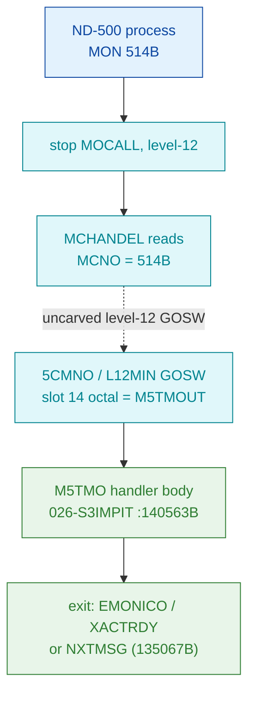

# MON 514B (octal) - ND500TimeOut (M5TMOUT / M5TMO)

Suspends the calling ND-500 program for a given time; the program is placed in a
**time queue inside the ND-500** (not the ND-100) and its execution resumes after
the delay. NPL/handler name **M5TMOUT**; the L symbol table names the entry
**M5TMO=140563B**. All addresses/values are **octal**.

**Status:** handler identity byte-proven (real SINTRAN L bytes at `M5TMO=140563B` in
`026-S3IMPIT`, load `32000B`). Every indirect worker pointer resolves 1:1 to the
M5TMOUT worker set (`SLOCK`, `SUNLOCK`, `XTER500`, `SPITMQ`, `IFM500XQ`, `WN5STATUS`,
`EMONICO`, `XACTRDY`, `NXTMSG`), and the call/exit sequence matches the NPL `M5TMOUT`
routine structure (a **different revision**, whose addresses sit ~200B lower). The
`MON 514B -> M5TMOUT` dispatch crosses an **uncarved level-12 GOSW** table, so that
one link stays UNVERIFIED (see [Honest caveats](#honest-caveats)).

- **Full disassembly:** [`514B-ND500TimeOut.ASM`](514B-ND500TimeOut.ASM) - the actual
  code (M5TMO body + internal continuation tags + inline pointer pools).
- **Bytes live once in** the canonical segment layer:
  [`../../segments-ref/`](../../segments-ref/).

---

## Dispatch path

MON 514B is an **ND-500 level-12 monitor call**. It is **not** dispatched through the
ND-100 monitor `GOTAB` - a `GOTAB[514]` probe is meaningless. It arrives at the handler
via the resident level-12 GOSW, slot **14 octal** (`M5TMOUT`) of the `5CMNO-L12MIN`
GOSW (base `500B`; `514B - 500B = 14` octal = index 12 decimal in the 0-indexed name
list).

The dashed hop (`C -> E`) is the resident level-12 GOSW (`5CMNO-L12MIN`, slot 14
octal) - it is **not present in any carved segment**, so it is the one link that
cannot be followed statically. The GOSW-slot-14 -> `M5TMOUT` mapping is VERIFIED from
NPL (`MP-P2-N500.NPL` lines 1385-1389: `... B5XMSG, M5TMOUT, 5MTRANS, ...`, the 13th
name = index 12 decimal = slot 14 octal); the runtime dispatch remains UNVERIFIED
because the GOSW overlay is uncarved.

---

## Code location (dispatch path)

Every row is a real region you can open. Byte offset = `(addr - loadbase)` in octal
words x 2 (decimal). Handler load base = `32000B`.

| Role | Segment (full disasm) | Addr range (octal) | Byte offset | Symbol | Verdict |
|------|------------------------|--------------------|-------------|--------|---------|
| GOTAB[514] probe | - (ND-500 call, not GOTAB-dispatched) | - | - | (none) | **MISATTRIBUTED** - a `GOTAB[514]` probe is meaningless for a level-12 call |
| Level-12 GOSW dispatch | - (uncarved resident level-12) | `MCHANDEL` reads `MCNO=514B`; `5CMNO-L12MIN` slot 14 octal | - | `5CMNO` / `L12MIN` -> `M5TMOUT` | **UNVERIFIED** - dispatch mechanism, not carved |
| Timeout entry | [026-S3IMPIT.asm](../../segments-ref/026-S3IMPIT/026-S3IMPIT.asm) · [.hex](../../segments-ref/026-S3IMPIT/026-S3IMPIT.hex) | `140563B` | 72422 | `M5TMO=140563B` | **VERIFIED** |
| Restart-reason tag | [026-S3IMPIT.asm](../../segments-ref/026-S3IMPIT/026-S3IMPIT.asm) · [.hex](../../segments-ref/026-S3IMPIT/026-S3IMPIT.hex) | `140600B` | 72448 | `NNT11=140600B` | **VERIFIED** (byte; internal continuation tag) |
| Queue-link tags | [026-S3IMPIT.asm](../../segments-ref/026-S3IMPIT/026-S3IMPIT.asm) · [.hex](../../segments-ref/026-S3IMPIT/026-S3IMPIT.hex) | `140712B` / `140763B` / `141005B` | 72596 / 72678 / 72714 | `NNC16` / `NNC17` / `NNC18` | **VERIFIED** (byte; internal tags reached by the body's own flow) |
| Handler body (closure) | [026-S3IMPIT.asm](../../segments-ref/026-S3IMPIT/026-S3IMPIT.asm) · [.hex](../../segments-ref/026-S3IMPIT/026-S3IMPIT.hex) | `140563B-141026B` (164 words) | 72422 | `M5TMO` .. pool end | **VERIFIED** (self-contained control flow) |
| Next distinct handler | [026-S3IMPIT.asm](../../segments-ref/026-S3IMPIT/026-S3IMPIT.asm) · [.hex](../../segments-ref/026-S3IMPIT/026-S3IMPIT.hex) | `141027B` | 72750 | `NOUTS`/`DVIO=141027B` (MON 504B) | **VERIFIED** (excluded from this carve) |

**Verify by hand:** `grep '^140563 ' ../../segments-ref/026-S3IMPIT/026-S3IMPIT.hex`
-> byte offset `72422`; then
`dd if=../../../segments/026-S3IMPIT.bin bs=1 skip=72422 count=8 | od -An -tx1`
-> `ba 67 c9 00 52 66 f7 ff` (= octal `135147 144400 051146 173777`, the M5TMO entry
`JPL I 147` (-> `SLOCK`) `/ RAND 0 0 / LDT I 146 / AAX -1`).

---

## Instruction walkthrough

Full listing: [`514B-ND500TimeOut.ASM`](514B-ND500TimeOut.ASM). The 164-word window is
one self-contained routine (control-flow closure confirmed - all 13 direct branches
land inside `140563B..140773B`). Two embedded **pointer/parameter pools** the
disassembler mis-renders as instructions are DATA, not code:
`140732B..140752B` (jumped over by `140731 JMP -> 140753`) and `141022B..141026B`.

**Indirect worker pointers, resolved against L07 symbols** - the identity proof. Each
pointer word resolves one-to-one to the M5TMOUT worker set (the same calls, in the
same order, as the NPL `M5TMOUT` routine):

| Ptr word | Value | Symbol (L07, 5-char) | Worker |
|----------|-------|----------------------|--------|
| 140732 | 023706 | `SLOCK` | SLOCK - take the ND-500 driver lock |
| 140734 | 024041 | `SUNLO` | SUNLOCK - release the driver lock |
| 140736 | 145372 | `XTER5` | XTER500 - terminate/clear ND-500 timer (role inferred) |
| 140737 | 023320 | `SPITM` | SPITMQ - set restart reason into queue (role inferred) |
| 140740 | 145466 | `XACTR` | XACTRDY - reactivate ND-500 executor queue |
| 140741 | 135067 | `NXTMS` | NXTMSG - handle next ND-500 message (exit) |
| 140742 | 023021 | `EMONI` | EMONICO - restart ND-500 proc with error |
| 140745 | 022704 | `IFM50` | IFM500XQ - fix proc into ND-500 time queue (role inferred) |
| 140746 | 023670 | `WN5ST` | WN5STATUS - write ND-500 process status |

**Entry + repeat check (140563..140605).** `140563 JPL I -> SLOCK` takes the ND-500
driver lock. `140565..140571` load the message flag word (`LDT I 146 / AAX -1 / LDATX`,
NPL `5MSFL`) and test the repeat bit (`BSKP ONE 170`). If set, `140572..140575` clear
the bit, `JPL I -> SUNLOCK`, and set the restart reason (`SAA -1`), then fall into the
restart-reason block at `NNT11=140600` (`XTER500 / SPITMQ / XACTRDY / JMP I -> NXTMSG`).

**Parameter validation (140606..140667).** `140606 JPL I -> SUNLOCK`; then the
number-of-time-units parameter is read from the message buffer (NPL `5ADP1`). The
illegal-parameter branch `140614..140620` loads `SAA 174` (error `174`) and leaves via
`EMONICO / XACTRDY / JMP I -> NXTMSG`. A zero count restarts immediately (NPL
`IF D=0 GO N5TMF`). `140623..140632` read and validate the time-unit selector (1..4);
`140633..140667` convert the requested delay into basic time units (the
`SAT`/`SHA`/`RADD` ladder; exact arithmetic inferred).

**Time-queue insertion (140670..141021).** `140670 JPL I -> SLOCK` re-takes the lock;
`140672 JPL I -> IFM500XQ` fixes the process into the ND-500 time queue;
`140674 JPL I -> WN5STATUS` writes the process status. The continuation tags
`NNC16=140712` / `NNC17=140763` / `NNC18=141005` link the entry into the sorted queue
(byte-address <-> word-address conversions; layout inferred). `141020 JPL I -> SUNLOCK`
releases the lock and `141021 JMP I -> NXTMSG` exits - the ND-500 process stays
suspended until its queued restart time.

---

## Parameter / register contract

ND-500 monitor calls pass parameters in the **ND-500 message buffer** (indexed by
`5MBBANK` + field displacement), not in ND-100 A/T/X user registers. The register use
below is level-12 driver-internal. NPL entry (a different revision, so **inferred**
here): `X` = current message, `B` = ND-500 CPU datafield.

| Item | Dir | Meaning | Verdict |
|------|-----|---------|---------|
| `X` / `B` (entry) | in | current message / ND-500 CPU datafield | inferred (NPL M5TMOUT header; not byte-isolated) |
| message flag `5MSFL` (msg) | in | carries the repeat bit `55REP` | inferred (read at `140565..140571`; field displacement UNVERIFIED) |
| NoOfTimeUnits (msg) | in | number of time units to suspend (0 = restart now) | inferred (read via `5ADP1`; exact field UNVERIFIED) |
| TimeUnit (msg) | in | 1=1/50 s, 2=s, 3=min, 4=hour | inferred (validated 1..4 at `140623..140632`; NPL/reference manual) |
| ReturnStatus (msg) | out | restart cause: 0=elapsed, 1=interrupt, -1=repeat | inferred (reference manual; `SAA -1` repeat reason is byte-visible) |
| Error `174` (`EC174`) | out | illegal parameter -> `EMONICO` | VERIFIED (`SAA 174` byte) |
| Exit | out | `EMONICO`/`XACTRDY` (error/restart) or `NXTMSG` (queued) | VERIFIED (indirect ptrs resolve) |
| Skip-return | - | none in the ND-100 sense; control leaves via the workers above | VERIFIED (none in-window) |

---

## Pseudo-code (for an emulator)

See **[`514B-ND500TimeOut.pseudo.c`](514B-ND500TimeOut.pseudo.c)** - a pseudo-C model of
the timeout/suspend worker for emulator authors. Control flow, the nine indirect worker
pointers (`SLOCK`, `SUNLOCK`, `XTER500`, `SPITMQ`, `IFM500XQ`, `WN5STATUS`, `EMONICO`,
`XACTRDY`, `NXTMSG`), and the `SAA 174` error path are byte-verified; the time-unit
conversion arithmetic and the message-field layout are inferred from the code structure
and the NPL `M5TMOUT` routine (a different revision than L). ND-500 parameters are
passed in the ND-500 message buffer, not in A/T/X.

Every instruction is translated per
[`../../instruction-semantics/ND100-INSTRUCTION-SEMANTICS.md`](../../instruction-semantics/ND100-INSTRUCTION-SEMANTICS.md)
(the authoritative ND-100 semantics reference). The handler reads and writes that
message buffer with the T/X **physical** transfers `LDATX` / `STATX` / `LDDTX` /
`STDTX`: these form a 24-bit **PHYSICAL** address
`EL = ((T & 0377) << 16) | ((X + disp3) & 0177777)` where `T` is the memory bank (the
ND-500 message-buffer bank `5MBBANK`) and `X` the word offset - the access
**bypasses the MMU / page tables** (reference section 5). `disp3 = 0` here because
the code pre-adjusts `X` with `AAX`.

---

## Honest caveats

**What is byte-proven:** the handler at `M5TMO=140563B` is real SINTRAN L code carved
from `026-S3IMPIT` (load `32000B`). Two independent anchors agree: (1) `M5TMO=140563`
in the L07 symbol table (`SYMBOL-2-LIST`), and (2) every indirect worker pointer
resolves to exactly the M5TMOUT worker set (`SLOCK`, `SUNLOCK`, `XTER500`, `SPITMQ`,
`IFM500XQ`, `WN5STATUS`, `EMONICO`, `XACTRDY`, `NXTMSG`) called in the same order as
the NPL `M5TMOUT` routine. The illegal-parameter error path (`SAA 174 -> EMONICO`) is
byte-verified. The carved slice is byte-identical to the canonical segment (`dd` above
reproduces the entry words).

**Closure note (why the window is 140563..141026).** All 13 direct branches
(`JMP -24 -> 140576`, `JAZ -> 140621`, `JMP 22 -> 140753`, etc.) land inside
`140563B..140773B`. The internal continuation tags `NNT11=140600`, `NNC16=140712`,
`NNC17=140763`, `NNC18=141005` are this routine's own labels (they match the NPL
`M5TMOUT` internal `*NNT11=*` / `*NNC16,` / `*NNC17,` / `*NNC18,` markers), not separate
handlers. The genuinely next handler, `NOUTS`/`DVIO=141027B` (MON 504B OutputString),
is **excluded**. Closing the control flow to `141026` includes this routine's body plus
its two trailing pointer pools without swallowing a foreign routine.
`validate-mon-carves.py` confirms SIZE/CONTIG/CLOSURE with zero direct escapes.

**What is NOT proven:**
- **The dispatch.** MON 514B is an ND-500 level-12 call; it is not in `GOTAB` (a
  `GOTAB[514]` probe is meaningless). The real path is the resident level-12 GOSW
  (`MCHANDEL` reads `MCNO`, `5CMNO-L12MIN` slot 14 octal = `M5TMOUT`), which is in an
  uncarved overlay and cannot be followed statically. The GOSW-slot-14 -> `M5TMOUT`
  mapping is VERIFIED from NPL; the runtime arrival is UNVERIFIED.
- **The exact parameter fields.** The message-flag/repeat-bit displacement, the
  NoOfTimeUnits (`5ADP1`) and TimeUnit (`5ADP2`) fields, and the ReturnStatus
  write-back are read from the ND-500 message buffer whose exact displacements are not
  byte-isolated in this window - marked inferred.
- **The time arithmetic.** The convert-to-basic-time-units ladder and the sorted
  time-queue insertion (`NNC16`/`NNC17`/`NNC18`) are structurally matched to the NPL
  but not independently byte-decoded field by field - inferred.
- **NPL is a different revision than L.** NPL places `M5TMOUT` at `140363B` (~200B
  lower) and the L bytes place `M5TMO=140563B`; only the behaviour, tag names, and
  worker call order carry over - the worker names were re-verified against the L07
  pointer words above.

Confirming the full chain needs a live trace (break at the level-12 GOSW on a real
ND-500 `MON 514B`, single-step, confirm P lands on `M5TMO=140563`).

---

Method: [../../../../../EXTRACTING-RESIDENT-CODE.md](../../../../../EXTRACTING-RESIDENT-CODE.md) §7.6/7.7 · dispatch reality:
[../../TASK-05-mismatches.md](../../TASK-05-mismatches.md) · master map: [../../MON-CALL-INDEX.md](../../MON-CALL-INDEX.md).
