# MON 53B (octal) — GetSegmentEntry (RSEGM)

> **CORRECTED 2026-07-15 (byte-verified).** The worker + dispatch described below are on the
> DEBUNKED model and are WRONG. Byte truth from the carved L07 image:
> `MCTAB[53B] = 005673B = MRSEG=040232B` in segment 003-S3CP, reached by the real dispatch
> `MON 53B -> ENT14(072167B) -> GOTAB[53B]=MFELL(072114B) -> CALLP(032201B) -> MCTAB[53B]=MRSEG`.
> Any "GOTAB from commoncode" / "uncarved CALLPROC bridge" / "F16xx stub" / old worker name below
> is an artefact of the wrong table. Verified: `dd if=044-S3IDPIT.bin bs=1 skip=1910 count=2`
> -> `41 9a`. Cross-ref ../317B-ExecuteCommand/README.md and SINTRAN/CARVING-HANDOFF.md sec 3a.

Returns the 5-word segment-table entry for an ND-100 segment. You pass a segment number
(0 = RT common) and receive a 5-word (10-byte) buffer describing that segment. See the
SINTRAN III Real Time Guide (ND-860133); use `GetSegmentNo` (MON 322B) to turn a segment
name into a number. This is an ND-100 monitor call.

**Status:** GOTAB dispatch head byte-proven (`GOTAB[53B] = 121174B`, the `F1634` level-14
entry thunk in `025-S3IRPIT`). `F1634`'s first instruction is an indirect `JMP` through a
link cell into a **resident** routine (`010341B`) that is **not carved**, so the actual
segment-entry worker is past an uncarved bridge. The manual short name `RSEGM` resolves to
`RSEGM=000021B` — a **data constant**, not a code address — so there is **no separate worker
body** to disassemble (see [Honest caveats](#honest-caveats)). All addresses/values are **octal**.

- **Full disassembly:** [`53B-GetSegmentEntry.ASM`](53B-GetSegmentEntry.ASM) — the `F1634` entry thunk (dispatch head + its link-cell table).
- **Bytes live once in** the canonical segment layer: [`../../segments-ref/`](../../segments-ref/).

---

## Dispatch path

```mermaid
flowchart LR
    A["User program<br/>MON 53B"] --> B["ENT14 level-14<br/>T = MON number"]
    B --> C["GOTAB[53B] = 121174B<br/>(byte-proven)"]
    C --> D["F1634 entry thunk<br/>025-S3IRPIT :121174B<br/>JMP I -> 010341B"]
    D -.uncarved resident routine.-> E["segment-entry worker<br/>resident :010341B (NOT CARVED)"]
    E --> F["RSEGM = 000021B<br/>data constant, NOT code"]
    class A blue
    class B,C,D teal
    class E green
    class F orange
    classDef blue fill:#E3F2FD,stroke:#0D47A1,color:#0D47A1
    classDef teal fill:#E0F7FA,stroke:#00838F,color:#00838F
    classDef green fill:#E8F5E9,stroke:#2E7D32,color:#2E7D32
    classDef orange fill:#FFF3E0,stroke:#E65100,color:#E65100
```

The dashed hop (`D ⇢ E`) is the resident routine reached by `F1634`'s indirect `JMP` — it is
**not present in any carved segment**, so it is the one link that cannot be followed
statically. `RSEGM` (F, orange) is only a data constant (`000021B`), not the worker's code.

---

## Code location (dispatch path)

Every row is a real region you can open. Byte offset = `(addr − loadbase)` in octal words × 2 (decimal).

| Role | Segment (full disasm) | Addr range (octal) | Byte offset | Symbol | Verdict |
|------|------------------------|--------------------|-------------|--------|---------|
| GOTAB[53] dispatch word | [commoncode.asm](../../segments-ref/SINTRAN-DATA_commoncode/SINTRAN-DATA_commoncode.asm) · [.hex](../../segments-ref/SINTRAN-DATA_commoncode/SINTRAN-DATA_commoncode.hex) | `071306B` (1 word) | 58764 | `GOTAB+53` = `121174B` | **VERIFIED** |
| F1634 entry thunk | [025-S3IRPIT.asm](../../segments-ref/025-S3IRPIT/025-S3IRPIT.asm) · [.hex](../../segments-ref/025-S3IRPIT/025-S3IRPIT.hex) | `121174B–121214B` (17w) | 56568 | `F1634` | **VERIFIED** (bytes); dispatch target |
| resident routine (via link cell) | — (uncarved) | `010341B` | — | link cell `121211` | **UNVERIFIED** |
| RSEGM named symbol | [SYMBOL-1-LIST](../../../../../../../SINTRAN/NPL-SOURCE/SYMBOLS/L07/SYMBOL-1-LIST.SYMB.TXT) | `000021B` | — | `RSEGM` | **DATA CONSTANT** (not code) |

**Verify by hand:** the GOTAB word first —
`grep '^71306 ' ../../segments-ref/SINTRAN-DATA_commoncode/SINTRAN-DATA_commoncode.hex`
→ `71306  121174  242 174  58764`; confirm from the canonical bin
`dd if=../../../resident/SINTRAN-DATA_commoncode.bin bs=1 skip=58764 count=2 2>/dev/null | od -An -tx1`
→ `a2 7c` (a stored word `121174B`). Then the `F1634` thunk head:
`grep '^121174 ' ../../segments-ref/025-S3IRPIT/025-S3IRPIT.hex` → byte offset `56568`; then
`dd if=../../../segments/025-S3IRPIT.bin bs=1 skip=56568 count=8 2>/dev/null | od -An -tx1`
→ `aa 0d 51 11 cc 73 09 0a` (= octal `125015 050421 146163 004412` = `JMP I 15` / `LDT ,B 21` /
`RADD CLD ST DB` / `STA ,B 12`, the `F1634` entry). `prove-mon.py 53` reads the same GOTAB word.

---

## Instruction walkthrough

Full listing: [`53B-GetSegmentEntry.ASM`](53B-GetSegmentEntry.ASM). One region — the `F1634`
level-14 entry thunk, bounded strictly to the next symbol `BOSIZ=121215B` (17 words).

**F1634 head (`121174-121200`).** `GOTAB[53]` lands on `121174 JMP I 15`, an **unconditional
indirect jump** through link cell `121211B` (content `010341B`) into the resident monitor. That
single instruction is the entire MON 53 dispatch step — the segment-entry read happens in the
uncarved resident routine `010341B`. The three following words (`121175 LDT ,B 21`,
`121176 RADD CLD ST DB` = `B = T`, `121177 STA ,B 12`) plus the second `121200 JMP I 11`
(same cell `121211B`) are the shared `F163x`-family level-14 handling reached by sibling stubs
(the family runs `F1630=121050` … `F1637=121273`, 21-word stride) — not the MON 53 entry step.

**Link-cell table (`121201-121214`).** These 12 words are a **pointer table (data)**, not code;
`nd100-dis` renders them as bogus `FDV`/`MPY`/`STZ`/`ADD` instructions. Their contents are
routine addresses (e.g. cell `121211B = 010341B`, the target of both `JMP I` above). The
sibling `F1630` stub (MON 43) calls into this same table (`JPL I 123 → 121201B`), which is why
`F1634`'s range holds shared family code and link cells.

---

## Parameter / register contract

Manual-side names/types are from
[`53B_GetSegmentEntry.yaml`](../../../../../../../Developer/MON/calls/53B_GetSegmentEntry.yaml)
(MAC form: `LDA (PAR / MON 53 / JMP ERROR`, with `PAR` = `SEGNO` then `BUFF`).

| Reg / field | Dir | Meaning | Verdict |
|-------------|-----|---------|---------|
| entry point | in | `121174B` = `F1634`, the `GOTAB[53]` level-14 thunk | VERIFIED (bytes) |
| `A` (param-list addr) | in | address of `{SegmentNumber, Buffer}` (MAC `LDA (PAR`) | inferred (manual) |
| `SegmentNumber` | in | segment number; `0` = RT common | inferred (manual) |
| `Buffer` | out | 5-word (10-byte) segment-table entry | inferred (manual) |
| error return | out | standard error code (`JMP ERROR` after MON 53) | inferred (manual) |
| resident worker | internal | `010341B` (via link cell `121211`) performs the actual read | **UNVERIFIED** (uncarved) |

The dispatch thunk is byte-proven; every field meaning lives in the caller-side `MON 53`
wrapper and the uncarved resident routine, so the register-to-field assignment is **inferred**.

---

## Pseudo-code (for an emulator)

See **[`53B-GetSegmentEntry.pseudo.c`](53B-GetSegmentEntry.pseudo.c)** — a pseudo-C model.
Only the `F1634` entry thunk (`JMP I → 010341B`) is byte-verified; because the resident routine
`010341B` is **uncarved** and `RSEGM=000021B` is a data constant (not a code body), the
5-word segment-entry copy is modelled from the **documented** behaviour only, NOT carved code.

Every instruction is translated against the canonical
[ND-100 instruction semantics reference](../../instruction-semantics/ND100-INSTRUCTION-SEMANTICS.md)
— `JMP I N` = `PC = EA` (indirect), `LDT` = `T = mem[EA]`, and `RADD CLD ST DB` = `B = T`
(the `RADD CLD S<src> D<dst> = dst = src` copy form, verified there).

---

## Honest caveats

**What is byte-proven:** `GOTAB[53B] = 121174B` (level-14 dispatch; `prove-mon.py 53` reads
commoncode file byte `0xe58c`); the `F1634` thunk at `121174B` in `025-S3IRPIT` is real code
(entry bytes `125015 050421 146163 004412`); and its first instruction is an indirect `JMP`
through link cell `121211B` (= `010341B`).

**What is NOT proven:** anything about the segment-entry worker body. `F1634` immediately jumps
into the resident routine `010341B`, which is in an **uncarved** overlay — so the read that
fills the caller's 5-word buffer cannot be read from these bytes. And the manual short name
`RSEGM` resolves (L07 `SYMBOL-1-LIST`) to `RSEGM=000021B`, a value far below any ND-100 segment
load base (`≥ 32000B`): it is a **data constant / table index**, not a worker address, so there
is no `RSEGM` code region to carve.

This reconciles into one story: the dispatch head (`GOTAB[53]=121174B → F1634`) is solid and
byte-proven; `F1634` is a thin thunk that `JMP`-indirects into the resident monitor; the real
segment-entry read lives in the uncarved resident routine `010341B`; and `RSEGM` is only a data
constant, not the worker. Confirming the worker needs a live trace (break at `121174B` on a real
`MON 53`, single-step the `JMP I` into `010341B`, and record where P lands).

---

Method: [../../../../../EXTRACTING-RESIDENT-CODE.md](../../../../../EXTRACTING-RESIDENT-CODE.md) §9 · dispatch reality:
[../../TASK-05-mismatches.md](../../TASK-05-mismatches.md) §G · master map: [../../MON-CALL-INDEX.md](../../MON-CALL-INDEX.md).
