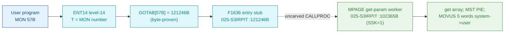

# MON 57B (octal) - GetUserParam (PAGEI)

Gets the 5 user parameters of a background program (why the last program terminated).
SetUserParam (MON 56B) sets them. Background programs only.

**Status:** GOTAB dispatch head byte-proven (`GOTAB[57B] = 121246B`), pointing at the
shared entry-stub block `F1636` in `025-S3IRPIT`; the `MPAGE` worker body is real
SINTRAN L bytes in the second-level monitor segment `025-S3IRPIT` (a `SYMBOL-2-LIST`
symbol). `MPAGE=102365B` (this call) is the GET entry of a **shared set/get body** whose
SET entry is `MPASE=102363B` (MON 56B); the `SSK` skip flag selects which. The stub
block does not itself reach `MPAGE`; the exact `MON 57 -> worker` link crosses an
uncarved kernel bridge (see [Honest caveats](#honest-caveats)). All addresses/values
are **octal**.

- **Full disassembly:** [`57B-GetUserParam.ASM`](57B-GetUserParam.ASM) - the actual code, both regions (F1636 entry stub + the shared MPASE/MPAGE worker).
- **Bytes live once in** the canonical segment layer: [`../../segments-ref/`](../../segments-ref/).

---

## Dispatch path

The dashed hop (`D -> E`) is the resident `CALLPROC`/segment-switch - it is **not
present in any carved segment**, so it is the one link that cannot be followed
statically. The stub `F1636` sits in a shared stub block whose own branches leave its
window; it is not a self-contained named handler and the worker address `102365` does
not occur inside the stub.

---

## Code location (dispatch path)

Every row is a real region you can open. Byte offset = `(addr - loadbase)` in octal
words x 2; for `025-S3IRPIT` (load base `32000B`) it is `(addr - 32000B) x 2`.

| Role | Segment (full disasm) | Addr range (octal) | Byte offset | Symbol | Verdict |
|------|------------------------|--------------------|-------------|--------|---------|
| GOTAB[57] dispatch word | [commoncode.asm](../../segments-ref/SINTRAN-DATA_commoncode/SINTRAN-DATA_commoncode.asm) - [.hex](../../segments-ref/SINTRAN-DATA_commoncode/SINTRAN-DATA_commoncode.hex) | `071312B` (1 word) | 58772 | `GOTAB+57` = `121246B` | **VERIFIED** |
| F1636 entry stub | [025-S3IRPIT.asm](../../segments-ref/025-S3IRPIT/025-S3IRPIT.asm) - [.hex](../../segments-ref/025-S3IRPIT/025-S3IRPIT.hex) | `121246B-121270B` (shared block) | 56652 | `F1636` | **VERIFIED** (GOTAB target); shared stub block |
| resident CALLPROC bridge | - (uncarved) | - | - | `CALLPROC` | **UNVERIFIED** |
| MPASE/MPAGE worker body | [025-S3IRPIT.asm](../../segments-ref/025-S3IRPIT/025-S3IRPIT.asm) - [.hex](../../segments-ref/025-S3IRPIT/025-S3IRPIT.hex) | `102363B-102406B` (code) + `102407B-102412B` (link cells) | 41450 | `MPAGE`=102365B (SSK=1) / `MPASE`=102363B (SSK=0) | real bytes = **CODE**; body link **MISATTRIBUTED** |

The worker window is bounded strictly by the next symbol `RERRP=102413B` (a different
handler). Words `102363B-102406B` are code and `102407B-102412B` are a pointer table
(link cells) - one of them, `102410B`, is the `USPAR=145445B` constant - they are
**data**.

**Verify by hand:** the GOTAB word:
`grep '^71312 ' ../../segments-ref/SINTRAN-DATA_commoncode/SINTRAN-DATA_commoncode.hex`
-> `71312  121246  242 246  58772`; then
`dd if=../../../resident/SINTRAN-DATA_commoncode.bin bs=1 skip=58772 count=2 2>/dev/null | od -An -tx1`
-> `a2 a6` (word = `121246B`). The stub head:
`dd if=../../../segments/025-S3IRPIT.bin bs=1 skip=56652 count=2 2>/dev/null | od -An -tx1`
-> `f7 01` (= octal `173401`, `AAX 1`, matching the disassembly). The MPAGE worker
entry: `grep '^102365 ' ../../segments-ref/025-S3IRPIT/025-S3IRPIT.hex` -> byte offset
`41450`; then
`dd if=../../../segments/025-S3IRPIT.bin bs=1 skip=41450 count=2 2>/dev/null | od -An -tx1`
-> `f8 90` (= octal `174220`, `BSET ONE SSK`, the MPAGE get entry). `prove-mon.py 57`
reads the same GOTAB value.

---

## Instruction walkthrough

Full listing: [`57B-GetUserParam.ASM`](57B-GetUserParam.ASM). Two regions.

**Region A - F1636 stub (`121246-121270`)** is the GOTAB target in `025-S3IRPIT`. It
sits inside a shared stub block; its head (`AAX 1` / `SWAP SD DX` / `LDT I ,X 51` /
`SKP IF DA EQL ST`) branches out of its own window (`JMP 44 -> 121316`,
`JMP -15 -> 121237`), so it is not a self-contained per-call handler; the real transfer
to the worker is the resident `CALLPROC`, which a static decode cannot follow.

**Region B - MPASE/MPAGE worker (`102363-102412`)** is the shared body.
`102363 BSET ZRO SSK` is the SET entry (MPASE, MON 56B); `102365 BSET ONE SSK` is the
GET entry (MPAGE, this call). Both join at `102366 JPL I 21 -> [102407]` (get the array
address); `102367 SAA 4` / `102370 MST PIE` enter the monitor level; `102371 BSKP ONE
SSK` forks - the GET side (this call) puts `USPAR` in `D` and the user array in `T`.
`102402 SAX 5` / `102404 JPL I 5 -> [102411]` runs `MOVUS` to copy the 5 words; `102405
STZ ,B 12` clears the status and `102406 JMP I 4 -> [102412]` returns.

---

## Parameter / register contract

Manual-side names/types are from [`57B_GetUserParam.yaml`](../../../../../../../Developer/MON/calls/57B_GetUserParam.yaml).

| Reg / field | Dir | Meaning | Verdict |
|-------------|-----|---------|---------|
| `Buff` (5 words) | out | `[0]` dir/user index, `[1]` terminal LDN, `[2]` error number (-1 if ESCAPE), `[3..4]` user-defined | inferred (manual) |
| entry point | in | `102365B` = get (this call); `102363B` = set (shared body, `SSK` split) | VERIFIED (bytes) |
| `SSK` | internal | set (0) / get (1) direction selector (`BSKP ONE SSK` at `102371`) | VERIFIED (bytes) |
| `B+20` (D0) | internal | user-array pointer used as one side of the `MOVUS` copy | VERIFIED (bytes); meaning inferred |
| `USPAR`=145445B | internal | system-side parameter array (the other `MOVUS` side) | VERIFIED (bytes) |
| `A` | out | status word cleared to 0 on success (`102405 STZ ,B 12`) | VERIFIED (bytes); meaning inferred |

---

## Pseudo-code (for an emulator)

See **[`57B-GetUserParam.pseudo.c`](57B-GetUserParam.pseudo.c)** - a pseudo-C model for
emulator authors. The control flow (the `SSK` set/get split taking the get branch, the
monitor entry, the 5-word `MOVUS` copy and the zeroed return status) is byte-verified;
the buffer layout is inferred from the manual and the monitor-call source shape.

Every instruction in the pseudo-code is translated against the canonical
[ND-100 instruction semantics reference](../../instruction-semantics/ND100-INSTRUCTION-SEMANTICS.md)
(`BSET ZRO/ONE SSK` clear/set skip flag, `JPL I` indirect call, `SAA` set A, `MST PIE`
mask-set, `BSKP ONE SSK` skip-if-set, `RADD CLD SA DD` copy idiom, `LDA`/`LDT ,B`
frame loads, `SAX` set X, `JMP I` indirect return).

---

## Honest caveats

**What is byte-proven:** `GOTAB[57B] = 121246B` (`prove-mon.py 57` reads commoncode
file byte `0xe594 = a2 a6`); that value read as a `025-S3IRPIT` address is the `F1636`
stub, whose bytes decode cleanly (`173401B = AAX 1`). The `MPAGE`/`MPASE` shared worker
at `102363B` in `025-S3IRPIT` is real code (first word `174020B = BSET ZRO SSK`) and it
is a set/get user-parameter routine (monitor entry, `SSK`-selected copy direction,
`MOVUS` 5-word transfer keyed on the `USPAR` constant), consistent with GetUserParam
and its `MPASE` SET twin.

**What is NOT proven:** the `F1636` stub lands inside a shared stub block whose own
branches leave its window, not a dedicated per-call handler; the actual transfer to
`MPAGE` is the resident `CALLPROC` in an **uncarved overlay**. So the `MON 57 -> MPAGE`
attribution rests on the `MPAGE` symbol name + matching behaviour + the `MPASE` SET
twin, not a followed pointer - hence **MISATTRIBUTED** in the strict sense. The worker's
`JPL I`/`JMP I` link cells (`102407..102412`) are a pointer table whose runtime targets
are not resolved here. Confirming the dispatch link needs a live trace: issue a real
`MON 57`, single-step through the stub and the resident `CALLPROC`, and confirm P lands
on `MPAGE = 102365` with `SSK = 1`.

Method: [../../../../../EXTRACTING-RESIDENT-CODE.md](../../../../../EXTRACTING-RESIDENT-CODE.md) - dispatch reality:
[../../TASK-05-mismatches.md](../../TASK-05-mismatches.md) - master map: [../../MON-CALL-INDEX.md](../../MON-CALL-INDEX.md).
