# MON 60B (octal) - N500M (ND-500 Monitor Function)

The primary gateway by which an ND-100 program controls the ND-500 coprocessor. One `MON 60B`
call selects one of ~67 subfunctions - register and memory access, process control, control-store
(microcode) operations, memory configuration, histogram/logging and domain management. On entry
`A` points to a parameter list whose first word is the subfunction code.

**Status:** **dispatch + worker byte-verified; ALL 47 subfunction folders carved (COMPLETE 2026-07-15).**
The worker `N500M = 030416B` runs in the **5PIT (PIT 5) context**, segment `050-S3I5PIT`, confirmed by
three independent sources (bytes + the L release-doc PIT layout + coherent code). Every distinct
`5IFUNC` handler body is carved from the authoritative worker source `5P-P2-MON60.NPL` into its own
`60B-NNB-NAME/` folder (README + .pseudo.c + verbatim .npl), plus the `5NOPAR` common path and the
error handlers. See [`CARVE-PROGRESS.md`](CARVE-PROGRESS.md) for the full list, and
[`60B-CROSS-ANALYSIS-caller-vs-worker.md`](60B-CROSS-ANALYSIS-caller-vs-worker.md) for the
reconciliation with the `nd-500-mon:prog` caller carve (both sides agree on `5IFUNC`).

**Server side (the `5NOPAR` hand-off target) is now carved too:** the ND-500 system monitor
(`FPT2ENTRY` -> `5FP2E`, segment `030-S3SM5`) with its `FUNCS` dispatch table, 3022 IOX driver,
control-store gate, 5MPM message + activation, level-12 return path, and ALL ~60 FUNCS operation
bodies lives in [`../../ND500-SYSTEM-MONITOR/`](../../ND500-SYSTEM-MONITOR/README.md). The full MON 60B
path is now mapped end to end with named routines at every hop.
Remaining: per-handler `.ASM` (needs the bank-2 5IFUNC address).

- **Disassembly:** [`60B-N500M.ASM`](60B-N500M.ASM) - the N500M dispatcher (050-S3I5PIT).
- **Canonical bytes:** `../../../segments/044-S3IDPIT.bin` (MCTAB), `../../../segments/050-S3I5PIT.bin` (worker).

---

## Dispatch path

```mermaid
flowchart LR
    A["ND-100 program<br/>A -> params; MON 60B<br/>params[0] = subfunction code"] --> B["ENT14 level-14 entry<br/>026-S3IMPIT :072167B"]
    B --> C["GOTAB[60B] = MFELL<br/>:071313B = 072114B"]
    C --> D["MFELL level switch<br/>026-S3IMPIT :072114B"]
    D --> E["CALLP monitor level<br/>:032201B"]
    E --> F["MCTAB[60B] = N500M<br/>MCTAB=005620B :005700B = 030416B"]
    F --> G["N500M worker (5PIT context)<br/>050-S3I5PIT :030416B"]
    G --> H["subfunction dispatch on params[0]<br/>range-check 177B, MPY/ADD jump table"]
    class A blue
    class B,C,D,E,F teal
    class G,H green
    classDef blue fill:#E3F2FD,stroke:#0D47A1,color:#0D47A1
    classDef teal fill:#E0F7FA,stroke:#00838F,color:#00838F
    classDef green fill:#E8F5E9,stroke:#2E7D32,color:#2E7D32
```



**Why the 5PIT overlay is correct** (this was the hard part - see [Overlay resolution](#overlay-resolution)):
the L release doc's Page-Index-Table layout maps `MON 60` into **PIT 5 (5PIT)** at page 13 = virtual
`26000B`, spanning to `40000B`. `N500M=030416B` is in that MON-60 region, and `050-S3I5PIT` ("Image of
5PIT segment") loads at `26000B`. So the monitor runs MON 60 with the 5PIT mapped, and `030416B` in
that context is real N500M code.

---

## Code location (dispatch path)

| Role | Segment | Addr (octal) | Byte offset | Symbol | Verdict |
|------|---------|--------------|-------------|--------|---------|
| level-14 monitor entry | 026-S3IMPIT (base 32000B) | `072167B` | 33006 | `ENT14` | **VERIFIED** |
| GOTAB[60B] slot | 026-S3IMPIT | `071313B` = `072114B` | 32548 | -> `MFELL` | **VERIFIED** |
| MFELL level switch | 026-S3IMPIT | `072114B` | 32920 | `MFELL` | **VERIFIED** |
| CALLP | 026-S3IMPIT | `032201B` | - | `CALLP` | **VERIFIED** (entry) |
| MCTAB[60B] slot | 044-S3IDPIT (base 4000B) | `005700B` = `030416B` | 1920 | -> `N500M` | **VERIFIED** |
| N500M worker entry (5PIT) | 050-S3I5PIT (base 026000B) | `030416B` | 2588 | `N500M` | **VERIFIED** (bytes + release-doc PIT map) |

**Verify by hand** (from `versions/L-VSX-500/segments/`):
```
dd if=044-S3IDPIT.bin bs=1 skip=1920 count=2 | od -An -tx1   ->  31 0e   (= 030416B = N500M)
dd if=050-S3I5PIT.bin  bs=1 skip=2588 count=2 | od -An -tx1   ->  5a 5f   (= 135137B, N500M first word JPL I 137)
dd if=026-S3IMPIT.bin  bs=1 skip=32548 count=2 | od -An -tx1  ->  74 4c   (= 072114B = MFELL)
```

---

## Instruction walkthrough

Full listing: [`60B-N500M.ASM`](60B-N500M.ASM).

**Entry (`030416B`).** `JPL I 137` calls a common prologue; `LDX ,B 20` loads the caller's parameter
pointer from the frame; `LDA I ,X 132` fetches `params[0]` (the subfunction code) through the
alternate page mapping (`BSET ZRO/ONE SSPTM`). `SAT 177 ; SKP IF DT MGRE SX` range-checks the code to
`177B` and branches to the error path if out of range.

**Dispatch.** The routine classifies the code through `SAT <code> ; SKP IF DA/DX UEQ ST` compares
(byte-visible: `40B, 15B, 61B, 145B, 16B, ...`) and at `030544B` computes a jump-table index
(`LDA I 33 ; MPY 33 ; ADD 33 ; RADD CLD SA DX ; LDA ,X 1`). Per-subfunction handlers are being
mapped (see below).

## Subfunction dispatch - byte analysis

**RESOLVED: the jump table is `5IFUNC`.** Full authoritative map (128 entries, code -> handler,
cross-verified 3 ways): **[`60B-5IFUNC-dispatch-table.md`](60B-5IFUNC-dispatch-table.md)**. Source:
`SINTRAN/NPL-SOURCE/NPL/5P-P2-MON60.NPL` (the MON 60 worker's own NPL). The
NPL dispatch `A := 5IFUNC(X) ; A =: P` matches the L07 bytes at `030416B`, and the L07 `SAT 145B`
boundary compare matches `5IFUNC`'s valid/`ILLFUNC` transition at `145B`->`146B`. The caller-side
byte-proven codes (`37B ICSLOAD`, `103B IRSYSP`, `133B ILI5EXQ`, ...) also match.

Documented user-facing names (7 categories, 0B-142B): [`60B-SUBFUNCTIONS-documented.md`](60B-SUBFUNCTIONS-documented.md)
(from manual ND-60.136.04A).

**VERIFIED from the dispatcher bytes:**
- Range check accepts `params[0]` up to `177B` (`SAT 177 ; SKP IF DT MGRE SX` at `030421B-030422B`);
  out-of-range -> error path.
- The dispatcher's category-boundary compares match the documented category starts:
  `SAT 15B` = Category 2 (Process Mgmt) start; `SAT 40B` = Category 3 (Memory Mgmt) start;
  `SAT 61B` = Category 3 end (`61B RESER`). **This alignment is byte-verified and is strong
  independent evidence the worker really is N500M and the documented 7-category structure is real.**
- The jump-table index is `entry = MEM[X+1]` where `X = MEM[<ptr>]*MEM[<n>] + MEM[<base>]`
  (`LDA I 33 ; MPY 33 ; ADD 33` at `030544B-030546B`).

**Open (not yet byte-proven), honest:**
- The jump-table `base`/`stride` operands resolve to words the dispatcher reads at low addresses
  (`~005115B`, and a base `~115542B`) that live in the **common-code overlay** mapped in the 5PIT
  context, NOT inside `050-S3I5PIT` (which starts at `26000B`). Following the table to each handler
  therefore needs the common-code overlay under the 5PIT PIT - next step. Do NOT guess the entries.
- `SAT 145B` appears in the dispatcher but `145B` is beyond the documented max (`142B`). Could be an
  internal limit, an undocumented code, or a B01-vs-L07 version difference - unresolved, flagged.

---

## Per-subfunction folder convention

Each carved subfunction lives in `60B-NNB-NAME/` and contains **four** files:
- `README.md` - dispatch, contract, byte status, emulator relevance.
- `60B-NNB-NAME.pseudo.c` - emulator model.
- `60B-NNB-NAME.npl` - **verbatim copy of the mapping NPL source** from `5P-P2-MON60.NPL` (the
  dispatch context + the 5IFUNC slot + the handler body), as reference. Actual code, no line numbers.
- `60B-NNB-NAME.ASM` - the L07 disassembly of the handler body, ONCE its bank-2 5IFUNC address is
  located (pending; see `60B-5IFUNC-dispatch-table.md`). Until then the folder is README+pseudo.c+npl.

Exemplar: [`60B-037B-ICSLOAD/`](60B-037B-ICSLOAD/).

## Overlay resolution

`030416B` decodes as three different things depending on the mapped PIT context: an ND-500 disk/paging
**data block** in the commoncode/normal overlay (SYMBOL-2-LIST field names `N500M, CMD, NSECT, DSKAD,
MPAGS, PGCOP, PAGTA, SECTA`); **ASCII** in `003-S3CP`; and **code** in `050-S3I5PIT`/`046-S3S5PIT`.
Static symbol matching alone is ambiguous (and `050`'s carver-assigned `N500-SYMBOLS` has no `N500M` -
that assignment is "medium confidence" and wrong). **The tie-breaker is the L release-doc PIT layout**
(`ND-860230-6-EN ... L-Version.md` section 8.2): PIT 5 (5PIT) maps `MON 60` at pages 13-17 =
`26000B-37777B`, which contains `030416B`. That is authoritative for which overlay executes.

## Honest caveats

**Byte-verified:** the dispatch chain and the worker location/entry (backed by the release-doc PIT
map). **Not yet proven:** the mapping from each subfunction code to its handler, and the names in the
documented ~67-function table (`Developer/MON/calls/60B_N500M.yaml`, `60B_N500M_Functions.md` - treat
as documented until matched to the byte-verified compare constants). The behavioural contract (error
codes, privilege, 5MPM/driver interaction) is from the manual, not these bytes. Per-subfunction
folders (`60B-NN-Name/`) will be added as handlers are traced.

Method: `../../../../../EXTRACTING-RESIDENT-CODE.md` · master map: [`../../MON-CALL-INDEX.md`](../../MON-CALL-INDEX.md) ·
ND-500 status: `../../../../../../SINTRAN/ND500/ND500-STATUS-AND-INDEX.md`.
