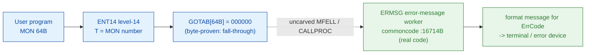

# MON 64B (octal) - WarningMessage (ERMSG)

Outputs a **file-system error message** for the input error code (appendix A lists the message for
each code) and then **returns - the program continues**. The message is written to the terminal;
for batch jobs, mode jobs, and RT programs it is written to the error device (normally the console).
Error code `0` is illegal. This is an ND-100 monitor call.

**Status:** GOTAB dispatch head byte-proven as **fall-through** (`GOTAB[64B] = 000000`, no per-call
stub); the `ERMSG` worker body is real SINTRAN L bytes (executable code, body `16714B-17020B`
closing at `EXIT`) with two entry points - `ERMSG=16714B` (T:=0) and `QERMS=16716B` (T:=1) - and the
exact `MON 64 -> worker` link crosses an uncarved kernel bridge (see
[Honest caveats](#honest-caveats)). All addresses/values are **octal**.

- **Full disassembly:** [`64B-WarningMessage.ASM`](64B-WarningMessage.ASM) - the actual code (the ERMSG worker body; there is no entry stub because the GOTAB slot is zero).
- **Bytes live once in** the canonical segment layer: [`../../segments-ref/`](../../segments-ref/).

---

## Dispatch path

The GOTAB slot is zero, so there is **no per-call entry stub**. The dashed hop (`C ⇢ E`) is the
resident `MFELL`/`CALLPROC` fall-through second-level dispatch - it is **not present in any carved
segment**, so it is the one link that cannot be followed statically. `ERMSG` (E) is the named
commoncode worker for this call and **is** real executable code.

---

## Code location (dispatch path)

Every row is a real region you can open. Byte offset = `(addr - loadbase)` in octal words x 2; for
commoncode (load base `0`) the byte offset is simply `octal-addr x 2` (decimal).

| Role | Segment (full disasm) | Addr range (octal) | Byte offset | Symbol | Verdict |
|------|------------------------|--------------------|-------------|--------|---------|
| GOTAB[64] dispatch word | [commoncode.asm](../../segments-ref/SINTRAN-DATA_commoncode/SINTRAN-DATA_commoncode.asm) · [.hex](../../segments-ref/SINTRAN-DATA_commoncode/SINTRAN-DATA_commoncode.hex) | `71317B` (1 word) | 58782 | `GOTAB+64` = `000000` | **VERIFIED** (fall-through) |
| resident MFELL/CALLPROC bridge | - (uncarved) | - | - | `CALLPROC` | **UNVERIFIED** |
| ERMSG worker body | [commoncode.asm](../../segments-ref/SINTRAN-DATA_commoncode/SINTRAN-DATA_commoncode.asm) · [.hex](../../segments-ref/SINTRAN-DATA_commoncode/SINTRAN-DATA_commoncode.hex) | `16714B-17037B` (body 16714-17020 + link cells) | 15256 | `ERMSG` / `QERMS` | real bytes = **CODE**; body link **MISATTRIBUTED** |

**Verify by hand:** the GOTAB slot:
`grep '^71317 ' ../../segments-ref/SINTRAN-DATA_commoncode/SINTRAN-DATA_commoncode.hex`
-> `71317  000000  000 000  58782` (the GOTAB word = `000000`, fall-through); then
`dd if=../../../resident/SINTRAN-DATA_commoncode.bin bs=1 skip=58782 count=2 2>/dev/null | od -An -tx1`
-> `00 00` (= `000000`, fall-through). For the ERMSG worker first word:
`grep '^16714 ' ../../segments-ref/SINTRAN-DATA_commoncode/SINTRAN-DATA_commoncode.hex`
-> `16714  146106  314 106  15256`; then
`dd if=../../../resident/SINTRAN-DATA_commoncode.bin bs=1 skip=15256 count=2 2>/dev/null | od -An -tx1`
-> `cc 46` (= octal `146106`, ERMSG's first word - a real `RADD` instruction, confirming the region
is code). `prove-mon.py 64` reports the same `GOTAB[64]=000000` fall-through.

---

## Instruction walkthrough

Full listing: [`64B-WarningMessage.ASM`](64B-WarningMessage.ASM). The functional body is the ERMSG
worker; there is no entry stub because `GOTAB[64] = 0`.

**Dual entry (16714-16717)** - `ERMSG=16714B` sets `T:=0` (`RADD CLD 0 DT`) and jumps to the merge
point `16717`; the secondary entry `QERMS=16716B` sets `T:=1` (`SAT 1`) and falls into the same merge
point. The two entries select a message flavour (warning vs alternate), both continuing through one
shared body.

**Store parameters + select source (16717-16746)** - the flag and the caller error code are stored
through the worker's pointer cells (`16717 STT I 102`, `16722 STT I 101`, `16723 STA I 101`). A pair
of `JAF`/`JAZ` tests then chooses the message source and format path, calling the format/lookup
workers via indirect `JPL I` through the trailing link cells (`16731 JPL I 76 -> 17027`,
`16737 JPL I 72 -> 17031`, `16742 JPL I 70 -> 17032`).

**Format + output + return (16747-17020)** - `16750 JPL I 63 -> 17033` and `16753 JPL I 62 -> 17035`
format the message text; the `16766-17011` block (`JAZ` tests, `STATX`) routes the output to the
correct device, and the routine restores context and returns at `17020 EXIT`. Every branch target
lands inside the region, which closes cleanly at the `EXIT`. Words `17021-17037` are pointer/constant
cells (link cells), not code.

---

## Parameter / register contract

Manual-side names/types are from [`64B_WarningMessage.yaml`](../../../../../../../Developer/MON/calls/64B_WarningMessage.yaml).

| Reg / field | Dir | Meaning | Verdict |
|-------------|-----|---------|---------|
| `A` (ErrCode) | in | error code number of the message to print; **0 is illegal** (`MAC` example `LDA ERRNO`) | inferred (manual); stored by `16723 STA I 101` (VERIFIED as a copy) |
| `T` (flavour) | internal | `0` at `ERMSG`, `1` at `QERMS` - selects the message variant | **VERIFIED** (bytes: `16714 RADD CLD 0 DT` / `16716 SAT 1`) |
| output device | out | terminal (interactive) or error device (batch / mode / RT) | inferred (manual) |
| return | out | none - the program continues (`17020 EXIT`) | **VERIFIED** (bytes: `EXIT`, no program-terminate) |

The worker's register staging (the dual-entry flag, the pointer-cell parameter stores, the `EXIT`
return) is VERIFIED from bytes, but the mapping onto the user-visible error-code-in contract and the
device-routing policy lives in the caller-side `MON 64` wrapper and the uncarved CALLPROC frame, so
that part of the contract is **inferred**, not byte-proven here.

---

## Pseudo-code (for an emulator)

See **[`64B-WarningMessage.pseudo.c`](64B-WarningMessage.pseudo.c)** - a pseudo-C model of the
handler for emulator authors. The `ERMSG` worker body (dual entry, parameter stores, format/output,
`EXIT`) is byte-verified; the output-routing policy and the appendix-A message table are inferred
from the manual. The fall-through `-> ERMSG` bridge is modelled but not proven. Every ND-100
instruction in the model is translated per the canonical
[`ND100-INSTRUCTION-SEMANTICS.md`](../../instruction-semantics/ND100-INSTRUCTION-SEMANTICS.md).

---

## Honest caveats

**What is byte-proven:** `GOTAB[64B] = 000000` (level-14 dispatch, a fall-through with no per-call
vector; `prove-mon.py 64` reads commoncode file byte `0xe59e = 00 00`). The `ERMSG` worker body at
`16714B` is real code - its first word `146106B` is a genuine `RADD` instruction, the body
(`16714-17020`, bounded by `SEGTX=17040B`) has clean, in-region control flow and returns via `EXIT`,
and it carries two entry points `ERMSG` (T=0) / `QERMS=16716B` (T=1).

**What is NOT proven:** the link from the zero GOTAB slot to the `ERMSG` worker. Because the vector
is zero there is no stub to disassemble and no pointer to dereference; dispatch drops into the
resident `MFELL`/`CALLPROC` second-level path, which lives in an **uncarved overlay**. So the
`MON 64 -> ERMSG` attribution rests on the `ERMSG` symbol name (= ERror MeSsaGe, matching the `64B`
short name in the manual) + the dual-entry `ERMSG`/`QERMS` shape + the format/output behaviour, not a
followed pointer - hence **MISATTRIBUTED** in the strict sense (a fall-through worker attached by
name). Confirming the link needs a live trace: issue a real `MON 64`, single-step the level-14
fall-through into the resident `CALLPROC` dispatch, and confirm P lands on `ERMSG=16714`.

This reconciles into one story: the dispatch head (`GOTAB[64]=0`, fall-through) is solid; there is no
stub; and `ERMSG` is a real, self-contained worker whose attribution to MON 64 is by name +
behaviour, not by a followed link.

Method: [../../../../../EXTRACTING-RESIDENT-CODE.md](../../../../../EXTRACTING-RESIDENT-CODE.md) · dispatch reality:
[../../TASK-05-mismatches.md](../../TASK-05-mismatches.md) · master map: [../../MON-CALL-INDEX.md](../../MON-CALL-INDEX.md).
