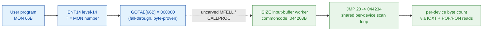

# MON 66B (octal) - InBufferSpace (ISIZE)

Returns the number of bytes currently held in a device's **input** buffer - the count a program
can still read before the buffer empties. Terminals and other character devices place input in this
buffer; all input monitor calls read from it. Not meaningful for internal devices. This is an
ND-100 monitor call.

**Status:** `partial`. `GOTAB[66B] = 000000` (byte-proven) - a **fall-through**: there is no direct
GOTAB handler word, so the level-14 handler is reached through the resident MFELL/CALLPROC path
(uncarved). The candidate worker body (`ISIZE = 044203B`) is real SINTRAN L bytes and is the
input-buffer **twin** of `OSIZE` (MON 67B OutBufferSpace) - they share one per-device scan loop - but
the `MON 66 -> ISIZE` link crosses the uncarved kernel bridge (see [Honest caveats](#honest-caveats)).
All addresses/values are **octal**.

- **Full disassembly:** [`66B-InBufferSpace.ASM`](66B-InBufferSpace.ASM) - the real ISIZE code (private prologue + the shared scan loop).
- **Bytes live once in** the canonical segment layer: [`../../segments-ref/`](../../segments-ref/).

---

## Dispatch path

The dashed hop (`C ⇢ D`) is the resident `MFELL`/`CALLPROC` fall-through - it is **not present in any
carved segment**, so it is the one link that cannot be followed statically. `GOTAB[66B]` is literally
`000000`, so there is no entry stub to disassemble; dispatch enters the resident handler that then
runs the `ISIZE` body.

---

## Code location (dispatch path)

Every row is a real region you can open. Byte offset = `(addr - loadbase)` in octal words x 2; the
commoncode load base is `0`, so the byte offset is simply `octal-addr x 2` (decimal).

| Role | Segment (full disasm) | Addr range (octal) | Byte offset | Symbol | Verdict |
|------|------------------------|--------------------|-------------|--------|---------|
| GOTAB[66] dispatch word | [commoncode.asm](../../segments-ref/SINTRAN-DATA_commoncode/SINTRAN-DATA_commoncode.asm) · [.hex](../../segments-ref/SINTRAN-DATA_commoncode/SINTRAN-DATA_commoncode.hex) | `071321B` (1 word) | 58786 | `GOTAB+66` = `000000` | **VERIFIED** (fall-through) |
| resident MFELL/CALLPROC bridge | - (uncarved) | - | - | `MFELL`/`CALLPROC` | **UNVERIFIED** |
| ISIZE worker body (candidate) | [commoncode.asm](../../segments-ref/SINTRAN-DATA_commoncode/SINTRAN-DATA_commoncode.asm) · [.hex](../../segments-ref/SINTRAN-DATA_commoncode/SINTRAN-DATA_commoncode.hex) | `044203B-044352B` (prologue + shared loop) | 37126 | `ISIZE` | real bytes; link **inferred** |

There is no entry-stub row: `GOTAB[66]` is `000000`, so the level-14 handler is a resident
fall-through, not a `025-S3IRPIT` stub.

**Verify by hand:** the GOTAB word is a zero (fall-through):
`grep '^71321' ../../segments-ref/SINTRAN-DATA_commoncode/SINTRAN-DATA_commoncode.hex`
-> `71321  000000  000 000  58786`; confirm the zero from the canonical bin
`dd if=../../../resident/SINTRAN-DATA_commoncode.bin bs=1 skip=58786 count=2 2>/dev/null | od -An -tx1`
-> `00 00`. For the ISIZE worker first word:
`grep '^44203' ../../segments-ref/SINTRAN-DATA_commoncode/SINTRAN-DATA_commoncode.hex`
-> `44203  047024  116 024  37126`; then
`dd if=../../../resident/SINTRAN-DATA_commoncode.bin bs=1 skip=37126 count=2 2>/dev/null | od -An -tx1`
-> `4e 14` (a big-endian word = octal `047024`, ISIZE's first word). `prove-mon.py 66` reads the
same GOTAB zero.

---

## Instruction walkthrough

Full listing: [`66B-InBufferSpace.ASM`](66B-InBufferSpace.ASM). The functional body is the `ISIZE`
worker; there is no entry stub (fall-through dispatch).

**ISIZE entry prologue (044203-044214)** - a 4-word private prologue (label `ISIZE`, next data symbol
`NKTRA=044204B`). It stages registers/working locals (`LDA I ,X 24 / SUB 24`), makes one indirect
call (`044205 JPL I 24` through pointer word `[044231]`, a runtime value), computes a small setup
value (`044210-044213`), and ends with `044214 JMP 20 -> 044234` - jumping **into the shared scan
loop**.

**Data / pointer cells (044215-044230)** - skipped by ISIZE's flow. They carry the small data
symbols `T1P01=044225B` and `DFRRT=044226B` (data cells), and are decoded as instructions but are
constant/pointer words. `044231-044233` is `OSIZE`'s own separate 3-word entry prologue (shown for
context; ISIZE does not run it).

**Shared per-device scan loop (044234-044342)** - ISIZE enters at `044234` (`STZ ,B -2`), sets the
I/O interrupt-enable words (`LDA 107 / TRR IIE / TRA IIC`), and runs the loop head at `044240`.
The loop loads a double-word device-table entry (`044241 LDD I ,X 104`, stride 2 words), tests an
end-of-table sentinel (`044243 SKP IF DA UEQ ST -> 044244 JMP 77 -> 044343`), skips empty slots
(`044245 JAZ -> 044337`), does a device status read (`044250-044252 LDT / AAT 2 / IOXT`), branches
on device class (`044255 JAZ -> 044304`), reads the buffer descriptor with interrupts **off**
(`044267 POF ... 044270 LDD ,X 0 ... 044271 PON`), and assembles a byte count
(`044331 RADD SD DA / 044332 SWAP SD DA`) stored via `044335 STD I ,X 15` (paging-mode bit `SSPTM`
toggled around the store). `044342 JMP -102 -> 044240` loops. This is byte-for-byte the same loop
used by `OSIZE` (MON 67B); see [`../067B-OutBufferSpace/`](../067B-OutBufferSpace/).

**Data / tail (044343-044352)** - `044343 JMP 10 -> 044353` jumps over a data/pointer block
(`044344-044352`, e.g. pointer word `000215B` at `044347`). The tail from `044353` is the shared
scan documented under 067B; its role on the input path is **UNVERIFIED** and not repeated here.

---

## Parameter / register contract

Manual-side names/types are from [`66B_InBufferSpace.yaml`](../../../../../../../Developer/MON/calls/66B_InBufferSpace.yaml).

| Reg / field | Dir | Meaning | Verdict |
|-------------|-----|---------|---------|
| `A` (DeviceNumber) | in | logical device number (1 = own terminal) | inferred (manual; not isolable from this carve) |
| `A` / `W1` (NoOfBytes) | out | number of bytes currently in the input buffer | inferred; the count is assembled by `RADD SD DA / SWAP SD DA` and stored via `STD I ,X 15` (the compute is VERIFIED from bytes) |
| device table | in | scanned via `LDD I ,X 104`, stride 2 words | VERIFIED (bytes) |
| `IOXT` | - | per-device status read inside the loop | VERIFIED (bytes) |
| skip return / error | out | no in-body skip-return; internal-device / illegal-LDN errors are raised by the resident entry path | inferred |

The exact ZAREG/ZXREG/ZTREG save-area mapping and the user-visible A/W1 convention live in the
caller-side `MON 66` wrapper and the uncarved CALLPROC frame, so the precise register contract is
**inferred**, not byte-proven here.

---

## Pseudo-code (for an emulator)

See **[`66B-InBufferSpace.pseudo.c`](66B-InBufferSpace.pseudo.c)** - a pseudo-C model of the handler
for emulator authors. The control flow (private prologue + shared scan loop) is byte-verified; the
semantic labels (which field is the byte count, the A-in/A-out register roles) are inferred from the
call structure, the OSIZE twin, and the manual; the fall-through `MON 66 -> ISIZE` bridge is modelled
but not proven. Every instruction is translated per the canonical
[`../../instruction-semantics/ND100-INSTRUCTION-SEMANTICS.md`](../../instruction-semantics/ND100-INSTRUCTION-SEMANTICS.md).

---

## Honest caveats

**What is byte-proven:** `GOTAB[66B] = 000000` (level-14 fall-through; `prove-mon.py 66` reads
commoncode file byte `0xe5a2 = 00 00`). The `ISIZE` worker entry bytes at `044203B`
(`047024B ...`) match the disassembly, and its `044214 JMP 20` lands at `044234` inside the shared
per-device scan loop that also serves `OSIZE=044231B`. That loop uses `IOXT`, interrupt-guarded
(`POF/PON`) double-word reads, and pointer arithmetic that assembles a count - consistent with an
input-buffer byte count.

**What is NOT proven:** the link from the `MON 66` fall-through to the `ISIZE` worker. Because
`GOTAB[66]` is `000000`, there is no stub to follow; dispatch enters the resident `MFELL`/`CALLPROC`
handler in an **uncarved overlay**, which then runs the body. So the `MON 66 -> ISIZE` attribution
rests on the symbol name (`ISIZE` = input-buffer SIZE), the shared loop with `OSIZE` (the documented
MON 67B OutBufferSpace worker), and the matching "input-buffer byte count" behaviour - not a followed
pointer. Hence the worker link is **inferred**, and the overall status is `partial`.

Note the twin symmetry is the strongest corroboration here: `ISIZE=044203` and `OSIZE=044231` sit a
few words apart in the same commoncode region and literally share the scan loop (`044234-044342`).
`ISIZE` returns bytes *in* the input buffer where `OSIZE` returns bytes *free* in the output buffer;
which quantity is produced is decided by the private prologues and the class/field selection, which
is inferred rather than byte-isolated. Confirming the bridge needs a live trace (break on a real
`MON 66`, single-step the fall-through, confirm P lands on `ISIZE=044203`).

Method: [../../../../../EXTRACTING-RESIDENT-CODE.md](../../../../../EXTRACTING-RESIDENT-CODE.md) · dispatch reality:
[../../TASK-05-mismatches.md](../../TASK-05-mismatches.md) · master map: [../../MON-CALL-INDEX.md](../../MON-CALL-INDEX.md).
