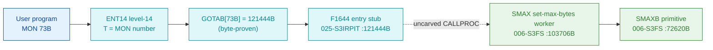

# MON 73B (octal) - SetMaxBytes (SMAX)

Sets the maximum byte pointer of an opened file (the number of bytes minus one).
The specified size is stored when the file is closed; a later attempt to read
beyond it returns error 3 (end of file). The file must be opened for write, and
the call is only relevant for sequential access.

**Status:** GOTAB dispatch head byte-proven as a **real per-call stub**
(`GOTAB[73B] = 121444B` -> `F1644` in `025-S3IRPIT`); the `SMAX` worker body is
real SINTRAN L bytes and calls the `SMAXB` set-max-bytes primitive; the exact
`MON 73 -> worker` link crosses an uncarved kernel bridge (see
[Honest caveats](#honest-caveats)). All addresses/values are **octal**.

- **Full disassembly:** [`73B-SetMaxBytes.ASM`](73B-SetMaxBytes.ASM) - the actual code, both regions (F1644 entry stub + SMAX worker).
- **Bytes live once in** the canonical segment layer: [`../../segments-ref/`](../../segments-ref/).

---

## Dispatch path

The dashed hop (`D -> E`) is the resident `CALLPROC`/segment-switch - it is **not
present in any carved segment**, so it is the one link that cannot be followed
statically.

---

## Code location (dispatch path)

Every row is a real region you can open. Byte offset = `(addr - loadbase)` in octal words x 2
(equal to the decimal `byteoff` column of the segment `.hex`).

| Role | Segment (full disasm) | Addr range (octal) | Byte offset | Symbol | Verdict |
|------|------------------------|--------------------|-------------|--------|---------|
| GOTAB[73] dispatch word | [commoncode.asm](../../segments-ref/SINTRAN-DATA_commoncode/SINTRAN-DATA_commoncode.asm) - [.hex](../../segments-ref/SINTRAN-DATA_commoncode/SINTRAN-DATA_commoncode.hex) | `071326B` (1 word) | 58796 | `GOTAB+73` = `121444B` | **VERIFIED** |
| F1644 entry stub | [025-S3IRPIT.asm](../../segments-ref/025-S3IRPIT/025-S3IRPIT.asm) - [.hex](../../segments-ref/025-S3IRPIT/025-S3IRPIT.hex) | `121444B-121470B` (21w) | 56904 | `F1644` | **VERIFIED** |
| resident CALLPROC bridge | - (uncarved) | - | - | `CALLPROC` | **UNVERIFIED** |
| SMAX worker body | [006-S3FS.asm](../../segments-ref/006-S3FS/006-S3FS.asm) - [.hex](../../segments-ref/006-S3FS/006-S3FS.hex) | `103706B-103717B` + tail `103731B-103734B` | 46988 | `SMAX` | real bytes; link **MISATTRIBUTED** |
| SMAXB set-max-bytes primitive | [006-S3FS.asm](../../segments-ref/006-S3FS/006-S3FS.asm) - [.hex](../../segments-ref/006-S3FS/006-S3FS.hex) | `72620B` (call target) | 37664 | `SMAXB` | called by SMAX (link cell `104026`) - **VERIFIED** |

**Verify by hand:** `grep '^103706 ' ../../segments-ref/006-S3FS/006-S3FS.hex` -> byte offset `46988`;
then `dd if=../../../segments/006-S3FS.bin bs=1 skip=46988 count=8 | od -An -tx1` -> `22 4d cc 65 cc 59 f0 06`
(each pair is one 16-bit word, big-endian on disk = octal `021115 146145 146131 170006` = `STD I 115` / `RADD CLD SL DA` / `RADD CLD SB DD` / `SAB 6`, the SMAX entry).

The GOTAB slot itself:
`dd if=../../../resident/SINTRAN-DATA_commoncode.bin bs=1 skip=58796 count=2 | od -An -tx1` -> `a3 24` (= `121444B`, the F1644 vector).

The stub bytes: `grep '^121444 ' ../../segments-ref/025-S3IRPIT/025-S3IRPIT.hex` -> byte offset `56904`;
then `dd if=../../../segments/025-S3IRPIT.bin bs=1 skip=56904 count=2 | od -An -tx1` -> `a8 06` (= `124006B` = `JMP 6`, the F1644 entry).

---

## Instruction walkthrough

Full listing: [`73B-SetMaxBytes.ASM`](73B-SetMaxBytes.ASM). Two regions:

**Region A - F1644 entry stub (`121444-121470`, `025-S3IRPIT`)** is the level-14
entry vectored from `GOTAB[73]`. It runs an argument/access check
(`121452 SAT 1`, `SKP IF DA EQL ST`, then `121464 SAT 2`), building `B`/`X`/`D`
from indirect literals before transferring on through the resident `CALLPROC`
bridge (the `JMP I 24` at `121463` and the forward `JMP`s to `121473B` continue
into the `F1645` dispatch continuation). The stub does not name `SMAX`; the value
`103706` occurs nowhere it dereferences.

**Region B - SMAX worker (`103706-103717` + shared tail `103731-103734`,
`006-S3FS`)** is the functional body. All calls to shared workers are
**indirect** (`JPL I` / `JMP I`) through the pointer-word table at `104024-104032`;
those words are **data (link cells)**, not code, and their resolved worker
addresses are annotated in the `.ASM`.

- **Prologue + parameter copy (`103706-103713`)** - `103706 STD I 115` stashes
  the caller's double-word parameter (through link cell `104025`); `103711 SAB 6`
  builds the 6-word local frame `B`; `103712 JPL I 112` -> `003752` is the shared
  resident prologue worker; `103713 STT I 112` stores the caller's file-number
  (register `T`).
- **Set the max byte pointer (`103714-103717`)** - `103714 JPL I 112` -> `072620`
  (**SMAXB**, the set-max-bytes primitive) performs the actual update, then
  `103715 JMP 16` -> `103733` funnels into the store-status tail. The alternate
  path `103716 MIN ,B 4` / `103717 JMP 12` -> `103731` unwinds and returns.
- **Store status + return (`103731-103734`)** - `103733 STA ,B 2` writes the
  result word into the caller's status slot `B+2`; `103734 JMP -3` falls to
  `103731 SAA -6` (unwind the 6-word frame, matching `SAB 6`), then
  `103732 JMP I 76` -> `003776` returns through the resident return cell. This
  tail is shared with the sibling calls SETBY (MON 74B, `103720B`) and SETBC
  (`103735B`), which use their own primitives (`SBYTE=72622B`, `SBLOP=72072B`,
  `SBLSZ=72351B`) in the same link-cell table; those sibling bodies are **not**
  part of MON 73B.

The `JPL I 112` call to **SMAXB** (link cell `104026 = 072620`) is the byte-level
proof that SMAX is the SetMaxBytes worker: it is the entry that drives the file
system's set-max-bytes primitive.

---

## Parameter / register contract

| Reg / field | Dir | Meaning | Verdict |
|-------------|-----|---------|---------|
| entry point | in | `103706B` = SMAX worker entry (via F1644 stub) | VERIFIED (bytes) |
| `T` | in | file number (from an earlier OpenFile); stored at `103713 STT I 112` | VERIFIED (copy); meaning inferred (manual) |
| `D` (double) | in | maximum byte pointer (INTEGER4), saved first (`STD I 115`) | VERIFIED (copy); layout inferred (manual) |
| local frame `B` | internal | `SAB 6` = 6-word working frame | VERIFIED (bytes) |
| `B+2` | out | returned status word (`STA ,B 2` at `103733`) | VERIFIED (bytes) |
| `A` | out | error number on the error return | inferred (manual MAC example) |

The user-visible `T`/`D` register convention lives in the caller-side `MON 73`
wrapper and the uncarved `CALLPROC` frame, so the precise
user-register-to-field assignment is **inferred** from the manual, not
byte-proven here.

---

## Pseudo-code (for an emulator)

See **[`73B-SetMaxBytes.pseudo.c`](73B-SetMaxBytes.pseudo.c)** - a pseudo-C model
of the handler for emulator authors. Control flow + the call to the SMAXB
primitive are byte-verified; the parameter-field semantics and error-number
meanings are inferred from the call structure and the manual. Every instruction
is translated per the canonical
[`../../instruction-semantics/ND100-INSTRUCTION-SEMANTICS.md`](../../instruction-semantics/ND100-INSTRUCTION-SEMANTICS.md).

---

## Honest caveats

**What is byte-proven:** `GOTAB[73B] = 121444B` (a real level-14 per-call vector,
not a fall-through); the `F1644` stub at `121444B` in `025-S3IRPIT` is real code
(entry bytes `124006 044353 135035 135035` match the disassembly); the `SMAX`
worker body at `103706B` in `006-S3FS` is real code (entry bytes
`021115 146145 146131 170006` match); and it belongs to the set-size family - it
calls `SMAXB` (`072620B`, link cell `104026`), the set-max-bytes primitive.

**What is NOT proven:** the link from the `F1644` stub (in `025-S3IRPIT`) to the
`SMAX` worker (in `006-S3FS`). The value `103706` occurs nowhere the stub
dereferences; the stub transfers through the resident `CALLPROC`/segment switch,
which lives in an **uncarved overlay**. So the `MON 73 -> SMAX` attribution rests
on the `SMAX` symbol name + its call to `SMAXB` + the matching set-size
behaviour, not a followed pointer - hence **MISATTRIBUTED** in the strict sense.
Confirming the link needs a live trace: break at `121444B` on a real `MON 73`,
single-step the segment switch, and confirm P lands on `SMAX = 103706`.

**Shared code:** `SMAX` (`103706B`), `SETBY` (MON 74B, `103720B`) and `SETBC`
(`103735B`) share one link-cell table (`104024-104032`) and one error/return tail
(`103731-103734`). Only the SMAX entry body (`103706-103717`) and the shared tail
are MON 73B; the sibling entry bodies are documented in their own folders
(e.g. [`../074B-SetStartByte/`](../074B-SetStartByte/)).

The link cells `003752` (resident prologue) and `003776` (resident return) match
no `FILSYS-SYMBOLS` entry; their low addresses suggest resident-monitor /
save-restore routines outside the file-system segment and are not resolved here.

Method: [../../../../../EXTRACTING-RESIDENT-CODE.md](../../../../../EXTRACTING-RESIDENT-CODE.md) - dispatch reality:
[../../TASK-05-mismatches.md](../../TASK-05-mismatches.md) - master map: [../../MON-CALL-INDEX.md](../../MON-CALL-INDEX.md).
