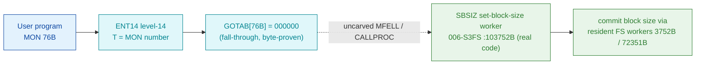

# MON 76B (octal) - SetBlockSize (SBSIZ)

Sets the random-access **block size** of an already-opened file. Monitor calls that read or write
randomly (ReadFromFile / WriteToFile) operate in units of this block. The standard block size is
512 bytes (set when the file is opened, reset when it is closed); factors of 2048 bytes are the most
efficient. The documented MON short name is **SETBS**; the internal file-system worker symbol is
**SBSIZ** (`103752B` in `FILSYS-SYMBOLS`). This is an ND-100 monitor call (also available on ND-500).

**Status:** `partial`. Dispatch head byte-proven (`GOTAB[76B] = 000000` = fall-through, matching the
resident MFELL/CALLPROC default path); the `SBSIZ` worker body is real SINTRAN L bytes and closes
cleanly; the exact `MON 76 -> worker` link crosses an uncarved kernel bridge (see
[Honest caveats](#honest-caveats)). All addresses/values are **octal**.

- **Full disassembly:** [`76B-SetBlockSize.ASM`](76B-SetBlockSize.ASM) - both regions (GOTAB dispatch word + SBSIZ worker).
- **Bytes live once in** the canonical segment layer: [`../../segments-ref/`](../../segments-ref/).

---

## Dispatch path

The dashed hop (`C ⇢ D`) is the resident `MFELL`/`CALLPROC` fall-through - **not present in any carved
segment**. `GOTAB[76B]` is literally `000000`, so there is no entry stub to disassemble; dispatch enters
the resident handler, which then reaches `SBSIZ`. `SBSIZ` (D) **is** real executable code and is one of a
family of file-position setters (`SETBY` 74B / `SETBC` / `SBSIZ` 76B / `RMAX` 62B / `REABT` 75B) that
share one skeleton verbatim, differing only in the pointer-table displacement each selects.

---

## Code location (dispatch path)

Every row is a real region you can open. Byte offset = `(addr - loadbase)` in octal words x 2; the
commoncode load base is `0` (so byte offset = `octal-addr x 2` decimal), and `006-S3FS` load base is
`26000B`, so its byte offset is `(addr - 26000B) x 2`.

| Role | Segment (full disasm) | Addr range (octal) | Byte offset | Symbol | Verdict |
|------|------------------------|--------------------|-------------|--------|---------|
| GOTAB[76] dispatch word | [commoncode.asm](../../segments-ref/SINTRAN-DATA_commoncode/SINTRAN-DATA_commoncode.asm) · [.hex](../../segments-ref/SINTRAN-DATA_commoncode/SINTRAN-DATA_commoncode.hex) | `071331B` (1 word) | 58802 | `GOTAB+76` = `000000` | **VERIFIED** (fall-through) |
| resident MFELL/CALLPROC bridge | - (uncarved) | - | - | `MFELL`/`CALLPROC` | **UNVERIFIED** |
| SBSIZ worker body | [006-S3FS.asm](../../segments-ref/006-S3FS/006-S3FS.asm) · [.hex](../../segments-ref/006-S3FS/006-S3FS.hex) | `103752B-103766B` (13 words) | 47060 | `SBSIZ` | real bytes = **CODE**; body link **MISATTRIBUTED** |

There is no entry-stub row: `GOTAB[76]` is `000000`, so the level-14 handler is a resident fall-through,
not a `025-S3IRPIT` stub.

**Verify by hand:** the GOTAB word is a zero (fall-through):
`grep '^71331 ' ../../segments-ref/SINTRAN-DATA_commoncode/SINTRAN-DATA_commoncode.hex`
-> `71331  000000  000 000  58802`; then
`dd if=../../../resident/SINTRAN-DATA_commoncode.bin bs=1 skip=58802 count=2 2>/dev/null | od -An -tx1`
-> `00 00` (GOTAB[76] = 000000, a fall-through). For the SBSIZ worker first word:
`grep '^103752 ' ../../segments-ref/006-S3FS/006-S3FS.hex`
-> `103752  021051  042 051  47060`; then
`dd if=../../../segments/006-S3FS.bin bs=1 skip=47060 count=2 2>/dev/null | od -An -tx1`
-> `22 29` (the raw stored bytes read as octal word `021051`, a genuine `STD I 51` instruction,
confirming the region is code). `prove-mon.py 76` reports the same `GOTAB[76]=000000` fall-through.

---

## Instruction walkthrough

Full listing: [`76B-SetBlockSize.ASM`](76B-SetBlockSize.ASM).

**SBSIZ worker body (103752-103766)** - real executable code (label `SBSIZ`, next symbol `RMAX=103767B`
bounds it at 13 words). It saves the 32-bit block-size argument (`103752 STD I 51`, storing the `A:D`
pair through pointer cell `104023`), stages registers (`103753 RADD CLD SL DA` = `A := L`,
`103754 RADD CLD SB DD` = `D := B`, `103755 SAB 6` = `B := 6`), then calls two resident FS workers
through the shared pointer table (`103756 JPL I 46 -> 104024` = ptr `003752`, `103760 JPL I 52 -> 104032`
= ptr `072351`), storing the returned `T` in between (`103757 STT I 46`). The normal path
(`103761 JMP 4 -> 103765`) writes the result (`103765 STA ,B 2`), and the error/exit tail
(`103762 MIN ,B 4`, `103763 SAA -6`, `103764 JMP I 44 -> 104030` = ptr `003776` common exit) shares the
resident return. The two backward/forward direct branches stay inside the block; the `JPL I`/`JMP I`
transfers are indirect through the shared pointer table (`104023-104034`, DATA), whose `3752B`/`72351B`/
`3776B` targets are resident FS routines outside this carve.

---

## Parameter / register contract

Manual-side names/types are from [`76B_SetBlockSize.yaml`](../../../../../../../Developer/MON/calls/76B_SetBlockSize.yaml).

| Reg / field | Dir | Meaning | Verdict |
|-------------|-----|---------|---------|
| `T` (FileNumber) | in | open-file handle returned by OpenFile (`MAC` example `LDT FILNO`) | inferred (manual) |
| `A:D` (BlockSize) | in | block size in bytes, LONGINT (32-bit), must be even; saved by `STD I 51` | inferred (manual) + VERIFIED save |
| error return | out | standard error code in `A` (appendix A); `MAC` shows a `JMP ERROR` skip return | inferred (manual) |

The worker's register staging (`STD I 51`, `RADD CLD` copies, `SAB 6`, the shared-helper `JPL I` calls)
is VERIFIED from bytes; the mapping onto the user-visible file/size contract lives in the caller-side
`MON 76` wrapper and the uncarved CALLPROC frame, so the field contract is **inferred**, not byte-proven
here. (The MAC example loads the size in `A` as "block size in words"; the higher-level PLANC/FORTRAN
`SetBlockSize` passes a 32-bit LONGINT, which is what the `STD I 51` 32-bit save is consistent with.)

---

## Pseudo-code (for an emulator)

See **[`76B-SetBlockSize.pseudo.c`](76B-SetBlockSize.pseudo.c)** - a pseudo-C model for emulator authors.
The `SBSIZ` control flow is byte-verified; the field semantics (which input is file / size) are inferred
from the manual, and the resident-worker behaviour (`3752B`/`72351B`/`3776B`) is modelled, not proven.
Every ND-100 instruction in the model is translated per the canonical
[`ND100-INSTRUCTION-SEMANTICS.md`](../../instruction-semantics/ND100-INSTRUCTION-SEMANTICS.md) - e.g.
`RADD CLD SL DA` = `A = L`, `SAB 6` = `B := 6`, `STD I 51` = `mem[ea]=A; mem[ea+1]=D` (32-bit save),
`MIN ,B 4` = increment-and-skip.

---

## Honest caveats

**What is byte-proven:** `GOTAB[76B] = 000000` (level-14 dispatch; `prove-mon.py 76` reads commoncode
file byte `0xe5b2 = 00 00 = 000000`), a fall-through. The `SBSIZ` worker at `103752B` is real code - its
first word `021051B` is a genuine `STD I 51` instruction, and the 13-word block (`103752-103766`,
bounded by `RMAX=103767B`) has coherent argument staging, two resident-worker calls and a shared
error/exit tail, all with self-contained in-block branches.

**What is NOT proven:** the link from the `MON 76` fall-through to `SBSIZ`. `GOTAB[76]` is `000000`, so
dispatch enters the resident `MFELL`/`CALLPROC`, which lives in an **uncarved** overlay; a static decode
cannot follow it to `SBSIZ`. Attributing the call body to `SBSIZ` rests on the symbol **name** (`SBSIZ`
= set-block-size, matching the `76B`/`SETBS` documented call) plus its position in the file-position
setter family, not a followed pointer - hence `partial`. The worker also calls resident FS routines
(`3752B`/`72351B`/`3776B`) through the shared pointer table, past the carved window, so the window is the
named worker body, not a fully self-contained subroutine.

This reconciles into one story: the dispatch head (`GOTAB[76] = 000000`, fall-through) is solid; the
resident second-level dispatch is uncarved; and `SBSIZ` is a real set-block-size worker whose attribution
to MON 76 is by name and family position, not by a followed link. Confirming it needs a live trace (break
on a real `MON 76`, single-step the fall-through and CALLPROC, and record that P lands on `SBSIZ=103752`).

**How this was carved:** the SBSIZ region was bounded by its own `FILSYS-SYMBOLS` entry (`SBSIZ=103752B`)
and the next symbol (`RMAX=103767B`), then read from the canonical `006-S3FS` segment binary and checked
for control-flow closure (all direct branches land inside `103752-103766`). Method:
[../../../../../EXTRACTING-RESIDENT-CODE.md](../../../../../EXTRACTING-RESIDENT-CODE.md) · dispatch reality:
[../../TASK-05-mismatches.md](../../TASK-05-mismatches.md) · master map: [../../MON-CALL-INDEX.md](../../MON-CALL-INDEX.md).
