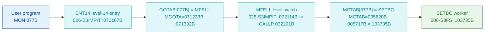

# MON 077B (octal) - SetStartBlock (SETBC)

Sets the next **block** to be read or written in an already-opened file (block-pointer
positioning). The first block of a file is number 0; the standard block size is 512 bytes.
The call is equivalent to SetStartByte with the block number multiplied by the block size.
This is an ND-100 (and ND-500) monitor call.

**Status:** **byte-verified** (dispatch + worker body). The worker is real carved code in
`006-S3FS`. All addresses/values are **octal**.

> **CORRECTED 2026-07-13.** The previous version of this folder said the call was
> `misattributed`, claiming `GOTAB[077B] = 121516B` routed to an `F1646` "compiler stub" in
> `025-S3IRPIT`, and it named the worker `SETBL = 030164B`. **Both were artefacts of the wrong
> dispatch model.** MON calls take their worker from **`MCTAB @ 005620B`** (segment
> `044-S3IDPIT`), not from that `GOTAB` (which is `MFELL` for 224 of 256 calls).
> `MCTAB[077B] = 103735B = SETBC` (byte-proven), and that worker is carved in `006-S3FS`, part
> of the `SETBC` / `SBSIZ` / `RMAX` file-parameter family. The old `SETBL = 030164B` name and
> the `F1646` stub came from the disproven "uncarved bridge" story. See
> [`../317B-ExecuteCommand/README.md`](../317B-ExecuteCommand/README.md) and
> `SINTRAN/CARVING-HANDOFF.md` section 3a.

- **Full disassembly:** [`77B-SetStartBlock.ASM`](77B-SetStartBlock.ASM).
- **Emulator model:** [`77B-SetStartBlock.pseudo.c`](77B-SetStartBlock.pseudo.c).
- **Bytes live once in** the canonical segment layer: [`../../segments-ref/`](../../segments-ref/).

---

## Dispatch path



There is **no dashed hop**. `GOTAB[077B] = MFELL` (byte-proven, `74 4c`); `MFELL` is a
program-**level** switch, not a subroutine call. The monitor level then indexes `MCTAB` and
reaches `SETBC`.

---

## Code location (dispatch path)

Byte offset = `(addr - loadbase)` in octal words x 2 (decimal). Offsets reproduced with `dd`.

| Role | Segment | Addr (octal) | Byte offset | Symbol | Verdict |
|------|---------|--------------|-------------|--------|---------|
| GOTAB[077B] slot | [026-S3IMPIT.asm](../../segments-ref/026-S3IMPIT/026-S3IMPIT.asm) | `071332B` = `072114B` | 32180 | -> `MFELL` | **VERIFIED** |
| MCTAB[077B] slot | [044-S3IDPIT.asm](../../segments-ref/044-S3IDPIT/044-S3IDPIT.asm) | `005717B` = `103735B` | 1950 | -> `SETBC` | **VERIFIED** |
| SETBC worker body | [006-S3FS.asm](../../segments-ref/006-S3FS/006-S3FS.asm) | `103735B-103751B` | 47034 | `SETBC` | **VERIFIED** |

**Verify by hand** (from `tools/sintran-segment-carver/versions/L-VSX-500/segments/`):
```
dd if=026-S3IMPIT.bin bs=1 skip=32180 count=2 | od -An -tx1   ->  74 4c   (= 072114B = MFELL)
dd if=044-S3IDPIT.bin bs=1 skip=1950  count=2 | od -An -tx1   ->  87 dd   (= 103735B = SETBC)
dd if=006-S3FS.bin    bs=1 skip=47034 count=2 | od -An -tx1   ->  22 36   (= 021066B, SETBC entry: STD I 66)
```

---

## Instruction walkthrough

Full listing: [`77B-SetStartBlock.ASM`](77B-SetStartBlock.ASM).

**Prologue (`103735B-103741B`).** `STD I 66` / `RADD CLD SL DA` / `RADD CLD SB DD` / `SAB 6`
save the caller's registers and build the frame; `JPL I 63` (`-> 104024B`) calls the shared
FILSYS open-file lookup helper, and `STT I 63` stores the resolved control-block pointer.

**Set the block pointer (`103743B-103751B`).** `JPL I 66` (`-> 104031B`) is the helper that
writes the new position into the open-file control block; on the success path `JMP 4`
(`-> 103750B`) stores the result (`STA ,B 2`) and returns, while the error path
(`103745B-103747B`, `MIN ,B 4` / `SAA -6` / `JMP I 61 -> 104030B`) reports a file error.

**Sibling family.** `SETBC` (`103735B`) is the first of three near-identical entries -
`SBSIZ` (`103752B`) and `RMAX` (`103767B`) - that share the same `STD I` / `SAB 6` /
`JPL I` skeleton and set/read different open-file parameters. That family structure is what
identifies `SETBC` as the block-pointer setter.

The prologue, the two helper calls and the error/success fork are byte-proven; the precise
semantics of the `104024B` / `104031B` helpers are **inferred** from the family structure.

---

## Parameter / register contract

| Reg / field | Dir | Meaning | Verdict |
|-------------|-----|---------|---------|
| file number | in | selects the open-file control block (resolved via `JPL I 63`) | VERIFIED (bytes); meaning inferred (manual) |
| block number | in | new next-block position written to the control block | VERIFIED (structure); byte layout inferred |
| `,B 2` | out | result / status stored on the success path | VERIFIED (bytes) |
| `,B 4` | out | error counter (`MIN ,B 4`) on the failure path | VERIFIED (bytes) |
| return | out | via saved link; error path `104030B` | VERIFIED (bytes) |

---

## Pseudo-code (for an emulator)

See **[`77B-SetStartBlock.pseudo.c`](77B-SetStartBlock.pseudo.c)** - the prologue, the open-file
lookup, the set-position helper call and the error/success fork are byte-verified; the helper
internals are inferred from the `SETBC`/`SBSIZ`/`RMAX` family.

---

## Honest caveats

**What is byte-proven:** `GOTAB[077B] = MFELL`; `MCTAB[077B] = 103735B = SETBC`; the `SETBC`
entry bytes at `103735B` in `006-S3FS` match the disassembly (`021066B = STD I 66`); the worker
resolves an open file, calls a helper to write a new position, and forks on error/success. It is
byte-adjacent to its siblings `SBSIZ` (`103752B`) and `RMAX` (`103767B`).

**What is NOT proven:** the exact control-block field written (block vs byte units), and the
internals of the `104024B` / `104031B` helpers, which are reached by `JPL I` and not carved in
this folder.

**Correction to earlier work.** The old folder read the disproven `GOTAB`, reported
`GOTAB[077B] = 121516B -> F1646` and named the worker `SETBL = 030164B`. The byte-proven worker
is `MCTAB[077B] = SETBC = 103735B`. The `F1646`/`SETBL` reading was the wrong-overlay error.

Method: [../../../../../EXTRACTING-RESIDENT-CODE.md](../../../../../EXTRACTING-RESIDENT-CODE.md) -
master map: [../../MON-CALL-INDEX.md](../../MON-CALL-INDEX.md).
