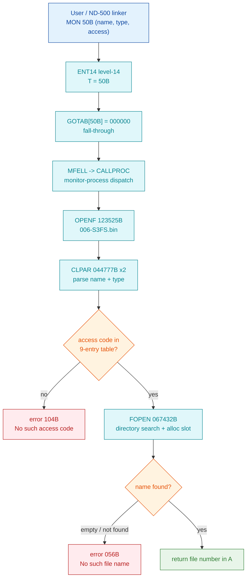

# MON 50B (octal) - OpenFile (OPEN)

**Short name:** OPEN **ND-100 file-system call** **Status:** handler located and byte-verified in `006-S3FS.bin`; empty-name behaviour answered below (see confidence notes).

Opens a mass-storage file (or peripheral) by name and returns a file number the
program uses for subsequent ReadFromFile / WriteToFile / SetBlockPointer calls.

- **Dispatch entry (level 14):** `GOTAB[50B] = 000000` -> fall-through -> `MFELL` -> `CALLPROC` (second-level monitor-process dispatch). VERIFIED: word at commoncode virtual `71303B` (= `71233B + 50B`) reads `000000`.
- **Handler (file system):** `006-S3FS.bin`, entry `OPENF = 123525B` (symbol `OPENF` in `FILSYS-SYMBOLS`, segment load base `26000B`).
- **Shared worker:** `FOPEN = 067432B` (does the open-file-table allocation). OPENF, `DOPEN`(DirectOpen 220B, `103026B`) and `OPENS`(ScratchOpen 235B, `126176B`) are three sibling routines that all call `FOPEN` - confirmed by the literal-pool pointer word `067432` appearing in each routine's pool (`123633B`, `103341B`, `126503B`).
- **Files in this folder:**
  [`050B-OPEN.ASM`](050B-OPEN.ASM) (byte-swapped disassembly, octal addresses) -
  [`050B-OPEN.bin`](050B-OPEN.bin) (150 bytes = 75 words, big-endian, verbatim slice `123525B..123637B`) -
  [`OPEN-emulation.md`](OPEN-emulation.md) (pseudocode + C sketch).

## Parameter contract (from ND-860228 SINTRAN III Monitor Calls, OpenFile 50B)

| # | Parameter          | Type | Dir |
|---|--------------------|------|-----|
| 1 | File number        | INT  | I/O |
| 2 | Access code        | INT  | I   |
| 3 | File name          | STR  | I   |
| 4 | Default file type  | STR  | I   |

MAC calling sequence (manual 1.7): `SAT <access>; LDX (<name-ptr>; LDA (<type>; MON 50`.
On success the file number is returned in A; on failure the file-system error code
is returned and `MON 65` (ErrorMessage) reports it.

## Behaviour section - Q1: what does an empty / all-zero file name do?

**Answer (confidence: HIGH that it is an error, MEDIUM on the exact code):**
An empty / all-zero name is **not a special case**. MON 50B OPEN has **no**
"empty name -> default file / scratch file / init-file" fallback. Opening an
unnamed scratch file is a *different* monitor call - **ScratchOpen (235B -> `OPENS`)** -
and default/direct opens use **DirectOpen (220B -> `DOPEN`)**. All three are
separate sibling routines; OPENF contains no branch that substitutes a default
name when the name string is empty.

What OPENF actually does with the parameters (byte-verified in `050B-OPEN.ASM`):

1. `123531B` call resident param-entry (`003752B`) - set up the monitor-call frame.
2. `123536B` / `123541B` call `CLPAR` (`044777B`) twice - parse the two string
   parameters (file name, default type). A parse failure jumps to the error exit
   `123612B` (store error code in the return slot, exit).
3. `123543B..123556B` validate the **access code** against a 9-entry table; if the
   access code is not found, `SAA 104` -> error **104B "No such access code"**
   -> error exit. (VERIFIED.)
4. `123565B` call `FOPEN` (`067432B`) - locate the named file in the directory and
   allocate an open-file-table slot. FOPEN returns file-system errors such as
   **056B "No such file name"**, **107B/122B "too many open files"**, **105B "File
   already opened"**, etc.

A name whose bytes are all zero terminates immediately (NUL is a name terminator),
so the directory search matches nothing. The most consistent result is
**error 056B "No such file name"** (it may instead surface as a parameter error
from `CLPAR` - see OPEN-emulation.md). The load-bearing fact for the emulator: **OPEN
does not succeed on an empty name; it returns a non-zero error in A.**

> Consumer note: the linker passing `[len=17, ptr=0xB0001DE8]` with all-zero name
> bytes is an **upstream** bug - the ND-500 name buffer was never populated. The
> kernel is behaving correctly by refusing it. The emulator's OPEN should return a
> file-system error (non-zero A) for an empty name, and the real fix is to make the
> name descriptor point at populated memory.

## How this was carved

1. `006-S3FS.bin` (big-endian, load base `26000B`) was carved from the SINTRAN
   SEGFIL0 disk image - see [`EXTRACTING-SEGMENTS.md`](../../../../../EXTRACTING-SEGMENTS.md).
2. Handler located by symbol `OPENF = 123525B` in
   `SINTRAN/NPL-SOURCE/SYMBOLS/L07/FILSYS-SYMBOLS.SYMB.TXT`. NOTE: the S3FS
   (FILSYS) symbols match the L binary; the *resident* symbol addresses do not
   (uniform revision offset), so resident targets (e.g. `003752B`) are given as
   raw addresses, not named.
3. Slice: word offset `123525B - 26000B = 75525B` (63146 decimal bytes); 75 words
   copied verbatim to the next symbol `CONNF = 123640B`. Big-endian, as carved.
4. Verified: the 150-byte slice was re-read from `006-S3FS.bin` and compared byte
   for byte (identical).
5. Disassembly: a byte-swapped copy (nd100-dis is little-endian only) run through
   `nd100-dis -a -S -o -b 42837`. The swap is never applied to the `.bin`.
