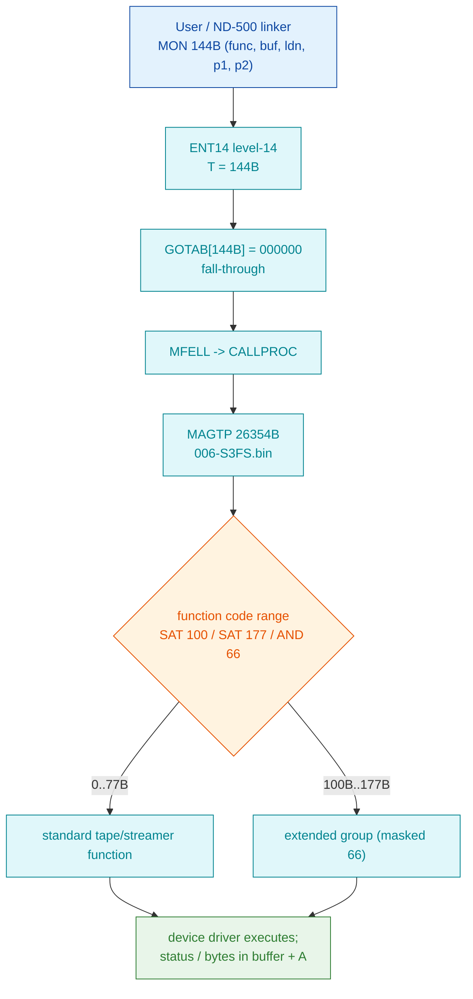

# MON 144B (octal) - DeviceFunction (MAGTP)

**Short name:** MAGTP **ND-100 file-system / device call** **Status:** VERIFIED (handler is code in `006-S3FS.bin`).

Device-dependent function call (the "monster" call that grew each SINTRAN
version). The **function code** (param 1) is interpreted by the addressed
device's driver (magnetic tape, SCSI streamer, floppy with volume, Versatec).

- **Dispatch entry (level 14):** `GOTAB[144B] = 000000` -> fall-through -> `MFELL`
  -> `CALLPROC` (second-level monitor-process dispatch). VERIFIED: word at
  commoncode virtual `71377B` (= `71233B + 144B`) reads `000000`.
- **Handler (file system):** `006-S3FS.bin`, entry `MAGTP = 26354B` (symbol `MAGTP`
  in `FILSYS-SYMBOLS`, segment load base `26000B`).
- **Files in this folder:**
  [`144B-MAGTP.ASM`](144B-MAGTP.ASM) (byte-swapped disassembly, octal addresses) -
  [`144B-MAGTP.bin`](144B-MAGTP.bin) (192 bytes = 96 words, big-endian, verbatim
  slice `26354B..26513B`; byte-identical to the earlier verified carve in
  `../../mon-analysis/144B-DeviceFunction/`) -
  [`MAGTP-emulation.md`](MAGTP-emulation.md) (function-code table + pseudocode/C).

## Parameter contract (from ND-860228 SINTRAN III Monitor Calls, DeviceFunction 144B)

| # | Parameter                        | Type | Dir |
|---|----------------------------------|------|-----|
| 1 | Function code                    | INT  | I   |
| 2 | Buffer used for data transfer    | ARR  | I   |
| 3 | Logical device number            | INT  | I   |
| 4 | 1st device-dependent parameter   | INT  | I   |
| 5 | 2nd device-dependent parameter   | INT  | I   |

## Dispatch and validation (verified in 144B-MAGTP.ASM)

The MAGTP entry copies the parameters into its frame and, at `26446B..26467B`,
range-checks the function code:

```
    LDA ,B 20        ; function code
    SAT 100          ; if code < 100B (>= "generic" range) ...
    ... GRE checks ...
    SAT 177          ; upper bound
    ... AND 66 ...    ; mask to select a device-function group
    LDT I 62         ; index a per-device function table -> dispatch
```

Codes below `100B` are the standard tape/streamer functions listed below;
`100B..177B` are treated as an extended/aliased group (masked with `66`). The
per-function work is done by the addressed device's driver, not inside this
96-word window (sub-entries `500RF=26375B`, `500WF=26401B`, `XRFIL=26405B`,
`XWFIL=26407B` are visible in the slice).



## Notes & confidence

- VERIFIED: handler location, GOTAB fall-through, function-code range validation,
  parameter contract. The 96-word slice matches the source segment byte for byte.
- The full per-function jump table and each driver's buffer handling live in the
  device driver (e.g. `IP-P2-SCSI-MAGTP.NPL`), outside this window; the function
  codes and buffer contract for the emulator are in `MAGTP-emulation.md`.

## How this was carved

1. `006-S3FS.bin` carved from SEGFIL0 - see
   [`EXTRACTING-SEGMENTS.md`](../../../../../EXTRACTING-SEGMENTS.md).
2. Located by symbol `MAGTP = 26354B` (`FILSYS-SYMBOLS.SYMB.TXT`, L07).
3. Slice: word offset `26354B - 26000B = 354B` (472 decimal bytes); 96 words
   copied verbatim, big-endian. Re-read and compared byte for byte (identical;
   also `cmp`-identical to the prior mon-analysis carve).
4. Disassembly: byte-swapped copy through `nd100-dis -a -S -o -b 11500`
   (11500 decimal = `26354B`). The swap is never applied to the `.bin`.
